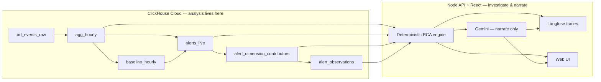

# 404Duos

## Track
**InMobi** — Click-a-thon 2026  
Problem: *From alert to answer: the automated root-cause analyst*

## Project
**InsightIQ** — ClickHouse-native anomaly detection with automated, evidence-backed root-cause analysis for ad-tech metrics.

## Team Members
- Vishnu Bhagwat ([@rogue-wild](https://github.com/rogue-wild))
- Sethukumar J ([@SethukumarJ](https://github.com/SethukumarJ))

## What it does

InsightIQ watches synthetic ad-event streams in **ClickHouse Cloud**, detects when a key metric (e.g. revenue) moves vs a seasonality-aware baseline, automatically drills into the responsible dimension segments, and returns a **plain-language diagnosis** where every number comes from deterministic queries — not the LLM.

**Detect → drill down → diagnose → (optional) chat follow-up**, with Langfuse traces for every chat/investigation narration turn.

## Hosted Demo

**Live app:** https://insight-iq-woad.vercel.app  

| Surface | What to try |
|---------|-------------|
| [/alerts](https://insight-iq-woad.vercel.app/alerts) | Daily / Hourly alert wall from `alerts_live` |
| Open any alert | Metric tree, segments, ruled-out, seasonality, diagnosis + citations |
| Export | Investigation bundle with evidence hash + immutable trace |
| [/chat](https://insight-iq-woad.vercel.app/chat) | Evidence-grounded Q&A (Gemini narrates engine numbers only) |

**API health:** https://insightiq-production-be0e.up.railway.app/health  

Suggested demo path (matches InMobi guidelines): Alerts → open a revenue drop → metric tree lights culprit/ruled-out → plain-English diagnosis → Ask in chat → show Langfuse trace.

## Demo Video

<video src="https://github.com/rogue-wild/404Duos/raw/main/404Duos/InsightIQ_Video_demo.mp4" controls playsinline width="720" title="InsightIQ demo video">
</video>

**[Watch on Google Drive](https://drive.google.com/file/d/1zs-GNEbhyFvMsoBIk6ckLEgFmALKtEwS/view?usp=sharing)** · in-folder: [`InsightIQ_Video_demo.mp4`](./InsightIQ_Video_demo.mp4)

Suggested script: metric drops on Alerts → open investigation → green/amber/red metric tree → diagnosis with citations → seasonality/ruled-out → chat follow-up → Langfuse public trace.

## Architecture

Full one-pager: **[ARCHITECTURE.md](./ARCHITECTURE.md)** · pipeline details: [docs/pipeline.md](./docs/pipeline.md)



| Stage | Where it runs | Approach |
|-------|---------------|----------|
| Detect | ClickHouse | Same weekday/hour × ~4-week seasonality baseline; noise-floored Z-score (`greatest(stddev, 0.05)`); `|z| > 3` |
| Seasonality trap | API RCA | Naive trailing-7d vs like-for-like residual; pure seasonality → ruled out (`info`), not alarmed |
| Drill-down | ClickHouse (+ Node enrichment) | Multi-dim contribution on `alert_dimension_contributors`; snapshot ranking across geo/OS/format/content/tier/campaign |
| Diagnosis | Node (deterministic) then Gemini | Engine builds text + citations from computed rows; LLM **only narrates** that JSON |
| OSS integration | **Langfuse** (JP cloud) | OTEL spans on chat/investigate/narrate — see links below |
| LLM | Google Gemini (`gemini-flash-lite-latest`) | Chosen for low latency/cost; never receives raw events |

### Langfuse evidence

| Evidence | Link |
|----------|------|
| Demo chat session (public) | https://jp.cloud.langfuse.com/project/cmsaj0vmd00bcad0k7vvthm8x/sessions/insightiq-web-ea80ad96-85c6-4e73-ac47-92d85cb4875d?viewId=__langfuse_with_io__ |
| Bulk export (CSV) | [`evidence/langfuse/1785643387197-lf-events-export-cmsaj0vmd00bcad0k7vvthm8x.csv`](./evidence/langfuse/1785643387197-lf-events-export-cmsaj0vmd00bcad0k7vvthm8x.csv) |
| Notes | [`evidence/langfuse/SHARE_LINKS.md`](./evidence/langfuse/SHARE_LINKS.md) |

Wiring: `apps/api/src/instrumentation.js`, `apps/api/.env.example` (`LANGFUSE_*`, host `https://jp.cloud.langfuse.com`).

### Unseen / graded incident evidence

| Evidence | Link |
|----------|------|
| Export (−50.3% revenue / requests) | [`evidence/unseen/inv-b82a676d-5e80-f884-0f1a-78a4b44f9b07-export.json`](./evidence/unseen/inv-b82a676d-5e80-f884-0f1a-78a4b44f9b07-export.json) |
| Export (−12.5% revenue / eCPM) | [`evidence/unseen/inv-b6b57556-9484-d041-33a5-5bab862dfe4d-export.json`](./evidence/unseen/inv-b6b57556-9484-d041-33a5-5bab862dfe4d-export.json) |
| Notes | [`evidence/unseen/README.md`](./evidence/unseen/README.md) |
| Live | https://insight-iq-woad.vercel.app/investigations/inv-b82a676d-5e80-f884-0f1a-78a4b44f9b07 · https://insight-iq-woad.vercel.app/investigations/inv-b6b57556-9484-d041-33a5-5bab862dfe4d |

## How we built it

- **ClickHouse Cloud** — primary datastore and analytical engine (ingest → MV rollup → baselines → alerts → RCA tables)
- **Node/Express** (`apps/api`) — in-process investigation engine (ported from Go for single-service deploy)
- **React/Vite** (`apps/web`) — dashboard, alert wall, investigation workspace, chat
- **Langfuse** — LLM/observability traces (session + CSV above)
- **Railway + Vercel** — hosted demo ([docs/deploy.md](./docs/deploy.md))

Explainability over sophistication: seasonality baselines, contribution filters, ruled-out checks, SHA-256 evidence lock, ordered investigation `trace[]`.

## How to run it

### Prerequisites
- Node.js 20+
- ClickHouse Cloud database `insightiq` with schema/data loaded ([`infra/clickhouse/`](./infra/clickhouse/), [docs/pipeline.md](./docs/pipeline.md))
- Optional: `GEMINI_API_KEY`, Langfuse keys

### Config

`apps/api/.env` (see [`apps/api/.env.example`](./apps/api/.env.example)):

```bash
PORT=4000
CLICKHOUSE_HOST=...
CLICKHOUSE_PORT=8443
CLICKHOUSE_USER=default
CLICKHOUSE_PASSWORD=...
CLICKHOUSE_DATABASE=insightiq
CLICKHOUSE_SECURE=true
GEMINI_API_KEY=...
GEMINI_MODEL=gemini-flash-lite-latest
LANGFUSE_PUBLIC_KEY=pk-lf-...
LANGFUSE_SECRET_KEY=sk-lf-...
LANGFUSE_BASE_URL=https://jp.cloud.langfuse.com
```

`apps/web/.env`:

```bash
VITE_API_URL=http://localhost:4000
```

### Start

```bash
# Terminal 1 — API (RCA in-process)
cd apps/api && npm install && npm run dev

# Terminal 2 — Web
cd apps/web && npm install && npm run dev
```

| Service | URL |
|---------|-----|
| Web | http://localhost:5173 |
| API | http://localhost:4000 |

```bash
curl -s http://127.0.0.1:4000/health
```

More: [docs/setup.md](./docs/setup.md) · deploy: [docs/deploy.md](./docs/deploy.md)

### Export an investigation

```bash
node scripts/export-investigation.mjs --list
node scripts/export-investigation.mjs --alertId=<UUID> --out=./evidence/unseen
```

UI: Investigation → **Export**. Graded bundle: [`evidence/unseen/`](./evidence/unseen/).

---

## Submission checklist (InMobi)

| Artifact | Status |
|----------|--------|
| Source code | ✅ this folder (`404Duos/`) |
| README (hosted demo + runbook) | ✅ |
| Architecture | ✅ [ARCHITECTURE.md](./ARCHITECTURE.md) |
| Hosted demo | ✅ https://insight-iq-woad.vercel.app |
| Langfuse wiring + evidence | ✅ session + CSV in [`evidence/langfuse/`](./evidence/langfuse/) |
| Unseen incident bundle | ✅ [`evidence/unseen/`](./evidence/unseen/) |
| Pitch deck PDF | ✅ [`pitch-deck.pdf`](./pitch-deck.pdf) |
| Demo video (2–3 min) | ✅ embedded above · [Drive](https://drive.google.com/file/d/1zs-GNEbhyFvMsoBIk6ckLEgFmALKtEwS/view?usp=sharing) · [`InsightIQ_Video_demo.mp4`](./InsightIQ_Video_demo.mp4) |

## License

MIT (unless otherwise noted for the Click-a-thon submissions repo).
