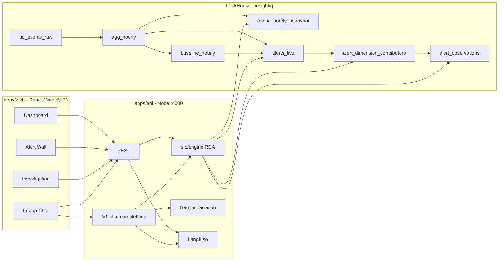

# Architecture

## Overview

InsightIQ is a low-latency analytics control plane for ad-tech event streams. A **reactive cascade inside ClickHouse** turns raw events into noise-filtered alerts and dimension-level root-cause rows; the Node API runs deterministic RCA in-process and narrates evidence with an LLM.

Native cascade details: [pipeline.md](./pipeline.md).



## Layers

### Data plane — ClickHouse (`insightiq`)

Reactive cascade (ingest → aggregate → baseline → alert → attribute → observe) runs **natively** in ClickHouse. Product paths then query the pre-aggregated layer only (not `ad_events_raw`):

| Object | Role |
|--------|------|
| `ad_events_raw` | High-throughput landing table |
| `mv_hourly` | Materialized view → `agg_hourly` |
| `agg_hourly` | Hourly SummingMergeTree rollup |
| `metric_hourly_snapshot` | VIEW over `agg_hourly` (+ fill_rate, ctr, ecpm, rpr) |
| `baseline_hourly` | 4-week same-hour seasonality expectations |
| `alerts_live` | Noise-floored Z-score anomalies |
| `alert_dimension_contributors` | Multi-dimensional segment attribution |
| `alert_observations` | Plain-language observation rows |
| `alert_rules` | Detection policy |

Techniques: seasonality window functions, stddev floor (e.g. `greatest(stddev, 0.05)`), contribution filters. Full write-up: [pipeline.md](./pipeline.md) · schema: [data-model.md](./data-model.md).

### API + investigation engine — Node (`:4000`)

In-process RCA under `apps/api/src/engine/`:

- List alerts (`day` or `hour` granularity)
- Investigate: baseline → metric decompose → dimension slice → seasonality / waterfall / counterfactual / hypotheses
- Dashboard meta and filtered timeseries
- Investigation export (diagnosis, trace, evidence hash)
- Gemini narrates structured evidence only
- OpenAI-compatible `/v1/chat/completions` for in-app chat
- Optional Langfuse tracing

### Web — React (`:5173`)

| Route | Purpose |
|-------|---------|
| `/` | Analytics dashboard |
| `/alerts` | Alert wall (Daily / Hourly) |
| `/investigations/:id` | RCA workspace + export |
| `/chat` | Natural-language Q&A |

## Request paths

1. **Alert wall** — Web → API engine → `alerts_live`
2. **Open alert** — Web → API investigate → diagnosis JSON
3. **Filter questions in chat** — API parses filters/dates → dashboard query → narrate
4. **RCA questions in chat** — resolve investigation → narrate from evidence

## Design principles

| Principle | Meaning |
|-----------|---------|
| Cascade in the database | Aggregation, baseline, anomaly, and first-pass RCA live in ClickHouse |
| Compute near the data | Further RCA in Node against the view layer |
| Evidence-bound LLM | Model explains numbers the engine computed |
| View layer only | Product paths do not scan raw events |
| Traceability | Investigation `trace`, optional Langfuse, evidence hash |

## Repo map

```
apps/web/                 React UI
apps/api/                 Node BFF + in-process RCA + Gemini + chat
apps/api/src/engine/      ClickHouse investigation engine
packages/contracts/       Investigation JSON schema
infra/clickhouse/         View-layer SQL reference
scripts/export-investigation.mjs  Investigation export CLI
docs/                     Documentation
```
