# ClickHouse-native pipeline

InsightIQ builds a **reactive cascade inside ClickHouse Cloud**: raw ad events are ingested, rolled up, baselined with seasonality, scored for anomalies, and attributed across dimensions — without shipping event rows to external analytics workers for those steps.

The application layer (Node API with in-process RCA, React UI) reads this pre-computed layer to investigate further and narrate evidence-backed answers.

## Executive summary

Traditional observability often pays high compute/egress costs and suffers alert fatigue from low-volume noise. InsightIQ keeps the heavy analytical cascade in ClickHouse:

1. Stream / load raw events into `ad_events_raw`
2. Materialized view → `agg_hourly` (SummingMergeTree)
3. Seasonality-aware baselines → `baseline_hourly`
4. Z-score checks → `alerts_live`
5. Multi-dimensional attribution → `alert_dimension_contributors` → `alert_observations`

In the loaded dataset, the pipeline concentrates signal from a large noisy candidate set into **hundreds of high-significance anomalies** (e.g. on the order of **~92k → ~388** critical revenue alerts after noise flooring), each with dimension-segment mapping ready for the UI.

## Cascade (entity view)

```mermaid
classDiagram
    class ad_events_raw {
        +DateTime ts
        +String app_id
        +String geo_device_id
        +String advertiser_id
        +String ad_format
        +UInt64 requests
        +UInt8 is_filled
        +UInt8 is_impression
        +UInt8 is_click
        +Float64 revenue
    }
    class agg_hourly {
        +DateTime bucket
        +String advertiser_id
        +String app_id
        +String country
        +String os_version
        +String ad_format
        +String category
        +String vertical
        +String publisher_tier
        +String campaign_type
        +Float64 revenue
        +UInt64 requests
        +UInt64 clicks
        +UInt64 impressions
        +UInt64 fills
    }
    class baseline_hourly {
        +String advertiser_id
        +String metric
        +DateTime bucket
        +Float64 expected
        +Float64 stddev
        +Float64 median
        +Float64 lower_bound
        +Float64 upper_bound
        +DateTime created_at
    }
    class alerts_live {
        +UUID alert_id
        +String advertiser_id
        +String metric
        +String granularity
        +DateTime bucket
        +Float64 actual
        +Float64 expected
        +Float64 zscore
        +DateTime created_at
    }
    class alert_dimension_contributors {
        +UUID alert_id
        +String dimension
        +String dimension_value
        +Float64 current_value
        +Float64 baseline_value
        +Float64 delta
        +Float64 contribution
    }
    class alert_observations {
        +UUID alert_id
        +UInt32 observation_order
        +String observation_type
        +String title
        +String detail
        +Float64 impact
    }

    ad_events_raw --> agg_hourly : mv_hourly pre-aggregate
    agg_hourly --> baseline_hourly : 4-week same-hour seasonality
    agg_hourly ..> alerts_live : Z-score vs baseline
    baseline_hourly ..> alerts_live : expected / stddev
    alerts_live --> alert_dimension_contributors : multi-dim RCA
    alert_dimension_contributors --> alert_observations : readable summaries
```



Linear view:

```
ad_events_raw
      │  MATERIALIZED VIEW mv_hourly (+ dim joins)
      ▼
agg_hourly  (SummingMergeTree)
      │
      ├─► baseline_hourly  (ReplacingMergeTree)
      │         │
      │         ▼
      └─► alerts_live
                │
                ├─► alert_dimension_contributors
                └─► alert_observations

metric_hourly_snapshot  (VIEW over agg_hourly + derived rates)
```

## Table glossary

| Table / view | Engine | Purpose |
|--------------|--------|---------|
| `ad_events_raw` | MergeTree | High-throughput landing table for raw events |
| `mv_hourly` | MaterializedView | Streams hourly rollups into `agg_hourly` |
| `agg_hourly` | SummingMergeTree | Real-time hourly aggregates (revenue, requests, fills, …) |
| `metric_hourly_snapshot` | View | Derived rates (`fill_rate`, `ctr`, `ecpm`, `rpr`) for product queries |
| `baseline_hourly` | ReplacingMergeTree | Seasonality expectations (`expected`, `stddev`, bounds) |
| `alerts_live` | MergeTree | Triggered anomalies (`actual`, `expected`, `zscore`) |
| `alert_dimension_contributors` | MergeTree | Segment-level contribution to each alert |
| `alert_observations` | MergeTree | Ordered plain-language observation rows for UI |
| `alert_rules` | MergeTree | Detection policy (`threshold`, `min_volume`, dimensions, …) |

Schema reference: [`../infra/clickhouse/insightiq_view_layer.sql`](../infra/clickhouse/insightiq_view_layer.sql).

## Core techniques

### A. Seasonality-aware baseline

Flat day-over-day averages treat normal weekend/hour patterns as incidents. Baselines look back over prior weeks at the **same hour-of-day** (and day-of-week alignment):

```sql
avg(value) OVER (
    PARTITION BY advertiser_id, toHour(bucket), toDayOfWeek(bucket)
    ORDER BY bucket
    ROWS BETWEEN 4 PRECEDING AND 1 PRECEDING
) AS expected
```

Product investigations compare the observed window against a **like-for-like** baseline (same weekday/hour × prior 4 weeks) and a **naive trailing-7d average** (mixed weekdays). If the naive view looks anomalous but the seasonal residual is small, the movement is **ruled out as seasonality** (severity `info`) — including planted weekend/hour-of-day traps that a flat global average would alarm on.

### B. Noise-floored Z-score

Standard `(actual - expected) / stddev` explodes on near-zero stddev (tiny absolute moves look like enormous Z-scores). InsightIQ floors volatility, e.g. `greatest(stddev, 0.05)` (5¢ on revenue-scale metrics):

- Suppresses penny-level noise
- Requires a meaningful absolute move before `|z| > 3` fires
- Dramatically reduces alert volume while keeping high-impact revenue anomalies

Default product wall filter: `abs(zscore) > 3`.

### C. Multi-dimensional attribution

When an alert fires, contribution is computed across dimensions such as:

`country`, `os_version`, `ad_format`, `category`, `vertical`, `publisher_tier`, `campaign_type`

Localized contribution highlights how much a segment (e.g. `Android 14`) drove the advertiser’s metric move. Small-slice noise is reduced with filters such as:

```sql
WHERE abs(delta) > 0.01 AND abs(contribution) > 0.05
```

(at least a 1¢ change and ≥5% contribution to the alert, on revenue-scale examples).

## Verification queries

Inspect top observation rows:

```sql
SELECT title, detail, impact
FROM insightiq.alert_observations
ORDER BY abs(impact) DESC
LIMIT 5;
```

Count live alerts:

```sql
SELECT count() FROM insightiq.alerts_live WHERE abs(zscore) > 3;
```

List contributors for one alert:

```sql
SELECT dimension, dimension_value, delta, contribution
FROM insightiq.alert_dimension_contributors
WHERE alert_id = toUUID('YOUR_ALERT_ID')
ORDER BY abs(delta) DESC;
```

## How the app uses this layer

| Consumer | Reads |
|----------|--------|
| Node API (`src/engine`) | `alerts_live`, contributors, observations, `metric_hourly_snapshot` / `agg_hourly`; narrates with Gemini |
| Web UI | Dashboard, alert wall, investigation, chat |

The LLM never receives raw event dumps — only structured evidence produced by ClickHouse + the engine.
