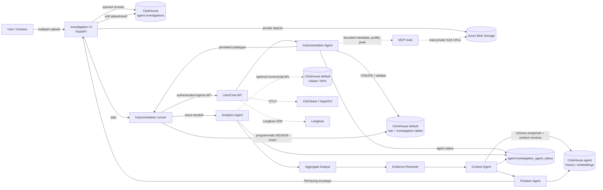

# Feature spec to insight — architecture

This is a product-analytics pipeline: a user submits `events.ndjson` and
`spec.md`, agents design the analytics model, and the runtime loads and
validates the result in ClickHouse. The design keeps large data transfers and
durable state outside the model context while retaining an auditable history.

## End-to-end flow



Solid arrows are runtime data/control paths. Dashed arrows are constrained
agent-tool paths: agents receive bounded metadata or samples, not the whole
blob and never storage credentials.

## Responsibilities and decision rationale

The following table records both the responsibility and the reason for the
boundary.

| Component | Responsibility |
| --- | --- |
| Investigation UI | Accept exactly `events.ndjson` and `spec.md`; validate names; upload to private Blob Storage; create a queued investigation revision; return immediately. **Why:** the request stays fast and the browser never becomes a data-processing or orchestration boundary. **How:** write only object references, checksums, and status to ClickHouse, then enqueue the runner. |
| Instrumentation runner | Own the long-running workflow outside the browser request; call LibreChat; persist each agent transition and final result. **Why:** agent calls can exceed HTTP timeouts and need resumable status. **How:** invoke the named persisted agents, pass references/handoffs, and record stage state in `agent.investigation_agent_status`. |
| LibreChat agents | Sequentially design instrumentation, analytics, context, and the final report. **Why:** model/tool decisions and their traces belong in the agent runtime, not in UI code. **How:** use the persisted agent graph and MCP tools, adding a structured section at each handoff. |
| MCP tools | Expose metadata, profiling, samples, DDL, and validation operations with explicit limits. **Why:** agents need evidence without receiving multi-GB blobs or credentials. **How:** return bounded previews and execute narrowly scoped SQL; the runner performs bulk transfer programmatically. |
| ClickHouse data plane | Store source/event data, investigation-scoped generated objects, rollups, and materialized views. **Why:** the workload is product analytics over append-heavy event data, where columnar scans, pruning, and SQL aggregation are the primary operations. **How:** create the agent-selected `MergeTree` schema, ingest in batches, and add incremental MVs only for repeated query shapes. |
| ClickHouse control/history plane | Store workflow state, schema history, context versions, embeddings, and finalizer deliveries. **Why:** operational state must be queryable alongside the evidence it describes and must survive agent/runtime restarts. **How:** use append-only, investigation-scoped records with checksums and version IDs; derive diffs from successive verified snapshots. |
| Context Store | Persist schema snapshots, semantic context changes, immutable business-logic versions, and optional vector chunks. **Why/how:** see [Context layer storage](#context-layer-storage) below. |

### Agent roles

| Agent | Why it exists | How it is used |
| --- | --- | --- |
| Instrumentation Agent | Converts an unfamiliar event stream into a verified physical model; separating this from analytics prevents guessed metrics from becoming tables. | Profiles bounded samples, chooses names/types/keys/TTL, creates and validates raw tables, performs programmatic ingestion, and returns the table-name map plus raw spec. |
| Analytics Agent | Translates the instrumentation evidence into queryable product questions without changing the physical source of truth. | Reads the persisted instrumentation handoff, proposes metrics/dimensions, and coordinates the downstream analytical specialists. |
| Aggregate Analyst | Finds repeated, high-value aggregations that justify precomputation. | Uses the ingested tables to write and validate aggregation SQL and, where useful, incremental MVs targeting separate rollup tables. |
| Evidence Reviewer | Prevents unsupported metrics or invalid SQL from becoming durable context. | Checks table/column names, grain, filters, denominators, and execution evidence against ClickHouse metadata and query results. |
| Context Agent | Turns verified technical findings into durable, versioned organizational knowledge. | Compares the new verified schema/analytics handoff with the previous context version, writes changes and provenance to ClickHouse, and emits the context handoff. |
| Finalizer Agent | Gives product and analytics consumers a stable result instead of exposing internal agent traces. | Reads the verified context and evidence, produces the PM-facing report, and persists the delivery envelope and itemized findings. |

Each agent is persisted by name in LibreChat and linked by an explicit edge.
That makes the graph inspectable and lets the runner start a fresh
investigation while retaining shared prompts, tools, and observability.

### Why and how the major choices fit this workload

| Choice | Why | How it is applied | Provenance |
| --- | --- | --- | --- |
| Private Blob Storage for inputs | Large artifacts should not pass through prompts, HTTP request bodies, or MCP responses. | UI uploads once; agents receive short-lived read URLs and bounded reads. | **derived** from the bulk-ingestion constraint |
| Programmatic ingestion | Ingestion must be reliable, resumable, and independent of model context limits. | The runner streams NDJSON to ClickHouse using the generated DDL and records accepted/rejected counts. | **derived** |
| Append-oriented event tables | Events are naturally emitted records; append paths avoid mutation cost and preserve evidence. | One row per emitted event, with an explicit event time and deterministic investigation scope. | **derived**; consistent with [ReplacingMergeTree guidance](https://clickhouse.com/docs/en/guides/replacing-merge-tree) when corrections are needed |
| Sort keys and bounded partitioning | Most reads filter by investigation and time; pruning matters more than many tiny partitions. | The agent chooses `ORDER BY` from observed filters and starts without a partition key unless retention/volume justifies one; time partitions align with TTL. | **official/derived**; see [custom partitioning](https://clickhouse.com/docs/en/engines/table-engines/mergetree-family/custom-partitioning-key) |
| Separate raw tables and rollups | Raw data keeps ad-hoc analysis possible while repeated metrics can be cheap and fresh. | Raw table is the source of truth; incremental MVs target separate aggregate tables, with refreshable MVs for heavier scheduled transforms. | **official/derived**; see [incremental MVs](https://clickhouse.com/docs/materialized-view/incremental-materialized-view) and [refreshable MVs](https://clickhouse.com/docs/materialized-view/refreshable-materialized-view) |
| Append-only history | Revisions must be auditable and replayable; overwriting state hides why a result changed. | New investigation, schema, context, and finalizer versions supersede older rows through version/checksum references. | **derived** |

## ClickHouse ownership

### `default` — data plane

- Uploaded NDJSON is streamed programmatically into the agent-designed raw
  event table.
- Investigation-scoped generated tables are created with collision-safe names.
- Optional incremental materialized views target separate rollup tables; raw
  tables remain the source of truth.

### `agent` — control and history plane

- `agent.investigations`: immutable revisions, blob references/checksums,
  overall status, current agent, progress, result, and errors.
- `agent.investigation_agent_status`: one append-only status history per agent
  and revision.
- `agent.schema_versions`, `agent.schema_columns`, and `agent.schema_changes`:
  verified physical-schema snapshots and diffs.
- `agent.business_logic_versions`, `agent.business_logic_embeddings_v1`, and
  `agent.context_changes`: durable context history and 1536-dimensional
  `text-embedding-3-small` chunks.
- `agent.finalizer_results` and `agent.finalizer_result_items`: immutable
  delivery envelopes and query-friendly items.

## Context layer storage

The context layer is stored in ClickHouse, principally in the `agent` control
database. It is not a prompt-sized JSON file and it is not only an embedding
index. A context refresh writes a new verified schema snapshot, business-logic
version, and context-change record; optional embeddings point back to those
versioned records. The current context is therefore a projection of durable
history, rather than an opaque mutable document.

### Why ClickHouse is the default store

1. **The evidence and the context share one query plane.** Schema diffs can be
   joined to the investigation, source checksum, generated table, metric, and
   validation result that produced them. This makes “why did context change?” a
   SQL query rather than a distributed correlation problem.
2. **The write pattern is append-heavy and versioned.** Refreshes add snapshots
   and changes; they do not need frequent in-place updates. That matches
   MergeTree storage and preserves an audit trail for replay and rollback.
3. **The read pattern is analytical and mixed-grain.** Context consumers need
   latest-version lookups, historical diffs, counts, joins, and occasional
   semantic similarity. ClickHouse handles these together, while the raw event
   tables and rollups remain nearby.
4. **Operational simplicity is part of correctness.** A single authenticated
   ClickHouse control plane avoids a second consistency, backup, access-control,
   and deployment system for a context corpus that is usually small compared
   with the event data.
5. **Embeddings remain useful without making them authoritative.** Vector
   columns/indexes can help retrieve relevant business-logic chunks, but the
   versioned textual record and its evidence references remain the source of
   truth. A similarity result alone can never authorize a schema or metric.

### Why not a vector database as the primary store?

A vector database is attractive when the dominant requirement is very large,
low-latency nearest-neighbor retrieval over mostly unstructured documents.
That is not the primary context workload here: the corpus is versioned,
investigation-scoped, and tightly related to ClickHouse tables and schema
changes. A separate vector database would require synchronizing document
versions, deletes, permissions, checksums, and evidence links, and would still
need ClickHouse for the authoritative joins and diffs.

The design can add a vector database later if measured retrieval volume or
vector scale warrants it. In that case it is a **derived cache/index** only:
the ClickHouse context-version ID and checksum must be stored in every indexed
record, and a missing or stale index must not block deterministic context
refresh or schema-diff queries.

### Why not a simple file store as the primary store?

Files are appropriate for immutable source artifacts (`spec.md` and
`events.ndjson`), but are a poor control-plane database. File-based context
would make concurrent refreshes, point-in-time queries, schema diffs, partial
failure recovery, row-level provenance, and authorization difficult. It also
encourages replacing one large document, which loses the append-only history
needed to explain agent behavior. Blob remains the immutable input archive;
ClickHouse remains the queryable, versioned context store.

### Retrieval and refresh path

```text
verified schema / analytics handoff
        -> append context version + evidence references in ClickHouse
        -> optionally embed versioned text and store the vector with its ID
        -> retrieve by investigation/version, metadata filters, or similarity
        -> join retrieved IDs back to authoritative context rows
        -> emit context handoff and a diff from the prior verified version
```

The metadata-first lookup is deliberate: use exact investigation, version,
table, and column filters before semantic search. Similarity narrows the set of
candidate explanations; it does not replace checksum/version validation.

## Handoff contract

Every stage preserves the preceding payload and adds one section:

```yaml
schema_version: 1
request: <normalized request>
instrumentation: {events: [], attributes: [], triggers: [], payload_examples: []}
analytics: {metrics: [], funnels: [], dimensions: [], aggregations: []}
context: {domain_metadata: {}, environment_tags: [], privacy_and_compliance: []}
handoff: {from: <agent>, to: <agent-or-user>}
open_items: []
```

The chain is acyclic: instrumentation → analytics → context → finalizer/user.
Each transition is recorded in `agent.investigation_agent_status`; a failure
is terminal for that stage and includes an error message.

## Invariants and safety

- Blob containers are private; agents receive short-lived read URLs only.
- The UI never reads or queries event data after upload.
- Bulk ingestion is programmatic and bounded; agents select the schema and
  queries, but do not stream large files through prompts or MCP.
- Agent queries follow discovery → profile → inspect → query, use sort-key or
  partition filters where available, and set `LIMIT`, scan caps, and timeouts.
- State is append-only. New revisions/versions supersede prior records rather
  than mutating them, preserving replay and auditability.
- Generated object names are investigation-scoped; DDL is validated before
  ingestion and the resulting schema is snapshotted by Context Store.
- Final success requires instrumentation persistence, Analytics completion,
  Context processing, and a persisted Finalizer result; otherwise the
  investigation remains running or failed with the responsible stage visible.

## LLM provider and model selection

The deployed provider is **OpenAI**, reached through LibreChat's OpenAI custom
endpoint at `https://api.openai.com/v1` with the Responses API enabled. Every
persisted agent currently uses the `gpt-5.6-luna` model preset. The provider
key is supplied only as `OPENAI_API_KEY` in the private LibreChat environment;
it is never included in an agent handoff, ClickHouse record, or Blob object.

### Why `gpt-5.6-luna`

An investigation is a high-volume, tool-heavy workflow: profiling, bounded
peeks, DDL validation, status writes, aggregation checks, and several agent
handoffs can each create a model turn. `gpt-5.6-luna` is the appropriate
default because OpenAI positions it for cost-sensitive, high-volume workloads
while it still supports the Responses API, function calling, and structured
outputs used by the LibreChat agent runtime. Its 1.05M-token context window
also leaves room for the bounded specification, tool results, and accumulated
handoff without making the raw NDJSON file part of the prompt.

The choice is therefore about predictable cost and throughput for repeated,
well-constrained decisions—not about using the least capable model everywhere.
The architecture removes bulk transfer and deterministic result construction
from the model, then uses validation tools to check the model's decisions.

This is a derived workload decision backed by OpenAI's published model
positioning for [GPT-5.6 Luna](https://developers.openai.com/api/docs/models/gpt-5.6-luna)
and [model-selection guidance](https://developers.openai.com/api/docs/models).


## Agent-chain execution and observability

The runner owns the long-lived orchestration boundary but not the agent work:
all schema decisions, aggregate analysis, context updates, and final report
generation execute in the LibreChat runtime. The runner only passes the
instrumentation handoff to the persisted Analytics Agent and records stage
state in ClickHouse.

**Why the split:** Langfuse is optimized for LLM/agent-level causality, while
ClickStack is optimized for service and infrastructure telemetry. Keeping both
avoids forcing either system to represent the other system's primary data
model. **How:** LibreChat sends prompts, model calls, tool calls, and agent
edges to Langfuse; its OTLP traffic goes through the private collector into
ClickHouse logs, metrics, and traces exposed through ClickStack/HyperDX. Use:

- Langfuse for agent/tool timelines, recursion, model errors, and prompt-version comparisons.
- ClickStack for runtime latency, request volume, error rates, collector health, and infrastructure telemetry.
- `agent.*` ClickHouse tables for durable investigation handoffs, schema versions, context changes, and finalizer delivery state.
