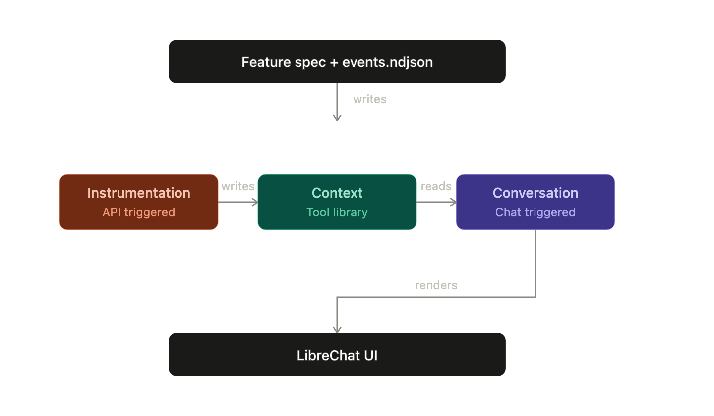

# Architecture notes

## The three agents and how they hand off

FeatureMage is built around three cooperating layers. They do not chat with each other like people in a room. Instead they hand off through shared stores and a small set of well-defined calls, so each step leaves something durable for the next.

The **Instrumentation Agent** takes a feature brief and sample events and turns them into something the warehouse can use. It designs the schema, registers what it learned in our metadata registry, creates the ClickHouse tables (and the activity views that feed analytics), and then asks Context to publish an updated picture of the product. That is the handoff from “new feature” to “the system knows this feature exists.”

The **Context Agent** is the living business memory of the product. It is intentionally more library than free-form chatbot: it stores and serves definitions for entities, metrics, funnel steps, and known caveats. When Instrumentation finishes, Context records a new version of that catalog. When someone asks a product question later, Conversation reads the latest version so answers stay aligned with what was actually instrumented.

The **Conversation / Visualization Agent** is what users meet in the product UI. It pulls the latest context, plans what to show, builds the right ClickHouse queries, and returns charts and insights through LibreChat. In short: Instrumentation writes facts and metadata, Context keeps the meaning current, and Conversation turns both into something a PM can act on.

---

## Where the context layer lives, and why

We keep the context layer in **Postgres**, as a versioned catalog of business meaning. Each publish creates a new current version and carries forward prior items so Conversation always sees a complete, consistent snapshot—not a partial patch.

That choice is deliberate. ClickHouse is excellent for event facts and funnel queries, so we leave raw telemetry there. A plain markdown file would drift the moment two features ship. A vector store would make retrieval fuzzy when we need definitions that stay exact. Postgres gives us durable versions, structured payloads, and a clean split: Instrumentation owns feature/event registry rows; Context owns the living meaning; Conversation only reads.

---

## Observability: Langfuse, LibreChat, and ClickStack

**Langfuse** is how we follow the Visualization and Conversation path. Every important step—discovering schema, planning a chart, generating or running a query—is traced end to end. Traces carry the environment name, which model was used, and which workflow step was running. That is what we use to debug a bad SQL plan or prove that an insight came from a real agent run rather than a one-off script.

For judging evidence, a Langfuse trace of a Visualization run that shows those steps (and the model used) is the main artifact.

**LibreChat** is the front door. Users talk to a Visualization Agent endpoint that our bridge exposes; chart and dimension requests go back to our analytics API. The demo evidence is simple: a short clip of a natural-language question becoming charts in the UI, with the agent path clearly selected.

**ClickStack** is what we use for production monitoring of the shared FastAPI service—request traces and operational telemetry into ClickHouse observability, tagged by environment (local vs cloud). That sits beside Langfuse, not instead of it: Langfuse covers agent reasoning; ClickStack covers how the service behaves in production.

---

## LLM providers and why we split them

**Instrumentation** uses **Gemini**. Spec-to-schema work is mostly structured extraction—journeys, events, column types—not open-ended prose. Gemini is lightweight enough for that job and reliable at producing the structured schema metadata we need to register features and stand up tables.

**Conversation / Visualization** defaults to **Claude**. We chose it for the same reason Claude Code earns trust: it is strong at generating code that actually runs. Here that means SQL and analytics paths that hold up in a real ClickHouse environment, not just look plausible in a chat. The workflow stays provider-agnostic (Claude, Gemini, or OpenAI via config), but Claude is our default when the output has to ship.

In practice: Gemini for turning a feature pack into durable schema and registry; Claude for planning, querying, and insight where production-ready code matters.