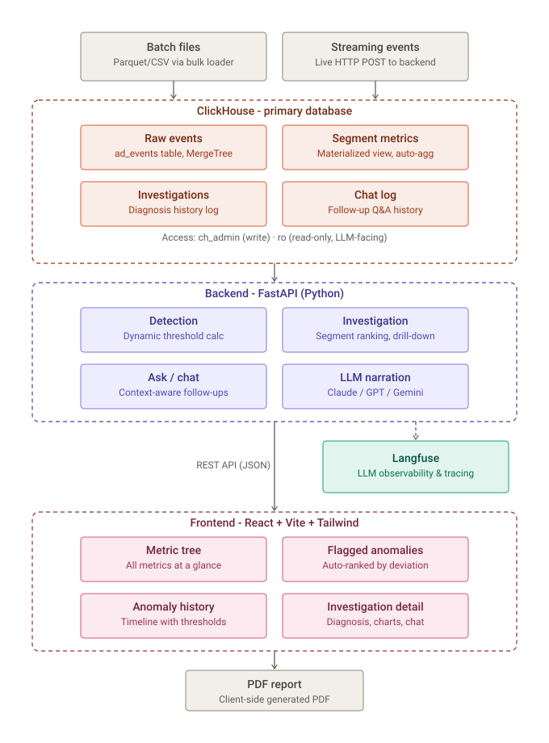

# CH-Minds

## Track

InMobi

## Project

**Why Did It Move?** - Automated root-cause analysis for ad-metrics, on ClickHouse. A metric drops - we name the exact segment and why, backed by real numbers, in seconds.

## Team Members

- Mohamed Hussain S ([mohhddhassan](https://github.com/mohhddhassan))
- Ravivarman R ([ravivarmanr-quantrail](https://github.com/ravivarmanr-quantrail))
- Praveen Kumar S ([PraveenQuantrail](https://github.com/PraveenQuantrail))

## What it does

InMobi's ad business spans thousands of app, device, geo, and advertiser combinations. When a headline metric like revenue or fill rate moves, the answer to "why?" today comes from a human manually drilling through dashboards, dimension by dimension. That doesn't scale, and it's slow even when it works.

"Why Did It Move" detects a metric deviation on its own, drills down through the data to the exact responsible segment, and produces a plain-language diagnosis where every claim traces back to a real, reproducible number. ClickHouse does all the analysis; the LLM only narrates the finished result - it never queries ClickHouse and never sees a raw event row.

Three stages:

1. **Detect** - a background scan sweeps every headline metric (revenue, fill rate, render rate, eCPM, CTR) x every business dimension, comparing each day to a trailing same-weekday **median** baseline (not a flat average, which false-alarms every weekend, and not a mean, which lets a real incident poison its own future comparisons - measured and fixed).
2. **Investigate** - revenue is decomposed into `Requests x Fill rate x eCPM` to find which factor moved, segments are ranked by deviation to find which one is responsible, and a hierarchical second pass checks for a sharper two-dimension combination. The same mechanism drills to hour grain.
3. **Narrate + trace** - the findings go to the LLM once to phrase in plain English, and the entire chain - every query, plus the narration call - is captured as a Langfuse trace.

## Hosted Demo

**[https://why-did-it-move-frontend.vercel.app](https://why-did-it-move-frontend.vercel.app)**

Live end to end: frontend on Vercel, backend on Railway, data and analysis in **ClickHouse Cloud**, tracing in **Langfuse Cloud**. Loaded with the full known batch (2026-06-01 to 2026-07-05) plus the real unseen-incident slice (2026-07-06 to 2026-07-10) - point the date picker at any day in that range, open a flagged anomaly (or click a bar in "Anomaly history" to investigate manually), and follow the "Open full trace in Langfuse" link on the diagnosis card for the full audit trail.

> **Note on the flagged-anomaly list vs. drill-down numbers**: `anomaly_candidates` is a frozen, point-in-time detection log - each row's stored deviation and baseline are exactly what the background scan computed at the moment it ran, and are never rewritten afterward (only its `open`/`investigated` status changes). Clicking "Investigate" does not read those stored numbers at all - it discards the snapshot and re-runs the full baseline/ranking/refinement query chain live, from scratch, against whatever is currently loaded. So the diagnosis you see is always freshly computed, never the frozen snapshot, even if the candidate itself was flagged several scans ago.

> **Note on trace links**: Langfuse Cloud ingests and indexes traces asynchronously - the trace itself is created immediately (verifiable via Langfuse's public API within seconds), but the web dashboard's trace detail page can take a minute or two to reflect it. If "Open full trace in Langfuse" briefly shows "Trace not found," wait a moment and hit Retry - it is an indexing delay on Langfuse's side, not a missing or broken trace.

## Demo Video


**[Why Did It Move - Demo Video](https://drive.google.com/file/d/1i1uTHf-pMjqlzUEAknzawmhsvHlwdIgO/view?usp=drive_link)**

## Architecture

<p align="center">
  
</p>

**Where the analysis runs, concretely**: a raw `ad_events` fact table (10.5M rows) feeds an `AggregatingMergeTree` rollup (`hourly_segment_metrics`) via a materialized view that resolves the three dimension tables (`apps`, `advertisers`, `geo_device`) at insert time. `ORDER BY` on the rollup covers all ten grouping columns, not a representative subset - for `AggregatingMergeTree`, `ORDER BY` is a row's merge identity, and leaving a column out lets background merges silently collapse it (a real incident we hit, diagnosed, and fixed early in the build - see `PROGRESS.md`). Every detection, ranking, and drill-down query reads this rollup, never the raw 10.5M-row fact table directly. The FastAPI backend (`detect.py`, `investigate.py`, `ask.py`) runs entirely deterministic SQL against ClickHouse and hands only the *already-computed* JSON result to the LLM (`llm.py`) for a 2-4 sentence narration - the LLM has no ability to query ClickHouse itself.

**Anomaly detection and attribution approach**: trailing same-weekday median baseline (4 weeks), with a per-metric dynamic threshold (`pct_threshold`/`volume_floor`) computed empirically from the currently-loaded data rather than a hand-picked constant. A segment is flagged when both its percentage deviation *and* its z-score clear threshold (an `AND`, not an `OR`, deliberately - the `OR` version flagged ~26% of everything). A second pass (`refine_segment`) checks whether a two-dimension combination within the winning segment deviates even more sharply, and every factor/dimension checked and cleared is recorded as "checked and ruled out," not silently discarded.

**Langfuse - meaningfully integrated, not superficial**. Every `/api/investigate` and `/api/scan` call is wrapped in a Langfuse trace with real input/output at both the trace and span level - a judge opening a trace sees the exact query sequence (day coverage check, threshold computation, factor decomposition, segment ranking, combo refinement, narration) in order, with real durations, independent of the diagnosis prose. This is the direct mechanism for the "no trace, no credit" unseen-incident requirement and the traceability judging criterion - not a checkbox integration. ClickStack and LibreChat were evaluated and intentionally not used for this specific problem (see `source-code/INMOBI_CONTEXT.md`).

**LLM provider**: OpenAI (`gpt-4o-mini`) is the active provider, behind a provider-agnostic interface (`llm.py`) that also supports Anthropic and Gemini via the same code path, swappable with one environment variable.

## How we built it

- **ClickHouse Cloud** - primary datastore and the engine doing every bit of the drill-down analysis. 10.5M-row fact table, `AggregatingMergeTree` rollup, three `ReplacingMergeTree` dimension tables.
- **Backend** - FastAPI (Python), deployed on Railway. Reads via a least-privilege read-only ClickHouse user; the handful of deterministic writes (results tables) use a separate admin credential, never exposed to any LLM-facing code path.
- **Frontend** - Vite + React + Tailwind + shadcn/ui, deployed on Vercel. Metric tree, flagged-anomaly list, drill-down/diagnosis view, an hour-level "hour breakdown" scan, a playback timeline that replays a day hour by hour, and a chat box for free-form follow-up questions.
- **Langfuse Cloud** - full pipeline tracing, see Architecture above.
- **Interesting implementation details** (full write-ups in `source-code/PROGRESS.md` and `source-code/EDGE_CASES.md`): a real `AggregatingMergeTree` `ORDER BY` corruption bug found and fixed via an independent cross-check against raw data; a partial-day comparison bug that would have flipped a genuine +19.6% into a fabricated -27.9% on exactly the kind of partial slice the unseen incident could arrive as; a mean-baseline contamination bug where a real incident poisoned its own future baseline window, fixed with a robust median; and, specific to this ClickHouse Cloud migration, a non-atomic async-insert-into-materialized-view interaction that silently double-wrote the unseen slice's rollup (caught via a sum-based cross-check, not row counts, and fixed) plus a `scan()` idempotency gap that let two overlapping scan calls double-insert candidates (caught live in the deployed dashboard and fixed in `detect.py`).

## How to run it

The system runs against either a local Docker ClickHouse (for development) or ClickHouse Cloud (used for the hosted demo above). Full instructions, including the exact commands and the Cloud-specific bootstrap script, are in [`source-code/PROGRESS.md`](source-code/PROGRESS.md) and [`source-code/README.md`](source-code/README.md). Quick start, local:

```bash
cd source-code
cp .env.example .env   # fill in a real OPENAI_API_KEY (or ANTHROPIC_/GEMINI_) + ACTIVE_LLM_PROVIDER
docker compose up -d
./scripts/load_data.sh
```

Frontend: `http://localhost:5173` - Backend: `http://localhost:8001` - Langfuse: `http://localhost:3000`

For ClickHouse Cloud specifically, see [`source-code/scripts/deploy_clickhouse_cloud.sh`](source-code/scripts/deploy_clickhouse_cloud.sh).
