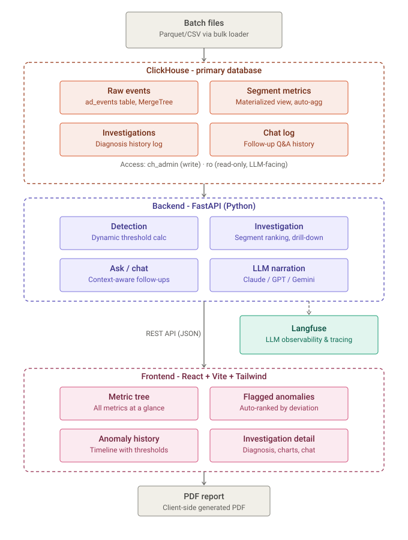

<div align="center">
  

  <h1>Why Did It Move</h1>

  <p><strong>Automated root-cause analysis for ad-metrics, on ClickHouse.</strong></p>
  <p>CH-Minds · Click-a-thon 2026 · InMobi problem statement<br/>
  <em>"From alert to answer: the automated root-cause analyst."</em></p>

  <p>
    
    
    
    
    
  </p>

  <p><strong>A metric drops - we name the exact segment and why, backed by real numbers, in seconds.</strong></p>
</div>

<br/>

> A metric moves → the system detects it on its own, drills down through ClickHouse to the exact segment responsible - day-level, hour-level, and by-segment - and explains it in plain English. Every cited number is real, reproducible, and traced end to end. Nothing is hallucinated: the LLM never queries ClickHouse and never sees a raw row.

---

## Table of contents

- [The problem](#the-problem)
- [Our solution](#our-solution)
- [What's inside](#whats-inside)
- [Architecture](#architecture)
- [Stack](#stack)
- [Repository layout](#repository-layout)
- [Running it](#running-it)
- [Verifying the results are real](#verifying-the-results-are-real-not-hallucinated)
- [The unseen incident / new data](#the-unseen-incident--new-data)
- [Further reading](#further-reading)

---

## The problem

InMobi's ad business runs at global scale - every app open, scroll, and ad slot is an **ad request**, and each one flows through a funnel: `Request → Fill → Impression → Click`, with revenue earned on impressions. Across thousands of app / device / geo / advertiser combinations, a metric like revenue or fill rate can move for any number of reasons - traffic changed, an ad format broke, a specific device/OS combo stopped rendering, one advertiser's campaign paused. Today, answering *"why did it move?"* means a human manually slicing dashboards dimension by dimension. That doesn't scale, and it's slow even when it works.

**The ask:** given a stream of ad-event data, **detect** when a headline metric deviates from its normal baseline, **automatically drill down** to the exact responsible segment, and **produce a plain-language diagnosis** where every claim is backed by a real, reproducible number - stating what was checked and ruled out, not just what was found. A private, unseen slice of new data (with new planted anomalies) drops in the final hours; the system has to work on data it has never seen, not just the known training batch.

Full spec: the original package's `PROBLEM_STATEMENT.md` and `metrics_glossary.md` (not included in this public repo - [see the official problem statement repo](https://github.com/sidagarwal04/click-a-thon-2026/tree/main/InMobi)).

## Our solution

Three stages, one architectural rule that shapes all of them: **ClickHouse does every bit of the analysis; the LLM only narrates the finished result.** The LLM never queries ClickHouse, never sees a raw event row, and never invents a number - it receives a pre-computed JSON object and turns it into 2–4 sentences of plain English.

<table>
<tr>
<td width="33%" valign="top">

### 1 · Detect
A background scan sweeps every headline metric (revenue, fill rate, render rate, eCPM, CTR) × every dimension, comparing each day against a **trailing same-weekday median baseline** - never a flat average (falsely flags every weekend) and never a *mean* baseline (a real incident poisons its own trailing window - see [Key differentiators](#key-differentiators)). Deviations flow into `anomaly_candidates`.

</td>
<td width="33%" valign="top">

### 2 · Investigate
For a flagged (or manually chosen) metric/day: decompose into `Requests × Fill rate × eCPM`, rank every dimension's segments by deviation, then drill **one level deeper** for a sharper intersection (e.g. `country=IN` alone vs. `country=IN AND device_model=iPhone`) - and record every factor/segment checked and ruled out. Then drill **one level finer in time**: which specific hour, and which segment at that hour.

</td>
<td width="33%" valign="top">

### 3 · Narrate + trace
The structured findings go to the LLM exactly once, purely to phrase them in plain language. Every query run, in order, plus the narration call, is captured as a **Langfuse trace** - a judge can open it and see precisely what the system checked and why, independent of the prose.

</td>
</tr>
</table>

### Key differentiators

- **Robust (median) baseline, not a mean.** A real incident sits inside the trailing window of its own future comparisons - a mean baseline lets it manufacture phantom anomalies in its own wake. Measured directly: a genuine −44.8% revenue incident inflated the *following* Sunday's reading from a true +5.5% to a false +22.7% under a mean baseline. Fixed everywhere with `quantileExact(0.5)`, a true order statistic immune to one outlier in a 4-sample window.
- **Partial-day and partial-hour aware.** The unseen slice will very likely arrive mid-day. Comparing a half-loaded day against full 24-hour trailing baselines flips a real **+19.6%** into a fabricated **−27.9%** - measured, not theoretical. Every query restricts the target period *and* its baselines to the same window instead.
- **Nothing about detection is a hardcoded guess.** Both the baseline and the anomaly threshold are computed live, per metric, from whatever data is currently loaded (`backend/app/thresholds.py`) - with an explicit, honest fallback when there isn't enough history yet to trust a percentile.
- **Multi-dimension drill-down, day *and* hour grain.** A planted anomaly localized to *"iPhones in India"* - not `country=IN` alone, not `device_model=iPhone` alone - still gets found and named precisely. And a segment that runs fine for 22 hours and collapses for 2 gets found too: hour-grain ranking uses the exact same robust-baseline machinery, just partitioned one level finer, so a day-level average can't dilute it away.
- **"Checked and ruled out" is real, not decorative.** Every factor/dimension that came back normal is recorded - and cuts that are *structurally* incapable of varying (e.g. fill rate by advertiser vertical, since an advertiser only exists on a filled request) are explicitly labelled "not applicable" with the reason, never silently run and reported as "normal."
- **Revenue gets three detectors the day-grain scan structurally can't express:** sustained multi-day drift (scored as *excess over the business overall*, so a global dip doesn't make every segment look like it's drifting), a segment collapsing to zero, and a mix-shift where the total looks fine but composition changed.
- **Latency is measured, not asserted.** Every diagnosis shows its own ClickHouse-vs-LLM time split; a separate p50/p95/p99 panel reports the *distribution* across every run logged so far - proof that "seconds, not minutes" holds up under real, repeated use, not just a cherry-picked demo run.
- **Every number is one click from its raw JSON evidence.** The "Raw evidence" panel on every diagnosis is the literal object handed to the LLM; the downloadable PDF report includes it verbatim as an appendix.

## What's inside

<table>
<tr><th>Capability</th><th>What it answers</th><th>Where</th></tr>
<tr><td><strong>Metric tree</strong></td><td>Is each headline metric normal / watch / anomalous right now, in the right unit (%, $)?</td><td><code>frontend/.../MetricTree.jsx</code></td></tr>
<tr><td><strong>Anomaly history</strong></td><td>Per-day deviation for one metric across the whole loaded range - click any day, flagged or not, to investigate it.</td><td><code>MetricHistoryTimeline.jsx</code></td></tr>
<tr><td><strong>Anomaly counts</strong></td><td><em>How many</em> segment-level anomalies fired each day - breadth, not just one number's deviation size. Shares one date range with Anomaly history.</td><td><code>AnomalyCountChart.jsx</code></td></tr>
<tr><td><strong>Hour breakdown</strong></td><td>Which <em>hours</em> of the currently-selected day had a responsible segment - reuses the same day picker, no second date control.</td><td><code>hourly_drilldown.py::day_hour_scan</code>, <code>HourScanStrip.jsx</code></td></tr>
<tr><td><strong>Investigation + Playback</strong></td><td>Full diagnosis for a metric/day, then hour-by-hour replay - scrub to any hour and see which segment was responsible <em>at that hour specifically</em>, which can differ from the day-level finding.</td><td><code>investigate.py</code>, <code>PlaybackTimeline.jsx</code></td></tr>
<tr><td><strong>Revenue signals</strong></td><td>Sustained drift, collapsed segments, and mix-shift - incident shapes the threshold scan can't see. Verified to surface real gaps: 4 segment/days with zero prior candidates.</td><td><code>revenue_signals.py</code>, <code>RevenueSignals.jsx</code></td></tr>
<tr><td><strong>Latency panels</strong></td><td>p50/p95/p99 across every logged investigation (system-wide reliability) <em>and</em> the ClickHouse-vs-LLM split for the one diagnosis on screen (this run's proof).</td><td><code>timing.py</code>, <code>LatencyStats.jsx</code> / <code>LatencyBar.jsx</code></td></tr>
<tr><td><strong>Chat follow-up</strong></td><td>Free-text questions answered from the same computed data, context-aware of whatever investigation is open - with a static, un-talkable-out-of refusal for anything off-topic.</td><td><code>ask.py</code>, <code>ChatBox.jsx</code></td></tr>
<tr><td><strong>PDF report</strong></td><td>Diagnosis + every number + raw JSON appendix + Langfuse trace link, bundled - the actual unseen-incident submission artifact.</td><td><code>lib/report.js</code></td></tr>
<tr><td><strong>Detection coverage banner</strong></td><td>States plainly which days/segment-days the scan could <em>not</em> evaluate (too little baseline history, a partial day) - never renders "not evaluated" as "normal."</td><td><code>coverage.py</code></td></tr>
</table>

## Architecture

<div align="center">
  
</div>

- **`ad_events`** - raw fact table, one row per ad request.
- **`hourly_segment_metrics`** - the serving-layer rollup every query actually reads. `AggregatingMergeTree` + `*State`/`*Merge` because fill rate/eCPM/CTR/render rate are **sum/sum ratios** (never averaged per-row - that breaks rollups), and its `ORDER BY` deliberately covers all 10 grouping columns (a real ClickHouse gotcha: for `AggregatingMergeTree`, `ORDER BY` is a row's *merge identity* - leaving a column out silently corrupts it during background merges; see [`INMOBI_CONTEXT.md`](INMOBI_CONTEXT.md)'s "Incident" section for the full story of finding and fixing this).
- **`anomaly_candidates` / `investigations` / `chat_queries` / `request_latencies`** - the pipeline's own output, written via a least-privilege `ch_admin` path never reachable from LLM-facing code.
- Full schema reasoning lives as comments directly above each `CREATE TABLE` in [`configs/clickhouse/01-schema.sql`](configs/clickhouse/01-schema.sql).

## Stack

| Component | Role |
|---|---|
| **ClickHouse** | Primary datastore *and* the engine doing the actual analysis - every decomposition, ranking, combo and hour-level drill-down is a ClickHouse query, never Python/LLM logic. |
| **FastAPI** (`backend/`) | Orchestrates detect → investigate → narrate; the only code path with write access to ClickHouse. |
| **Langfuse** | Full tracing of every investigation - what was checked, in what order, with real input/output at every step. The one optional OSS component this build integrates, chosen because it's the direct mechanism for the "no trace, no credit" unseen-incident requirement. |
| **Vite + React + Tailwind + shadcn/ui** (`frontend/`) | Dashboard: metric tree, anomaly counts, hour breakdown, diagnosis + latency, hour-by-hour replay, PDF report, chat follow-up. |

## Repository layout

<details>
<summary><strong>Click to expand full tree</strong></summary>

```
docker-compose.yaml                   All infra (ClickHouse always on; Langfuse optional profile)
.env.example                          Copy to .env before running
configs/clickhouse/01-schema.sql      Schema + reasoning comments (read this to understand the data model)
configs/clickhouse/init-db.sh         Creates the read-only ClickHouse user on first boot
backend/app/
  detect.py                          Background scan, day-grain (Detect)
  investigate.py                     Drill-down + factor decomposition + combo refinement
  hourly_drilldown.py                Hour-level segment ranking + per-day hour scan
  revenue_signals.py                 Sustained drift / collapsed segment / mix-shift detectors
  baseline.py                        Shared robust (median) trailing-baseline window - one definition, every query
  coverage.py                        Partial-day / partial-hour detection, so baselines never compare mismatched windows
  thresholds.py                      Dynamic, data-derived detection thresholds
  timing.py                          Per-stage latency instrumentation + p50/p95/p99 aggregation
  llm.py                             Provider-agnostic narration (OpenAI/Anthropic/Gemini)
  tracing.py                         Langfuse wrapper
  ingest.py                          Incremental event ingest (POST /api/ingest/events)
  timeline.py                        Hour-by-hour replay data
  ask.py                             Chat follow-up endpoint
frontend/src/                        Dashboard (see components/ for metric tree, diagnosis, chat, playback)
scripts/load_data.sh                 Bulk data load - refuses to double-count an already-loaded date range
scripts/validate_thresholds.sql      Independent empirical check of the detection thresholds
scripts/edge_cases.sql               Reusable correctness probes - re-run after every new data load
EDGE_CASES.md                        Full edge-case audit against the real dataset: what was found, fixed, verified
SCALABILITY.md                       Measured (not hand-waved) scaling story to billions of rows
PROGRESS.md / INMOBI_CONTEXT.md      Full build history, known risks, and problem-statement reference
```

</details>

## Running it

```bash
cp .env.example .env
```

Edit `.env` and set at least one LLM key (`OPENAI_API_KEY`, `ANTHROPIC_API_KEY`, or `GEMINI_API_KEY`) plus a matching `ACTIVE_LLM_PROVIDER`. Everything else in `.env.example` already has working defaults for local development.

```bash
docker compose up -d
```

This brings up ClickHouse (always on) and, per `COMPOSE_PROFILES` in `.env`, Langfuse - plus the backend and frontend. First boot takes a minute while ClickHouse initializes and Langfuse runs its own migrations; `docker compose ps` should show every container `healthy`.

### Get the data

The InMobi ad-events dataset isn't included in this repo - `ad_events.parquet` alone is over GitHub's 100MB file limit. It's the same 4 files from the official problem package:

```bash
git clone --depth 1 https://github.com/sidagarwal04/click-a-thon-2026.git /tmp/click-a-thon-2026
mkdir -p data/inmobi
cp /tmp/click-a-thon-2026/InMobi/data/{ad_events.parquet,apps.csv,advertisers.csv,geo_device.csv} data/inmobi/
```

Then load it:

```bash
./scripts/load_data.sh
```

Dimension tables load first, `ad_events` second (the rollup's materialized view needs the dimension lookups populated before it can resolve joins correctly on the incoming events). The script stages events and **refuses to commit if the date range is already loaded** - safe to re-run without silently double-counting a day - and prints row counts for all 5 tables when done.

### Use it

| | |
|---|---|
| Dashboard | http://localhost:5173 |
| Backend API | http://localhost:8001 (interactive docs at `/docs`) |
| Langfuse UI | http://localhost:3000 |

From the dashboard: pick a day, hit **Re-scan** to run detection, click any flagged anomaly (or use **Investigate manually** for any metric/day) to get a diagnosis, check the **Hour breakdown** strip for which hours of that day stood out, **Replay this incident** for the hour-by-hour view (scrub to any hour to see which segment was responsible then), the download icon for a PDF report, and **Ask a follow-up** to query the same data conversationally.

## Verifying the results are real, not hallucinated

- Every diagnosis has a **"Raw evidence (JSON)"** panel - the exact object handed to the LLM, so any sentence in the diagnosis can be checked against a specific field.
- Every diagnosis links to its **full Langfuse trace** - every ClickHouse query the pipeline ran, in order, with real input/output.
- Every diagnosis shows its **own latency breakdown** (ClickHouse vs. LLM), and a separate panel reports the **p50/p95/p99 across every logged run** - not a cherry-picked single timing.
- `scripts/edge_cases.sql` and `scripts/validate_thresholds.sql` independently re-derive rollup correctness and detection thresholds straight from raw data, as a cross-check against what the pipeline computes live.
- The downloadable PDF report bundles the diagnosis, every number behind it, the raw JSON appendix, and the trace link into one artifact - this is the actual submission artifact for the unseen-incident requirement.

## The unseen incident / new data

`scripts/load_data.sh` is safe to re-run against a new slice of files (dimension tables upsert, `ad_events` just gets new date partitions, and a **staging-table overlap guard refuses to double-count** an already-loaded range); `POST /api/ingest/events` accepts incrementally-pushed data if it doesn't arrive as files at all. Either way it lands in the same `ad_events` table and needs zero schema/code changes downstream.

**Every correctness fix in this build applies automatically, with zero manual work**, because each one lives in query logic and shared modules that run fresh on every call - not a patch applied to today's specific rows:

- Robust median baseline, partial-day/partial-hour handling, "not evaluated ≠ normal" gating, structurally-degenerate dimension exclusion, and dynamic per-metric thresholds all recompute live from whatever's currently loaded.
- The loader's overlap guard runs on every invocation, by construction.

**One deliberate manual step remains**, on purpose: run `scripts/edge_cases.sql` once right after the new slice lands (steps in [`INMOBI_CONTEXT.md`](INMOBI_CONTEXT.md)'s "Ingesting and verifying new data" section). The code being correct doesn't guarantee tomorrow's *file* has no new problem of its own - that exact "trust but verify" discipline is what caught this build's real rollup-corruption bug and a real dimension-table duplication bug, neither of which a passing test suite alone would have surfaced.

## Further reading

- [`EDGE_CASES.md`](EDGE_CASES.md) - full edge-case audit against the live 9M-row dataset: what was found, what changed, and how each fix was verified against real numbers.
- [`SCALABILITY.md`](SCALABILITY.md) - measured (not hand-waved) path to billions of rows: what the rollup buys today, what breaks first, and the concrete fix already written and ready.
- [`INMOBI_CONTEXT.md`](INMOBI_CONTEXT.md) - condensed problem-statement reference, the rollup-corruption incident writeup, and the exact query inventory showing where ClickHouse does the real work.
- [`PROGRESS.md`](PROGRESS.md) - full build log: what's implemented, what's been independently verified against live data (not just read), and the ranked list of known risks.

## License

MIT - see [LICENSE](LICENSE).
