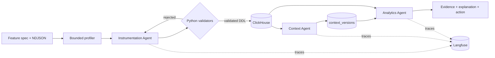

# Atlys track — submission specifications

Team **Chaishots** · Project **Asklys** · Click-a-thon 2026

This document maps each Atlys code-freeze requirement to the evidence in this
repository, so every scored criterion has something concrete behind it. Track
problem statement: *"From feature spec to insight: agents that instrument,
analyze, and explain."*

| Rubric criterion | Weight | Where the evidence is |
|---|---|---|
| ClickHouse & OSS Stack | 25% | [§1](#1-code--how-to-run-it), [§2](#2-architecture), [§3.1](#31-generated-ddl-for-the-feature-specs) |
| Problem Fit | 20% | [§3.2](#32-analytics-agent-insight-report), [§5](#5-standard-probe-set) |
| Technical Implementation | 20% | [§1](#1-code--how-to-run-it), [§2](#2-architecture), [§3.3](#33-context-layer--freshness-proof) |
| Innovation | 20% | [Asklys](#innovation-asklys-the-conversational-analyst), [§3.3](#33-context-layer--freshness-proof) |
| Scalability & Impact | 10% | [§2](#2-architecture), [Scalability](#scalability--impact) |
| Presentation | 5% | `pitch-deck-1.pdf`, hosted demo, demo video |

---

## 1. Code + how to run it

All three agents, tracing, and the visualization layer live in this repository —
backend and frontend together, so the submission is self-contained.

| Agent | Implementation | Role |
|---|---|---|
| **Instrumentation** | `backend/app/services/full_feature_workflow.py` | Profiles NDJSON, proposes typed ClickHouse schema, partition/order keys, materialized views |
| **Context** | `backend/app/services/full_feature_workflow.py`, `backend/app/tools/context_store.py` | Diffs new schema against living context; persists a new version |
| **Analytics** | `backend/app/services/full_feature_workflow.py`, `backend/app/tools/baseline_analysis.py` | Plans analyses, runs validated read-only SQL, interprets aggregate evidence |
| **Tracing** | `backend/app/tracing/langfuse.py` | Pipeline, agent, and tool spans with bounded metadata |
| **Visualization** | `frontend/` (React 19 + Vite) | Run explorer and the Asklys conversational analyst |

**Run guide:** [`RUN.md`](./RUN.md) — environment variables, ClickHouse Cloud
connection, prerequisites, and troubleshooting.

**One command, end to end:**

```bash
uv run --project backend atlys-pipeline --feature <feature>
```

This profiles the events, generates and validates DDL, creates the table,
streams the rows in, updates the semantic context, runs validated analytics,
stores every artifact, and flushes the Langfuse trace. It prints a JSON summary
with the run ID, table, rows inserted, context version, insights, and trace ID.

The same operation is reachable through `POST /api/v1/features/process` (REST)
and the `process_feature` MCP tool — all three adapters call one service, so
there is a single code path to audit.

---

## 2. Architecture

Full write-up: [`ARCHITECTURE.md`](./ARCHITECTURE.md). Summary of the four
points the track asks for:

### The three agents and how they hand off



Hand-offs are **typed Pydantic contracts**, not free-form text. Each agent's
output is parsed into a schema and rejected on violation rather than patched.
Two hard gates enforce ordering: no DDL executes until Python validators accept
every identifier, type, nullable rule, and funnel step; and the Analytics Agent
cannot start until a refreshed context version has been persisted.

### Where the context layer is stored, and why

**ClickHouse table `context_versions`**, alongside `generated_artifacts` in the
same database as the event data.

Each version is written as a **complete document**, so any historical snapshot
is read directly instead of being replayed from diffs, and a before/after
comparison is a two-row query. ClickHouse was chosen over a file or a vector
store because the context must share the warehouse's durability and access
control, be queryable by the client the agents already hold, and version
atomically with the runs that produced it. No similarity search is needed — the
context is small, structured, and read in full — so a vector store would add
infrastructure without adding capability.

### How Langfuse tracing is wired

`backend/app/tracing/langfuse.py` wraps each pipeline stage, agent call, and
tool execution in a span. Traces carry stage names, latencies, attempt counts,
and errors, with **bounded metadata**: no secrets and no raw event payloads.
Every completed run stores its `langfuse_trace_id` in the `agent_runs` table,
so a trace can be recovered from the warehouse alone. Tracing is toggled with
`LANGFUSE_TRACING_ENABLED`.

ClickStack and LibreChat were not integrated. The MCP server
(`backend/app/mcp_server.py`, Python SDK v2 `MCPServer`) exposes the pipeline
over stdio or Streamable HTTP and is LibreChat-compatible at
`http://localhost:8001/mcp`, but we are not claiming evidence for an
integration we did not run.

### LLM providers used and why

All models are served by **Fireworks AI** over an OpenAI-compatible endpoint:

| Model | Used by | Why |
|---|---|---|
| `gpt-oss-120b` | Instrumentation, Context, Analytics agents | Strict JSON-schema structured output — every response is parsed into a typed contract and rejected on violation. Open weights keep the system portable to self-hosting. |
| `deepseek-v4-pro` | Asklys conversational analyst | Stronger SQL generation and self-critique for the interactive plan → review → repair loop. |

Provider choice is configuration (`FIREWORKS_BASE_URL`, `FIREWORKS_MODEL`,
`ASKLYS_MODEL`), so any OpenAI-compatible endpoint substitutes without code
changes.

---

## 3. Graded outputs

All evidence below was produced by pipeline runs against ClickHouse Cloud
database `atlys` on 2 August 2026 and is stored in the warehouse itself
(`generated_artifacts`, `context_versions`, `agent_runs`). Nothing is
hand-written.

### 3.1 Generated DDL for the feature specs

Five feature specs ran end to end. The generated DDL is exported to files:

- **[`submission_artifacts/all_generated_ddl.sql`](./submission_artifacts/all_generated_ddl.sql)** — every `CREATE TABLE` in one file
- **`submission_artifacts/<feature>/schema.sql`** — per feature, with a header
  recording the run ID, trace ID, rows loaded, and context version

Both are exported unmodified from ClickHouse. The schema artifact also records
the agent's schema reasoning, partition rationale, and per-field sort-key
rationale, all re-derivable with:

```sql
SELECT payload FROM generated_artifacts WHERE artifact_type = 'schema';
```

| # | Feature | Generated table | Rows loaded | Context version | Langfuse trace ID |
|---|---|---|---|---|---|
| 1 | `express_checkout_f1` | `express_checkout_events` | 5,507 | v2 | `afe6fc2f03c251785404f325e06ad0e3` |
| 2 | `group_family_f2` | `group_application_events` | 5,453 | v3 | `adb389ca213bd869be811ad0d2d0305b` |
| 3 | `status_sharing_f3` | `visa_status_sharing_events` | 6,503 | v4 | `089db6c8c215922bc2cac20d2b5817b1` |
| 4 | `abandoned_checkout_recovery_f4` | `abandoned_checkout_recovery_events` | 5,919 | v5 | `209fbbbae9d7bdfa4ba539f658083ba3` |
| 5 | `instant_forex_f5` | `instant_forex_addon_events` | 6,237 | v6 | `97e9e1246e32c240e5ce500011f49f6a` |
| **6** | **`unseen_f6` (sealed)** | **`promo_coupon_checkout_events`** | **5,363** | **v7** | **`e18e58f7f9d834c17e9b52f42f2aa851`** |

Each schema artifact stores not just the DDL but the agent's **reasoning**:
`schema_reasoning`, `partition_by_reasoning`, and per-field
`order_by_reasoning` explaining each sort key's role (`primary_entity`,
`time_filter`, `event_filter`, `segment_filter`, `relationship_key`).

<details>
<summary><strong>Generated DDL — all six features</strong></summary>

```sql
CREATE TABLE `atlys`.`express_checkout_events`
(
    `event` String,
    `id` String,
    `timestamp` DateTime64(3),
    `device_type` String,
    `os` Nullable(String),
    `app_version` String,
    `geoip_country_code` String,
    `city` String,
    `client_lib` String,
    `user_id` String,
    `application_id` String,
    `destination` String,
    `eligible` Nullable(UInt8),
    `shown_amount` Nullable(Float64),
    `currency` Nullable(String),
    `saved_method_type` Nullable(String),
    `otp_attempts` Nullable(Int64),
    `otp_success` Nullable(UInt8),
    `payment` Nullable(String)
)
ENGINE = MergeTree
ORDER BY (`user_id`, `timestamp`, `event`);

CREATE TABLE `atlys`.`group_application_events`
(
    `event` String,
    `id` String,
    `timestamp` DateTime64(3),
    `device_type` String,
    `os` Nullable(String),
    `app_version` String,
    `geoip_country_code` String,
    `city` String,
    `client_lib` String,
    `user_id` String,
    `application_id` String,
    `group_id` String,
    `destination` String,
    `group_size` Int64,
    `traveller_index` Nullable(Int64),
    `relation` Nullable(String),
    `docs_complete` Nullable(UInt8),
    `travellers_submitted` Nullable(Int64)
)
ENGINE = MergeTree
ORDER BY (`group_id`, `timestamp`, `event`, `user_id`);

CREATE TABLE `atlys`.`visa_status_sharing_events`
(
    `event` String,
    `id` String,
    `timestamp` DateTime64(3),
    `device_type` Nullable(String),
    `os` Nullable(String),
    `app_version` Nullable(String),
    `geoip_country_code` Nullable(String),
    `city` Nullable(String),
    `client_lib` Nullable(String),
    `user_id` Nullable(String),
    `application_id` Nullable(String),
    `share_id` String,
    `destination` String,
    `status_shared` Nullable(String),
    `channel` Nullable(String),
    `recipient_is_new_user` Nullable(UInt8),
    `cta` Nullable(String)
)
ENGINE = MergeTree
ORDER BY (`destination`, `event`, `timestamp`, `share_id`);

CREATE TABLE `atlys`.`abandoned_checkout_recovery_events`
(
    `event` String,
    `id` String,
    `timestamp` DateTime64(3),
    `device_type` String,
    `os` Nullable(String),
    `app_version` String,
    `geoip_country_code` String,
    `city` String,
    `client_lib` String,
    `user_id` String,
    `application_id` String,
    `destination` String,
    `drop_step` String,
    `channel` Nullable(String),
    `hours_since_drop` Nullable(Int64)
)
ENGINE = MergeTree
ORDER BY (`user_id`, `timestamp`, `event`, `drop_step`);

CREATE TABLE `atlys`.`instant_forex_addon_events`
(
    `event` String,
    `id` String,
    `timestamp` DateTime64(3),
    `device_type` String,
    `os` Nullable(String),
    `app_version` String,
    `geoip_country_code` String,
    `city` String,
    `client_lib` String,
    `user_id` String,
    `application_id` String,
    `destination` String,
    `from_currency` String,
    `to_currency` String,
    `fx_rate` Nullable(Float64),
    `amount` Nullable(Int64),
    `addon_value_inr` Nullable(Float64)
)
ENGINE = MergeTree
ORDER BY (`user_id`, `timestamp`, `event`, `destination`);

-- Sealed sixth specification
CREATE TABLE `atlys`.`promo_coupon_checkout_events`
(
    `event` String,
    `id` String,
    `timestamp` DateTime64(3),
    `device_type` String,
    `os` Nullable(String),
    `app_version` String,
    `geoip_country_code` String,
    `city` String,
    `client_lib` String,
    `user_id` String,
    `application_id` String,
    `destination` String,
    `cart_value` Float64,
    `currency` String,
    `coupon_code` Nullable(String),
    `discount_type` Nullable(String),
    `discount_amount` Nullable(Float64),
    `final_value` Nullable(Float64),
    `reject_reason` Nullable(String)
)
ENGINE = MergeTree
ORDER BY (`user_id`, `timestamp`, `event`, `destination`);
```

</details>

Note the schema decisions are **evidence-driven, not templated**: nullability
tracks observed presence rates per field (`visa_status_sharing_events` marks
the whole envelope nullable because those fields are genuinely absent in some
rows, while `express_checkout_events` keeps them required), and sort keys
differ per feature according to how each will be queried — `group_id` leads for
group applications, `destination` leads for status sharing.

Each feature also produced a **materialized view** for daily aggregates
(`*_daily_aggregate` + `*_daily_aggregate_mv`), generated from the
Instrumentation Agent's materialization plan.

### 3.2 Analytics Agent insight report

Every run's Analytics Agent output is stored in `agent_runs.insights_json` and
in `generated_artifacts` (`artifact_type = 'insights'`), reachable through
`GET /api/v1/runs/{run_id}/insights`. Each finding carries a title,
explanation, recommendation, confidence, and caveats, and can be traced back to
the analyses that ran (`analysis_plan`) and the aggregate rows they returned
(`query_results`).

Representative findings across the five runs:

**Express checkout** — Express converts about half of shown users to payment
(high confidence). OTP success is notably lower on iOS (high). Baseline
conversion lift *cannot* be measured because the exposed cohort is missing —
reported as low confidence rather than guessed.

**Group / family applications** — Overall group conversion around 57% (high).
Groups of 5 or more under-perform on completion while mid-size groups of 3–4 do
better (medium). Document completion is *not* the primary bottleneck (medium).

**Status sharing** — Share rate about 24.6% after the WhatsApp nudge launch
(high). Funnel: 71.5% adopt link generation, 80.6% open the link, but only
28.5% click the CTA (high). Zero CTA clicks from new-user opens, so K-factor is
0 (high) — a genuinely negative finding surfaced rather than buried.

**Abandoned checkout recovery** — Reminder timing dramatically influences
recovery (high). Push notifications outperform other channels (medium). Low
funnel conversion before reconversion caps overall impact (high).

**Instant forex add-on** — The major drop-off is between offer shown and
add-to-cart (high), with high conversion once add-to-cart completes (high). No
observable relationship between `fx_rate` magnitude and attach rate (low).

The agent consistently reports **what it cannot conclude** — missing cohorts,
absent latency data, unavailable churn metrics — with explicit low confidence,
instead of manufacturing a number.

### 3.3 Context layer + freshness proof

The context layer is `context_versions` in ClickHouse. It **demonstrably grew
as each new table landed** — this is the before/after changelog, queryable
directly:

```sql
SELECT version, created_at, length(document) FROM context_versions ORDER BY version;
```

| Version | Trigger | Relationships | Metrics | Conflicts | Tables covered |
|---|---|---|---|---|---|
| v1 | Base context (8 existing tables) | 5 | 7 | 7 | 6 |
| v2 | + `express_checkout_events` | 7 (+2) | 12 (+5) | 1 | 7 |
| v3 | + `group_application_events` | 7 | 15 (+3) | 2 | 7 |
| v4 | + `visa_status_sharing_events` | 7 | 22 (+7) | 2 | 7 |
| v5 | + `abandoned_checkout_recovery_events` | 9 (+2) | 26 (+4) | 3 | 8 |
| v6 | + `instant_forex_addon_events` | 11 (+2) | 30 (+4) | 3 | 9 |
| **v7** | **+ `promo_coupon_checkout_events` (sealed 6th spec)** | **11** | **34 (+4)** | **4** | **10** |

The document grew from 4,412 to 17,917 bytes across the seven versions.

**This is the freshness proof the track asks for:** v7 is the before/after pair
that matters most, because the sealed sixth spec was unseen when v6 was
written. The context absorbed a brand-new table and four new coupon metrics
without any code change.

**Metrics before (v1, 7):** `conversion_rate`, `drop_off_rate`,
`step_through_rate`, `passport_capture_pass_rate`, `on_time_delivery_rate`,
`revenue_per_conversion`, `funnel_conversion_rate`.

**Metrics added by v7 (27 new),** including `express_conversion_rate`,
`otp_success_rate`, `express_adoption_rate`, `average_payment_latency_ms`,
`group_completion_rate`, `add_remove_churn_rate`, `docs_complete_rate`,
`share_rate_overall`, `share_rate_by_channel_destination`,
`k_factor_by_channel`, `link_open_rate`, `overall_recovery_rate`,
`recovery_rate_by_drop_step`, `channel_recovery_rate`, `timing_recovery_rate`,
`forex_attach_rate`, `forex_add_to_cart_rate`,
`average_forex_addon_value_inr`, and — from the sealed sixth spec —
`coupon_apply_rate`, `coupon_rejection_rate`, `checkout_with_coupon_rate`, and
`total_discount_amount`.

Each version also records **conflicts** the Context Agent detected — for
example, that an access pattern referenced a column `user` on
`express_checkout_events` when the schema only contains `user_id`. Conflicts
are surfaced in the context document rather than silently resolved.

Exported to [`submission_artifacts/context/`](./submission_artifacts/context/):
`before.json` (v1, base), `after.json` (v7), every intermediate version, and
[`changelog.md`](./submission_artifacts/context/changelog.md) with the full
before/after comparison.

Retrieve any snapshot live through `GET /api/v1/context/{version}`, or the diff
for a run through `GET /api/v1/runs/{run_id}/context-diff`.

### 3.4 Sixth-spec bundle

The sealed sixth specification ran end to end through the identical single
command, with no code changes and no hand-editing.

**[`submission_artifacts/06_promo_coupon_checkout/`](./submission_artifacts/06_promo_coupon_checkout/)**

| | |
|---|---|
| Feature | `unseen_f6` |
| Generated table | `promo_coupon_checkout_events` |
| Rows loaded | 5,363 |
| Context version after run | v7 |
| Run ID | `63a7c39b-a158-4acf-b92c-3f15250c9e15` |
| **Langfuse trace (mandatory)** | `e18e58f7f9d834c17e9b52f42f2aa851` |

| File | Contents |
|---|---|
| [`schema.sql`](./submission_artifacts/06_promo_coupon_checkout/schema.sql) | Generated DDL |
| [`insight-summary.md`](./submission_artifacts/06_promo_coupon_checkout/insight-summary.md) | Product-facing insight summary written by the agent |
| [`insights.json`](./submission_artifacts/06_promo_coupon_checkout/insights.json) | Full findings with evidence, recommendations, confidence, caveats |
| [`trace.json`](./submission_artifacts/06_promo_coupon_checkout/trace.json) | Trace reference and run metadata |

**PM evidence tag — `PM-COUPON-READONLY-2026-08-02`:** the product questions
were also answered with read-only ClickHouse queries and recorded in
[`insight-summary.md#pm-answers-verified-directly-in-clickhouse`](./submission_artifacts/06_promo_coupon_checkout/insight-summary.md#pm-answers-verified-directly-in-clickhouse).

The agent handled genuinely unseen fields — `cart_value`, `coupon_code`,
`discount_type`, `discount_amount`, `final_value`, `reject_reason` — marking
exactly the sometimes-absent ones nullable, and choosing
`ORDER BY (user_id, timestamp, event, destination)` with no partitioning at
5,363 rows.

**The strongest signal in this bundle is a data-quality defect the agent found
on its own.** It observed apply-to-checkout step-through rates above 100% in
several segments (Desktop FR at 2.0, iOS EG at 2.07) and concluded the
`checkout_with_coupon` event is likely emitted even when no discount was
applied — recommending the event definition be corrected. It also reported *no
observable conversion lift* from the feature at low confidence rather than
manufacturing a positive result.

---

## 4. Langfuse trace links

Every completed run persists its trace ID in `agent_runs.langfuse_trace_id`:

```sql
SELECT feature, langfuse_trace_id, created_at
FROM agent_runs WHERE status = 'completed' ORDER BY created_at;
```

| Feature | Trace ID |
|---|---|
| `express_checkout_f1` | `afe6fc2f03c251785404f325e06ad0e3` |
| `group_family_f2` | `adb389ca213bd869be811ad0d2d0305b` |
| `status_sharing_f3` | `089db6c8c215922bc2cac20d2b5817b1` |
| `abandoned_checkout_recovery_f4` | `209fbbbae9d7bdfa4ba539f658083ba3` |
| `instant_forex_f5` | `97e9e1246e32c240e5ce500011f49f6a` |
| **`unseen_f6` (sealed 6th spec — mandatory)** | **`e18e58f7f9d834c17e9b52f42f2aa851`** |

Traces are on Langfuse Cloud (`https://cloud.langfuse.com`). Each covers the
whole pipeline: profiling, the Instrumentation Agent, DDL validation and
execution, the Context Agent, analytics SQL execution, and insight
interpretation. Asklys responses carry their own `langfuse_trace_id`.

The mandatory sixth-spec trace is `e18e58f7f9d834c17e9b52f42f2aa851`, also
recorded in
[`06_promo_coupon_checkout/trace.json`](./submission_artifacts/06_promo_coupon_checkout/trace.json).

> **Pending:** shared public trace links or JSON exports to accompany the IDs
> above.

---

## 5. Standard probe set

> **Pending execution.** The four mandatory probes run against the eight
> existing tables through the Asklys analyst, which returns the validated SQL,
> the result rows, the product-facing answer, and a Langfuse trace ID for each:
>
> 1. "Analyze the existing funnel and surface the most important issues, with the why."
> 2. "Where are we losing conversions, and for which segments (device / geo / destination)?"
> 3. "Are there any regressions or trends over the last quarter?"
> 4. "Is anything in the base context wrong, stale, or self-contradictory?"
>
> Probe 4 is directly supported by the conflicts recorded in every context
> version (see [§3.3](#33-context-layer--freshness-proof)).

---

## Innovation: Asklys, the conversational analyst

The pipeline ends at an insight report. **Asklys makes it a conversation.** A
plain-English product question becomes validated ClickHouse SQL, the right
visualization, and an answer written for a product audience — grounded in the
same living context the three agents maintain.

What makes it more than a text-to-SQL wrapper:

- **Grounded in real schema** — reads live table/column metadata, sort keys,
  engines, and sampled dimension values, so it references columns that exist
- **Intent-aware planning** — classifies the question as funnel, trend,
  user-path, or text, then commits to a metric definition and stated
  assumptions *before* writing SQL
- **Self-correcting** — a reviewer step inspects the candidate SQL and its
  results and can reject and repair it, retrying up to 5 attempts and
  **reporting the attempt count** rather than hiding it
- **Unsafe queries refused by construction** — a deterministic validator
  (`SELECT`/`WITH` only, single statement, no `SELECT *`, no raw payloads, no
  identifier dumps) plus ClickHouse `readonly=2` and execution-time caps
- **Visual answers** — funnel steps with drop-off rates, trend series, or
  Sankey-style path links, matched to intent
- **Fully auditable** — every response carries its SQL, the context used, the
  analysis trail, the model, and a Langfuse trace ID

Progress streams over `POST /api/v1/asklys/query/stream`, so planning, each
query attempt, and each repair are visible as they happen — without exposing
private chain-of-thought.

---

## Scalability & impact

- **Bounded memory ingestion** — NDJSON is streamed and profiled with byte and
  line limits (`FEATURE_MAX_EVENT_FILE_BYTES`, `FEATURE_MAX_EVENT_LINE_BYTES`),
  so file size does not translate into memory use.
- **Raw rows never reach a model** — agents see bounded profiles and aggregate
  results only. Cost and privacy exposure stay flat as data grows.
- **Resumable runs** — an existing generated table is reused only when its
  schema and row count exactly match the validated proposal, so a retry after a
  failure does not duplicate work or corrupt state.
- **Materialized views per feature** — daily aggregates are generated with the
  schema, so dashboard reads do not rescan raw events.
- **One service, three adapters** — REST, CLI, and MCP share a single pipeline
  implementation; adding an interface adds no pipeline logic.
- **Portable models** — any OpenAI-compatible endpoint substitutes via
  configuration, including self-hosted open weights.

---

## Verification

```bash
cd backend
../.venv/bin/pytest -q          # 118 passed
../.venv/bin/ruff check app tests
../.venv/bin/mypy app           # 41 source files, no issues

cd ../frontend
npm run typecheck
npm run build
```

## Submission assets

| Asset | Location |
|---|---|
| Architecture write-up | [`ARCHITECTURE.md`](./ARCHITECTURE.md) |
| Run guide | [`RUN.md`](./RUN.md) |
| Pitch deck | [`pitch-deck-1.pdf`](./pitch-deck-1.pdf) |
| Generated evidence layout | [`submission_artifacts/`](./submission_artifacts/) |
| Submission checklist | [`SUBMISSION_CHECKLIST.md`](./SUBMISSION_CHECKLIST.md) |
| Hosted demo | https://chaishots-atlys.vercel.app/ |
