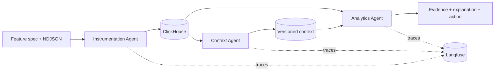

# Chaishots

## Track

Atlys

## Project

**Chaishots x Atlys** — From feature spec to insight: three agents that instrument,
contextualize, and explain, ClickHouse-native and fully traced in Langfuse.

## Team Members

- Vardhan ([kvardhan77](https://github.com/kvardhan77))
- Venu ([venuvarma-m](https://github.com/venuvarma-m))
- Jaswanth ([jaswanthg76](https://github.com/jaswanthg76))
- Aneesh ([aneeshtheja04](https://github.com/aneeshtheja04))

## What it does

Give Chaishots x Atlys a feature specification (`spec.md`) and its raw event stream
(`events.ndjson`). It then:

1. **Profiles** the NDJSON with bounded memory — field types, presence,
   cardinality estimates, and quality signals — never loading raw rows into a
   model prompt
2. **Instruments** the feature: the Instrumentation Agent proposes a typed
   ClickHouse schema, partition and ordering keys, and materialized views;
   Python validators check every identifier, type, nullable rule, and funnel
   step before any DDL executes
3. **Contextualizes** the change: the Context Agent diffs the validated schema
   against the living semantic context, adds entities/joins/metrics, flags
   contradictions, and persists a new context version
4. **Explains** the result: the Analytics Agent plans analyses, runs only
   validated read-only aggregate SQL, and turns the returned evidence into
   product-facing findings with recommendations, confidence, and caveats
5. **Traces** every stage in Langfuse — pipeline, agent, tool, latency, and
   error spans, with bounded metadata and no secrets or raw payloads

Trust model: **ClickHouse computes → typed contracts carry the evidence → the
LLM explains.** The Analytics Agent never begins until a refreshed context
version exists, and it only ever interprets aggregate results it did not
choose the SQL text for.

## Asklys — the conversational analyst

The pipeline ends at an insight report. **Asklys is where that stops being a
document and starts being a conversation.** It is our in-house chat interface
that turns a plain-English product question into validated ClickHouse SQL, the
right visualization, and an answer written for a product audience — grounded in
the same living semantic context the three agents maintain.

Ask *"where are we losing conversions, and for which segments?"* and Asklys:

1. **Grounds itself in real schema** — it reads live table and column metadata,
   sort keys, engines, and sampled dimension values, so it references columns
   that actually exist rather than plausible-sounding ones
2. **Plans with intent** — it classifies the question as a funnel, trend,
   user-path, or text answer, then commits to a metric definition, stated
   assumptions, and its reasoning *before* writing SQL
3. **Self-corrects** — a reviewer step inspects the candidate SQL and its
   results, and can reject and repair the query. Asklys retries up to a
   configured attempt limit, and reports how many attempts it needed rather
   than hiding them
4. **Refuses unsafe queries by construction** — every candidate passes a
   deterministic validator (SELECT/WITH only, single statement, no `SELECT *`,
   no raw payloads, no identifier dumps) and executes under ClickHouse
   `readonly=2` with execution-time caps
5. **Answers visually** — funnel steps with drop-off rates, trend series, or
   Sankey-style path links, chosen to match the question's intent
6. **Shows its work** — the response carries the SQL it ran, the context it
   used, its step-by-step analysis trail, the model, and a Langfuse trace ID

Progress streams live over `POST /api/v1/asklys/query/stream`, so the analysis
trail — planning, each query attempt, each repair — is visible as it happens,
without exposing private chain-of-thought.

Why this is the selling point: the Atlys brief asks for agents that instrument,
analyze, and *explain*. Asklys is the explain step made interactive — a PM can
interrogate the warehouse without knowing SQL, without a dashboard being built
first, and without having to trust the model, because every number is traceable
to validated SQL that ran read-only against ClickHouse.

## Hosted Demo

**[Live demo](https://chaishots-atlys.vercel.app/new-run)** — the run
explorer: submit a feature, then inspect the generated schema, the context
diff, the evidence, and the resulting insights. Open the
**[Asklys](https://chaishots-atlys.vercel.app/asklys)** tab to question the
warehouse directly.

## Demo Video

https://drive.google.com/drive/folders/1ug3Hupy_keF60GNZncjCfd7aohPelOnq?usp=drive_link

## OSS stack evidence

| Tool | Role in pipeline | Proof for judges |
|---|---|---|
| **ClickHouse Cloud** | Primary datastore, analytical engine, and the context layer's own home (`context_versions`, `generated_artifacts`) | Generated DDL + run reports in [`submission_artifacts/`](./submission_artifacts/) |
| **Langfuse Cloud** | Pipeline, agent, and tool traces for every run | Trace export: [`langfuse_traces.csv`](./langfuse_traces.csv); wiring described in [`ARCHITECTURE.md`](./ARCHITECTURE.md) |

The exported Langfuse traces are stored at
[`./langfuse_traces.csv`](./langfuse_traces.csv) from the repository root.

## Architecture

See [`ARCHITECTURE.md`](./ARCHITECTURE.md) — the full write-up covering the
three agents and their hand-offs, where the context layer is stored and why,
how Langfuse tracing is wired, and the LLM provider choice.

For the point-by-point mapping of Atlys track requirements to evidence —
generated DDL, insight reports, the context-freshness proof, and trace IDs —
see [`ATLYS_SPECIFICATIONS.md`](./ATLYS_SPECIFICATIONS.md).



Why it is trustworthy:

- Raw event rows stay in ClickHouse; models receive bounded profiles and
  aggregate results only
- Agent hand-offs use typed Pydantic contracts, not free-form messages
- Generated identifiers, DDL, and analytical SQL are validated
  deterministically before execution
- Semantic context is versioned, diffed, and stored alongside run artifacts
- REST, CLI, and MCP interfaces all call the same pipeline service, so there is
  one code path to audit

## Pitch deck

[`pitch-deck-1.pdf`](./pitch-deck-1.pdf) in this folder.

## Generated evidence

Evidence pack: [`submission_artifacts/`](./submission_artifacts/) — generated
DDL for the five known specs and the sealed sixth, the Analytics Agent's
autonomous report over the eight existing tables, the context before/after
changelog proving freshness, the four standard probe outputs, and the
corresponding Langfuse traces.

Everything there is produced by the pipeline on a clean ClickHouse run and is
not edited by hand. Reproduce any feature's bundle yourself:

```bash
uv run --project backend atlys-pipeline --feature <feature>
```

The command prints a JSON summary including the run ID, table, inserted row
count, context version, insights, and trace ID.

## How we built it

| Piece | Role |
|---|---|
| **ClickHouse Cloud** | Event storage, generated feature tables, versioned context, and run artifacts |
| **Python 3.13 / uv / FastAPI** | Pipeline service, agent orchestration, and deterministic validators |
| **Pydantic** | Typed contracts on every agent hand-off; malformed model output is rejected, not patched |
| **React 19 / Vite / TypeScript** | Run explorer UI for schemas, context diffs, evidence, and insights |
| **Langfuse Cloud** | Traces judges can open for each agent run |
| **Asklys** | Our in-house conversational analyst 

## How to run it

Supported on macOS and Linux with Python 3.13, [uv](https://docs.astral.sh/uv/),
Node.js 20+, and npm.

You need a **ClickHouse Cloud** service containing the eight Atlys baseline
tables (`application_started`, `auth_completed`, `destination_card_clicked`,
`document_uploaded`, `landing_page_scrolled`, `pay_now_clicked`,
`purchase_completed`, `search_typed`), plus a Fireworks API key and Langfuse
credentials.

### 1. Configure

`.env` is a checked-in, secretless template — do not put real credentials in
it. Put your credentials in `.env.local`, which is git-ignored and is loaded
after `.env`, so its values override the template:

```bash
cp .env.example .env.local
```

Fill at least `CLICKHOUSE_*`, `FIREWORKS_API_KEY`, and `LANGFUSE_*`. Running
`./dev.sh` creates `.env.local` for you on first run if it is missing.

### 2. Start the app

```bash
./dev.sh
```

One command: checks Python dependencies, installs frontend packages when
needed, starts both applications, verifies the frontend-to-backend proxy, and
shuts everything down together with Ctrl+C.

| Service | URL |
|---|---|
| Asklys UI | http://localhost:3000 |
| API docs (Swagger) | http://localhost:8000/docs |
| Health check | http://localhost:8000/api/v1/utils/health-check/ |

Starting the app does not run an agent pipeline or write to ClickHouse.
Credentials are only needed once you process a feature.

## Interfaces

| Interface | Purpose | Address or command |
| --- | --- | --- |
| Web application | Explore runs, context, evidence, and insights | <http://localhost:3000> |
| REST and Swagger | Upload features, run the pipeline, inspect artifacts | <http://localhost:8000/docs> |

## Source code

All project code is in this repository — backend and frontend together, so the
submission is completely self-contained.

```text
backend/                 FastAPI API, agents, pipeline, MCP server, and CLI
frontend/                React/Vite run explorer and Asklys analysis interface
incoming_features/       Feature specifications and NDJSON event inputs
langfuse_traces.csv       Exported Langfuse pipeline, agent, and tool traces
submission_artifacts/    Generated schemas, reports, context diffs, and traces
dev.sh                   One-command local application launcher
ARCHITECTURE.md          Detailed architecture and design decisions
RUN.md                   Setup, operation, and verification guide
```

## Verification

```bash
cd backend
../.venv/bin/pytest -q
../.venv/bin/ruff check app tests
../.venv/bin/mypy app

cd ../frontend
npm run typecheck
npm run build
```

## License

MIT — see [`LICENSE`](./LICENSE).
