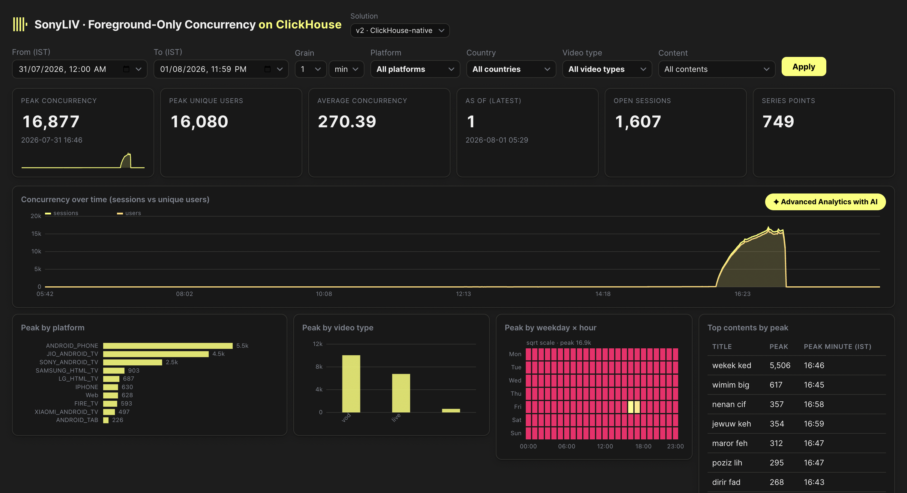
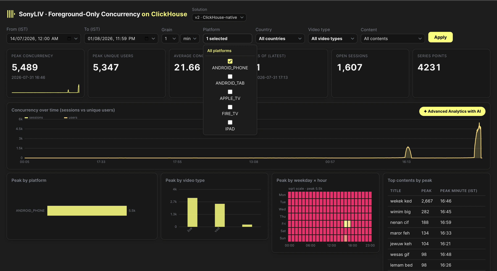
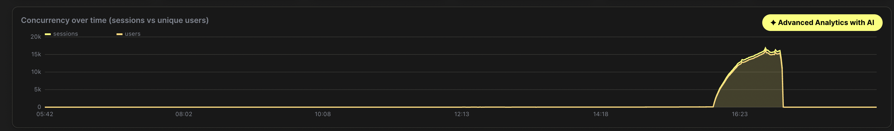
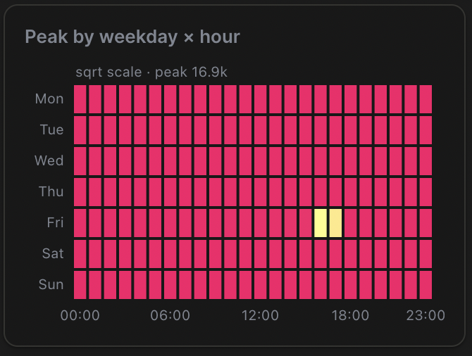
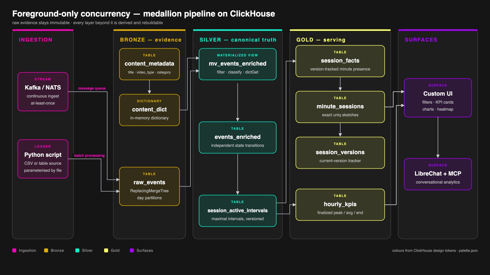
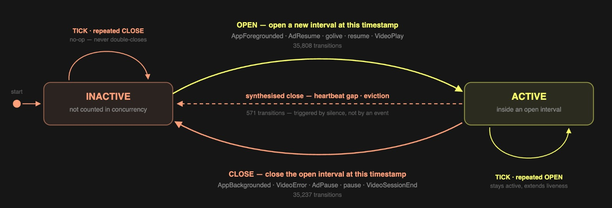
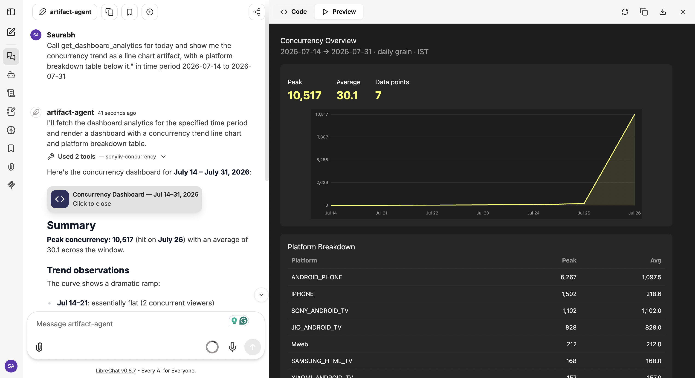
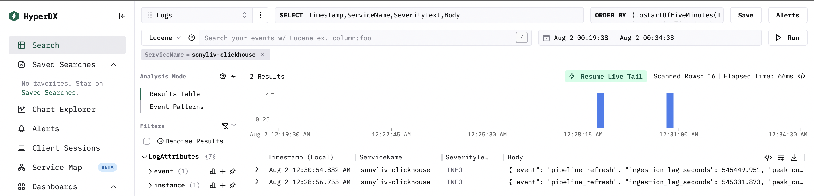

# ClickSherlock

## Track
SonyLIV

## Project
**Foreground-only concurrency at streaming scale** — a ClickHouse-native,
medallion-architected pipeline that counts *genuinely active* viewers per
minute from raw playback events, with a live dashboard and a conversational
analytics agent.

## Team Members
- Sachidananda Maharana (Github: `oo007`)
- Shruti Jain (Github: `CybernetTech`)
- Saurabh (GitHub: `saurabhojha`)
- Jitendra (GitHub: `jitendra1411`)

## What it does

`src/backend` ingests raw SonyLIV playback events (7M events on the unseen day)
and derives **foreground-only concurrency**: how many sessions/users were
genuinely watching in each minute — excluding backgrounded, paused, or
silent sessions. It serves exact per-minute peaks/averages, finalized hourly
KPIs for long ranges, multi-dimensional filters, and answers the same
questions conversationally through a LibreChat agent backed by a ClickHouse
MCP server.

## Hosted Demo

Demo [Video Link](https://drive.google.com/file/d/1odpNiZtPy-B2HBkvTHXtePzSYjB7lhRZ/view?usp=drive_link)
Libre Chat [Video](https://drive.google.com/file/d/1eeuswcDHL7LB0_au58Yx-TpCmM4PyHDk/view?usp=drive_link)

## Demo Video

Demo [Video Link](https://drive.google.com/file/d/1odpNiZtPy-B2HBkvTHXtePzSYjB7lhRZ/view?usp=drive_link)
Libre Chat [Video](https://drive.google.com/file/d/1eeuswcDHL7LB0_au58Yx-TpCmM4PyHDk/view?usp=drive_link)


## Slide Deck

Link to [Slide Deck](https://docs.google.com/presentation/d/1n3LO8HVB2DO51vKwJ_d5lqcdb4M7a0-W/edit?slide=id.g3f6284a59a0_0_342#slide=id.g3f6284a59a0_0_342)

## Product screenshots

### Dashboard — concurrency over time (sessions vs unique users)



### Dashboard — filtering by dimension (e.g. platform)



### Concurrency curve (exact, minute grain)



### Peak by weekday × hour (heatmap)




## Architecture

ClickHouse-native medallion pipeline :



### State machine — independent state transitions



## Full detail: [architecture_overview.md](architecture_overview.md) 
and the step-by-step guides is in [`src/backend/docs/`](src/backend/docs/).

## How we built it

- **ClickHouse as the only datastore and engine** — enrichment is a
  materialized view; sessionization is watermark-driven SQL (touched
  sessions only, never a history rescan); serving is version-tracked
  `uniqExact` sketches (exact, no FINAL/deletes on the read path).
- **Correctness**: independent state transitions (session/visibility/
  playback/buffer/liveness), 90s liveness gap, 5s flap merge — state before
  overlap. The single-latch draft overcounted 23,091 paused/backgrounded
  event-rows that this design correctly excludes.
- **Scale**: day-scoped load + MV enrichment of 6.9M events in ~16s;
  finalized hourly snapshots make long-range queries ~35x faster
  (0.04s vs 1.4s).
- **OSS stack**: ClickStack (pipeline telemetry) + LibreChat with a custom
  ClickHouse MCP server (integration committed with redacted secrets).
- **UI**: dependency-free (Python stdlib + vanilla canvas), clickpy-inspired
  yellow/black theme, IST timezone throughout.

### OSS integration — LibreChat+MCP & ClickStack 



LibreChat is the conversational surface over the same Gold serving tables,
driven by a custom ClickHouse MCP server (tools: `get_concurrency`,
`get_peak_concurrency_detail`, `compare_concurrency`,
`get_dashboard_analytics`, `render_dashboard_html`, `get_data_health`,
`get_query_evidence`). Config + server code committed in
`src/integrations/librechat-mcp/` with secrets redacted.



ClickStack observes the pipeline itself: ingestion lag, serving-query
latency/rows-read, peak concurrency and open sessions flow into its bundled
ClickHouse `otel_*` tables (the same tables its HyperDX-style UI reads).
Wiring: [`src/integrations/clickstack/`](src/integrations/clickstack/) —
compose service, metrics user, and the OTel insert script; it writes to
ClickStack's own ClickHouse `default.otel_metrics_gauge` /
`default.otel_logs` (36,061 gauge rows / 16 log rows captured live).

### Ingestion — bring events in any way you like

The pipeline is transport-agnostic: everything downstream (enrichment MV,
state machine, serving) consumes `raw_events` regardless of how rows arrive.
Pick whichever fits your environment:

- **Kafka** — a `Kafka` table engine lands rows into `raw_events`; the
  enrichment materialized view fires per insert, exactly as in batch.
- **Python** — any ClickHouse client (e.g. `clickhouse-connect`,
  `clickhouse-driver`) inserts batches; schema evolution for new CSV columns
  is automatic.
- **Bash / CLI** — `clickhouse-client` (or the included `05_refresh.sh`
  `--load-raw FILE [DAY]`) handles day-scoped loads directly from a CSV with
  no intermediate service.
- **Any OTLP/HTTP writer** — raw events are just INSERTs to one table; the
  pipeline never cares about the source.

For the demo we used the bash path (`05_refresh.sh`) — no Python
orchestrator in the data path.

## Concurrency curve (SonyLIV track requirement)

The curve is rendered live in the dashboard UI (not a static image). The
exact query, fresh benchmark numbers, and `system.query_log` query IDs are
in [`evidence/benchmark_queries.sql`](evidence/benchmark_queries.sql) and
[`evidence/query_log/2026-08-02_benchmark_queries.md`](evidence/query_log/2026-08-02_benchmark_queries.md)
(full trace with query IDs), the complete dashboard surface (series, KPIs,
breakdown, heatmap, filters) in
[`evidence/query_log/dashboard_benchmark.md`](evidence/query_log/dashboard_benchmark.md),
plus
[`evidence/unseen_results/BENCHMARK_RESULTS.md`](evidence/unseen_results/BENCHMARK_RESULTS.md).
Headline: **peak 16,877 sessions @ 2026-07-31 16:46 IST (16,080 users)**.

Dataset filters: see
[`evidence/filters_documentation.md`](evidence/filters_documentation.md) —
platform, country, video type, content, time range, granularity (+ the
unseen-day `video_resolution` / `show_name`).

## How to run it

Requirements: Docker (or Colima), a ClickHouse server (local container or
ClickHouse Cloud).

```bash
# 1. Create the schema (all tables, views, dictionary, materialized view)
clickhouse-client --multiquery < src/backend/01_schema.sql

# 2. Load content metadata + raw events (unseen-day ready: handles the
#    video_resolution / show_name columns and variable-length IDs)
./src/backend/05_refresh.sh --load-content content.csv
./src/backend/05_refresh.sh --load-raw raw.csv 2026-07-31

# 3. Bootstrap the day + build finalized hourly snapshots
./src/backend/05_refresh.sh --bootstrap 2026-07-31
./src/backend/05_refresh.sh --snapshots 2026-07-31

# 4. Run the dashboard (defaults to sonyliv_v2, port 8085)
python3 ui/server.py --port 8085

# 5. (Optional) Conversational layer: LibreChat + MCP servers
cd src/integrations/librechat-mcp
cp .env.example .env.portable   # fill CLICKHOUSE_* and DEEPSEEK_API_KEY
make -f Makefile.portable secrets
make -f Makefile.portable up    # LibreChat on :3080; enable MCP tools in an Agent
```

See [`src/backend/docs/10-unseen-day-runbook.md`](src/backend/docs/10-unseen-day-runbook.md)
for the end-to-end runbook, including benchmark + evidence capture.
