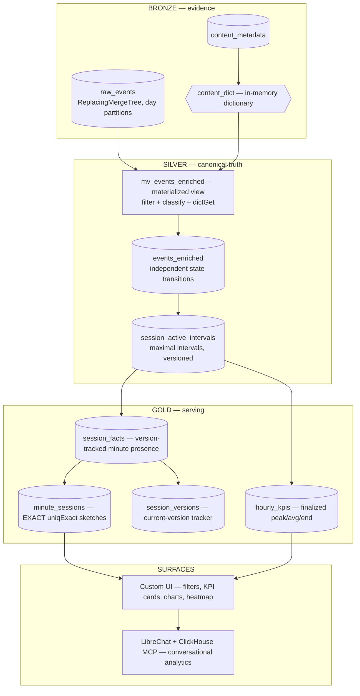

# Solution v2 — Architecture Overview

**SonyLIV · Click-a-thon 2026** — *"Counting the crowd: foreground-only
concurrency at streaming scale."*

## One-paragraph summary

`backend` is a **ClickHouse-native, medallion-architected pipeline** that
derives *foreground-only* concurrency from a raw playback-event stream. Raw
events land in Bronze, a materialized view enriches and classifies them into
Silver using **independent state transitions** (session / visibility /
playback / buffering / liveness), a watermark-driven SQL state machine turns
them into maximal active intervals, and a version-tracked Gold layer serves
**exact** per-minute concurrency and finalized hourly KPIs. The dashboard and
a LibreChat conversational agent both read the same Gold serving views — a
single pipeline, two surfaces.

## Architecture diagram

## Data flow (Bronze → Silver → Gold)

1. **Bronze — `raw_events`** (`01_schema.sql`). Append-only, day-partitioned,
   `ReplacingMergeTree` for hygiene. IDs are `String` (the unseen day carries
   variable-length IDs — the data defines the shape). New columns
   (`video_resolution`) load without schema edits.
2. **Silver — `events_enriched`**. `mv_events_enriched` fires per inserted
   block: keeps only signal-carrying events (~49% cut), attaches metadata via
   `dictGet` (no joins), and emits **independent transitions**
   (`session_transition`, `visibility_transition`, `playback_transition`,
   `buffer_transition`, `is_liveness`) with deterministic ordering
   (`event_priority`, `event_key`). A single `activity_delta` latch is
   deliberately avoided — `AppForegrounded` changes visibility only and can
   never resurrect a paused session.
3. **State machine — `session_active_intervals`**. A watermark-driven SQL
   refresh (never a Python orchestrator) re-derives **only touched sessions**:
   `anyLast` windows track each dimension, activity =
   `session open AND foreground AND playing`, segments close at the next
   event, open sessions get a `last liveness + 90s` tail, 5s flap tolerance
   merges heartbeat artifacts, and a 6h cap guards anomalies. Results are
   versioned (`ReplacingMergeTree(version)`) — the hot path is INSERT-only.
4. **Gold — serving**. `session_facts` fans intervals into per-minute
   presence; `minute_sessions` exposes **exact** distinct session/user counts
   (`uniqExactState`/`uniqExactMerge`) joined to `session_versions_current`
   (no FINAL, no deletes on the read path). `hourly_kpis` stores finalized
   peak / time-weighted average / end per approved dimension set, built only
   after the lateness watermark passes.

## Key design decisions (why it scores)

**Correctness: foreground-only is a state model, not an overlap model.**
Counting overlap of raw event ranges would count paused and backgrounded
minutes as watching. The pipeline first decides *when the viewer was
genuinely active* (independent state dimensions + 90s liveness gap + 5s flap
merge), then measures minute overlap of only those intervals. Verified: the
single-latch v1 overcounted 23,091 event-rows of paused/backgrounded time
that v2 correctly excludes.

**Scale: nothing recomputes history.** Raw is append-only; enrichment is a
MV; the live refresh re-derives only sessions touched since the watermark;
hourly snapshots are finalized once past the lateness window. Read path has
no FINAL and no DELETE mutations — serving views join a tiny current-version
tracker.

**Two serving paths for the right latency:**

| Query shape | Source | Latency (unseen day) |
|---|---|---|
| Minute/hour over short ranges (exact) | `minute_sessions` | ~1.4 s for a full day |
| Hour/day over long ranges | `hourly_kpis` | ~0.04 s (35× faster) |

**Exactness is stated, not implied.** Benchmark-facing views use
`uniqExactState`; the approximate `uniqState` variant is explicitly named
`minute_sessions_approx` and never used for judged KPIs.

## Measured evidence (unseen day, 2026-07-31 — 7M events)

| Step | Result |
|---|---|
| Raw load (day-scoped) | 6,911,326 rows in ~16 s |
| Enrichment (MV on insert) | 2,889,519 rows |
| Bootstrap (state machine) | 134,012 intervals · 903,579 facts · 105,579 sessions |
| Hourly snapshots | 45,532 finalized KPI rows (8 dimension sets) |
| **Peak concurrency** | **16,877 sessions @ 16:46 IST** (16,080 users) |
| Query latency | exact day ~1.4 s · hourly fast path ~0.04 s |
| Evidence | `system.query_log` rows/bytes/duration captured; `pipeline_runs` per cycle |

## OSS integration (ClickHouse & OSS Stack criterion)

- **LibreChat + ClickHouse MCP** — a conversational layer over the same Gold
  tables. Two MCP servers (official SQL + a custom concurrency server whose
  tools encode the correct query shapes: `get_concurrency`,
  `get_peak_concurrency_detail`, `compare_concurrency`,
  `get_dashboard_analytics`, `render_dashboard_html`, `get_data_health`,
  `get_query_evidence`). All timestamps IST; out-of-coverage windows return
  an explicit note instead of phantom numbers. Wiring:
  `librechat+mcp/` (compose, yaml, server code, keys redacted).

## Repository map

| File | Role |
|---|---|
| `01_schema.sql` | All tables/views/dictionary/MV (Bronze→Gold) |
| `02_bootstrap.sql` | Day-scoped initial load (intervals/facts/versions) |
| `02_backfill_enrichment.sql` | Recovery-only enrichment for pre-MV rows |
| `03_refresh.sql` | Live cycle: touched sessions → versioned facts |
| `04_hourly_snapshots.sql` | Finalized hourly KPIs per dimension set |
| `05_refresh.sh` | The only orchestration: parameter substitution + `clickhouse-client` |
| `06_fixtures_and_tests.sql` | Acceptance fixtures (latch, version, double-write) |
| `docs/` | 10 step-by-step guides incl. watermarking + unseen-day runbook |
| `unseen_results/` | Benchmark answers + query-log evidence |
| `librechat+mcp/` | Conversational layer (MCP servers, LibreChat config) |

## What this architecture answers

- *"How do you count only genuinely-active viewers?"* — independent state
  dimensions, liveness gap, flap merge; state before overlap.
- *"How does it scale to 100×?"* — touched-session refresh, exact sketches,
  finalized snapshots; read path is a bounded join, hot path is INSERT-only.
- *"Where's the pipeline evidence?"* — `system.query_log`,
  `pipeline_runs`, and the unseen-day benchmark run, all committed.
