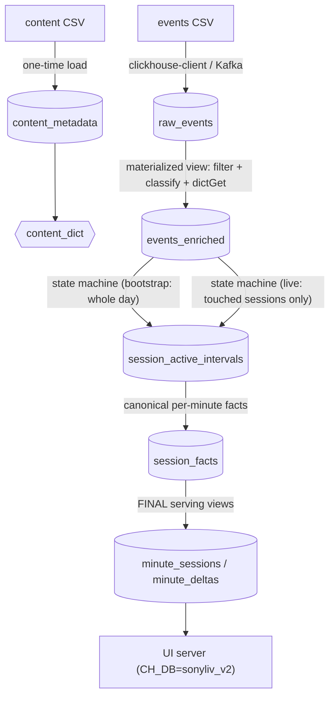

# Solution v2 — Step-by-Step Docs

Read in order. Same journey as the v1 docs, but for the **ClickHouse-native
pipeline**: no Python orchestrator, no day-partition drops in the live path.

| File | Covers | SQL |
|---|---|---|
| [01-ingestion.md](01-ingestion.md) | raw events into Bronze | `01_schema.sql` |
| [02-silver-enrichment.md](02-silver-enrichment.md) | MV enrichment (Silver) | `01_schema.sql` |
| [03-state-machine.md](03-state-machine.md) | intervals from sessions | `02_bootstrap.sql` / `03_refresh.sql` |
| [04-gold-serving.md](04-gold-serving.md) | version-tracked facts + serving views (no FINAL/DELETE) | `01_schema.sql` |
| [05-streaming.md](05-streaming.md) | the incremental refresh cycle | `03_refresh.sql`, `05_refresh.sh` |
| [06-dashboard-serving.md](06-dashboard-serving.md) | UI queries, all-IST | `ui/server.py` |
| [07-worked-example-end-to-end.md](07-worked-example-end-to-end.md) | one example traced through every layer | all of the above |
| [08-watermarking.md](08-watermarking.md) | what the watermark solves, why it is needed, current + reviewed design | `03_refresh.sql`, `05_refresh.sh` |
| [09-hourly-snapshots.md](09-hourly-snapshots.md) | finalized hourly KPIs for long-range serving | `04_hourly_snapshots.sql` |

## One picture

## What changed vs v1

- **Enrichment is a materialized view again** (safe: single writer per table).
- **Intervals are versioned** (`ReplacingMergeTree(version)`): every refresh
  writes the touched sessions' intervals at a new cycle id.
- **Gold is per-session facts** (`session_facts`), and the serving tables are
  **views** over the latest facts — no deletes, no drops, no rebuilds.
- **The live refresh re-derives only touched sessions** (events since the
  watermark minus a 10-min late window). Cost follows "sessions that moved",
  not the day's total rows.

## Live schema inventory (sonyliv_v2, 2026-08-02)

| Table | Engine | Role |
|---|---|---|
| `raw_events` | ReplacingMergeTree(event_time) | Bronze, append-only |
| `content_metadata` | ReplacingMergeTree | content catalog (33,464) |
| `content_dict` | Dictionary (HASHED) | in-memory enrichment |
| `events_enriched` | MergeTree (+ MV `mv_events_enriched`) | Silver |
| `session_active_intervals` | ReplacingMergeTree(version) | versioned intervals |
| `session_facts` | ReplacingMergeTree(version) | per-session minute facts |
| `pipeline_watermark` | ReplacingMergeTree | event-time watermark |
| `touched_sessions` | MergeTree | per-cycle touched set |
| `pipeline_runs` | MergeTree | run audit |
| `minute_sessions` | **View** | **exact** uniqExactState per (minute × dims) |
| `minute_sessions_approx` | **View** | approximate uniqState variant |
| `minute_deltas` | **View** | +1/−1 change points |
| `open_sessions_deltas` | **View** | live provisional tails |

## Validation (identical to v1)

| Check | Result |
|---|---|
| Enriched rows (07-26) | 433,425 (matches v1) |
| Intervals (07-26) | 28,629 closed + 8 open (matches v1) |
| Peak concurrency | **2,727 @ 2026-07-26 16:29 IST** (matches v1) |
| No-op refresh | unchanged |
| Incremental refresh | synthetic 3-min session → exactly 3 facts, peak unchanged |
| Re-run same cycle | no duplicated served rows |
