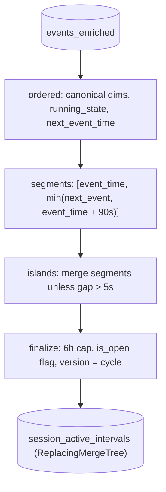

# v2 Step 3 — State machine: sessions → versioned intervals

**Goal:** for every session, produce the maximal genuinely-watching ranges.
The logic is **identical to v1** (90s gap, 5s flap merge, 6h cap) — what
changes in v2 is *scope* (whole day on bootstrap, touched sessions live) and
*versioning* (ReplacingMergeTree instead of drop-and-rebuild).

## Design reasoning — why this state model

1. **Activity is derived, not observed.** The stream carries transitions
   (+1/−1: started, paused, backgrounded, resumed) and liveness (0: heartbeats,
   buffer, seek). Activity = the **last explicit decision still in force**,
   extended by heartbeat liveness, and expired after silence. This is a latch,
   not a running sum — a sum would drift on repeated pauses/resumes; a latch
   only cares about the most recent decision.
2. **Foreground events are not guaranteed.** A silent app-kill leaves no
   `AppBackgrounded`. The 90 s gap is the safety net that closes intervals
   even with no close event; a lost `AppForegrounded` is healed by the next
   `VideoPlay`/resume (+1). The model must tolerate both, or every killed
   session leaks into the concurrency numbers.
3. **State before overlap.** Counting overlap of every event's implied range
   overcounts (a paused/backgrounded range still overlaps minutes). The state
   machine decides *when the viewer was active*, then measures overlap of only
   those intervals. That separation is the correctness core of the problem.

The full 5-point reasoning (including the three-delta classification and the
latch vs running-sum choice) is in the v1 guide:
[`solutions/docs/03-state-machine.md`](../../solutions/docs/03-state-machine.md).

## The two rules

1. **90-second liveness gap** — silence longer than that closes the interval
   at `last signal + 90 s`.
2. **5-second flap tolerance** — pause/resume pairs within 5 s are heartbeat
   artifacts, not breaks; segments merge into maximal intervals.

**Why 90 s when heartbeats are "every 60 s"?** The cadence is nominal, not
guaranteed — jitter, client throttling, and batching delay real beats. A gap
equal to the cadence would split healthy sessions on one late heartbeat; a
much larger gap would keep dead sessions "watching" for minutes. 90 s = 1.5×
the cadence: absorbs a missed beat plus 50% jitter margin, and still detects
abandonment ~30 s after the first miss. Tunable (`gap_sec`); validation plan
sweeps 60/75/90/120 s against known-good minutes.

## The four passes (window functions over each session)

The key v2 difference is the last step: every row carries
`version = {cycle}`. When a session is re-derived in a later cycle, its new
interval rows (same `video_session_id`, `interval_start`) **replace** the old
ones on merge — the serving views read only the latest version.

## Bootstrap scope vs live scope

**Bootstrap (`02_bootstrap.sql`)** — one-off per day:
`WHERE toDate(event_time) = {day}`. Re-runs are idempotent: the versioned
table supersedes, and gold facts are re-emitted at the new version.

**Live (`03_refresh.sql`)** — every cycle:
`WHERE event_time > watermark - 10 min` → touched sessions only. The same
window-function state machine runs, but over a fraction of the day's rows.

## Worked example (same as v1)

| # | event | time | delta |
|---|---|---|---|
| 1 | VideoSessionStart | 10:00:00 | +1 |
| 2 | VideoHeartbeat/pause | 10:00:30 | −1 |
| 3 | VideoHeartbeat/resume | 10:00:33 | +1 |
| 4 | VideoSessionEnd | 10:05:00 | −1 |

Segments merge into one island `[10:00:00, 10:05:00]` (pause 3 s ≤ 5 s
tolerance) → one interval row at the current version. Without the tolerance,
the session would be double-counted in minute 10:00.

## Output (07-26, live)

| Table | Count |
|---|---:|
| `session_active_intervals` (07-26) | 28,637 (28,629 closed + 8 open) |
| `events_enriched` → intervals ratio | ~15 events per interval |

## Why versioning removes the day-drop

v1 deleted a day's partitions to make re-runs idempotent. v2 never deletes:
re-deriving a session at `version = N+1` makes `version = N` rows obsolete,
and `v_session_versions_current` (max version per session) drives every
serving join — no FINAL, no merge-time dedup on the read path. History is
append-only — the property that scales to 100×.
