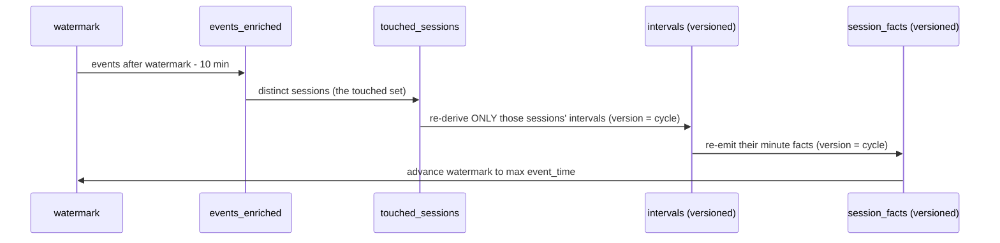

# v2 Step 5 — Streaming: the incremental refresh cycle

**Goal:** keep gold current without ever dropping or rebuilding a partition.

## The two state pieces

- **`pipeline_watermark`** — the max event-time processed (a
  ReplacingMergeTree row).
- **`touched_sessions`** — sessions with any event since
  `watermark - 10 min` (rebuilt each cycle; a plain MergeTree).

## One cycle (`03_refresh.sql`, run by `05_refresh.sh`)



Step by step:

1. **Read** enriched events after `watermark - 10 min` (late window).
2. **Collect** the distinct `video_session_id`s → `touched_sessions`.
3. **Re-derive** those sessions' maximal intervals with the same 4-pass
   state machine, at `version = {cycle}`.
4. **Append** their intervals and facts at `version = cycle`, and record the
   version per touched session in `session_versions` — INSERT-only, no
   mutations. Serving queries join the version table, so reads need no FINAL.
5. **Advance** the watermark; record a `pipeline_runs` row.

## Why it is safe to re-run

- Same event read twice → the state guard skips it; re-inserting identical
  facts is a no-op at the served level (uniqState dedupes).
- A session's interval shrinks/grows between cycles → its new facts are
  written at a higher version; the version join serves only the newest.

## The scheduler

```bash
./backend/05_refresh.sh --bootstrap 2026-07-26   # initial load
./backend/05_refresh.sh --once                   # single cycle
./backend/05_refresh.sh --loop                   # every 30s (or cron it)
```

The script only substitutes `{wm}` / `{cycle}` and calls `clickhouse-client`
— the compute is all SQL inside ClickHouse.

## 100× story

Cost per cycle = **sessions that emitted new events**, not the day's rows.
1M viewers watching live = 1M touched sessions re-derived per cycle, each
bounded by its own event history; closed history partitions are never
re-read.

## Validated

| Scenario | Result |
|---|---|
| No-op cycle (nothing new) | facts and peak unchanged |
| Synthetic 3-min session appended | exactly 3 new fact minutes, peak unchanged |
| Same cycle re-run | no new served rows (versioned) |
