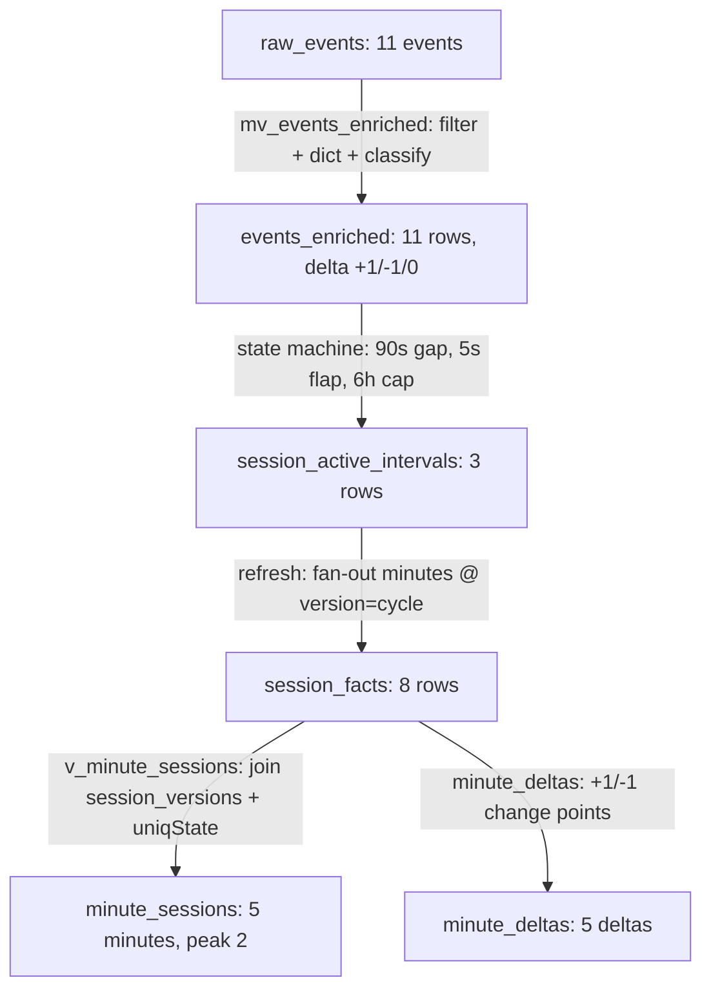

# v2 — End-to-end data flow, traced with a real example

Two viewers, two sessions, eleven events. Every number below was produced by
running the actual v2 SQL against these events (not hand-made): the state
machine splits, the minute facts, and the delta curve all come from the
pipeline's own logic.

> **Note (post-review):** this worked example predates the P0.1 rewrite and
> traces the v1-style single `activity_delta` classification. The current v2
> pipeline classifies **independent transitions** (session/visibility/
> playback/buffer + liveness) and derives `foreground_active` as the
> conjunction `session open AND foreground AND playing` — the behavioral
> outcomes here are still illustrative, but see
> [02-silver-enrichment.md](02-silver-enrichment.md) and
> [03-state-machine.md](03-state-machine.md) for the current model.

Times are shown in **IST** (the dashboard's display timezone). Internally the
pipeline stores UTC (IST − 5:30), so e.g. `21:30 IST` = `16:00 UTC`.

## The story

- **Session A (SESSA · content 1001, "Live Match")** — User 1 watches for a
  bit, pauses for **30 seconds** (a real break), resumes, watches two more
  minutes, ends the session.
- **Session B (SESSB · content 1002, "VOD Film")** — User 2 starts 30 seconds
  later, watches two minutes, then backgrounds the app (interval closes
  immediately — no 90 s tail needed because the close event arrived).

## 1) Bronze — `raw_events` (what arrives)

| event_time (IST) | video_session_id | user_id | event_type | event |
|---|---|---|---|---|
| 21:30:00 | SESSA | USER1 | VideoSessionStart | VideoSessionStart |
| 21:31:00 | SESSA | USER1 | VideoPlay | Play |
| 21:32:00 | SESSA | USER1 | VideoHeartbeat | BufferStart |
| 21:33:00 | SESSA | USER1 | VideoHeartbeat | pause |
| 21:33:30 | SESSA | USER1 | VideoHeartbeat | resume |
| 21:34:00 | SESSA | USER1 | VideoHeartbeat | network-activity |
| 21:35:00 | SESSA | USER1 | VideoSessionEnd | VideoSessionEnd |
| 21:30:30 | SESSB | USER2 | VideoSessionStart | VideoSessionStart |
| 21:31:30 | SESSB | USER2 | VideoPlay | Play |
| 21:32:00 | SESSB | USER2 | VideoHeartbeat | BufferEnd |
| 21:32:30 | SESSB | USER2 | AppBackgrounded | AppBackgrounded |

## 2) Silver — `events_enriched` (MV classifies each event)

The materialized view keeps only signal-carrying events, attaches the content
dict, and assigns `activity_delta` (+1 watching ON / −1 watching OFF / 0
liveness). All eleven events survive (they are all in the keep-list).

| event_time (IST) | session | event | activity_delta | why |
|---|---|---|---|---|
| 21:30:00 | SESSA | VideoSessionStart | **+1** | watching starts |
| 21:31:00 | SESSA | Play | **+1** | explicit play (no-op under the latch) |
| 21:32:00 | SESSA | BufferStart | **0** | buffering = watching; liveness only |
| 21:33:00 | SESSA | pause | **−1** | playback paused |
| 21:33:30 | SESSA | resume | **+1** | playback resumed |
| 21:34:00 | SESSA | network-activity | **0** | liveness only |
| 21:35:00 | SESSA | VideoSessionEnd | **−1** | session over |
| 21:30:30 | SESSB | VideoSessionStart | **+1** | watching starts |
| 21:31:30 | SESSB | Play | **+1** | explicit play |
| 21:32:00 | SESSB | BufferEnd | **0** | liveness only |
| 21:32:30 | SESSB | AppBackgrounded | **−1** | foreground watching ended |

## 3) State machine — `events_enriched` → `session_active_intervals`

Per session, the 4-pass window-function build turns the classified stream
into **maximal intervals** (90 s liveness gap, 5 s flap tolerance, 6 h cap).

**Session A** — the running state (`anyLast(nonzero delta)`) toggles
1 → 1 → 1 → 0 → 1 → 1 → 0. Segments while active:

| segment start (IST) | segment end (IST) | note |
|---|---|---|
| 21:30:00 | 21:33:00 | closed by the pause |
| 21:33:30 | 21:34:00 | closed by next event |
| 21:34:00 | 21:35:00 | closed by VideoSessionEnd |

Island merging: the gap between segment 1 and 2 is **30 s > 5 s flap
tolerance → real break, two islands**. If the pause had been 3 s instead of
30 s, it would have merged into one interval — this is the flap rule in
action.

**Session B** — state 1 → 1 → 1 → 0:

| segment start (IST) | segment end (IST) | note |
|---|---|---|
| 21:30:30 | 21:31:30 | closed by next event |
| 21:31:30 | 21:32:00 | closed by next event |
| 21:32:00 | 21:32:30 | closed by AppBackgrounded (close event arrived — no 90 s tail) |

One island. (Had the app been killed silently, the last segment would extend
to `last signal + 90 s` — the gap rule in action.)

**Result — `session_active_intervals`** (one row per maximal interval):

| session | interval_start (IST) | interval_end (IST) | is_open |
|---|---|---|---|
| SESSA | 21:30:00 | 21:33:00 | 0 |
| SESSA | 21:33:30 | 21:35:00 | 0 |
| SESSB | 21:30:30 | 21:32:30 | 0 |

## 4) Gold — `session_facts` (per-session minute presence)

Each interval fans out into one fact row per minute it covers (exact
floor/ceil overlap convention). Written at `version = cycle` by the refresh;
`session_versions` records the current version per session.

| minute_bucket (IST) | video_session_id | content_id | version |
|---|---|---|---|
| 21:30 | SESSA | 1001 | 2 |
| 21:31 | SESSA | 1001 | 2 |
| 21:32 | SESSA | 1001 | 2 |
| 21:33 | SESSA | 1001 | 2 |
| 21:34 | SESSA | 1001 | 2 |
| 21:30 | SESSB | 1002 | 2 |
| 21:31 | SESSB | 1002 | 2 |
| 21:32 | SESSB | 1002 | 2 |

## 5) Serving — `minute_sessions` view (what the dashboard reads)

The view joins `session_facts` to `session_versions`, filters the current
version, and runs `uniqState`/`uniqMerge` per (minute × dims):

| minute (IST) | sessions (distinct) |
|---|---:|
| 21:30 | **2** (SESSA + SESSB) |
| 21:31 | **2** |
| 21:32 | **2** |
| 21:33 | **1** (SESSA only — SESSB ended at 21:32:30) |
| 21:34 | **1** (SESSA only) |
| 21:35 | 0 |

Peak = **2 sessions @ 21:30–21:32 IST**. Same story from `minute_deltas`
(+1 at 21:30 ×2, −1 at 21:33 ×2, +1 at 21:33, −1 at 21:35): the running sum
2 → 2 → 2 → 1 → 1 → 0.

## The pipeline map (which step wrote which row)

**The 100× point:** only the 11 events in this window were touched — the
refresh re-derived only the sessions they belong to (SESSA, SESSB), appended
their facts at a new version, and the read path joined the version table.
Nothing else in history was read or rewritten.
