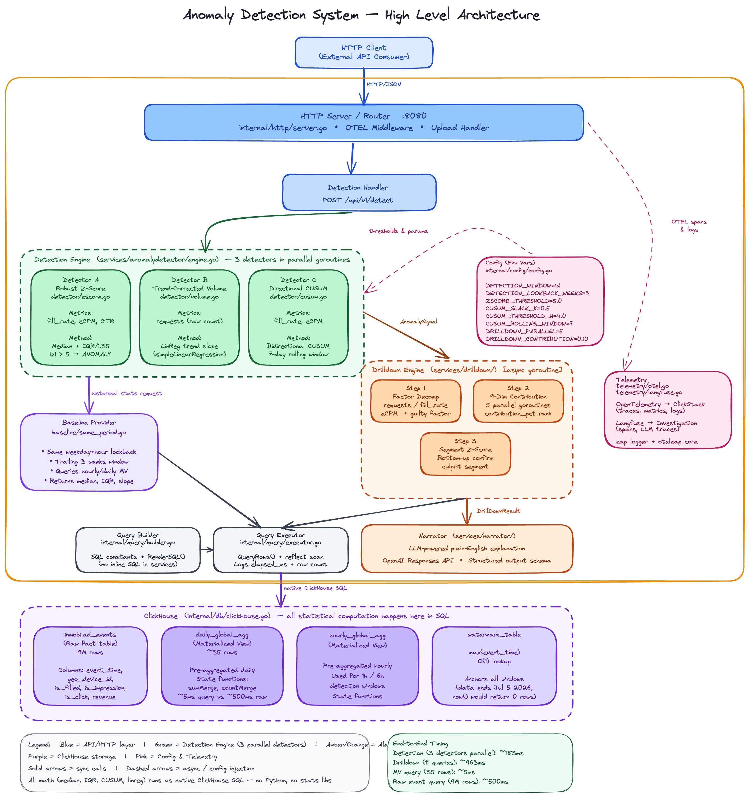

# Column Commanders

## Track
InMobi

## Project
**ClickRCA** — Real-time anomaly detection and root cause analysis for ad-tech metrics.

## Team Members
- Prasanna kumar Reddi (prasannakumar414)
- siddhartha kakaraparthy (Kvnpsiddhartha)
- Ganesh vasireddy (GaneshVasireddy)
- Tarun Juluru (Tarun-007)

## What it does

ClickRCA continuously monitors InMobi ad-platform metrics (CTR, fill rate, eCPM, RPR) and automatically surfaces anomalies the moment they appear — along with a root-cause explanation of *why* they happened.

Key capabilities:

- **Dual-resolution detection** — a fast 5 m/10 m real-time pipeline catches intra-hour spikes; a daily pipeline catches sustained trends. Both run on the same ClickHouse data.
- **Multi-algorithm ensemble** — RobustZScore, CUSUM, and TrendVolume detectors vote on each signal; a segment scanner (OS version, region, ad format, …) isolates which slice of traffic is responsible.
- **Factor decomposition drilldown** — parallel SQL queries across 9 dimensions decompose the deviation into ranked contributing segments with percentage attribution.
- **LLM narration (optional)** — an evidence-grounded narrator (GPT-4o via aimlapi) turns raw numbers into a concise human-readable incident summary.
- **Investigation agent (optional)** — an OpenAI-powered SQL agent can query ClickHouse interactively to verify findings with hard guardrails (row/byte limits, query timeout).

## Hosted Demo
[https://math-mahogany-dish.ngrok-free.dev/dashboard/](https://math-mahogany-dish.ngrok-free.dev/dashboard/)

## Demo Video
https://www.loom.com/share/5f97faf5390e410b807488a035724597

## Architecture



All services run on a single AWS EC2 instance (Ubuntu 26.04) orchestrated with Docker Compose. ngrok provides TLS termination without a custom domain or certificate.

## How we built it

| Layer | Technology |
|---|---|
| **Language** | Go 1.25 (statically compiled, `FROM scratch` Docker image) |
| **HTTP framework** | Gin |
| **Database** | ClickHouse Cloud — AggregatingMergeTree materialised views for O(1) rollup reads |
| **Detection algorithms** | RobustZScore (median/IQR baseline), CUSUM (persistent state in ClickHouse), TrendVolume |
| **Segment detection** | Parallel per-dimension z-score scans (os_version, region, ad_format, …) |
| **LLM narration** | GPT-4o via aimlapi, structured JSON output |
| **Observability** | OpenTelemetry SDK → OTel Collector → HyperDX ClickStack (traces + logs) |
| **Frontend** | Vanilla JS + React 18 (CDN) + Babel — zero build step |
| **Reverse proxy** | nginx (path-based routing: `/dashboard`, `/api`, `/otel`) |
| **Tunnel** | ngrok (free static domain, TLS at edge) |
| **Deployment** | Docker Compose on AWS EC2 |

Notable implementation details:

- **Stateless detection** — CUSUM state is persisted in ClickHouse so the Go service can restart without losing algorithm continuity.
- **Baseline robustness** — same-period baselines use median + IQR instead of mean + stddev to resist outlier contamination.
- **Drilldown parallelism** — 9 dimension queries run concurrently via `golang.org/x/sync/errgroup` with a configurable worker pool.
- **Zero frontend build** — React and Babel are loaded from unpkg CDN; the entire UI is a single `index.html` with no npm/webpack step.

## How to run it

### Prerequisites
- Docker + Docker Compose v2
- A [ClickHouse Cloud](https://clickhouse.cloud) instance with the schema applied (`scripts/create_tables.sh`)
- A [ngrok](https://ngrok.com) account with an authtoken
- A [HyperDX](https://hyperdx.io) account and ingestion API key (optional — for observability)

### 1. Clone the repo

```bash
git clone https://github.com/clickathon-hope/clickathon-solution-2026.git
cd clickathon-solution-2026
```

### 2. Configure environment

```bash
cp .env.example .env
```

Open `.env` and fill in at minimum:

| Variable | Required | Description |
|---|---|---|
| `CLICKHOUSE_HOST` | ✅ | ClickHouse Cloud hostname |
| `CLICKHOUSE_PASSWORD` | ✅ | ClickHouse password |
| `NGROK_AUTHTOKEN` | ✅ | ngrok auth token from dashboard |
| `HYPERDX_OTLP_ENDPOINT` | optional | e.g. `https://in-otel.hyperdx.io` |
| `HYPERDX_API_KEY` | optional | HyperDX ingestion API key |
| `OPENAI_API_KEY` | optional | Required only if `NARRATOR_ENABLED=true` |

### 3. Start backend services

```bash
docker-compose up -d --build
```

> On newer Docker installs the command is `docker compose` (without hyphen).

Verify everything is up:

```bash
curl http://localhost:8080/health   # → {"status":"ok"}
```

### 4. Open the frontend

The frontend is plain HTML — no build step, no local server needed.

```
frontend/index.html  →  open directly in your browser
```

It connects to `http://localhost:8080` by default. To point it at a different backend, append `?api=http://your-host:8080` to the URL — the setting is saved to localStorage.

**Frontend observability config (optional)**

Copy the example config and fill in your HyperDX details:

```bash
cp frontend/config.example.js frontend/config.js
```

### 5. Public URL (via ngrok)

Once the stack is running, the backend is also reachable at your ngrok domain. The domain is set in `docker-compose.yml` under the `ngrok` service:

```yaml
command: http --url=<your-ngrok-domain> nginx:80
```

Replace `<your-ngrok-domain>` with your own static domain from the [ngrok dashboard](https://dashboard.ngrok.com).

### Environment variables

See [`.env.example`](.env.example) for the full list with descriptions.
