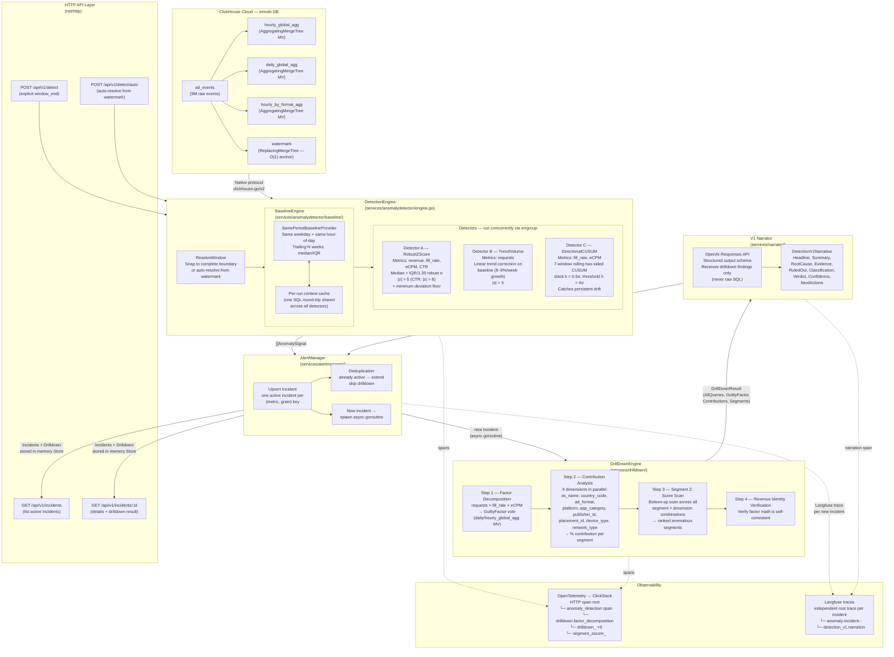

# Detection V1 Architecture

## Overview

Detection V1 is the deterministic, SQL-first anomaly detection pipeline exposed under `/api/v1`. It detects metric anomalies in ad event data, identifies the root-cause dimension segment via drilldown, and produces an LLM-narrated verdict — all without human intervention.

The entire statistical computation (z-scores, trend correction, CUSUM accumulation, factor decomposition, contribution analysis) runs as ClickHouse SQL against pre-aggregated Materialized Views. Go only parses results and applies threshold decisions.

---

## Architecture Diagram



---

## Component Descriptions

### 1. Data Layer — ClickHouse Materialized Views

| Table | Engine | Purpose |
|---|---|---|
| `ad_events` | MergeTree | Raw ad event stream (9M events) |
| `hourly_global_agg` | AggregatingMergeTree MV | Pre-aggregated hourly global metrics |
| `daily_global_agg` | AggregatingMergeTree MV | Pre-aggregated daily global metrics |
| `hourly_by_format_agg` | AggregatingMergeTree MV | Hourly metrics broken out by ad format |
| `watermark` | ReplacingMergeTree | O(1) anchor for `max(event_time)` |

All detection SQL runs against these MVs — never against `ad_events` directly. Detection latency is < 100ms.

---

### 2. HTTP API Layer

| Endpoint | Description |
|---|---|
| `POST /api/v1/detect` | Trigger detection for an explicit `window_end` timestamp |
| `POST /api/v1/detect/auto` | Auto-detect: resolve `window_end` from the `watermark` table |
| `GET /api/v1/incidents` | List all active incidents in memory |
| `GET /api/v1/incidents/:id` | Fetch a single incident with its drilldown result and narrative |

---

### 3. DetectionEngine

`services/anomalydetector/engine.go`

Orchestrates all three detectors concurrently using `golang.org/x/sync/errgroup`. Before running detectors, it injects a **per-run baseline cache** into the context so all three detectors share a single SQL round-trip to ClickHouse.

**Window resolution:** If no `window_end` is provided, the engine queries the `watermark` table (O(1)) and snaps the result to the nearest complete window boundary (e.g. top of the hour).

---

### 4. BaselineEngine

`services/anomalydetector/baseline/`

**Strategy:** Same-period comparison — selects prior windows that share the same hour-of-day AND same day-of-week, within a configurable trailing-week lookback (default 3 weeks). Requires a minimum of 3 matching windows.

**Statistics:** Uses `median` and `IQR/1.35` (normalized IQR as robust σ) rather than mean/stddev. This prevents a single extreme outlier from corrupting the baseline — critical when a prior window was itself anomalous.

---

### 5. Three Detectors

#### Detector A — RobustZScore (`detector/zscore.go`)
- **Metrics:** `revenue`, `fill_rate`, `eCPM`, `CTR`
- **Algorithm:** `z = (current − median) / (IQR / 1.35)`
- **Fires when:** `|z| > 5` (CTR: `|z| > 8`) AND deviation exceeds a minimum real-world floor (e.g. ≥8% for revenue)
- **Designed for:** abrupt single-window drops (e.g. Android 15 crash: z = −163)

#### Detector B — TrendVolume (`detector/volume.go`)
- **Metrics:** `requests`
- **Algorithm:** Same as A but applies linear trend correction to the baseline median: `baseline_adj = median + slope × Δt`. Slope is computed via `simpleLinearRegression()` in ClickHouse over the baseline set.
- **Fires when:** `|z| > 5` AND deviation ≥ floor
- **Designed for:** volume metrics with 8–9%/week organic growth that would otherwise generate false positives

#### Detector C — DirectionalCUSUM (`detector/cusum.go`)
- **Metrics:** `fill_rate`, `eCPM`
- **Algorithm:** Two-sided rolling CUSUM over 7 consecutive windows. Slack `k = 0.5σ`, threshold `h = 4σ`. Not unbounded — the 7-window cap prevents stale alert accumulation.
- **Fires when:** `CUSUM_down > h` (drop) or `CUSUM_up > h` (spike)
- **Designed for:** persistent multi-day drift that single z-scores miss (e.g. a −2.6%/day eCPM erosion over 4 days)

---

### 6. AlertManager

`services/alertmanager/`

**Deduplication key:** `(metric, grain)`. If an incident for that key is already `active`, the signal extends it and skips the expensive drilldown. Only **new** incidents trigger a drilldown goroutine.

Multiple detectors (e.g. `zscore` and `cusum_down`) agreeing on the same metric produce a single corroborated incident, not two.

Each new incident spawns an **independent Langfuse root trace** for observability, then launches an async goroutine to run the DrillDownEngine.

---

### 7. DrillDownEngine

`services/drilldown/engine.go`

Four steps, all pure ClickHouse SQL:

| Step | SQL Source | Output |
|---|---|---|
| Factor decomposition | `hourly_global_agg` / `daily_global_agg` | `GuiltyFactor`: which of requests / fill_rate / eCPM moved most |
| Contribution analysis × 9 dims | `hourly_by_format_agg` | `% contribution` per dimension segment (parallel execution) |
| Segment z-score scan | `hourly_by_format_agg` | Ranked list of anomalous segments (bottom-up) |
| Revenue identity verification | `daily_global_agg` | Confirms factor math is self-consistent |

The 9 dimensions analyzed in parallel: `os_name`, `country_code`, `ad_format`, `platform`, `app_category`, `publisher_id`, `placement_id`, `device_type`, `network_type`.

The full set of SQL queries is collected in `DrillDownResult.AllQueries` for traceability.

---

### 8. V1 Narrator

`services/narrator/narrator.go`

After the deterministic drilldown, the narrator sends its computed **findings** (never raw SQL) to the OpenAI Responses API with a strict structured output schema. The model produces a `DetectionV1Narrative` containing:

- `headline` — one-line summary
- `summary` — 2–3 sentence human-readable explanation
- `root_cause` — the identified root cause
- `business_impact` — revenue / fill rate impact quantification
- `evidence` — list of supporting data points from drilldown
- `ruled_out` — dimensions/factors excluded with reasoning
- `classification` — incident type classification
- `verdict` — final operations-facing verdict
- `confidence` — model confidence score (0–1)
- `next_actions` — recommended follow-up steps

---

## Data Flow Summary

```
HTTP Request
     │
     ▼
DetectionEngine.ResolveWindow()     ← watermark O(1) lookup
     │
     ▼  (context baseline cache injected)
[concurrent via errgroup]
  Detector A (zscore)    → BaselineEngine.Compute() → CH SQL → AnomalySignals
  Detector B (volume)    → BaselineEngine.Compute() → CH SQL → AnomalySignals
  Detector C (cusum)     → BaselineEngine.Compute() → CH SQL → AnomalySignals
     │
     ▼
Merge + deduplicate signals
     │
     ▼
AlertManager.ProcessResult()
  ├── existing incident → extend, return early
  └── new incident → spawn async goroutine
          │
          ▼
     DrillDownEngine.Investigate()
       ├── Factor decomposition SQL
       ├── [9 goroutines] Contribution SQL × 9 dimensions
       ├── Segment z-score scan SQL
       └── Revenue identity verification SQL
          │
          ▼
     Narrator.NarrateDetectionV1()    ← OpenAI Responses API
          │
          ▼
     Incident updated with DrillDownResult + DetectionV1Narrative
     (polled by GET /api/v1/incidents/:id)
```

---

## Observability

### OpenTelemetry → ClickStack
All spans are nested under the root HTTP request span:

```
HTTP request span (ClickStack middleware)
└── anomaly_detection          DetectionEngine.Detect()
    ├── drilldown.factor_decomposition
    ├── drilldown_os_name
    ├── drilldown_country_code
    ├── drilldown_ad_format
    ├── drilldown_platform
    ├── drilldown_app_category
    ├── drilldown_publisher_id
    ├── drilldown_placement_id
    ├── drilldown_device_type
    ├── drilldown_network_type
    └── segment_zscore_<dim>
```

### Langfuse (independent root traces)
Each new incident creates its own root trace in Langfuse (not parented to the HTTP span):

```
anomaly-incident-<metric>-<incident_id[:8]>   ← root trace
└── detection_v1.narration                    ← narration span
```

Span attributes include full input/output JSON for every drilldown step, enabling post-hoc audit and reproduction from stored SQL alone.

---

## Key Design Decisions

| Decision | Rationale |
|---|---|
| Pure SQL detection | No Python STL library dependency; deterministic; < 100ms on MVs |
| Median/IQR not mean/stddev | Robust to outliers in the baseline set itself |
| Same-weekday same-hour baseline | Controls for both daily and weekly seasonality |
| 7-window bounded CUSUM | Prevents stale alert accumulation from unbounded accumulators |
| Async drilldown goroutines | Detection HTTP response is never blocked by expensive investigation |
| Narrator receives findings only | LLM never sees raw SQL; reduces prompt injection surface |
| Per-run baseline cache | All three detectors share one ClickHouse round-trip |
