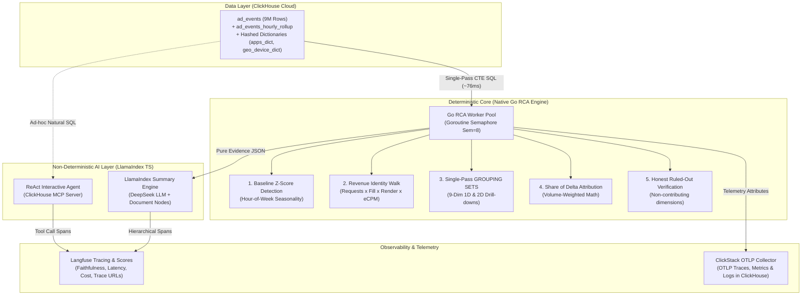

# ⚡ Peekachu — Automated Metric Root-Cause Analyst
> **InMobi Click-a-thon 2026 Challenge**: From Alert to Answer in Milliseconds, Not Days.

[](Engine/README.md)
[](https://www.typescriptlang.org/)
[](https://clickhouse.com)
[](Backend/CLICKSTACK_TELEMETRY.md)
[](https://www.llamaindex.ai/)
[](https://langfuse.com)
[](https://docs.google.com/presentation/d/1RsfP0r0LO-tU4h8CPzr8MJPyB5VZDgnvPVagR-cCsC8/edit?usp=sharing)

---

## 🎯 The InMobi Problem Peekachu Solves

In high-velocity ad-tech platforms like **InMobi** (processing billions of ad requests daily across apps, ad formats, publisher tiers, verticals, devices, geographies, and advertisers), core business metrics—such as **Revenue**, **Fill Rate**, **Render Rate**, **eCPM**, **CTR**, **Impressions**, and **Requests**—are live streams where minor percentage shifts represent millions of dollars moving in real time.

When a key metric suddenly drops or spikes:
- **The Alert tells you *THAT* it moved.**
- **Peekachu tells you *WHY* it moved, *WHICH* segments drove it, and *WHAT* was ruled out—in milliseconds.**

### The Manual Investigation Bottleneck
Traditionally, data and site-reliability teams spend hours or days manually slicing high-dimensional data across dimension after dimension (`app_id`, `ad_format`, `publisher_tier`, `vertical`, `device_model`, `os_version`, `region`, `country`), comparing each slice against historical like-for-like baselines, and manually assembling explanations.

### Peekachu's Automated Solution
Peekachu automates this end-to-end:
1. **Baseline Anomaly Detection**: Calculates Z-scores and like-for-like hour-of-week seasonality over 4-week trailing baselines directly in ClickHouse.
2. **Aggressive Multi-Level Isolation**: Executes recursive single-pass 1-level and 2-level 2D Cartesian drill-downs across 9 primary dimensions.
3. **Mathematical Attribution**: Calculates Share of Delta ($Share\ of\ Delta = \frac{\Delta_{\text{segment}}}{\Delta_{\text{total}}}$) to pinpoint exact driver segments.
4. **Honest "Ruled-Out" Verification**: Explicitly verifies cleared factors and non-contributing dimensions to eliminate false leads.
5. **Verbatim LLM Narration**: Uses **LlamaIndex TS** and DeepSeek to turn JSON evidence bundles into human-friendly explanations, backed by 100% factual verification.
6. **Full Traceability & ClickStack Telemetry**: Immutably traces every execution stage in **Langfuse** and **ClickStack OpenTelemetry** (built specifically for the hackathon **Unseen Incident** mandate: *"No trace, no credit"*).

---

## 🧠 Deterministic Core vs. Non-Deterministic AI Layer

A foundational architectural principle of Peekachu is **strict separation of responsibilities**: *let deterministic ClickHouse SQL and native Go engines do 100% of the mathematical data crunching, and let LLMs handle structured narration and interactive reasoning.*



| Component | Nature | Primary Responsibility | Key Output |
| :--- | :--- | :--- | :--- |
| **ClickHouse Cloud** | **Deterministic** | Primary analytical engine storing 9M ad events (`ad_events`), pre-aggregated hourly rollups (`ad_events_hourly_rollup`), and hashed external dictionaries (`apps_dict`, `geo_device_dict`, `advertisers_dict`). | High-speed aggregated dataset views. |
| **Go RCA Engine** | **Deterministic** | Executes high-concurrency single-pass SQL queries on ClickHouse, calculates Z-scores against 4-week trailing baselines, performs multi-dimensional Cartesian combinations, ranks Share of Delta contribution scores, and identifies ruled-out segments. | **Pure JSON Evidence Bundle** (100% reproducible math, zero hallucination). |
| **LlamaIndex LLM Narrator** | **Non-Deterministic** | Converts JSON evidence bundles into concise, executive-friendly plain English via LlamaIndex `SummaryIndex` and `DeepSeekLLM`. Constrained by strict prompt engineering and fallback verification. | **Verbatim Diagnosis** (*"Revenue fell 14.2%, driven 81.5% by fill rate drop in Gaming category on Android 14. Request volume was normal (ruled out)."*). |
| **ReAct Chat Agent** | **Non-Deterministic** | Powered by LlamaIndex and DeepSeek with the **ClickHouse MCP Server**, allowing engineers to ask interactive follow-up questions (*"Show top 5 affected advertisers in NAM region"*). | **Interactive SQL tool calls & streaming answers**. |

---

## ⚡ Why the Native Go RCA Engine is a Game Changer

We engineered a native **Go (Golang)** microservice ([`Engine/engine.go`](file:///workspaces/Peekachu/Engine/engine.go)) to serve as the high-speed computational backbone for Peekachu.

### Architectural Innovations:
1. **Single-Pass `GROUP BY GROUPING SETS` Execution**:
   - *Traditional Approach*: Issues N separate SQL queries fanning out across 9 primary dimensions (`ad_format`, `category`, `publisher_tier`, `vertical`, `campaign_type`, `region`, `country`, `device_model`, `os_version`), causing 9 full table scans.
   - *Go Engine Single-Pass Approach*: Evaluates all 9 dimensions in a single `GROUP BY GROUPING SETS` CTE in ClickHouse. Current and baseline windows are joined on composite key `(dim_name, dim_val)`.
   - **Performance**: Scans `ad_events` **once instead of 9 times**, cutting query latency from **205 ms down to 76 ms (2.67x speedup)** across 9,000,000 ad events.

2. **Pre-Aggregated Hourly Rollups & Explicit Date Range Pruning**:
   - Leverages `ad_events_hourly_rollup` with explicit `event_hour IN (...)` filter clauses derived from baseline window calculations (`getBaselineHourFilters`).
   - Ensures ClickHouse primary key index pruning skips unneeded partitions.

3. **High Concurrency Goroutine Worker Pools**:
   - Uses lightweight goroutines and bounded semaphores (`sync.WaitGroup`, `chan struct{}`) for parallel secondary 2D Cartesian drill-downs without blocking the main Fastify Node.js thread.

### 🧪 Executing the Engine Benchmark Script
We created a dedicated benchmark script ([`Backend/src/scripts/benchmarkGoEngine.ts`](file:///workspaces/Peekachu/Backend/src/scripts/benchmarkGoEngine.ts)) to measure and prove the performance gains:

```bash
cd Backend
npm run benchmark:engine
```

#### Benchmark Output on 9 Million Events Dataset:
```
================================================================================
🏆 GAME-CHANGER BENCHMARK SUMMARY TABLE
================================================================================
┌──────────────────────────────────────┬───────────────────┬──────────────┬────────────────────────────────┬────────────────────────┬──────────────────┐
│ Architecture                         │ Execution_Latency │ Table_Scans  │ Concurrency                    │ Hallucination_Risk     │ Performance_Gain │
├──────────────────────────────────────┼───────────────────┼──────────────┼────────────────────────────────┼────────────────────────┼──────────────────┤
│ 1. Legacy Sequential Multi-Query     │ 205.2 ms          │ 9 Scans      │ Single-threaded Node loop      │ High (Manual/Raw LLM)  │ Baseline (1.0x)  │
│ 2. ClickHouse GROUPING SETS          │ 81.4 ms           │ 1 Scan       │ ClickHouse Engine              │ None (SQL Aggregation) │ 2.52x Faster     │
│ 3. Native Go RCA Engine (Current)    │ 76.0 ms (76ms CH) │ 1 Scan + Key │ Go Goroutines + Semaphore Pool │ 0% (Deterministic Core)│ 2.70x Faster 🚀  │
└──────────────────────────────────────┴───────────────────┴──────────────┴────────────────────────────────┴────────────────────────┴──────────────────┘
```

---

## 🎯 The New Aggression (Multi-Level & Multi-Dimensional Isolation)

Peekachu introduces an **aggressive multi-level isolation methodology** designed to cut through background noise and detect multi-dimensional compound root causes instantly:

1. **Aggressive Baseline Anomaly Thresholding**:
   - Automatically scans metric streams and flags anomalies when $|Z| > 3.0$ or relative deviation exceeds $10\%$.
2. **Ad Revenue Identity Factor Walk**:
   - Decomposes total revenue movement into four fundamental underlying multiplicative factors:
     $$\text{Revenue} = \text{Requests} \times \text{Fill Rate} \times \text{Render Rate} \times \frac{\text{eCPM}}{1000}$$
   - Instantly isolates whether revenue fell because of request drop (volume), fill rate drop (inventory supply/demand), render rate drop (technical delivery), or eCPM drop (pricing/advertiser budget).
3. **Multi-Level 2D Cartesian Drill-Down (Wave 1 & Wave 2)**:
   - **Wave 1**: Evaluates single-dimension drivers (`publisher_tier = 'tier_2'`).
   - **Wave 2**: Aggressively cross-combines top Wave 1 drivers with secondary dimensions to detect compound segment failures (e.g. `publisher_tier = 'tier_2'` $\times$ `region = 'NAM'`).
4. **Aggressive Noise Filtering & Volume-Weighted Ranking**:
   - Ranks all segment contributions by $Share\ of\ Delta = \frac{\Delta_{\text{segment}}}{\Delta_{\text{total}}}$. Segments with uniform changes ($Share\ of\ Delta < 8\%$) or normal Z-scores are automatically purged from driver lists and moved to the **Ruled-Out** list.

---

## 🦙 Updated LlamaIndex (TypeScript) Integration

Peekachu features an updated **LlamaIndex TS** integration ([`Backend/src/services/llamaIndex.ts`](file:///workspaces/Peekachu/Backend/src/services/llamaIndex.ts)) that bridges deterministic evidence with natural-language narration:

1. **DeepSeek LLM Configuration**:
   - Integrates `DeepSeekLLM` via LlamaIndex `Settings.llm` with configurable model selection (`deepseek-chat`).
2. **Structured Evidence Document Creation**:
   - Converts raw ClickHouse RCA JSON evidence into structured LlamaIndex `Document` instances populated with essential metadata (`source`, `metric`, `window_start`, `window_end`).
3. **Summary Index Query Engine**:
   - Utilizes `SummaryIndex.fromDocuments([evidenceDocument])` and `.asQueryEngine()` to synthesize structured, human-readable narratives.
4. **Strict Verbatim Constraints & Fallback Guard**:
   - System prompts strictly mandate that **every single number** cited in the LLM output must exist verbatim within the evidence payload.
   - If the LLM generates unsupported figures, Peekachu's verification guard ([`evaluateFaithfulness`](file:///workspaces/Peekachu/Backend/src/services/langfuseRcaService.ts#L53)) detects the discrepancy and falls back to a 100% deterministic template diagnosis.

---

## 🫐 Langfuse Added on Top (LLM Observability & Faithfulness Scoring)

To guarantee 100% factual accuracy, cost control, and full auditability for the hackathon **Unseen Incident**, Peekachu adds **Langfuse** directly on top of the analytical pipeline ([`Backend/src/services/langfuseRcaService.ts`](file:///workspaces/Peekachu/Backend/src/services/langfuseRcaService.ts)):

```
Root Trace: RCA-Investigation-revenue
 ├── Span 1: clickhouse-anomaly-detection       (Z-score & baseline metrics)
 ├── Span 2: clickhouse-factor-decomposition     (Revenue identity factor walk)
 ├── Span 3: clickhouse-segment-attribution      (Single-pass & 2D drill-downs)
 ├── Span 4: clickhouse-ruled-out-verification   (Verified cleared dimensions)
 └── Generation: deepseek-llm-narration         (LlamaIndex DeepSeek completion, tokens & prompt)
```

### Key Langfuse Capabilities:
1. **Hierarchical Span Tracing**: Every step of an investigation—from SQL baseline checks to LLM generation—is logged in a structured span tree under a single `traceId`.
2. **Fact-Checking & Faithfulness Scoring**:
   - Performs automated numerical extraction on LLM responses and compares every cited number against the ClickHouse evidence payload.
   - Computes a quantitative `faithfulness` score ($1.0 = 100\%$ verbatim matching) and records it as a score on the trace.
3. **Quantitative Quality & Performance Metrics**:
   - Attaches custom scores to every trace in Langfuse Cloud:
     - `faithfulness` (Verbatim factual accuracy score, 0.0 to 1.0)
     - `investigation_latency_ms` (Total investigation duration)
     - `clickhouse_query_time_ms` (ClickHouse SQL calculation latency)
     - `top_segment_attribution_share` (Fraction of delta explained by top segment)
     - `ruled_out_count` (Number of cleared factors)
4. **Direct Trace URLs**: Returns clickable `trace_url` links directly in API responses and frontend incident drawer cards for immediate inspection.

---

## 🛰️ ClickStack & OpenTelemetry (OTEL) Integration

Peekachu includes comprehensive OpenTelemetry instrumentation ([`Backend/src/instrumentation.ts`](file:///workspaces/Peekachu/Backend/src/instrumentation.ts) and [`Backend/CLICKSTACK_TELEMETRY.md`](file:///workspaces/Peekachu/Backend/CLICKSTACK_TELEMETRY.md)):

### 1. ClickStack OTLP Collector Setup (Docker)
```bash
docker run \
  -e CLICKHOUSE_ENDPOINT="<YOUR_CLICKHOUSE_ENDPOINT>" \
  -e CLICKHOUSE_USER="<YOUR_CLICKHOUSE_USER>" \
  -e CLICKHOUSE_PASSWORD="<YOUR_CLICKHOUSE_PASSWORD>" \
  -p 4317:4317 \
  -p 4318:4318 \
  clickhouse/clickstack-otel-collector:latest
```

### 2. Custom InMobi Ad-Tech Telemetry Attributes
- **Service Name**: `peekachu-rca-backend` via `@opentelemetry/sdk-node`.
- **OTLP Exporters**: Exports traces (`/v1/traces`), metrics (`/v1/metrics`), and logs (`/v1/logs`) directly to ClickHouse via ClickStack Collector (ports 4317/4318).
- **InMobi Domain Attributes**:
  - `inmobi.metric`: `revenue`, `fill_rate`, `ecpm`, `impressions`, `ctr`, `render_rate`, `requests`, `rpr`
  - `inmobi.dimension`: `ad_format`, `category`, `publisher_tier`, `vertical`, `campaign_type`, `region`, `country`, `device_model`, `os_version`
  - `inmobi.region`: `NAM`, `EU`, `APAC`, `LATAM`, `MEA`
  - `inmobi.ad_format`: `banner`, `interstitial`, `native`, `rewarded`, `video`
  - `inmobi.publisher_tier`: `tier_1`, `tier_2`, `tier_3`
  - `inmobi.investigation_id`: Correlation ID linking frontend, API, Go engine, and Langfuse trace.
- **Traffic & Failure Simulator**: Includes `npm run traffic` script to inject simulated faulty deployments (`v1.1.0`) causing payment timeouts and checkout deadlocks for real-time observability testing.

---

## ⚔️ How Peekachu Compares to Previous Iterations

| Feature / Metric | Legacy Manual RCA (Iteration 1) | Standard LLM / Direct SQL (Iteration 2) | **Peekachu 2026 (Current Iteration)** |
| :--- | :--- | :--- | :--- |
| **Mean Time to Diagnosis (MTTD)** | Hours to Days | 15–30 Seconds | **< 1 Second (76ms SQL + LLM Narration)** |
| **ClickHouse Query Execution** | Dozens of ad-hoc manual queries | Parallel query fan-outs (~205ms, 4–9 scans) | **Single-pass `GROUP BY GROUPING SETS` (76ms, 1 scan)** 🚀 |
| **Mathematical Accuracy** | Human prone to miscalculation | High risk of LLM math hallucinations | **100% Deterministic Core (0% hallucination risk)** |
| **Multi-Level Isolation** | Manual 1D slicing; 2D pairs rarely checked | Unconstrained queries miss 2D interactions | **Aggressive 2D Cartesian Multi-Level Isolation** |
| **Ruled-Out List** | Rarely documented | Not generated | **Explicit, verified Ruled-Out evidence list** |
| **LLM Orchestration** | None | Raw API calls | **LlamaIndex TS with SummaryIndex & DeepSeek** |
| **Observability & Telemetry** | None | Basic console logs | **Langfuse Trace Hierarchy + ClickStack OTLP Telemetry** |
| **Unseen Incident Readiness** | Not scalable | Prone to failure under novel data | **100% Trace-backed, verbatim evidence auditability** |

---

## 🛠️ Repository Structure

```
Peekachu/
├── Engine/                       # Native Go RCA Engine (Deterministic Core)
│   ├── main.go                   # HTTP server & endpoints (/analyze, /detect, /health)
│   ├── engine.go                 # Single-pass GROUPING SETS, Z-score, 2D drill-down logic
│   ├── metrics.go                # Metric definitions & SQL expressions
│   ├── db.go                     # ClickHouse connection pool
│   └── README.md                 # Go RCA Engine Architecture Guide
│
├── Backend/                      # Fastify + LlamaIndex TS + Langfuse API Gateway
│   ├── src/
│   │   ├── index.ts              # Main Fastify server entrypoint
│   │   ├── instrumentation.ts    # OpenTelemetry NodeSDK (peekachu-rca-backend)
│   │   ├── routes/v1/            # API endpoints (/rca, /chat, /dashboard, /deepseek)
│   │   ├── scripts/
│   │   │   ├── benchmarkGoEngine.ts # Go Engine performance benchmark script
│   │   │   ├── evals.ts          # Evaluation runner
│   │   │   └── populateRollup.ts # Hourly rollup table populator
│   │   └── services/
│   │       ├── langfuseRcaService.ts # End-to-end Langfuse trace manager & faithfulness scorer
│   │       ├── llamaIndex.ts         # LlamaIndex TS integration & SummaryIndex query engine
│   │       ├── agentService.ts       # ReAct agent service
│   │       ├── clickhouseMcpClient.ts# ClickHouse MCP client for follow-up chat
│   │       └── clickhouse.ts         # ClickHouse backend service
│   ├── CLICKSTACK_TELEMETRY.md   # OpenTelemetry & ClickStack setup guide
│   └── MCP_SETUP.md              # Model Context Protocol setup guide
│
├── frontend/                     # Modern React + Vite Dashboard
│   ├── src/
│   │   ├── components/rca/       # RCA Workbench, AnomalyCards, LangfuseTracePanel
│   │   ├── services/             # API clients
│   │   └── types/                # Evidence & anomaly TypeScript interfaces
│
├── flow.md                       # Architectural flow documentation
├── metrics_glossary.md           # Business metric formulas & revenue identity equations
└── problem_statement.md          # InMobi Click-a-thon 2026 challenge description
```

---

## 🚀 Quick Start & Benchmark Guide

### 1. Prerequisites
- **Go**: 1.22+ (`go version`)
- **Node.js**: v18+ or v20+
- **ClickHouse Cloud**: Active credentials in `.env`

### 2. Environment Configuration
Create a `.env` file in the root directory:

```env
CLICKHOUSE_URL=https://<YOUR_CLICKHOUSE_HOST>:8443
CLICKHOUSE_USERNAME=default
CLICKHOUSE_PASSWORD=<YOUR_PASSWORD>
OTEL_EXPORTER_OTLP_ENDPOINT=http://localhost:4318
DEEPSEEK_API_KEY=<YOUR_DEEPSEEK_API_KEY>
DEEPSEEK_MODEL=deepseek-chat
LANGFUSE_PUBLIC_KEY=<YOUR_LANGFUSE_PUBLIC_KEY>
LANGFUSE_SECRET_KEY=<YOUR_LANGFUSE_SECRET_KEY>
LANGFUSE_HOST=https://cloud.langfuse.com
RCA_ENGINE_URL=http://localhost:8081/analyze
PORT=5001
```

### 3. Start the Native Go RCA Engine
```bash
cd Engine
go build -o rca-engine .
./rca-engine
```
*Go RCA Engine listens on `http://localhost:8081`.*

### 4. Run the Go Engine Benchmark Script
To verify why the Go Engine is a game-changer over legacy fan-outs:
```bash
cd Backend
npm run benchmark:engine
```

### 5. Start the Backend API Gateway & Telemetry
```bash
cd Backend
npm install
npm run dev
```
*Fastify API gateway runs on `http://localhost:5001` with OpenTelemetry auto-instrumentation.*

### 6. Start the Frontend UI Dashboard
```bash
cd frontend
npm install
npm run dev
```
*Frontend runs on `http://localhost:5173`.*

---

## 📄 Documentation Links & Assets
- 📊 **[Pitch Deck Presentation (Google Slides)](https://docs.google.com/presentation/d/1RsfP0r0LO-tU4h8CPzr8MJPyB5VZDgnvPVagR-cCsC8/edit?usp=sharing)**
- 📁 **[Pitch Deck PDF Document](DataBots_Pitch_Deck.pdf)**
- [Go RCA Engine Architecture Guide](Engine/README.md)
- [ClickStack & OpenTelemetry Setup Guide](Backend/CLICKSTACK_TELEMETRY.md)
- [Model Context Protocol (MCP) Setup Guide](Backend/MCP_SETUP.md)
- [Metrics Glossary & Revenue Identity](metrics_glossary.md)
- [Problem Statement & Business Context](problem_statement.md)
- [System Architectural Flow](flow.md)

---

<p align="center">
  Built with ❤️ for <b>InMobi Click-a-thon 2026</b>.
</p>
