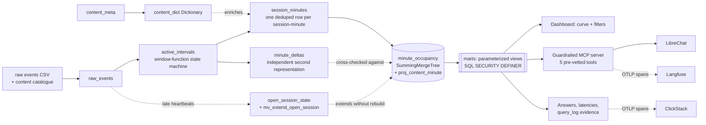

# DevSapiens

## Track

SonyLIV

## Project

**ClickLiv**, foreground-only concurrency at streaming scale.

An open app is not a viewer. ClickLiv treats every session as a state machine running over its
own ordered event stream, opens a clock only while that machine is **playing, foregrounded and
heartbeat-fresh**, and answers "how many people are actually watching right now" from the sum of
those clocks rather than from the number of sessions someone left open.

**Try it live: [clickliv.vercel.app](https://clickliv.vercel.app)**. The curve, the filters, and
the exact ClickHouse query behind whatever is on screen.

## Team Members

- Ashutosh Jha ([@ashutosh887](https://github.com/ashutosh887))
- Mansi Sondhi ([@weirdcoder26](https://github.com/weirdcoder26))

## What it does

- **Counts only active playback.** A session contributes to a minute only while it is playing,
  foregrounded and within one measured heartbeat period of its last event. Pause, background,
  error, session end and heartbeat silence all close the clock.
- **Serves any slice at minute grain from one rollup.** A single parameterized view answers every
  combination of eleven filters, at minute, hour or day grain, reading a `SummingMergeTree` of
  session-minutes instead of re-deriving session state per request.
- **Absorbs open sessions without a rebuild.** A materialized view extends still-open sessions as
  heartbeats arrive, and the incremental state is proven against a full batch rebuild to the
  millisecond.
- **Proves its own number five ways.** The rollup, an independent signed-delta path, a
  `maxIntersections` oracle, a pure-Python reference that reads the CSV and never touches
  ClickHouse, and chDB running the same SQL in-process, all diffed by four gates.
- **Answers the question in English.** LibreChat over a guardrailed MCP surface where the model
  never emits SQL: it calls pre-vetted parameterized tools under a restricted, budgeted
  ClickHouse role.

**Why this matters.** Ad inventory is sold against concurrent audience and CDN capacity is
provisioned against the peak minute, so an overstated curve costs money in both directions at
once. On the sealed day, counting every open session instead of every actively-watching one
overstates peak concurrency by **9.1%** and average concurrency by **90.1%**. The gap is not
rounding, and it is not a modelling preference: it is paused, backgrounded and dead time being
sold as audience.

| Sealed-day reading | Value |
|---|---|
| Peak concurrency, foreground-only | **22,175** at 2026-07-31 11:16 UTC |
| Peak counting every open session | 24,196, the same minute |
| Overcount, peak / average | 9.1% / 90.1% |
| Instantaneous peak, point-in-time overlap | 20,003 |
| Events / sessions loaded | 7,000,000 / 108,486 |
| Active intervals / rollup rows | 177,372 / 704,123 |
| Serving latency, server-side p99 | **124 ms**, missing our self-imposed 100 ms target |
| Correctness | 12/12 checks, five independent implementations agreeing exactly |

Every number above is produced by a query this repository ran, carries a `query_id` generated by
the client before the query ran, and resolves in `system.query_log`. The benchmark answers, the
per-query latencies and the query-log evidence for the sealed dataset are in
[`source/unseen/answers/`](source/unseen/answers/) and
[`source/unseen/evidence/`](source/unseen/evidence/), pinned by a SHA-256 manifest at
[`source/unseen/submission/manifest.json`](source/unseen/submission/manifest.json).

## Hosted Demo

- **[clickliv.vercel.app](https://clickliv.vercel.app)** — the product UI. The concurrency curve
  and its filters, reading `marts.v_concurrency_full` through a serverless proxy as the same
  restricted, budgeted role every other consumer uses. No admin credential exists in that
  environment, and the API response says so in a `served_by` field.
- **[librechat.15-252-63-157.sslip.io](https://librechat.15-252-63-157.sslip.io)** — the
  conversational layer. Ask for any of these numbers in plain language.
- **[langfuse.15-252-63-157.sslip.io](https://langfuse.15-252-63-157.sslip.io)** — the LLM and
  MCP traces, stored in this project's own ClickHouse Cloud service.
- **[clickstack.15-252-63-157.sslip.io](https://clickstack.15-252-63-157.sslip.io)** — the
  pipeline traces. The starred **ClickLiv pipeline telemetry** dashboard is the panel worth
  opening.

The data lives in a ClickHouse Cloud service in `ap-south-1` with 2 replicas, next to a
ClickHouse managed Postgres service in the same region. The three self-hosted surfaces run on one
EC2 instance in `ap-south-1` behind Caddy for automatic HTTPS.

### The concurrency curve

The curve is computed in ClickHouse and rendered in the product UI. It is not a screenshot. The
dashboard calls one parameterized view for every combination of filters, grain and range, and a
disclosure pane on the page shows the exact call behind the chart currently on screen together
with the rows it read.

```sql
SELECT bucket_minute, peak_concurrency, average_concurrency, minutes_in_bucket
FROM marts.v_concurrency_full(
    country            = '',
    platform           = 'ANDROID_PHONE',
    video_type         = '',
    category           = '',
    app_version        = '',
    player_version     = '',
    audio_language     = '',
    subtitle_language  = '',
    video_resolution   = '',
    show_name          = '',
    content_id         = 0,
    minute_from        = 29757600,
    minute_to          = 29759039,
    grain_minutes      = 1)
ORDER BY bucket_minute;
```

All fourteen parameters are required, which is deliberate: a caller that forgets one gets an
error rather than a silently unfiltered answer. `minute_from` and `minute_to` above are
2026-07-31 00:00 and 23:59 UTC, the dense day the sealed drop concentrates in. The raw file also
carries 3,360 outlier minutes across 9,200 rows spanning 2014-12-31 to 2026-08-03; nothing is
filtered out, both windows are queryable, and the outliers simply sit outside the range these two
parameters select. `marts.v_data_window` publishes both windows so a caller learns the extent
instead of assuming "now".

An empty string means no filter on that dimension, and so do `ALL`, `ANY`, `NONE`, `NULL`, `*`
and `%`, because a dashboard that sends its own placeholder should not silently get the wrong
answer. `grain_minutes` is 1 for minute, 60 for hour, 1440 for day.

Underneath, that view reads a `SummingMergeTree` rollup keyed by `(minute, <every dimension>)`,
which is what lets the curve repaint instantly at any filter combination. `minute` leads the key
because it is the one predicate `KeyCondition` can use: the dimension filters match
case-insensitively and the index cannot invert a `lower()`.

The full definition is in [`source/sql/06_marts.sql`](source/sql/06_marts.sql). The rollup it
reads is built by [`source/sql/03_occupancy.sql`](source/sql/03_occupancy.sql) from the active
intervals produced by the state machine in
[`source/sql/02_sessionize.sql`](source/sql/02_sessionize.sql).

**Peak is not composable, and the view enforces the order.** `max` does not distribute over sums,
so the operations are fixed: filter, sum across the excluded dimensions, then take the max over
minutes. Taking the max first gives a different and wrong answer, which is why the peak of a
slice can land in a different minute from the peak of the whole. The problem statement's own
worked example of exactly this is reproduced in
[`source/evidence/dimension_crossover.txt`](source/evidence/dimension_crossover.txt): four
distinct peak minutes across five slices.

### Filters, and the dataset column behind each one

Every filter applies to the concurrency curve and to every other view in the product. The UI does
not carry a hard-coded filter list: it reads the view's parameter signature from
`system.parameterized_view_parameters` at runtime
([`source/web/api/_clickhouse.js`](source/web/api/_clickhouse.js), `signature()`), so the controls
cannot drift from the serving contract.

| Filter in the UI | Dataset column | Source |
|---|---|---|
| Platform | `platform` | raw event stream |
| Country | `country` | raw event stream |
| Audio language | `audio_language` | raw event stream |
| Subtitle language | `subtitle_language` | raw event stream |
| App version | `app_version` | raw event stream |
| Player version | `player_version` | raw event stream |
| Video resolution | `video_resolution` | raw event stream |
| Video type | `video_type` | content catalogue, keyed on `content_id` |
| Category | `category` | content catalogue, keyed on `content_id` |
| Title | `title`, resolved to `content_id` | content catalogue, keyed on `content_id` |
| Show | `show_name` | content catalogue, keyed on `content_id` |

Content attributes reach the rollup through a ClickHouse `Dictionary` on `content_id` rather than
a join, so filtering by title, category or video type costs a dictionary lookup rather than a
second table read.

`video_resolution` on the event and `show_name` in the catalogue both arrived with the sealed
drop, needed no code change, and are filterable on the same terms as every other dimension.
`video_resolution` is recorded inconsistently in the source, `1920*1080`, `1920 * 1080` and
`Auto-1920*1080` among them, and every spelling is published as its own distinct value rather
than merged into one, because collapsing them would mean guessing at a mapping the data does not
state. Whole-day peak concurrency for `video_resolution = '1920*1080'` alone is **4,344**,
verified live against `marts.v_concurrency_full`.

**Filters are close to free.** Applying zero dimension filters reads 97,043 rows and applying
eight reads 99,968, a difference of 2,925 rows rather than eight more table scans, measured on
the tuning extract from `system.query_log.read_rows` by a `query_id` generated before each query
ran ([`source/evidence/read_cost_by_filter_count.txt`](source/evidence/read_cost_by_filter_count.txt)).
A small `marts.dimension_value` table resolves case-insensitive matching, so each added predicate
does not cost another pass over the fact table.

**Case is respected, not guessed at.** The sealed data carries both `Web` and `WEB`, and both
`Mweb` and `MWEB`. The case-insensitive fallback fires only when the lowercase match is unique,
so the view matches exactly rather than silently merging two real slices into one.

## Demo Video

**https://youtu.be/RCbLC5MoHrw**

Shows the concurrency curve and the filters working live against the hosted demo, the
conversational layer answering in English, then the correctness gates and the `query_log` evidence
behind the published numbers.

## Architecture



Solid arrows carry data. Dashed arrows carry something else: enrichment by dictionary lookup
rather than a join, a correctness relationship where one path is diffed against another, an
incremental extension that does not rewrite what is already there, and telemetry leaving the
pipeline for an observability backend. No dashed edge sits on the path from a CSV row to a served
number.

**Stage by stage.**

1. **Load.** Content catalogue first, because the enrichment is a ClickHouse `Dictionary` and the
   loader asserts the ordering rather than assuming it. The loader reads the real CSV header,
   builds its input schema from it, and refuses to start if a required column is missing rather
   than binding a renamed column to an empty string.
2. **Sessionize.** A state machine expressed as window functions partitioned by
   `video_session_id`. A segment is open while the session is playing **and** foregrounded **and**
   heartbeat-fresh. Any transition out of that state closes the segment uniformly, whatever caused
   it: pause, background, error, session end, session restart, or a heartbeat gap wider than the
   threshold. Output is `active_intervals`, one row per continuous active segment.
3. **Occupancy.** Each interval expands to the minutes it covers, half-open so a session ending
   exactly on a boundary is counted once, and is deduped to one row per `(session, minute)` with
   the dimension tuple resolved by `argMax` on event order, because dimensions are not stable
   inside a session. Rolled up into a `SummingMergeTree` keyed by every dimension plus `minute`.
4. **Deltas.** The same intervals merged into runs, converted to signed plus-one minus-one events
   and reconstructed by a windowed cumulative sum. An independent second computation of the same
   series, diffed against the rollup by the correctness gate.
5. **Serve.** Parameterized `marts` views with `SQL SECURITY DEFINER`, read by every consumer. The
   dashboard, the MCP server and the benchmark harness all read the same views, so there is no
   second query path that could drift.

**The one modelling decision everything rests on.** One deduped row per `(session, minute)` means
each session sits in exactly one dimension tuple per minute, so **per-minute concurrency is
additive across dimensions** and a single rollup answers any filter combination rather than one
table per combination.

**Storage and ordering keys.**

| Object | Engine | Ordering key |
|---|---|---|
| `raw_events` | MergeTree | `(video_session_id, event_time)` |
| `content_meta` to `content_dict` | Dictionary, `HASHED()` | `content_id` |
| `active_intervals` | MergeTree | `(video_session_id, minute)` |
| `session_minutes` | MergeTree | `(video_session_id, minute)` |
| `minute_occupancy` | SummingMergeTree(sessions) | `(minute, <every dimension>, content_id)` |
| `proj_content_minute` | projection | `(content_id, minute)` |
| `minute_deltas` | MergeTree | `minute` |
| `open_session_state` | ReplacingMergeTree | `video_session_id` |
| `marts.*` | parameterized views | the only granted surface |

A projection reordered by `content_id` fixes the one access path the base key cannot serve, and
`system.query_log.projections` records the planner choosing it unforced
([`source/evidence/projections.txt`](source/evidence/projections.txt): granules 6 of 17, 15,245
rows read).

### Where the OSS stack sits in this pipeline

All three pillars are wired, committed and load-bearing. Deployment is one
[`source/docker-compose.yml`](source/docker-compose.yml) with `obs`, `llm` and `chat` profiles;
secrets are redacted in [`source/.env.example`](source/.env.example).

| Tool | What runs through it | Wiring | Integration code |
|---|---|---|---|
| **ClickStack** | The pipeline observes itself: one OTLP span per pipeline stage and per query, carrying `clickhouse.query_duration_ms` and `clickhouse.read_rows` read back out of `system.query_log` rather than a client stopwatch. `make obs-up`, then `make trace`. | `docker-compose.yml` profile `obs` | [`source/src/clickliv/otel.py`](source/src/clickliv/otel.py) emits, [`source/src/clickliv/observe.py`](source/src/clickliv/observe.py) reads the traces back out of ClickStack's own ClickHouse |
| **Langfuse** 4.1.0 | Every MCP tool call and LLM call is traced with token usage and cost. Langfuse is itself a second ClickHouse workload: traces in this project's own ClickHouse Cloud service, transactional state on **ClickHouse managed Postgres**. `make llm-up`. | `docker-compose.yml` profile `llm` | [`source/src/clickliv/otel.py`](source/src/clickliv/otel.py) (OTLP sink at `/api/public/otel/v1/traces`, `langfuse.observation.type` tagging), [`source/src/clickliv/llm.py`](source/src/clickliv/llm.py) |
| **LibreChat** v0.8.7 | The product's conversational surface. The model **never emits SQL**: it calls five pre-vetted parameterized MCP tools, filter values are checked against an allowlist before any SQL is built, and the server connects as a restricted role under a `readonly = 1 CONST` settings profile, so the query budget is enforced by ClickHouse rather than by prompt text. The official `mcp-clickhouse` 0.4.1 runs alongside it for comparison. `make chat-up`. | [`source/docker/librechat.yaml`](source/docker/librechat.yaml), `docker-compose.yml` profile `chat` | [`source/src/clickliv/mcp.py`](source/src/clickliv/mcp.py), 843 lines |

Round-trip evidence is in
[`source/evidence/conversational_layer.txt`](source/evidence/conversational_layer.txt), 358 lines:
the English questions, the answers, the `clusterAllReplicas(default, system.query_log)` rows
proving which queries the model actually caused, and the refusals — a read outside `marts` is
denied by ClickHouse with error 497, an attempted `SET max_execution_time` with error 164.

**The LLM is deliberately outside the correctness path.** Every number in `answers/`, `evidence/`
and `unseen/` is produced by SQL this repository ran. A model call cannot make a wrong concurrency
number right, and the LLM layer falls back to a no-op that changes no output when no key is
present — and that no-op is a test case.

## How we built it

**Stack.**

- **ClickHouse Cloud** (`ap-south-1`, 2 replicas, server 26.4.1.2029), the only datastore and the
  only analytical engine.
- **SQL**, 1,161 lines across nine numbered files. No SQL lives in Python strings, which is what
  lets the same unmodified files run against ClickHouse Cloud, local Docker and chDB.
- **Python**, 5,395 lines across 25 modules, with a **zero runtime dependencies** policy
  (`pyproject.toml` declares `dependencies = []`): the ClickHouse client, the OTLP trace exporter,
  the MCP server and the test suite are all standard library.
- **The product UI**, 1,760 lines of plain HTML, CSS and ES modules, no framework and no build
  step, on Vercel functions pinned to Mumbai.
- **chDB** 26.5.0 as a second ClickHouse runtime, in-process, for a zero-install reproduction.
- **ClickStack, Langfuse and LibreChat**, all three, plus the official ClickHouse MCP server.

**Why these choices.**

- *A `SummingMergeTree` rollup rather than an `AggregatingMergeTree` of `uniqExactState`.* The
  sketch model is what most teams reach for. We built it too, as an adversary. It costs 56 bytes
  per row uncompressed against our 24, which is 10.8x more on disk for 1.34x the rows, and the
  gap is what decides this at the 300K-concurrent scale the brief names. Deduping to one row per
  `(session, minute)` buys the same de-duplication for a plain integer sum.
- *`minute` first in the ordering key.* It is the only predicate `KeyCondition` can use, because
  the dimension filters fold case and the index cannot invert a `lower()`.
- *A `Dictionary` rather than a join for content attributes.* Filtering by title or category costs
  a lookup, not a second table read.
- *Parameterized views with `SQL SECURITY DEFINER`.* The reader is granted the views and nothing
  underneath them, so a least-privilege role can serve the dashboard, the MCP server and the
  benchmark harness from one contract with no second query path to drift.
- *Thresholds measured, not documented.* See below.

**Correctness is diffed, not asserted.** Five independent implementations of the same number are
checked against each other, and any single one of them could be confidently wrong:

1. the session-minute occupancy rollup,
2. a signed-delta path with a windowed cumulative sum,
3. `maxIntersections`, an arithmetic oracle with no rollup involved,
4. a pure-Python reference that reads the CSV directly and never touches ClickHouse
   ([`source/src/clickliv/reference.py`](source/src/clickliv/reference.py), 323 lines),
5. chDB running the same SQL files in-process with no server.

Four gates on top: a twelve-check cross-path diff (Gate A, 12/12 on the sealed day), a
byte-identical rebuild proving idempotency (Gate B), a held-out day rerun end to end (Gate C,
[`source/answers/gate_c/`](source/answers/gate_c/)), and a chDB hash match against the server.

**What the data actually said, against what the data dictionary said.** The documented 60 second
heartbeat measures at 40 seconds: on the sealed day, 1,400,239 inter-heartbeat gaps land in the
40 second band against 10,626 in the 60 second band, a ratio of 132 to 1, and not one of 21
platforms medians more than 31 ms away from 40.000 seconds. Every liveness threshold in the
project therefore derives from the measured cadence rather than the documented one. There is no
pause event type either; playback state lives inside the heartbeat stream. Background and
foreground markers do not pair, so the model never waits for a matching marker and the gap rule
catches the sessions where one never arrives.

**The two thresholds that remain judgement calls are swept rather than defended.** A 99-point grid
on the sealed data, gap from 40 to 300 seconds by grace from 0 to 120: the peak moves 0.5% across
the whole operating box, and the peak minute is identical in all 99 cells.

**An extract is a window, not a lifetime — and this is the thing the sealed day taught us.** The
sealed day is roughly an hour cut out of a continuous stream, so a session already playing when
the window opens emitted its play marker before the first row and never emits another. **25,651 of
108,486 sealed sessions, 23.64%, carry no event that would prove they were playing**, and they
carry 21.2% of the file. Our state machine defaulted `playing` to off, so it scored all of them
zero for their entire life, and the visible symptom was a false 46-minute ramp where the true
audience is flat from the first minute. The state machine now treats a session as playing until
something says otherwise; pause, background, error and session end all still switch it off, so
**every exclusion the problem statement names is unaffected**. We found it by building the model a
competing team would build, an `AggregatingMergeTree` of `uniqExactState`, running it on the
sealed data and attributing every per-minute disagreement to a named mechanical cause. Twelve
cross-path checks and a 224-point sweep were all green on the defect, because they diff us against
us; only an adversary catches a definition bug. Documented in
[`source/docs/correctness.md`](source/docs/correctness.md).

**Performance is reported as what the queries read.** Every latency is `query_duration_ms` from
`system.query_log`, matched by a `query_id` the client generated before the query ran, never
client wall clock, because wall clock measures the network rather than the design.

**Scale is proven, not projected.** Sessions split across eight shards by
`cityHash64(video_session_id) % 8`, each shard computed alone and summed, reproduce the server's
peak of 22,175 and its full 4,145-minute series exactly, so this fans out with no coordination.
Read amplification against raw events is flat at **10.3x from 1x through 100x**
([`source/evidence/scale.txt`](source/evidence/scale.txt)), and that file states plainly which
part of the scaling proof is a duplication artefact and which part is structural.

### Stated plainly, because a judge will find them anyway

- **We miss our own serving SLO on the sealed data.** p99 is 124 ms against the 100 ms target we
  set ourselves; no SLA was published upstream, and we would rather state a number and miss it
  than leave latency unstated. 7.7x the data on a Cloud instance at its 4-thread floor moved p99
  from under 60 ms to 124 ms. `source/unseen/evidence/serving_slo.txt` prints `FAIL` in full.
- **The final minute of the sealed curve is largely grace-credited**, because the file stops
  mid-minute while 34.7% of sessions are still open. The peak is thirteen minutes clear of that
  edge and only 0.025% of session-minutes land past the last event in the file. It is labelled on
  the curve rather than trimmed.
- **The average-concurrency denominator is active minutes**, meaning minutes carrying at least one
  session, and it is published next to every average rather than left implicit.
- **A finalization watermark is not built.** Open sessions are extended incrementally today;
  compacting and sealing them once a watermark passes is the one line of the brief's "incremental
  compaction" direction we have not shipped.

## How to run it

```sh
git clone https://github.com/ashutosh887/ClickLiv
cd ClickLiv
cp .env.example .env          # point CH_HOST at your ClickHouse service
make data                     # fetch the datasets
make up                       # optional: local ClickHouse in Docker instead of Cloud
make all                      # schema, load, sessionize, rollup, gates, answers, evidence
```

`make all` runs the whole pipeline from CSV to the correctness gate in about 11 seconds on local
Docker and prints twelve cross-path checks. No Docker, no server and no credentials at all:

```sh
make chdb                     # the same SQL in-process, hashes matched against the server
make test                     # 104 tests, standard library only
```

The graded run against the sealed dataset is one command, preflighted before anything is dropped:

```sh
make preflight RAW=data/ch-hackathon-raw-data_surprise.csv \
               CONTENT=data/ch-hackathon-content-data_surprise.csv
make unseen    RAW=data/ch-hackathon-raw-data_surprise.csv \
               CONTENT=data/ch-hackathon-content-data_surprise.csv
```

It writes the answers, the latencies, the query-log evidence and a SHA-256 manifest into a
separate output tree, so a graded run never overwrites committed results. `make rollback` undoes
it.

The three OSS surfaces, each a profile in the one `docker-compose.yml`:

```sh
make obs-up                   # ClickStack, then `make trace` to emit pipeline spans
make llm-up                   # Langfuse
make chat-up                  # LibreChat over the guardrailed MCP server
```

Useful individual targets:

| Command | What it produces |
|---|---|
| `make verify` | The twelve-check cross-path correctness gate |
| `make gate-b` | Two rebuilds, proven byte-identical |
| `make gate-c` | A held-out day taken through the whole pipeline |
| `make chdb` | The same SQL in a second ClickHouse runtime, hashes matched |
| `make answers` | Benchmark answers plus per-query latencies from `system.query_log` |
| `make sweep` | The gap and grace sensitivity surface |
| `make scale` | The 8-shard exactness proof and the read-cost scaling proof |
| `make claims` | Re-reads every published headline number live and names any stale document |
| `make test` | The standard library test suite |
| `make mcp` | The guardrailed MCP server |

Full command reference and the sealed-day runbook are in
[`source/docs/operations.md`](source/docs/operations.md) and
[`source/docs/unseen-day.md`](source/docs/unseen-day.md).

---

## What is in this folder

```
DevSapiens/
├── README.md          this file
├── pitch-deck.pdf     the deck
└── source/            github.com/ashutosh887/ClickLiv, MIT, 149 files
    ├── sql/           9 files, 1,161 lines: the entire model
    ├── src/clickliv/  25 modules, 5,395 lines, standard library only
    ├── tests/         9 files, 28 classes, 104 tests
    ├── web/           the product UI, 1,760 lines, no framework, no build step
    ├── docs/          12 documents, 2,623 lines
    ├── answers/ evidence/ submission/   results, latencies, query-log evidence
    ├── unseen/        the graded run on the sealed day
    ├── sample_rerun/  the tuning dataset rerun with the shipped model, side by side
    ├── fixtures/      a committed fixture and an adversarial synthetic unseen day
    ├── docker/ docker-compose.yml   ClickStack, Langfuse and LibreChat wiring
    └── LICENSE        MIT
```

Source is a complete, runnable copy rather than a pointer to a repository that could move. The
canonical repository is **[github.com/ashutosh887/ClickLiv](https://github.com/ashutosh887/ClickLiv)**,
public and MIT.
