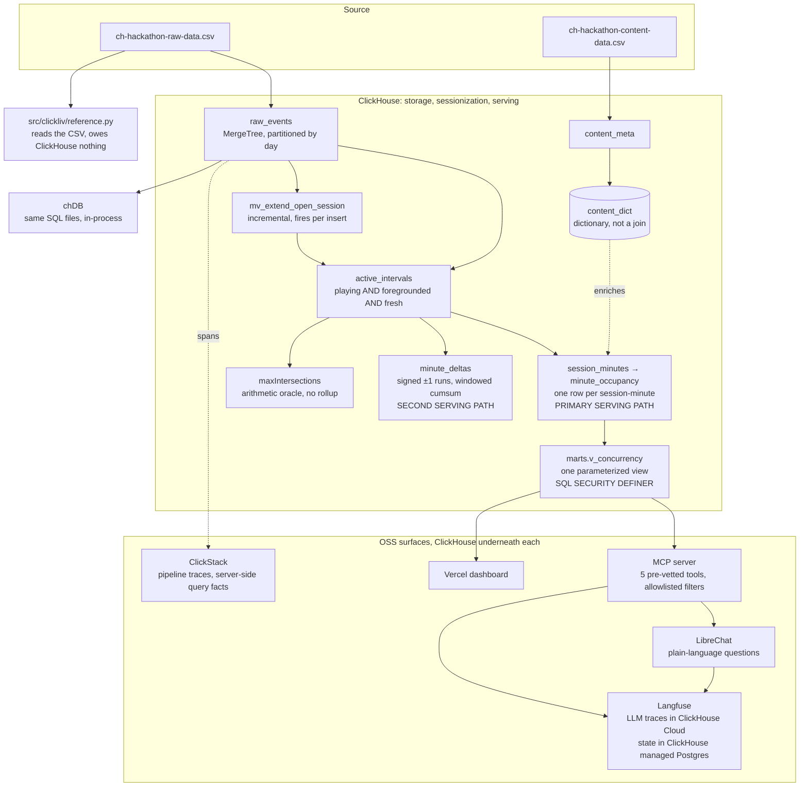

# DevSapiens

## Track

SonyLIV. Counting the crowd: foreground-only concurrency at streaming scale.

## Project

**ClickLiv**, foreground-only concurrent viewers for SonyLIV streaming telemetry, on
ClickHouse.

## Team Members

- Ashutosh Jha ([@ashutosh887](https://github.com/ashutosh887))
- Mansi Sondhi ([@weirdcoder26](https://github.com/weirdcoder26))

## What it does

An open app is not a viewer. A session counts as concurrent only while it is **playing**,
**foregrounded** and **heartbeat-fresh**.

On the graded day, 7,000,000 events from 2026-07-31, counting every open session instead
reports **24,196** concurrent viewers in the busiest minute where **22,175** were actually
watching. That is **2,021 phantom viewers in a single minute**. At live-sport scale those
are the people capacity gets provisioned for and ad inventory gets priced against, and they
are not watching anything.

| Graded day, 2026-07-31 | Foreground-only | Naive, every open session |
|---|---|---|
| Peak concurrent viewers | **22,175** | 24,196, **9.1% high** |
| Average concurrent viewers | **895.9** | 1,703.2, **90.1% high** |
| Minute the peak lands in, UTC | 11:16 | 11:16, the same minute |

ClickLiv ingests raw session telemetry into ClickHouse, reconstructs the truly active
playback intervals inside every session, rolls them to one row per session-minute, and
serves peak and average concurrency at any grain under any combination of filters from that
one rollup. It absorbs still-open sessions incrementally as heartbeats keep arriving, and it
exposes the same numbers through a web dashboard, a conversational surface and an MCP
server, all reading through one budgeted read-only role.

## Hosted Demo

- **[clickliv.vercel.app](https://clickliv.vercel.app)**, the concurrency curve and its
  filters, reading `marts.v_concurrency` through a serverless proxy as the same restricted
  budgeted role every other consumer uses. No admin credential exists in that environment,
  and the API response says so in a `served_by` field.
- **[librechat.15-252-63-157.sslip.io](https://librechat.15-252-63-157.sslip.io)**, ask for
  any of these numbers in plain language.
- **[langfuse.15-252-63-157.sslip.io](https://langfuse.15-252-63-157.sslip.io)**, the LLM
  traces, stored in this project's own ClickHouse Cloud service.
- **[clickstack.15-252-63-157.sslip.io](https://clickstack.15-252-63-157.sslip.io)**, the
  pipeline traces. The starred **ClickLiv pipeline telemetry** dashboard is the panel worth
  opening.

The data lives in a ClickHouse Cloud service in `ap-south-1` with 2 replicas, next to a
ClickHouse managed Postgres service in the same region. The three self-hosted surfaces run
on one EC2 instance in `ap-south-1` behind Caddy for automatic HTTPS.

## Demo Video

**<https://youtu.be/RCbLC5MoHrw>**, the recorded 2 to 3 minute walkthrough: the concurrency
curve and its filters live against the hosted demo, the conversational layer answering in
English, then the correctness gates and the `query_log` evidence behind every number below.

The pitch deck is [`docs/pitch-deck.pdf`](docs/pitch-deck.pdf), 14 slides.

---

## Where each judging criterion is answered

| Criterion | The short answer | Section |
|---|---|---|
| ClickHouse and the OSS stack | All three OSS pillars, plus the ClickHouse MCP server. Langfuse is a second ClickHouse workload, not a name-drop: its traces live in this project's own Cloud service on SharedMergeTree, its state in ClickHouse managed Postgres. | [OSS stack](#the-oss-stack) |
| Correctness against the private key | Five independent implementations of the same question, diffed by four gates. Three ClickHouse runtimes and a Python reference that reads the CSV and owes ClickHouse nothing agree hash for hash. | [Correctness](#correctness-five-paths-then-diff-them) |
| Innovation, against the obvious alternative | We built the competing design, a session-independent heartbeat-presence sketch, ran it on the graded day and diffed it cell by cell. It reads 22,718 against our 22,175, and every session-minute of the gap is paused playback a presence model structurally cannot see. | [Versus a presence sketch](#how-clickliv-differs-from-a-presence-sketch) |
| Query performance, and what the queries read | The served query reads the 704,123-row rollup, never the 7,000,000 events, and read cost is flat in the number of filters: zero filters to eight costs 2,925 extra rows, not eight more scans. p99 on the graded day is 124 ms, which **misses** our self-imposed 100 ms on a Cloud instance at its 4 thread floor. | [Serving](#serving-one-parameterized-view-behind-a-budgeted-role) |
| Update handling | A materialized view extends still-open sessions on every insert with no rebuild, and the graded day is 34.7% still-open sessions, so this is exercised for real rather than by fixture. | [Update handling](#update-handling-incrementally-rather-than-by-rebuild) |
| Design quality and the trade-offs | Every threshold derives from a measurement of this data rather than from the data dictionary, and the two that remain guesses are swept across a grid rather than defended. | [The model](#the-model-and-the-measurement-that-forced-each-decision) |
| Scalability, and behaviour at 100x | Sharding is exact by construction. Eight independent shards computed alone and summed reproduce the server's peak and its full minute series. | [Scale](#scale-and-what-happens-at-100x) |
| The unseen day | One command, preflighted before anything is dropped, snapshotted so a failure is seconds from rollback, rehearsed against adversarial fixtures and a held-out real day. | [Unseen day](#built-for-the-unseen-day) |

---

## Results

The graded SonyLIV drop is the source of truth. The tuning extract is published beside it,
rebuilt this morning under the same code, so both columns come from one pipeline rather than
two models called one. Every figure below is produced by a query this repository ran, tagged
with a `query_id` and traceable to `system.query_log`.

**`make claims` re-reads every published figure straight off the live service** and names
any document still stating a superseded one. This README is checkable in one command rather
than trusted.

### Graded dataset, 2026-07-31

| Measure | Value |
|---|---|
| Peak concurrency, foreground-only, unfiltered | **22,175** |
| Minute of peak, UTC | **2026-07-31 11:16:00** |
| Peak concurrency, naive, any open session | 24,196, in the same minute |
| Peak overcount from counting open sessions | **9.1%** |
| Average overcount from counting open sessions | **90.1%** |
| Average concurrency, over the dense day | 895.9 |
| Average concurrency, over minutes carrying active playback | 313.5 |
| Instantaneous peak, point-in-time overlap rather than occupancy | 20,003 |
| Peak, video_type vod | 13,249 |
| Peak, audio_language hin | 11,255 |
| Peak, video_type live | 10,314 |
| Peak, platform ANDROID_PHONE | 6,513 |
| Peak, platform SONY_ANDROID_TV | 3,308 |
| Peak, IPHONE in india | 715 |
| Peak, vod on Mweb | 75 |
| Raw events loaded | 7,000,000 |
| Content rows loaded | 33,325 |
| Distinct sessions | 108,486 |
| Sessions still open at the file boundary | 37,649, **34.7%** |
| Active intervals after sessionization | 177,372 |
| Occupancy rows, one per session-minute per tuple | 704,123 |
| Minutes carrying at least one session | 4,145 |
| Serving latency, server-side p50 / p95 / p99 | 99 / 121 / **124 ms**, target missed |

Average concurrency is reported against **two denominators on purpose**, because there is no
single defensible one. 895.9 divides by the minutes of the dense day, which is the
denominator the overcount comparison needs. 313.5 divides by the minutes carrying active
playback, which is the denominator `answers/benchmark_answers.csv` states in its own
`average_denominator` column. Both are labelled everywhere they appear rather than silently
picked.

The dense window is one day, 2026-07-31. The full extent of the file runs 2014-12-31 to
2026-08-03 with 3,360 outlier minutes carrying 9,200 rollup rows. Nothing is filtered out;
both are published, and the outliers are excluded from the dense-day denominator only.

### Tuning extract, for comparison

| Measure | Value |
|---|---|
| Peak concurrency, foreground-only | 2,710 |
| Average concurrency, over minutes carrying active playback | 35.2145 |
| Instantaneous peak | 2,306 |
| Minutes carrying at least one session | 3,650 |

Both datasets stay queryable. The graded data builds into the `clickliv` database behind the
`marts` schema, which is what every live surface reads, and the extract is preserved as
`clickliv_sample` behind `marts_clickliv_sample`: same views, same parameters, same
restricted role. See [docs/datasets.md](docs/datasets.md).

### Why the correction is 9.1% here and was roughly four times that on the extract

The tuning extract gives a much larger peak overcount than the graded day, and puts the
naive peak in a different minute from the real one where the graded day puts both in the
same minute. That is not an inconsistency to explain away. It is the most useful thing we
learned, and it is why the correction is published per dataset instead of as a headline
constant.

The cause is measured. **Every one of the extract's sessions carries an explicit
`VideoSessionEnd`. On the graded day 37,649 of 108,486 sessions, 34.7%, never send one**
because the day is cut at a boundary while they are still running. A completed session
contributes a naive interval running all the way to its end marker, including the idle,
paused and backgrounded tail at the finish, and that tail is exactly the time
foreground-only excludes. A truncated session never accumulates that tail, so there is far
less for the naive reading to overstate. The extract compounds it by being sparse, 12 days
carrying 3,650 active minutes, where the graded day is one dense day of 4,145.

The direction of the correction is identical on both and the model is unchanged between
them. Only the size moves, and it moves for a reason that is a property of real traffic
rather than of our code. A team that tuned on the extract and quoted its overcount on the
graded day would be wrong by a factor of four.

**Latency, and a target we report ourselves missing.** Latency is `query_duration_ms` read
from `system.query_log` by `query_id`, never client wall clock. The 40 samples are the 8
benchmark queries run 5 times each. The 100 ms target is ours and self-imposed, because no
SLA was ever published upstream, and on the graded day we miss it: p99 is 124 ms and
`unseen/evidence/serving_slo.txt` says `FAIL` in as many words. The cause is measured and it
is not the model. The same eight queries read the same rollup, but the service is carrying
7.7 times the data on a ClickHouse Cloud instance sitting at its 4 thread and 16 GiB floor
against a 120 GB ceiling. The fix is a slider, which is the kind of fix a design wants to
have.

---

## The OSS stack

The rules require one of ClickStack, Langfuse or LibreChat, integrated meaningfully, and say
superficial inclusion will not count. All three are here, plus the ClickHouse MCP server,
and each carries load that would be missed if it were removed.

**ClickStack** traces the pipeline itself, 189 spans in a single `make replay`: one root span
per command, a span per stage, a span per ingest and a span per query. The query spans
deliberately do not report client wall clock. Before export the tracer flushes logs, reads
`system.query_log` for the query ids it collected, and attaches what the server itself
recorded. The exporter is OTLP over JSON on the standard library, so this pillar added zero
dependencies, and leaving the endpoint unset makes tracing a byte-identical no-op, verified
in both directions against Gates A, B and D. One exporter feeds ClickStack and Langfuse from
the same spans.

**Langfuse** traces the LLM and MCP calls, and its own storage is entirely ClickHouse
products: traces in this project's ClickHouse Cloud service on SharedMergeTree,
transactional state in ClickHouse managed Postgres. It is not an observability logo bolted
on the side, it is a second ClickHouse workload running next to the first. The trace count
is deliberately not published here, because it climbs every time anyone opens the chat
surface and a figure wrong within the hour is worse than no figure.

**LibreChat and the MCP server** are where the question gets asked in plain language, and
the MCP boundary is what makes an LLM safe to point at a warehouse. Five pre-vetted
parameterized tools: `concurrency_peak`, `concurrency_series`, `top_slices`, `overcount` and
`list_dimensions`. They filter on every dimension in the
[filter table](#which-dataset-column-backs-each-filter), plus a title or a `content_id`, so
nothing published in this README is out of reach from chat. Filter values are validated
against real dimension values read from the data, so an invalid filter raises a tool error
rather than silently returning zero. On the default path the model never emits SQL, and the
server connects as a restricted role, so the query budget is enforced by ClickHouse rather
than by prompt instructions. Each answer reports the rows it read, taken from the response
statistics block and verified byte identical to `system.query_log.read_rows` for the same
`query_id`. A labelled escape hatch to the official read-only ClickHouse MCP server exists
for schema exploration; it is off the default path, authenticates as a separate read-only
user, and its instructions require the model to show the SQL it ran, so a reader can tell an
ad hoc query from a published mart.

The optional LLM use case the problem statement suggests is built too: `make decline`
detects a concurrency decline and narrates the likely cause.

---

## Correctness: five paths, then diff them

Two paths that agree is a claim no single path can make.

| Path | What it is |
|---|---|
| `minute_occupancy` | One row per (session, minute). The primary serving path. |
| `minute_deltas` | Signed +1/-1 on merged runs and a windowed cumulative sum. A second, structurally different serving path. |
| `maxIntersections` | An arithmetic oracle with no rollup involved at all. |
| `src/clickliv/reference.py` | A Python reference that reads the CSV and owes ClickHouse nothing. |
| chDB | The same SQL files in-process, no server, identical hashes. |

Four gates diff them.

- **Gate A**, `make verify`. 12 cross-path checks, unfiltered and across every slice. It is
  the gate the graded run proves, and it diffs every interval and every rollup row against
  an independent Python recomputation of the same day.
- **Gate B**, `make gate-b`. Rebuilds twice and asserts the serving tables are byte
  identical.
- **Gate C**, `make gate-c`. Reloads against the busiest single day alone, rehearsing the
  unseen-day drop before it happens. It caught a real async-mutation race the first time it
  ran.
- **Gate D**, `make chdb`. Builds the entire pipeline in-process with chDB and matches the
  server hash for hash. Same SQL files, three ClickHouse runtimes, three ClickHouse
  versions, identical hashes.

**The two guessed thresholds are swept, not defended.** `make sweep` runs the whole grace 20s
to 60s by gap 60s to 120s grid. Peak concurrency moves 0.3% and the peak minute never moves,
while segment count does move, so the threshold does real work at the segment level and none
at the minute level. The answer does not depend on the guess, which is a stronger result than
arguing for a particular value.

**Both readings of "concurrency" are computed.** `make instantaneous` reports both. Occupancy
is any active playback during minute m; instantaneous is overlap at a point in time. On the
graded day that is 22,175 against 20,003, and they differ at every slice, so they are not
interchangeable anywhere. Occupancy leads because the problem statement's own worked example
reads that way, and the instantaneous figure is reported beside it per slice.

`make test` runs 104 stdlib `unittest` tests in under a second. `pyproject.toml` declares
zero runtime dependencies.

---

## How ClickLiv differs from a presence sketch

The obvious model for this problem is a presence sketch: an `AggregatingMergeTree` of
`uniqExactState(video_session_id)` fed by a materialized view, counting a session in a minute
if it emitted a heartbeat in that minute. We built it in full, ran it on the graded day, and
diffed it against ours at the level of the individual `(session, minute)` cell.

We share more than we differ. Both are one pre-aggregated row per minute per dimension tuple,
both are exact rather than approximate, both answer any filter combination in a single scan,
both absorb late data without a rebuild, and both enrich content attributes through the same
dictionary. One property of the sketch is genuinely elegant and worth saying out loud:
because rollup merges the states rather than summing them, a session whose dimensions change
inside a minute is counted once at every level of aggregation for free, where our
`SummingMergeTree` needs `03_occupancy.sql` to pick exactly one tuple per session-minute to
get the same guarantee.

The divergence is one question asked differently. A presence sketch asks **did this session
transmit during this minute**. We ask **was this session in an active playback state during
this minute**. That reads like a distinction without a difference until you measure what a
paused player does:

| On the graded day | Measured |
|---|---|
| Pause events followed immediately by another heartbeat | **50.6%** |
| Background events followed immediately by another heartbeat | **5.9%** |
| Presence sketch peak against ours, same minute | 22,718 against **22,175**, a gap of **2.4%** |
| Disk cost of `uniqExactState` against our `sum()` | **10.8x the bytes** for 1.34x the rows |

A paused player keeps beating, so a presence sketch cannot see the pause and counts the
minute. A backgrounded client goes quiet, so presence excludes that time for free. **Our
advantage is not background exclusion, it is pause exclusion**, which the problem statement
names explicitly as time that overstates the audience, and which a presence sketch is
structurally unable to exclude because the signal it counts is the signal that keeps
arriving. Every session-minute of the 2.4% gap is paused, ended or errored playback. We also
bridge minutes where no heartbeat landed but the session was demonstrably still playing,
which presence cannot do in the other direction either.

The two models also disagree about **which minute a narrow slice peaks in**, for 58 of 84
`category` values and 9 of 12 `subtitle_language` values. That is precisely the phenomenon
the problem statement's own worked example describes, and it is the reason peak has to be
taken after filtering rather than composed from per-slice maxima.

Same events, same minute grain, same exactness. They count who transmitted; we count who
watched. Method and the full disagreement table are in
[docs/correctness.md](docs/correctness.md).

---

## The concurrency curve, and the SQL behind it

The curve is live in the product at **[clickliv.vercel.app](https://clickliv.vercel.app)**:
foreground-only concurrency over the whole window, the naive open-session curve drawn behind
it for contrast, and the ramp into the peak minute visible at minute grain. The filters
redraw it.

This is the query the dashboard issues to draw it, verbatim. It calls a parameterized view as
a table function, so every filter arrives as a bound parameter and no SQL is ever
concatenated from user input:

```sql
SELECT bucket_minute,
       toDateTime(bucket_minute * 60, 'UTC') AS bucket_start,
       peak_concurrency,
       round(average_concurrency, 2) AS average_concurrency,
       minutes_in_bucket
FROM marts.v_concurrency(
    grain_minutes = {grain:UInt32}, country = '', platform = {platform:String},
    video_type = {video_type:String}, content_id = 0,
    minute_from = 0, minute_to = 4294967295)
ORDER BY bucket_minute
```

It reads exactly one table, the `minute_occupancy` rollup, and never touches `raw_events`.
That table and the statement that fills it are the whole concurrency model at the serving
grain:

```sql
CREATE TABLE minute_occupancy
(
    country LowCardinality(String), platform LowCardinality(String),
    video_type LowCardinality(String), category LowCardinality(String),
    app_version LowCardinality(String), player_version LowCardinality(String),
    audio_language LowCardinality(String), subtitle_language LowCardinality(String),
    content_id UInt64 CODEC(ZSTD(1)),
    minute UInt32 CODEC(DoubleDelta, ZSTD(1)),
    sessions UInt32
)
ENGINE = SummingMergeTree(sessions)
PARTITION BY toYYYYMMDD(toDateTime(minute * 60, 'UTC'))
ORDER BY (minute, country, platform, video_type, category, app_version,
          player_version, audio_language, subtitle_language, content_id);

INSERT INTO minute_occupancy
SELECT country, platform, video_type, category, app_version, player_version,
       audio_language, subtitle_language, content_id, minute,
       toUInt32(count()) AS sessions
FROM session_minutes
GROUP BY country, platform, video_type, category, app_version, player_version,
         audio_language, subtitle_language, content_id, minute;
```

**What the sort key actually buys, stated honestly.** Its first job is the `SummingMergeTree`
grouping: every dimension appears in the key, so merges collapse duplicate
`(minute, dimension tuple)` rows and the rollup stays one row per combination. That is the
load-bearing reason and it holds regardless of any query plan.

Its second job is index pruning, and here the committed evidence limits what we may claim.
`unseen/evidence/explain_day_peak_no_filter.txt` shows the headline query reading **180 of
180 granules**, no pruning at all, because a query for the peak over the whole dataset asks
for every minute there is and there is nothing to prune. `minute` still leads rather than a
dimension, because a minute range is the one predicate `KeyCondition` can turn into a range
at all: the dimension filters reach the table wrapped in `lower()` or as `col = col`, and
neither becomes a range. Any query carrying a real time window gets binary search on
`minute`; the unfiltered benchmark query is the one case that cannot benefit, and we are not
going to claim it does. Where pruning is real and measured is the projection path, below.

`session_minutes` underneath holds one row per active session-minute, produced by
`sql/02_sessionize.sql` and `sql/03_occupancy.sql`. What counts as active, and the
measurement that forced each part of that rule, is
[the model](#the-model-and-the-measurement-that-forced-each-decision).

### Which dataset column backs each filter

Every filter is a column the dataset ships, carried through to the rollup and exposed as a
parameter of the same view the curve reads. Dimensions from the content file reach a session
by `content_id` through a dictionary rather than a join. Filters apply to the curve and to
every other view built on `marts`, because they are the same parameters on the same view.

| Filter | Dataset column | Source file | Distinct values, graded day |
|---|---|---|---|
| Platform | `platform` | raw events | 21 |
| Country | `country` | raw events | 1 |
| App version | `app_version` | raw events | 135 |
| Player version | `player_version` | raw events | 94 |
| Audio language | `audio_language` | raw events | 70 |
| Subtitle language | `subtitle_language` | raw events | 12 |
| Video resolution | `video_resolution` | raw events | 1,838 |
| Title or asset | `title`, resolved to `content_id` | content | 33,325 rows |
| Show | `show_name` | content | 360 |
| Video type | `video_type` | content | 3 |
| Category | `category` | content | 84 |
| Time range and grain | `event_timestamp` | raw events | minute, hour or day |

This table is the only place the README enumerates dimensions; everywhere else refers back to
it, so a schema change is an edit here and nowhere else. `video_resolution` and `show_name`
arrived with the graded dataset and needed no code change: both surfaces discover the
dimension set from the data rather than listing it.

---

## Architecture



Everything the problem is made of runs in ClickHouse. Sessionization is a window function
over ordered events, concurrency is a merge of intervals into a minute grain, and serving is
a filtered aggregate over a rollup. Nothing runs outside the database except the independent
Python reference, which exists precisely so that it can disagree.

---

## The model, and the measurement that forced each decision

The characterizations in this section were measured on the tuning extract, where the
behaviour was first found. The rules they produced are unchanged on the graded day, and the
graded-day equivalents are in [docs/architecture.md](docs/architecture.md).

### Active is three signals, because no single one is sufficient

| Signal | Why it alone is not enough |
|---|---|
| Background and foreground markers | They do not balance. 14,700 `AppBackgrounded` against 14,321 `AppForegrounded`, and 344 sessions end backgrounded. A state machine that waits for a matching foreground never closes those. |
| Heartbeat gaps | Telemetry keeps flowing during pause. Of the pause windows over 60s, 79.4% contain other telemetry. A gap rule sees a paused session as alive. |
| Pause and resume markers | Also not guaranteed, and a session can die silently without ever pausing. |

Segments close on pause, background, error, session end, session restart, and on any gap over
the threshold. They reopen on play, resume, and foreground while playing. Because markers do
not balance, closing a background period never depends on a matching foreground event
arriving.

**Pause is excluded from active time.** The question is who is watching, not who has the app
open. It is one predicate to flip if SonyLIV defines it the other way.

### Trust the data, not the data dictionary

**The heartbeat is 40s, not the documented 60s.** Four independent telemetry streams sit at an
inter-heartbeat p90 of 40.001s. Every liveness threshold derives from that measured number:
the tail grace is exactly one cadence, the gap threshold is 2.25 cadences. A team that trusted
the document has its thresholds wrong by a full cadence and over-credits every session tail by
50%.

**There is no pause event type.** `event_type='VideoHeartbeat'` is a bucket of 41 distinct
`event` values, and the playback-state markers live inside it: `pause`, `resume`,
`speed-pause`, `AdPause`. Anything keyed only on `event_type` cannot exclude paused time,
which is one of the three exclusions this track exists to test.

**Dimensions are unstable inside sessions.** `subtitle_language` changes within 99.97% of
sessions and `audio_language` within 81%, so `any(dim) GROUP BY session` fabricates a label
for most sessions. The tuple is resolved per `(session, minute)` with `argMax` on event order,
which also guarantees exactly one tuple per session per minute.

### One row per session-minute, not one per interval

Thousands of session-minutes contain more than one active segment. Signed per-interval deltas
bucketed to minutes therefore either double count those or lose them. Deduping to one active
flag per `(session, minute)` fixes it, and it buys the property the whole serving layer rests
on.

**Per-minute concurrency is additive across dimensions.** Each session sits in exactly one
dimension tuple per minute, so summing slice counts gives the total. That is what lets a
single rollup answer any filter combination.

**Peak is not composable across time,** because `max` does not distribute over sums. The order
of operations is therefore fixed: **filter, sum across the excluded dimensions, then take the
max over minutes.** Never max first. `make crossover` reproduces the problem statement's own
worked example through the served view.

### Robust to duplicate and co-timestamped events by representation

Large numbers of events share a timestamp inside a session, and some carry conflicting state
effects, so order within a millisecond changes the answer. The interval model **never counts
rows**: it takes the min and max timestamp per segment, so a repeated or co-timestamped event
cannot inflate anything. Ordering is settled by rule rather than left to insertion order:
deactivating events apply last, and both implementations sort by
`(timestamp, kind, dimension tuple)`, a total order. That is why they agree exactly rather
than approximately.

### Smaller decisions, each for a stated reason

**A dictionary, not a join, for content enrichment.** A materialized view fires only on
inserts to the left-most table of a join and freezes the right side at insert time, so content
loaded after events would never be picked up. A dictionary makes the dependency explicit, and
the loader asserts content loads first rather than assuming it.

**Partitioning by day is data management, not performance.** Unnecessary partitioning is
measured at 46x slower elsewhere, so the justification has to be the right one: a day is the
unit this data arrives and is replaced in, which makes the partition the atomic promotion unit
and the thing Gate C drops and rebuilds in isolation. Retention is not one of the reasons,
because no TTL is defined anywhere in `sql/`.

**Serving reads always aggregate.** `SummingMergeTree` merges are asynchronous, so every read
groups explicitly instead of trusting that a merge has happened. `FINAL` never appears in the
hot path.

---

## Serving: one parameterized view, behind a budgeted role

The benchmark question shapes are private, so rather than guess the wording, `marts` answers
any (dimension filter, time range, grain) combination through one parameterized view called as
a table function. Filtering happens before aggregation and aggregation is always to minute, so
the order of operations holds no matter which dimensions are supplied.

`marts` is the only granted surface. Every remote consumer, the Vercel dashboard and the MCP
server with LibreChat behind it, holds a role scoped to `SELECT ON marts.*` and nothing on the
tables underneath, enforced by `SQL SECURITY DEFINER` so the invoker's own grants are never
checked against the raw tables. This is not a detail: a plain view over `minute_occupancy`
returned an access error naming the underlying table, which would have made "marts is the only
granted surface" false in the first way a guardrails reviewer checks. One local tool sits
outside that rule on purpose: `make ui` connects with the `.env` admin credential and reads
`minute_occupancy` directly for its platform list. It is a developer chart on localhost, not a
demo surface.

The settings profile carries `readonly = 1 CONST`, so a consumer cannot raise its own ceiling.
A raw scan is not merely slow, it does not start. **Verified by refusal against live Cloud, not
argued from a design document.** Thirteen attacks as the restricted role, every one denied:

| Attempt | Server response |
|---|---|
| `SELECT FROM minute_occupancy`, `raw_events`, `langfuse.traces`, `system.users` | `497 ACCESS_DENIED` |
| `INSERT`, `DROP`, `CREATE TABLE` | `497 ACCESS_DENIED` |
| `SET max_execution_time = 600` | `164 READONLY` |
| The same smuggled as a URL parameter alongside `readonly=0` | `164 READONLY`, the CONST profile wins |
| `url()` | `497 ACCESS_DENIED`, no `READ ON URL` grant |
| `file('/etc/passwd')` | `291 DATABASE_ACCESS_DENIED` |
| `numbers(1e11)` | `158 TOO_MANY_ROWS`, capped at 200M |
| Triple cross join | `159 TIMEOUT_EXCEEDED, elapsed 10000.25 ms, maximum 10000 ms` |

**Read cost is flat in the number of filters.** The served query reads the rollup, never the
events. Measured on the extract from `system.query_log.read_rows` by a `query_id` the client
generated before each query ran, re-measured 2026-08-02:

| Dimension filters applied | 0 | 1 | 2 | 3 | 5 | 8 |
|---|---|---|---|---|---|---|
| Rows read | 97,043 | 97,493 | 97,943 | 98,168 | 99,068 | 99,968 |

The naive baseline, the same answer computed straight off the events with no rollup, reads
905,558. The interesting number is not the headline ratio but the flatness: going from zero
filters to eight costs **2,925 extra rows, not eight more table scans**. `marts.dimension_value`
carries 225 rows and each resolved filter reads it twice, which is the whole of that cost. The
query ids are in `evidence/read_cost_by_filter_count.txt`, so any cell can be re-checked
individually. That property had to be earned: a red team found by measurement that the
case-fold fallback originally resolved an unmatched value with a subquery against the fact
table, so every added predicate cost another full scan. Before `marts.dimension_value` existed
the same eight-filter query read 871,362 rows, exactly nine passes over the serving table. The
before is recorded in [docs/scale.md](docs/scale.md) rather than quietly deleted.

**Projections are proven, not asserted, and this is where pruning is real.** `make
projections`. `content_id` sits last among the dimensions in the base table's ordering, so
`proj_content_minute` reorders by `(content_id, minute)`. On the graded day, a query for the
busiest `content_id` goes from **136 of 180 granules by generic exclusion search to 26 of 136
by binary search**, and from 52 parts to 21. The planner picks the projection on its own,
forcing it by name lands on the identical plan, and `system.query_log.projections` records
`['clickliv.minute_occupancy.proj_content_minute']`, so the claim is checkable after the fact
rather than only at EXPLAIN time. Full plans in `unseen/evidence/projections.txt`.

---

## Update handling, incrementally rather than by rebuild

Update handling is a named evaluation criterion, and the graded day is where it stops being
hypothetical: **37,649 of its 108,486 sessions, 34.7%, are still open when the file ends.**

The served tables are a full idempotent rebuild by default. On top of that, a
`ReplacingMergeTree` tracks sessions known to still be open and a materialized view fires on
every insert into `raw_events`, extending the tracked state live with no rebuild when a later
non-closing event lands inside the gap threshold.

The proof is the part that matters, and `make incremental` runs it: take a session genuinely
open at data end, insert one heartbeat, read the live state without rebuilding, then run the
full batch sessionizer from scratch and compare. They agree to the millisecond. The
incremental objects are dropped in a `finally` block, so a per-insert materialized view is not
a permanent tax on every other command.

---

## Scale, and what happens at 100x

**Sharding is exact by construction.** `make scale`. Sessionization never lets a session cross
a shard boundary, so splitting across 8 independent chDB instances by
`cityHash64(video_session_id) % 8`, computing each shard alone and summing reproduces the
server's peak and its full minute series exactly. No session is double counted or missed, so
this fans out on any number of workers with no coordination. That is the property that matters
at 100x: the expensive stage is embarrassingly parallel and needs no shuffle.

The 10x and 100x sets are built by exact duplication, so both tables grow by the same factor
and any rollup-to-raw ratio is flat there by construction. That is arithmetic, not evidence of
scaling, and `evidence/scale.txt` says so. The 100x proxy also skips the window-function
sessionizer so it finishes in minutes, so its concurrency numbers are not the pipeline's and
are published nowhere.

The honest limit is the one we hit today: the serving layer's read pattern is right, and the
instance is small. Going from the extract to 7.7x the data on a 4 thread floor moved p99 from
under 60 ms to 124 ms. Nothing about that is the model, and nothing about it is fixed by
changing the model.

**User-level concurrency is a separate question and is answered separately.** `make userlevel`
computes concurrency by `user_id` rather than by session, and exact against HyperLogLog agree
to 0.00% error.

---

## Built for the unseen day

The sealed evaluation dataset arrives in the final hours and hand-computed answers score
nothing.

```sh
make preflight RAW=<events.csv> CONTENT=<content.csv>   # read only, changes nothing
make unseen    RAW=<events.csv> CONTENT=<content.csv>   # answers, latencies, evidence
make rollback                                            # put the previous demo back
```

`make unseen` is the graded path and the only command that should touch the sealed data.
`make replay` runs the same stages but takes no CSV arguments and writes over the committed
extract results, so it is the rehearsal command, not the drop command.

`make preflight` validates a fresh pair of files while the tables the demo is serving are
still up, so everything wrong with them is found before anything is dropped. `make unseen`
builds into `clickliv`, because every live surface reads that database. Its outputs land under
`unseen/` instead, so the committed extract run is never overwritten, and it writes
`unseen/answers/comparison.md` with the graded numbers beside the extract ones. A snapshot
moves the serving tables aside rather than dropping them, so a run that dies midway is one
`make rollback` away from the demo it was replacing, measured at 7.8 seconds against Cloud.

It held. The graded drop added two columns we had never seen, `video_resolution` and
`show_name`, and needed no code change: the loader reads the real header and refuses to start
if a required column is missing, printing the header it found. Sessionize aborts if the event
vocabulary stops matching, printing the event types present next to the ones expected, because
every answer coming back zero with nothing complaining is the worst failure mode available.
Gzip, alternate delimiters, extra columns, renamed columns and archives are all handled and
each is covered by a test. Sessions still open at end of file, unbalanced background markers,
duplicate session starts and late arrivals out of order are exercised by
`fixtures/unseen_events.csv`.

The runbook is [docs/unseen-day.md](docs/unseen-day.md).

---

## How to run it

```sh
cp .env.example .env
make data                 # fetch the two source CSVs; data/ is gitignored
make up && make all       # ClickHouse in Docker, then CSV to Gate A, about 11 seconds
```

Point `.env` at ClickHouse Cloud instead of running `make up` to use a hosted service.

| Target | What it does |
|---|---|
| `make all` | Build the whole pipeline and run **Gate A**, 12 cross-path checks |
| `make chdb` | **Gate D**, the whole pipeline in-process with chDB, no server, same hashes |
| `make marts` | The parameterized serving view, the role and the query budget |
| `make answers` | The benchmark answer set through `marts`, plus latencies and EXPLAIN |
| `make claims` | Re-read every published figure live and name any document stating a superseded one |
| `make unseen RAW= CONTENT=` | The sealed-dataset run: answers, latencies, evidence, comparison table |
| `make mcp` / `make chat-up` / `make llm-up` / `make obs-up` | The MCP server, LibreChat, Langfuse, ClickStack |
| `make test` | 104 tests, in under a second |

Every other target, and there are thirty, is listed in
[docs/operations.md](docs/operations.md). `make replay` composes the full run end to end in 52
seconds against Cloud.

---

## What does not work, and what we are not claiming

Calibrated honesty is cheaper than a discovered overstatement.

**We miss our own serving SLO on the graded data.** p99 is 124 ms against the 100 ms target we
set ourselves, and the evidence file records `FAIL`. The service is at its smallest Cloud
configuration while holding 7.7 times the data it was tuned on. We are not claiming
dashboard-grade latency at this volume on this instance size; we are claiming the read pattern
is right and the instance is small.

**Nobody upstream published whether "concurrency at minute m" means occupancy or
instantaneous**, and the private ground truth uses one of them. Both are computed and both are
reported per slice. Occupancy leads.

**`audio_language` is dirty.** `hin`, `HIN` and `hin-hindi` are the same language and are
stored as distinct values. The published slice figures are for the exact value as stored.

**Some titles map to more than one `content_id`**, so a question phrased by title alone is
genuinely ambiguous. The chat surface refuses rather than guesses: it names the candidates and
asks for a `content_id`. A title the dataset does not hold also fails loudly instead of falling
through to the unfiltered total, which is the answer shape that would otherwise look right and
be wrong.

**`EXPLAIN ANALYZE` requires ClickHouse 26.7 or newer, and Cloud is on 26.4.** `make answers`
detects the syntax error, falls back to `EXPLAIN indexes = 1`, and writes the reason into the
evidence file instead of leaving a silent gap. Local Docker is 26.7.

**ClickHouse Cloud idle scaling is a console setting with a 15-minute timeout**, so a service
left alone overnight pays a cold start on the first query.

---

## Documentation

The README carries the argument. These pages carry the detail.

| Page | What it covers |
|---|---|
| [docs/architecture.md](docs/architecture.md) | The model, the active rule, where the data dictionary is wrong, the repository layout |
| [docs/correctness.md](docs/correctness.md) | Gates A through D, the oracles, threshold sensitivity, the presence-sketch diff, the tests |
| [docs/unseen-day.md](docs/unseen-day.md) | The sealed-dataset runbook, and what to do when the CSV differs |
| [docs/evidence.md](docs/evidence.md) | What lands in `answers/`, `evidence/` and `submission/`, and how to check any number against a `query_id` |

Also in `docs/`: `serving.md`, `observability.md`, `mcp.md`, `operations.md`, `scale.md`,
`datasets.md` and `cloud-dashboard.md`.

Built by **DevSapiens** for the ClickHouse Click-a-thon 2026, SonyLIV foreground-only
concurrency track.

## Licence

MIT. See [LICENSE](LICENSE).
