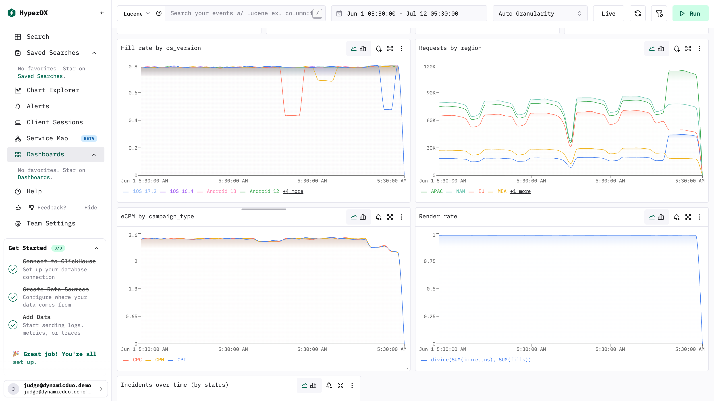
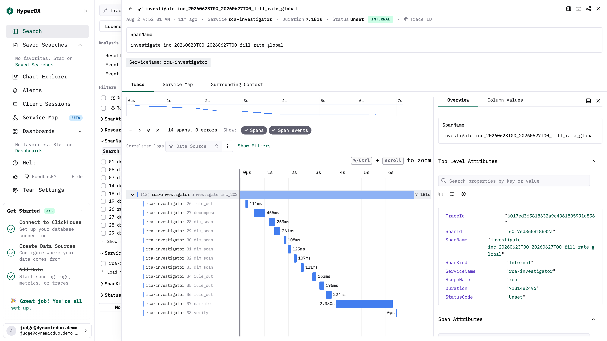

# Dynamic Duo — AdVerdict (InMobi track)

> **From alert to answer in seconds — every number computed by ClickHouse, every
> conclusion proven by a trace.**

| | |
|---|---|
| **Project** | **AdVerdict** — the automated root-cause analyst for the ad exchange. Every diagnosis it ships is a stored, digit-verified *verdict*. |
| **Team** | Dynamic Duo |
| **Track** | InMobi — "From alert to answer: the automated root-cause analyst" |
| **Members** | Nityananda Gohain ([@nityanandagohain](https://github.com/nityanandagohain)) · Srikanth Chekuri ([@srikanthccv](https://github.com/srikanthccv)) |
| **Hosted demo** | LibreChat: `https://civilization-surge-mature-additional.trycloudflare.com` · HyperDX: `https://episodes-constantly-alice-grammar.trycloudflare.com` *(tunnel from the demo machine — ping us if it's asleep)* |
| **Demo video** | [Loom walkthrough](https://www.loom.com/share/5bd585ff8ccb4206b0c4e05244c48044) |
| **Demo login** | LibreChat: `judge@dynamicduo.demo` / `Judge-DDuo-26!x31d0a9` · HyperDX: `judge@dynamicduo.demo` / `Judge-DDuo-26!x31d0a9` |
| **HyperDX deep links** | ⚠ the data window is **Jun 1 – Jul 12 2026** — the default "Last 1h" range shows nothing. [RCA Overview dashboard (range pre-set)](https://episodes-constantly-alice-grammar.trycloudflare.com/dashboards/6a6ec307aa28a0eaf7c900f5?from=1780272000000&to=1783814400000&isLive=false) · [Investigation traces (last 24 h)](https://episodes-constantly-alice-grammar.trycloudflare.com/search?source=6a6ec307aa28a0eaf7c900f4&isLive=false) — or pick source **Traces**, range **Last 1 day** |

## What it does

A user sees ad-exchange incidents in LibreChat, asks about one, and the system
presents the stored root-cause diagnosis — or drills any ad-hoc (metric, window,
scope) **live**. The "why" is never the chat model's opinion: it is the output of a
fixed, deterministic q1–q6 ClickHouse query sequence, guard-railed so that every
figure in the narrative provably exists in the query results, with the full
step-by-step trace (hypothesis, exact SQL, result rows, decision) queryable in chat
("how do you know?") and browsable in HyperDX.

- **Detection**: per-series profiling + a five-model ensemble scored in SQL, three
  gates from measured noise floors, classification by model *disagreement* — weekend
  dips become recorded `ruled_out_seasonal` verdicts, not silence and not pages.
- **Attribution**: revenue-identity decomposition → contribution-weighted dimension
  sweeps → confounder elimination → Kitagawa mix-shift gate → peer comparison for
  history-free slices.
- **Trust**: `numbers_verified` guardrail, deterministic template fallback, immutable
  trace tables. Humans may *trigger* investigations; no human ever *authors* one.

## The unseen slice (release-day requirement)

Loaded and diagnosed with **zero code changes** — see
[`unseen_report/`](unseen_report/) for the system-generated diagnoses and the
**full traces**: [`TRACE_FLAGSHIP.md`](unseen_report/TRACE_FLAGSHIP.md) renders
the headline investigation step by step (hypothesis, exact SQL, result rows,
decision), and all 193 step rows for the 11 incidents are exported from
`rca.investigation_steps` in
[`traces_investigation_steps.jsonl`](unseen_report/traces_investigation_steps.jsonl)
with the stored verdicts in [`diagnoses.jsonl`](unseen_report/diagnoses.jsonl).
Headlines the system produced on its own:

- **Fill-rate trench, Jul 8–9** → **iOS 17.5** named as the driver (verdict
  `INTERACTION` with its own device family — the OS and its handsets are
  near-duplicates), fill ≈0.79 → ≈0.48 in-segment, recovered Jul 10.
- **eCPM format swap, Jul 9** → video and rewarded trade price levels (≈∓30/25%),
  other formats flat — surfaced in the ledger and the eCPM drill-downs.
- Boundary-hugging scoped alerts identified as **dimension-regeneration artifacts**
  (the unseen dims reuse IDs with new attributes) — several were auto-classified
  `ruled_out_seasonal`, and the caveat is documented rather than papered over.

## For the judges — where each criterion lives

| Criterion | Look at |
|---|---|
| ClickHouse & OSS stack | Detection ensemble and the q1–q6 drill-downs are pure SQL ([`source/detector/`](source/detector/), [`source/sql/agent/`](source/sql/agent/)); MV cascade + SummingMergeTree rollup ([`source/sql/`](source/sql/)); ClickStack wired and screenshotted below; LibreChat is the product surface with two MCP servers |
| Problem fit | The hosted demo: *"What incidents are there?"* → *"Why did fill rate drop June 23–25?"* → *"How do you know?"* |
| Technical implementation | [ARCHITECTURE.md](ARCHITECTURE.md) · digit-for-digit guardrail ([`source/detector/guardrail.py`](source/detector/guardrail.py)) · idempotent re-runs · planted-oracle regression fixture ([`source/EDGE_CASES.md`](source/EDGE_CASES.md)) |
| Innovation | Classification by model *disagreement* · confounder elimination with printed residuals · publication blocked on one unverified digit · a run-scoped trace id on every diagnosis |
| Scalability & impact | Rollup makes detection cost ∝ series × hours, not events; a new metric is a whitelist row, not a redesign ([ARCHITECTURE.md](ARCHITECTURE.md), last section) |
| Presentation | [pitch-deck.pdf](pitch-deck.pdf) · [the video](https://www.loom.com/share/5bd585ff8ccb4206b0c4e05244c48044) · this README |

## Architecture

See [ARCHITECTURE.md](ARCHITECTURE.md) (1½ pages).

### ClickStack evidence

Investigation spans flow from the runner through the in-stack OTel collector
(`source/librechat/docker-compose.yml`, wired by `source/librechat/wire_traces.sh`)
into the stack's ClickHouse (`default.otel_traces`); the seeded **RCA Overview**
dashboard (`source/librechat/hyperdx-seed.js`) reads the same `rca.metrics_hourly_by_dim`
rollup the investigator queries. The demo ledger itself lives in our ClickHouse
Cloud service (ap-south-1). Both are live behind the hosted demo links above.





More in [`screenshots/`](screenshots/).

## How we built it

**ClickHouse Cloud** is the primary datastore and the analytical engine — the MV
cascade, five-model detection ensemble, and the fixed q1–q6 attribution sequence
are all SQL. **LibreChat** is the product surface (agent + two MCP servers:
our ~90-line `rca-mcp` and the official `mcp-clickhouse` on a SELECT-only user);
**ClickStack** carries the traces and the ops dashboard. LLMs: the chat agent runs
OpenAI `chat-latest` (the current ChatGPT-Instant model — function calling for the
MCP tools, no reasoning tax), and the narrator runs `gpt-5-nano` with minimal
reasoning, because it only turns a finished evidence bundle into a paragraph — a
digit-for-digit guardrail blocks anything it can't back. Python glue is
stdlib-only (urllib); no LangChain, no ORM.

## How to run it

```bash
cd "Dynamic Duo/source"                # the submission is self-contained
cd librechat && cp .env.example .env   # set OPENAI_API_KEY (or run keyless on templates)
cd .. && ./clean_run.sh --yes          # wipe → boot → load → (one wizard moment)
./investigate.sh                       # profile → sweep → diagnose every dataset
```

(The same tree lives at
[nityanandagohain/ch-hackathon](https://github.com/nityanandagohain/ch-hackathon).
To add a fresh slice later: `./load.sh --events <file.parquet> --dataset unseen &&
./investigate.sh` — exactly what we ran on release day.)

Full walkthrough with expected numbers at every stage: `CLEAN_RUN.md`. Golden-question
checklist for the chat surface: `librechat/GOLDEN_QUESTIONS.md`. Edge-case regression
fixture (mechanisms the dev data never contained, scored against a planted oracle):
`EDGE_CASES.md`.

## Repository layout

Full source ships in [`source/`](source/) (a mirror of the repo at submission
time); paths below are relative to it.

| path | what |
|---|---|
| `sql/00–07,99` | schema, MV cascade, dictionaries, read-only user, load validation |
| `sql/agent/` | the fixed q1–q6 drill-down queries (validated record included) |
| `detector/` | profiling + ensemble scoring SQL, sweep, tracing, guardrail |
| `agent/` | the deterministic runner, whitelist, multi-provider narrator, prefill |
| `rca_mcp/` | custom MCP server (list_incidents / investigate / investigate_window) |
| `librechat/` | compose stack (LibreChat, HyperDX, collector, MCP sidecars), agent instructions |
| `tools/` | edge-case generator + oracle scorer / release-day report runner |
| `unseen_report/` | **the unseen-slice submission bundle** (diagnoses + SQL + traces) |
