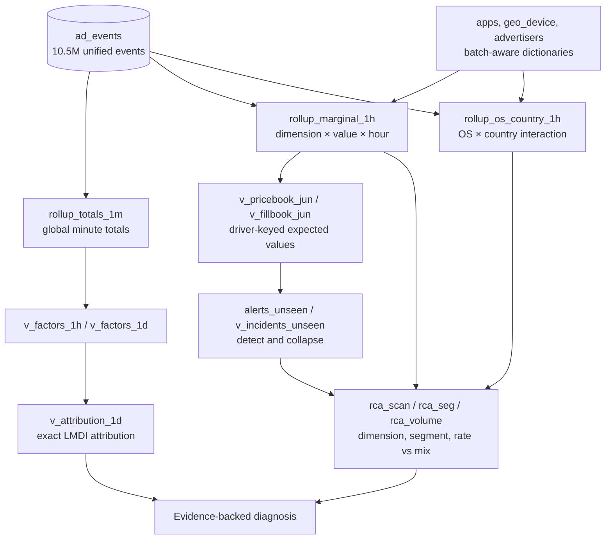

# InMobi Revenue RCA — Architecture

Fastlane is a ClickHouse-first automated root-cause analysis pipeline for
mobile-ad revenue. It detects anomalies as events land, identifies the affected
factor and segment, distinguishes a rate fault from traffic-mix movement, and
returns evidence that can be reproduced from SQL.

## Revenue identity

```text
Revenue = Requests × Fill rate × Render rate × eCPM / 1,000
```

Fill rate is `fills / requests`, render rate is `impressions / fills`, and eCPM
is revenue per thousand impressions. Every revenue investigation is decomposed
through these four factors.

## Pipeline



Data lands once in the raw fact table. Materialized views build the rollups and
downstream analysis on insert; there is no nightly batch. The explanatory views
read rollups rather than repeatedly scanning raw events.

## Data model decisions

| Component | Why it exists |
|---|---|
| `ad_events` | Single source of truth, partitioned by month and ordered for hour-range reads. |
| Dictionaries over dimensions | O(1) in-memory lookup within materialized views. |
| `rollup_totals_1m` | Dimension-free totals for global revenue-factor analysis. |
| `rollup_marginal_1h` | One row per `(dimension, value, hour)` using `ARRAY JOIN`; it avoids a full nine-dimensional cube. |
| `rollup_os_country_1h` | A targeted cross for real OS/geography interaction faults. |
| `v_pricebook_jun` / `v_fillbook_jun` | Median, driver-keyed baselines for expected eCPM, fill, and render rates. |
| `alerts_unseen` / `v_incidents_unseen` | Raw threshold breaches and their collapse into root-cause candidates. |

The marginal rollup scales with the sum of dimension cardinalities rather than
the product of all dimensions. The only precomputed two-way cross is OS ×
country, where interaction faults are operationally meaningful.

## Detection and attribution

### LMDI revenue decomposition

```text
L = (revenue₁ - revenue₀) / ln(revenue₁ / revenue₀)
contribution(factor) = L × ln(factor₁ / factor₀)
```

LMDI makes the four factor contributions add to the measured revenue delta with
no unexplained interaction residual.

### Rate versus mix

```text
rate effect = (weight₀ + weight₁) / 2 × (metric₁ - metric₀)
mix effect  = (metric₀ + metric₁) / 2 × (weight₁ - weight₀)
```

The rate effect indicates the segment itself changed. The mix effect indicates
traffic shifted between segments with different normal performance. The two
produce very different operational diagnoses.

### Concentration and incident collapse

`rca_scan` ranks all nine dimensions by concentration. A score near zero means
the movement is uniform across that dimension; a high score means one segment
owns the movement. When two dimensions are highly concentrated, the pipeline
tests their cross.

`v_incidents_unseen` retains the leading alert within each day and metric as the
root cause, reporting related hits as bleed-through. An overlapping bucket moves
when a large segment fault happens; that is consistency evidence, not a new
incident.

### Noise models

- Fill and render rates use binomial standard error with overdispersion
  adjustment (`φ = 1.6`).
- eCPM uses relative deviation against a 0.5% noise floor.
- Requests use a same-day-type median and MAD detector, which catches uniform
  ingestion gaps even when rates remain normal.

## Regenerated-dimension handling

The unseen bundle retains stable IDs but regenerates dimension labels. Volume
belongs to an entity ID, while a price belongs to the current market label.
Using only old or only new labels creates false alerts.

The pipeline keeps both dimension snapshots and selects the appropriate one for
each event:

```sql
if(event_time < '2026-07-06', dict_*_v1, dict_*)
```

It baselines drivers rather than raw segments:

| Metric | Expected-value driver |
|---|---|
| `fill_rate`, `render_rate` | `publisher_tier × ad_format` |
| `ecpm` | `country × ad_format` |
| Volume and mix | Stable entity ID |

Expected value is the observed events in each driver cell multiplied by its
baseline rate. Reweighting to observed mix means a segment alerts only when its
own rate changes.

## Reproducibility

Run the SQL in order:

1. [`u01_schema.sql`](schemas/u01_schema.sql) — database, dimensions, and facts.
2. [`u02_pipeline.sql`](schemas/u02_pipeline.sql) — dictionaries, rollups, and materialized views.
3. [`u03_baselines.sql`](schemas/u03_baselines.sql) — driver baselines and expected values.
4. [`u04_alerts.sql`](schemas/u04_alerts.sql) — detection and incident collapse.
5. [`u05_rca_scan.sql`](schemas/u05_rca_scan.sql) — drill-down and rate/mix split.

Load dimensions before events. If views are created after data is loaded,
backfill them deliberately: materialized views only process rows inserted after
they exist.

```sql
SELECT * FROM `inmobi-hari`.v_incidents_unseen;

SELECT * FROM `inmobi-hari`.rca_scan(
  test_from = '2026-07-08', test_to = '2026-07-09',
  base_from = '2026-07-06', base_to = '2026-07-07',
  metric = 'fill_rate'
);

SELECT * FROM `inmobi-hari`.rca_seg(
  test_from = '2026-07-09', test_to = '2026-07-10',
  base_from = '2026-07-06', base_to = '2026-07-07',
  metric = 'ecpm', dim = 'ad_format'
);
```

See [README-real.md](README-real.md) for onboarding and the full
dimension-snapshot method, and [DIAGNOSIS.md](DIAGNOSIS.md) for the unseen
incident diagnoses and complete findings.
