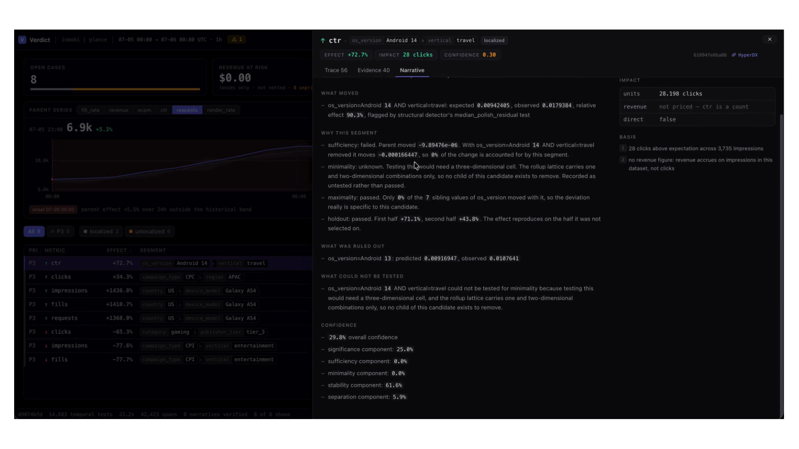
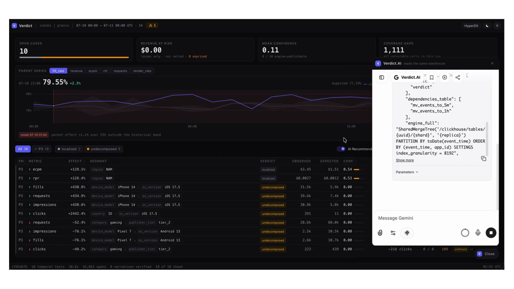
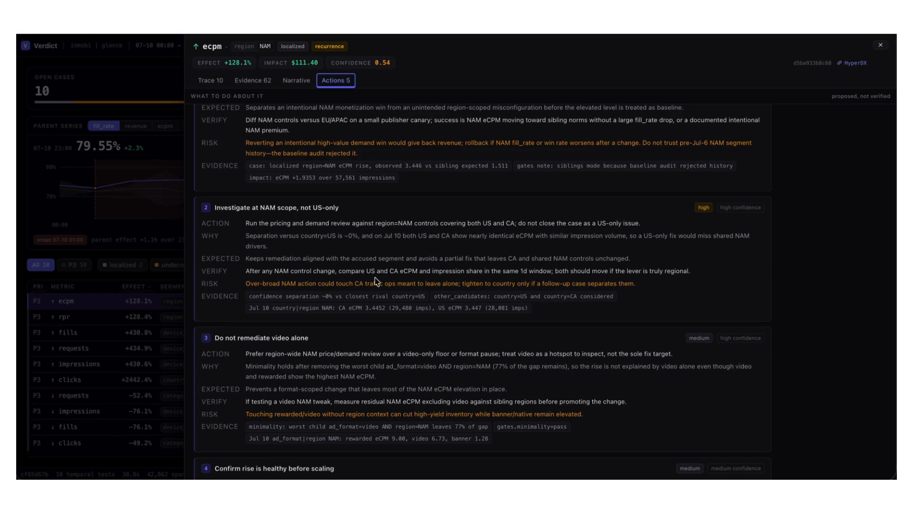

# Verdict

An autonomous investigator agent for ad-tech metrics, built on ClickHouse.

When a metric moves, Verdict finds the segment responsible, proves the claim by removing that
segment and showing the parent metric returns to normal, publishes what it ruled out and why,
and attaches a confidence score you can audit line by line. A language model writes the prose.
It does not decide anything: switch it off and every number in every case file is identical.

Built for the ClickHouse Click-a-thon 2026, InMobi "Automated Root-Cause Analyst" track.

---

## The problem with the obvious approach

Rank every segment by how far it moved, report the worst one. This fails in three ways that
matter, and all three are present in the hackathon dataset.

**It reports passengers as drivers.** When Android 15 fill rate collapses, every device model
that skews Android 15 also drops. Galaxy S23 shows a large, statistically significant decline.
It is not the cause; it is downstream of the cause. Ranking cannot tell the two apart because
both look identical from the top.

**It cannot see interactions.** One incident here only exists at the intersection of APAC and
iOS 18.1. Viewed one dimension at a time, APAC looks mildly off and iOS 18.1 looks mildly off,
and neither clears a sensible threshold. The cause is invisible to any one-dimensional scan.

**It cannot see compensating pairs.** Another incident moves eCPM down for one ad format and
up for another by almost exactly the offsetting amount. Every aggregate stays flat. A detector
watching totals sees a perfectly healthy system.

Verdict addresses these with an explain-away test rather than a ranking, two complementary
detectors rather than one, and a published ledger of what it cleared rather than silence.

---

## Quick start

You need a ClickHouse Cloud service and the hackathon dataset.

```bash
git clone https://github.com/satya2908/clickathon_in_mobi_solution
cd clickathon_in_mobi_solution
cp .env.example .env        # fill in CLICKHOUSE_HOST / CLICKHOUSE_PASSWORD
```

### With Docker

```bash
./stack.sh up                                 # product: console, chat, tracing, MCP
docker compose exec verdict verdict schema apply
docker compose exec verdict verdict load
docker compose exec verdict verdict investigate --start 2026-07-05 --hours 24
```

Then open the console. Run `./stack.sh` with no arguments for the interactive menu; `down`,
`status`, `logs [SERVICE]`, and `rebuild` are also available as non-interactive commands.

Cursor-generated next actions are an optional capability, not a product dependency. Add
`CURSOR_API_KEY` to `.env`, then start both stacks with one command:

```bash
./stack.sh up --with-ai
```

This activates the Compose `recommendations` profile and exposes the UI control, but leaves that
control switched off until a user opts into model usage. A normal `./stack.sh up` does not build
the Cursor image, hides the control, blocks the recommendation API, and stops an agent left over
from an earlier AI-enabled run.

| Surface | Where | What it is |
|---|---|---|
| Console | <http://localhost:3000> | cases, evidence, investigation traces |
| Verdict.AI | bottom-right of the console | chat, with a SQL tool on the same tables |
| LibreChat | <http://localhost:3080> | the same chat, full window |
| MCP server | <http://localhost:8001/sse> | the SQL tool, on its own, for any MCP client |
| HyperDX | hosted, with ClickHouse Cloud | every investigation as a distributed trace |

Ports are overridable — `WEB_PORT`, `LIBRECHAT_PORT`, `MCP_PORT`, `HYPERDX_UI_PORT`, and
`CURSOR_AGENT_PORT` (only in AI mode).

Traces go to the collector, which writes them to ClickHouse, and the HyperDX that ships with
ClickHouse Cloud reads them from there — so the default needs no extra container. To run
ClickStack locally instead, start the profile and repoint the console at it:

```bash
docker compose --profile selfhosted up -d
NEXT_PUBLIC_HYPERDX_URL=http://localhost:8080     # in .env, then rebuild web
```

### Without Docker

```bash
uv venv && uv pip install -e ".[dev]"
set -a && source .env && set +a
verdict config check                          # validates config, touches no network
verdict schema apply
verdict load --data-dir ../hackathon_dataaset/InMobi/data
verdict investigate --start 2026-07-05 --hours 24
```

`verdict investigate` takes `--grain 5m|1h|1d`, `--metric` (repeatable), `--no-llm` to force
template prose, and `--no-persist` to investigate without writing anything.

---

## What a run does

Five stages, one span each, all of them recorded. `verdict investigate` on a 24-hour window
takes a few seconds and writes a case file per finding.

### Latency

Measured against ClickHouse Cloud in `ap-south-1` from a laptop, so every figure below includes
real WAN round trips rather than a loopback socket. Ingest is a Parquet file on disk becoming
queryable rollups; the materialized views build `rollup_5m`, `rollup_1h` and `rollup_1d` on the
way in, so there is no separate aggregation step to wait for. Analyse is all ten metrics over
the full 1-way and 2-way lattice, including localization, the holdout re-test, and writing every
case, candidate, trace step and coverage row back.

| Batch | Ingest | Analyse and persist | End to end |
| --- | --- | --- | --- |
| 1 hour (10.7k events, 152 KiB) | 0.6s | 2.8s | **3.4s** |
| 24 hours (265k events, 2.1 MiB) | 3.2s | 2.9s | **6.1s** |
| Full corpus (9M events, cold load) | ~3 min | — | — |

Without the write-back — `--no-persist`, which is what a dry run or a what-if costs — analysis
of a 24-hour window is **1.9s**.

Almost none of that is ClickHouse. A 24-hour run issues about twenty queries totalling **107ms**
of server time, reading 44k rows; the slowest single query is 27ms. The wall clock is round
trips, at roughly 170ms each from here, of which 112ms is the TLS handshake. Running in the same
region would collapse these figures.

That is why nearly every optimization here is about *count* of queries rather than their cost.
The reader runs in `batch` mode by default (`clickhouse.read_mode`, or `CLICKHOUSE_READ_MODE`):
it reads the entire lattice — every combination, the window and all four baseline weeks — in one
query per run, and the holdout reads both half-windows for every candidate in two more. Cases,
candidates and trace steps are written one insert per table rather than per case, and the
recurrence back-link asks about a whole run at once. The alternative reader, `per_combo`, issues
a query per combination and exists to cross-check that the batching changed nothing; findings
from the two modes are identical, and a 24-hour window takes 42.9s that way against 1.9s this
way.

**Detect.** Two detectors that fail in different directions, which is the point of having two.
The *temporal* detector compares each cell against its own history — a robust baseline over
prior weeks, with overdispersion estimated rather than assumed, because ad traffic is nowhere
near Poisson and a binomial test on it reports everything as significant. It catches main
effects and needs history. The *structural* detector compares each cell against its siblings
in the same bucket, needs no history at all, and is the one that sees compensating pairs and
interaction-only incidents. A *confirmatory* pass re-tests what either one proposes.

Multiple testing is real here: a 1-way and 2-way lattice over this dataset is tens of
thousands of simultaneous tests per metric per bucket, so p-values go through
Benjamini-Hochberg. Cells too small to resolve the effect are not tested and not silently
dropped — they go to the coverage ledger with the reason and the smallest effect they could
have detected.

**Localize.** Candidates are not ranked. Each is subjected to counterfactuals that can fail:

- *Sufficiency* — remove the candidate from the parent. Does the parent return to
  expectation? This is the explain-away test, and it is what separates a driver from a
  passenger, because removing Galaxy S23 does not repair Android 15.
- *Minimality* — remove the candidate's guiltiest child. Does the candidate still deviate? If
  not, the answer is the child, and reporting the parent is a true statement that is too broad
  to act on.
- *Maximality* — do the candidate's siblings move too? If they do, the cause is the parent.
- *Holdout* — split the window in half. Does the effect reproduce in both? An effect present
  in one half is a spike with a story attached.

### Rates or traffic

A fill rate falling from 75% to 68% has two entirely different explanations. Either a segment
started failing to fill, which is an incident and someone's integration is broken, or every
segment is filling exactly as well as it always did and more of the traffic arrived at the
segment that was always worse, which is a demand-mix story and not a fault at all.

The counterfactual cannot tell these apart. Removing the segment repairs the parent whether
that segment broke or merely grew, so a system that only measures each segment's own rate
movement will report the second as the first — and page the wrong team.

So the movement is decomposed. Writing an aggregate ratio as a weighted mean of its segments'
own rates, `R = Σ wᵢrᵢ`, the change between baseline and observed splits exactly three ways:

| Term | What it is |
|---|---|
| Rate | `Σ wᵢ⁰(rᵢ¹ − rᵢ⁰)` — rates moved, traffic shares held at baseline |
| Mix | `Σ (wᵢ¹ − wᵢ⁰)(rᵢ⁰ − R⁰)` — shares moved toward segments whose rates already differed |
| Interaction | `Σ (wᵢ¹ − wᵢ⁰)(rᵢ¹ − rᵢ⁰)` — both moved together |

The identity is exact, not a first-order approximation, and the three sum to the observed
movement. Interaction is kept visible rather than distributed across the other two as LMDI
would, because a large interaction term is itself the finding: rate and mix moved together and
no clean attribution exists.

On the Android 15 fill incident this reports −0.0343 of a −0.0344 movement as within-segment
rate and essentially nothing as mix — the right answer for a genuine outage, now demonstrated
rather than assumed. The split appears as its own step in the investigation trace.

**Score.** Confidence is a weighted reading of five components — significance, sufficiency,
minimality, stability, separation — each published with the number, the weight, and a sentence
saying what it measured. A component that could not be tested scores nothing and says so
rather than defaulting to a value; the weights renormalise around it. There is no model in
this path. The same inputs give the same score.

**Narrate.** A language model writes the prose from a bundle of already-computed figures.
Every number in the draft is checked against that bundle, and a draft containing a figure that
is not in it is rejected and replaced with the template. Prose is presentation, never
evidence: `--no-llm` changes the wording and nothing else.

**Publish.** Case, candidates (including every cleared one and why), per-step trace, and
coverage gaps go to ClickHouse, and the trace also goes to HyperDX over OTLP.

### What one run produces

A single 24-hour run over 2026-07-05, all ten metrics, on the 9M-event corpus:

| | |
|---|---|
| Cells tested | 14,683 across 10 metrics |
| Findings surviving Benjamini-Hochberg | 159 |
| Cases opened | 7 — one localized, six unlocalized |
| Candidates evaluated | 287 |
| Coverage gaps recorded | 3,421 |

The candidate outcomes are the interesting part, because they are overwhelmingly refusals: 174
rejected as too narrow, 45 as too broad, 42 moving the wrong way, 20 partial, 4 that did not
reproduce across the holdout, 1 immaterial. **One** survived every counterfactual and was
accused. A detector that accepted its first plausible answer would have reported any of the
other 286.

Six of the seven cases are published as *unlocalized*: something moved, nothing survived the
counterfactuals, and saying so is the honest result rather than naming the least-implausible
segment.

The coverage ledger is larger than the case list by three orders of magnitude, and that ratio
is the point — 2,638 cells were below the floor at which their own denominator could resolve a
5% change, 747 had a non-positive value that log-space cannot represent, and 36 had no sampling
model. See [Where this is weak](#where-this-is-weak) for what that floor means in practice.

---

## The unseen incident bundle

A sealed slice of the same universe, released in the final hours: five days of new events with
anomalies nobody had seen. What follows is everything the system produced for it, including the
part it got wrong.

### What arrived

| File | Size | Contents |
|---|---|---|
| `ad_events.parquet` | 14.4 MiB | 1,500,000 events, 2026-07-06 to 2026-07-10 |
| `geo_device.csv` | 178.6 KiB | 5,000 geo/device profiles |
| `apps.csv` | 49.6 KiB | 2,000 apps |
| `advertisers.csv` | 10.3 KiB | 500 advertisers |

14.7 MiB in total, picking up the day after the 9M-event build corpus ends. All five days are
weekdays, which matters later. The three CSVs ship through Git LFS and arrive as 130-byte
pointer stubs unless fetched through the media endpoint — the exact failure the loader's LFS
guard exists to catch, met in the wild for the first time.

### The trap in the dimensions

The dimension tables carry the **same IDs with regenerated attribute values**. Only 147 of 2,000
app rows, 26 of 500 advertiser rows and 18 of 5,000 geo/device rows are unchanged. Since the
rollups denormalize `region`, `os_version` and the rest at insert time, every historical rollup
row encodes the *old* meaning of every segment, and the history has to be re-rolled under the
new dimensions before any comparison is like-for-like.

Doing that is not cosmetic. It is the difference between a baseline and noise:

| Attribution | What the five regions do across the boundary |
|---|---|
| Both periods under the new dimensions | +5.0%, +5.2%, +5.3%, +5.4%, +5.5% |
| History left under the old dimensions | −37.7%, −30.1%, −10.2%, +39.5%, +122.5% |

The first column is the growth trend the release notes promised, recovered exactly.
`ad_format` — the one grouping that comes off the event rather than a dimension table — moves
+4.7% to +5.6% either way, which is the control that confirms the reading.

### A bug this found: dictionary staleness on a multi-node service

The first ingest produced rollups that reconciled perfectly against raw and were entirely
misattributed. ClickHouse Cloud served this project on **two nodes**; `SYSTEM RELOAD DICTIONARY`
is node-local; the append landed on the node that had missed the reload, and the materialized
view resolved every dimension through a dictionary still holding the previous load. Row counts
matched at all three grains. Every segment named the wrong population.

Verification now reloads `ON CLUSTER` and compares each node's dictionary against the table it
was built from, because "the dictionary is loaded" and "the dictionary is loaded with the right
thing" are different claims and only the second one matters. The old check asserted the lookup
was non-empty, which a stale dictionary passes trivially.

### Cost of the run

| Stage | Time |
|---|---|
| Ingest 1.5M events onto the live 9M corpus, queryable at all three grains | **22.4s** (66,976 events/s) |
| Analyse one day, ten metrics, full lattice, no write-back | **2.9 – 3.4s** |
| Analyse all five days as one 120-hour window | **3.7s** |
| Analyse one day, with narration and full persistence | 51.0 – 58.6s |
| Full corpus rebuild after the dimension reload (10.5M events) | 215s |

Ingest is the number that matters for "new data lands": the rollups the detectors read contain
the batch 22.4 seconds after the file does, verified by reconciling raw against `rollup_5m`,
`rollup_1h` and `rollup_1d` for the batch window. The 51–59s figure is almost entirely the
language model writing prose for a dozen cases; the analysis inside it is the 3s one.

### What it produced

Five daily runs over 2026-07-06 to 2026-07-10:

| | |
|---|---|
| Cells tested | 73,665 across 10 metrics |
| Cases opened | 70 — 43 localized, 27 unlocalized |
| Candidates evaluated | 2,846 |
| Trace steps recorded | 3,654 |
| Coverage gaps recorded | 7,982 |
| Narratives verified against the computed bundle | 57 |

### The diagnosis, and the miss

The aggregate signal is unmistakable and needs no model to see: overall fill rate runs 0.7930,
0.7941, then **0.7314, 0.7324**, then back to 0.7935. Something broke on 8–9 July and recovered.

The true cause is **`os_version = iOS 17.5`**, and the evidence is a query anyone can rerun:

```sql
SELECT
  round(sumIf(fills,    toDate(bucket) IN ('2026-07-08','2026-07-09'))
      / sumIf(requests, toDate(bucket) IN ('2026-07-08','2026-07-09')), 4) AS incident,
  round(sumIf(fills,    toDate(bucket) IN ('2026-07-06','2026-07-07','2026-07-10'))
      / sumIf(requests, toDate(bucket) IN ('2026-07-06','2026-07-07','2026-07-10')), 4) AS normal
FROM rollup_1d
WHERE combo = 'os_version' AND key_a = 'iOS 17.5' AND bucket >= '2026-07-06'
```

`0.4772` against `0.7957` — a **40.0% relative collapse** over 115,642 requests. Every finer
crossing of iOS 17.5 lands between −39.4% and −40.5%: by publisher tier (−40.5, −39.8, −40.2),
by ad format (−40.4, −39.9, −39.4), by region, country and category alike. That uniformity is
the signature of a single-dimension cause, and it makes iOS 17.5 both minimal and complete.

**The pipeline did not name it for fill rate.** It reported `publisher_tier = tier_3` at −24.4%
on both days. It did reach `os_version = iOS 17.5` on 9 July through RPR, so the segment was
within the lattice and testable — the fill-rate call specifically went to a passenger.

The cause of the miss is measurable rather than mysterious. Across the June/July boundary:

| Per app, June versus July | Correlation |
|---|---|
| Request volume | **1.00** |
| Fill rate | **−0.05** |

Entity popularity carries across the boundary exactly; entity *behaviour* was redrawn along with
the dimension attributes. So historical baselines remain sound for counts and for global
aggregates, and are meaningless for segment-level rates — and the detector trusted them anyway.
`publisher_tier = tier_3` averaged 0.82 in June and 0.67 across every normal July day, so its
June baseline manufactured a 24% deficit that had nothing to do with the incident.

The existing holdout cannot catch this. It splits the window and re-tests both halves, but
compares both against the *same* baseline, so it validates the selection rather than the
baseline. Work is in progress on baseline selection by backtest: score each candidate baseline
on held-out normal periods, use whichever actually predicts, and refuse to localize a rate when
none of them do. That is a general safeguard rather than a rule fitted to this release — on the
build corpus it keeps the weekly-aligned baseline unchanged.

Nothing in the codebase encodes anything learned from this release. The two fixes it produced —
a case must quote a test of its own metric, and dictionaries must be verified per node — are
both defects that predate it and would corrupt any dataset.

---

## The console

`http://localhost:3000`. Four things you can do with a case:

- **Trace** — every step of the investigation as a tree or a waterfall, each node carrying
  what it did, why it did it, what it concluded, and the SQL it ran. The waterfall is drawn
  from recorded start offsets, so the gaps are real gaps.
- **Evidence** — the confidence breakdown component by component, and the full candidate table
  with each rejection and its reason.
- **Narrative** — the prose, with its impact figures alongside it.
- **Actions** — optional. Off by default; see below.

Cases carry a priority derived from impact and confidence, and impact is left explicitly
unpriced for count metrics rather than being rounded to zero dollars.

### Actions

Actions have two independent gates. The deployment must be started with
`./stack.sh up --with-ai`; otherwise the control is absent and the server rejects recommendation
API requests. Even in AI mode, the user-facing toggle defaults off so merely running the
container cannot spend model quota.

When the toggle is enabled, each case is sent to the bundled Cursor CLI service twice: once to
draft steps, and once more, in an isolated session, to review the draft against the same evidence
and drop what it cannot support. Both passes are advisory and labelled as such. The pipeline's
verdicts do not depend on them.

The service lives in `services/cursor-cli-agent/`, runs non-root with a read-only source view,
dropped capabilities, a bounded job store, and a read-only ClickHouse MCP allow-list. Set
`CURSOR_SERVICE_API_TOKEN` in `.env` to require a bearer token between the Next.js server and the
agent; the token is never sent to browser JavaScript.

---

## Verdict.AI and MCP

The console has a chat bubble backed by LibreChat. It has one tool: SQL against the same
tables the detectors read, over the official ClickHouse MCP server. It is attached by default
and pinned in the composer, because a chat that quietly stops consulting the database and
answers from memory is worse than no chat.

The server is told about the schema before its first query — that rollups hold counters and
never rates, how the `combo`/`key_a`/`key_b` keying works, which tables hold pipeline output,
and that the coverage ledger exists and a segment missing from `cases` was not necessarily
innocent. It is also told to show its SQL, so anything it says can be checked.

One protocol note worth recording, because it cost an afternoon. Everything else in this
project reaches Gemini through its OpenAI-compatible endpoint, so the pipeline and the chat
share one wire format and the provider can be changed by editing a URL. That does not survive
tool use: Gemini attaches a `thought_signature` to every function call and rejects the
following turn unless it is echoed back, and the field rides in `extra_content`, which has no
place in the OpenAI schema and is dropped in translation. Identical requests, measured
directly against the API, return 200 with the signature and 400 without it. No model setting
avoids it. So the chat spec alone uses LibreChat's native Google provider, which has somewhere
to put the field.

### From other MCP clients

The server is published on `localhost:8001` and speaks SSE, so anything that speaks MCP can
use it. For Cursor, `.cursor/mcp.json` is in the repository and needs no edit:

```json
{ "mcpServers": { "verdict-clickhouse": { "url": "http://localhost:8001/sse" } } }
```

---

## Tracing

Every run emits OpenTelemetry spans to the collector, which writes them to ClickHouse, where
HyperDX renders them. Cases store their `trace_id`, so the console deep-links each case to its
own trace — with the time range already set, because HyperDX otherwise opens on Live Tail and
finds nothing, which reads as a lost trace rather than as the wrong hour.

The same steps are also written to `case_steps` as first-class rows, and the console reads
those. The investigation view therefore works whether or not anyone is running the
observability stack: HyperDX is where you go to see one run against everything else happening
at the time, not a dependency of being able to read a case.

---

## Configuration

Behaviour lives in `config/*.yaml`; credentials live in the environment. The YAML holds
`${VAR}` placeholders resolved at load time, so the same file is valid unchanged as a local
file, a Docker bind mount, or a Kubernetes ConfigMap, with secrets arriving separately.

| Placeholder | Meaning |
|---|---|
| `${VAR}` | required, startup fails naming the missing variable |
| `${VAR:-default}` | falls back when unset **or** empty |
| `${VAR-default}` | falls back only when unset |

`verdict config check` validates everything without connecting anywhere, and doubles as the
container healthcheck so a broken ConfigMap shows up as an unhealthy container rather than as
a run that dies partway through.

Two settings are worth knowing about before you touch them:

- **`retention.enforce`** defaults to `false`. The day counts describe production intent, but a
  historical dataset is by definition older than a 7-day raw TTL, so enabling this on an
  analysis corpus instructs ClickHouse to delete all of it on the first background merge.
- **`llm.enabled`** can be `false` at any time. Prose degrades to a template; no number changes.

---

## Data model

Nothing stores a metric. Rollups store additive counters and every metric is divided out at
read time. This is not a stylistic preference: a stored fill rate cannot be re-aggregated,
because averaging hourly fill rates only reproduces the daily fill rate if every hour carried
identical traffic, which never happens. Storing counters makes a rollup row mean the same
thing at every grain and in every combination.

Rollups hold a **1-way and 2-way lattice** in long form — `(bucket, combo, key_a, key_b,
requests, fills, impressions, clicks, revenue)`, where `combo` names the keying
(`region`, `region|os_version`, or `__all__`). The alternative, one row per full dimension
tuple, was measured on the real dataset and rejected: it compresses 9M events to 7.9M rows at
hourly grain, a pointless 1.14x, because dimension cardinality is high relative to event
volume. The lattice gives 6.4x hourly and 150x daily. The cost is that three-way interactions
are out of reach, which is a stated limit rather than a hidden one.

All 46 combinations are produced by a single `ARRAY JOIN` inside one materialized view. Using
46 separate views would be 46 chances for the streaming path and the backfill path to define a
bucket boundary differently, and any such disagreement appears in the data as a step change
indistinguishable from a real incident.

Grains chain 5m → 1h → 1d, each a `SummingMergeTree` with its own retention. Chaining views
off a summing table is safe because a view sees pre-merge blocks, and a sum of partial sums is
the total.

### Which slices are legal

`advertiser_id` is empty on unfilled requests, so `vertical` and `campaign_type` exist only on
filled events. Slicing **fill rate** by `campaign_type` therefore returns 1.0 for every value:
the denominator has quietly become "filled requests". A naive scan reports that as a clean and
confident finding, and it is entirely an artefact.

Rather than hand-listing the illegal pairs, each dimension records the funnel stage at which it
becomes known and each metric records the stage of its denominator population. A slice is legal
only when every row the metric counts actually carries the dimension. Run `verdict config
matrix` to see the derived result and the reason behind each refusal.

---

## Verification at load time

Two failure modes here are quiet enough to corrupt every downstream conclusion while every
command still reports success, so the loader checks for both:

- A dimension CSV that is really a **Git LFS pointer stub**. It parses as valid CSV, the
  dictionary loads with three entries, every lookup returns `''`, and the entire lattice
  collapses to one empty-string segment. Every metric still computes; every answer is wrong.
- **Rollups disagreeing with the facts.** Each grain must reproduce the raw totals exactly, and
  each one-way combo must independently sum to the grand total. A lattice that is not a
  partition of the data produces statistics that are internally consistent and wrong.

Every glossary metric is also computed twice, once from raw events and once from the rollup,
and the two must agree. That makes the published formulas testable rather than aspirational.

---

## Testing against known answers

Accuracy on real data is unmeasurable, because nobody knows the true cause. `verdict inject`
plants synthetic incidents in a copy of the corpus and writes the answer key beside it, which
turns "does this look right" into a score.

The catalogue covers the three shapes that defeat ranking — a main effect with passengers
downstream of it, an interaction visible only at an intersection, and a compensating pair that
leaves every total flat — plus a high-cardinality segment, a slow drift that no
window-versus-window comparison can see, and a **clean** window with nothing planted in it at
all. That last one is the one that matters most: a detector is only as good as its willingness
to return nothing, and the clean case is the only test that can catch an invented incident.

The suite is 493 tests over the statistics, the counterfactuals, the rate/mix decomposition,
the confidence scoring, the schema, and the narration guard, and it runs in about four seconds
without touching the network.

```bash
pytest -q
```

---

## Where this is weak

An independent statistical audit was run against this corpus. Its findings are recorded here
rather than in a drawer, because a system that publishes a coverage ledger and then hides its
own limitations is arguing against itself. What follows is what was verified, what was fixed,
and what remains true.

### Fixed as a result

**The structural detector was silently disabled on low-rate metrics.** It sized its floor from
`min_relative_effect`, while the temporal detector sizes its floor against a near-total
collapse and argues at length why a threshold picked in advance is the wrong basis. At CTR's
1.09% base rate the old floor demanded ~827,000 impressions; a whole day of this corpus has
184,000 across every cell combined. Every structural CTR cell was therefore filed as
`below_detection_floor` — 44,713 ledger rows, and one CTR case in twenty-three runs. The two
detectors now agree, which halves the coverage ledger over a 24-hour window (3,421 gaps to
1,723) and changes the case count by one.

**Findings claimed a correction they had never been through.** `survives_correction` defaulted
to `True`, and only the temporal family goes through Benjamini-Hochberg, so every structural
finding reported that it had survived a procedure that was never run on it. Findings now carry
a `screening` field naming what actually happened — Benjamini-Hochberg, a fixed structural
threshold, or a post-hoc re-test of a cell the localizer had already chosen — and the
confidence component gives the right reason for capping each.

**Mix shift could be reported as segment degradation.** See [Rates or
traffic](#rates-or-traffic) below; this is now decomposed and published.

**A failed localization read as a clean window.** An exception during localization was logged
at warning level and skipped, so the run reported success with a shorter case list — and a case
that never appears is indistinguishable from a metric with nothing wrong. Failures are now
counted in the summary, listed before the case table, and recorded in the run status; the
all-clear prints only when the run earned it.

**A case could quote another metric's test.** A case takes its name from a finding and its
numbers from the localization, and the search for that finding matched on segment alone. Its
fallback pool is the whole sweep, so a segment that moved in two metrics could hand a fill-rate
localization the *requests* finding for the same cell — reaching ClickHouse as
`metric=requests, observed=0.599`, a request count of 0.6. The finding must now match the
localization's metric as well as its segment.

**Dictionary staleness silently misattributed a whole batch.** See [the unseen
bundle](#a-bug-this-found-dictionary-staleness-on-a-multi-node-service); reloads are now
cluster-wide and each node's dictionary is checked against its source table.

**The correction was sizing its family from the wrong number.** Benjamini-Hochberg needs the
count of hypotheses *tested*, not the count of p-values handed to it, and every threshold is
`alpha*k/m` — so understating `m` raises all of them at once. The sweep accumulated each
metric's findings and gaps by hand and left `tested_cells` behind, so the correction always
received zero and fell back to the number of findings. Latent while every tested cell yields a
finding, which is true under the shipped `detect_rises: true`, and silently permissive the
moment it is not. The sweep now merges results whole, and two tests pin the count.

### Known and unfixed

- **The baseline is never validated.** The detector assumes a trailing weekly-aligned history
  predicts the window under test and has no way to notice when it does not. On the unseen
  release, per-app fill rate correlated **−0.05** across the boundary while volume correlated
  **1.00**, and the stale baseline sent the headline fill-rate verdict to a passenger segment.
  The holdout does not cover this: it re-tests both halves of the window against the same
  baseline, so it validates selection, not the baseline. Baseline selection by backtest is in
  progress.

- **No trend model.** The baseline is a trailing seasonal level, so a persistent drift is
  partly absorbed into the thing it would have to be measured against. Global requests rose
  8.55% across four weekly steps here while sitting only 5.25% above their trailing baseline. A
  fixed-anchor drift guard was specified and never built; the settings for it have been removed
  rather than left in the config implying a capability that does not exist.
- **Sparse count tests are a normal approximation to a quasi-Poisson model** and are
  overconfident in the tail where expected counts are small. Counts also dominate the case
  list, 148 of 153 cases across all runs to date.
- **Continuous-ratio inference is heuristic.** eCPM, RPR and revenue use a median/MAD statistic
  against a Student-t tail, which is not the distribution that statistic follows. The rollups
  store no second moments, so a properly calibrated interval is not currently constructible.
- **Confirmed incidents are not masked out of future baselines.** At most one historical week
  is trimmed, so two contaminated weeks in the same aligned history survive it.
- **No iterative peeling.** Each group is localized once, so a dominant cause can mask a
  smaller concurrent one.
- **The holdout is not a true holdout.** Candidates are selected over the whole window and then
  checked on both halves, so the second half participated in selection.
- **High-cardinality dimensions are outside the lattice.** `app_id`, `advertiser_id` and
  `geo_device_id` have no rollup cell at any grain, and the largest single app carries 12% of
  requests. `verdict inject` plants an incident there specifically as an expected miss.

The honest summary is that counterfactual removal here is accounting attribution, not causal
identification. "This segment accounts for the movement" is supportable from what is computed;
"this segment caused it" requires a mechanism the data does not contain.

---

## Layout

```
src/verdict/
  detect.py structural.py   the two detectors, and dispersion estimation
  localize.py               the counterfactuals: sufficiency, minimality, maximality, holdout
  decompose.py              rate versus traffic mix, as an exact identity
  confidence.py             the five scored components
  narrate.py llm.py         prose, and the numeric guard that can reject it
  stats.py                  baselines, intervals, corrections
  inject.py injectcat.py    synthetic incidents and their answer key
  schema.py load.py db.py   ClickHouse DDL, loading, verification
  pipeline.py cli.py        stage orchestration and the command surface
  trace.py store.py         spans, and everything that gets persisted
web/                        the console (Next.js)
config/                     behaviour as YAML; also the LibreChat and collector config
artifacts/                  the architecture diagram, demo logs, unseen-bundle evidence
```

---

## Demo and deck

[`demo.mp4`](demo.mp4) — 2m54s, recorded end to end against the unseen release: a quiet
day, the release pointed at the system from the console, the drill-down, the diagnosis,
the trace, and a follow-up in chat.

[`pitch-deck.pdf`](pitch-deck.pdf). The slides are the artefact; the generator that
produced them has been removed, so edits go through whichever tool you prefer.

Both files are kept byte-identical with the copies in the submission folder.

### Screenshots

Stills in [`artifacts/screenshots/`](artifacts/screenshots), for reading without playing
the video.

**[The board](artifacts/screenshots/01-board.png).** One run, ranked by priority. The
header carries the four numbers a reader needs before drilling in: how many cases are
open, how much revenue is at risk, the mean confidence, and how many cells the sweep
could not test. The last one is the honest column — a system that only reports what it
found tells you nothing about what it missed.


**[A verdict and its trace](artifacts/screenshots/02-verdict-trace.png).** The
`os_version=iOS 17.5` fill-rate collapse from the unseen release, opened. Every node in
the trace says what it did, why it did it, and what came back — the localizer's `WHY`
reads "the detector says a metric moved; it does not say where", which is the whole
argument for the step existing. Note `audit` running before `detect`: that is the
baseline check, and on this release it is what forced the fall back to sibling
comparison.


**[The narrative](artifacts/screenshots/03-narrative.png).** Prose, with every number in
it carried from the computation rather than generated. The components at the bottom are
the confidence score's arithmetic, shown so the score can be argued with.



**[The evidence ledger](artifacts/screenshots/04-evidence.png).** Every candidate the
localizer considered, including the ones it cleared and the reason each was cleared.
This is the part that is hard to fake and easy to check: if the accused segment is
wrong, the exoneration reason for the right one is sitting in this table.


**[Verdict.AI over MCP](artifacts/screenshots/05-verdict-ai-mcp.png).** A follow-up
question answered by querying ClickHouse through the official MCP server, with the
query and its result shown rather than summarised.



**[Recommendations](artifacts/screenshots/06-recommendations.png).** Off by default, and
the only part of the console where a model proposes rather than reports. Each
recommendation is checked against the case's own numbers in a second pass before it is
shown; the second and third here are refusals to act, which is usually the more useful
output.



There is no HyperDX still here. It is a hosted service behind a ClickHouse Cloud login,
so the trace view is best seen by following the HyperDX link in the case header against
your own instance.

---

## Licence

MIT. See [LICENSE](LICENSE).
