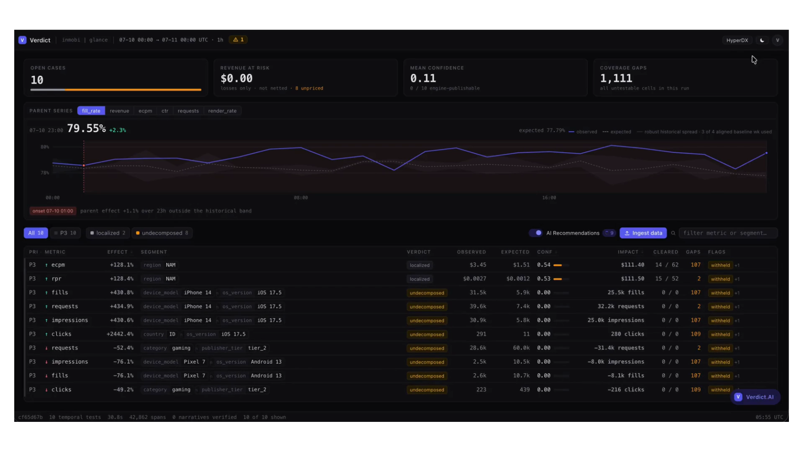
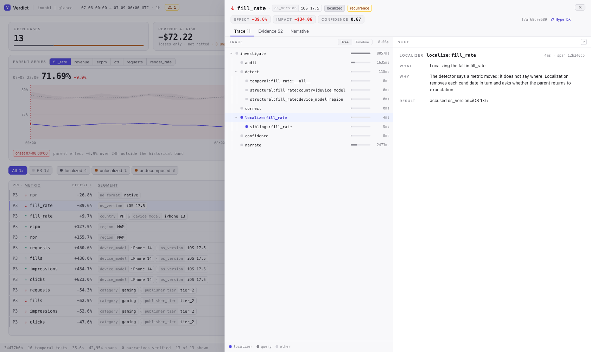
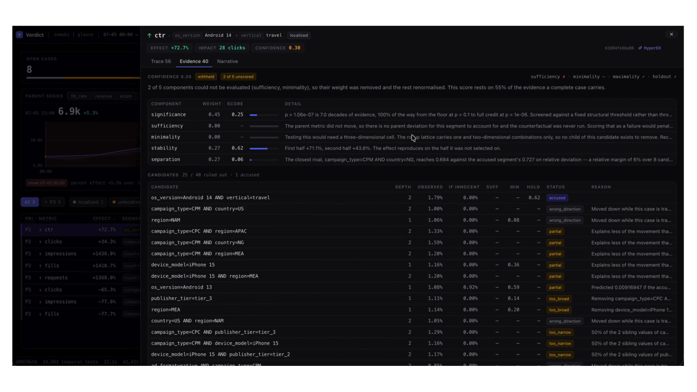

# Low Cardinality

## Track

InMobi — *From alert to answer: the automated root-cause analyst.*

## Project

**Verdict** — an autonomous investigator agent for ad-tech metrics on ClickHouse. It does not
rank segments; it accuses one and then tries to prove itself wrong.

## Team Members

- Sohham Seal ([@SohhamS](https://github.com/SohhamS))

## What it does

When a metric moves, Verdict finds the segment responsible, proves the claim by removing that
segment and showing the parent returns to expectation, publishes what it ruled out and why, and
attaches a confidence score that decomposes into auditable parts.

The reason it works is that ranking does not. Rank every segment by how far it moved and report
the worst, and three things go wrong, all of them present in this dataset:

- **Passengers get reported as drivers.** When Android 15 fill rate collapses, every device model
  that skews Android 15 drops with it. Galaxy S23 shows a large, significant decline. It is
  downstream of the cause, and from the top the two look identical.
- **Interactions are invisible.** One incident exists only at the intersection of APAC and iOS
  18.1. One dimension at a time, neither clears a sensible threshold.
- **Compensating pairs are invisible.** Another moves eCPM down for one ad format and up for
  another by an almost exactly offsetting amount. Every total stays flat.

So instead of ranking, Verdict runs counterfactuals. For each candidate it asks whether removing
that segment returns the parent to expectation (**sufficiency**), whether a smaller piece inside
it would do just as well (**minimality**), and whether the fault is spread across the segment
rather than hiding in one corner (**maximality**). A candidate that fails those checks is
published as a lead, not a verdict, and labelled as such.

A language model writes the prose. It decides nothing: switch it off and every number in every
case file is byte-identical. Every figure it writes is checked against the computed values before
it is shown, and a narrative containing a number the pipeline did not produce is discarded and
replaced by the template.

## Hosted Demo

There is no permanently hosted URL. The system is one `docker compose up` away from running
against your own ClickHouse Cloud service — see [How to run it](#how-to-run-it), which is the
same path the recording was made on, and takes about five minutes from a clean checkout.

That is a deliberate trade rather than an omission. The investigation reads and writes a live
ClickHouse service holding 10.5M events, and the console can trigger ingestion; standing that
up behind a public URL without authentication would have meant either exposing a writable
endpoint or building the auth the track guidelines put out of scope. The recorded walkthrough
below covers everything a hosted link would have shown, end to end and in one take.

## Demo Video

**[`demo.mp4`](demo.mp4)** — 2m54s, end to end against the unseen release: a quiet day, the
release pointed at the system from the console, the drill-down, the diagnosis, the trace, and a
follow-up question answered in chat over the same tables.

**[`demo_1.mp4`](demo_1.mp4)** — 3m30s, a walkthrough of the architecture: how a release becomes
counter rollups, what the detectors and the cross-examination actually do, and where the model is
and is not allowed to speak.

Stills, for reading without playing it: **[`artifacts/screenshots/`](artifacts/screenshots)** —
the [board](artifacts/screenshots/01-board.png), a
[verdict and its trace](artifacts/screenshots/02-verdict-trace.png), the
[narrative](artifacts/screenshots/03-narrative.png), the
[evidence ledger](artifacts/screenshots/04-evidence.png) with every cleared candidate and the
reason it was cleared, [Verdict.AI querying over MCP](artifacts/screenshots/05-verdict-ai-mcp.png),
and [recommendations](artifacts/screenshots/06-recommendations.png).







## The unseen incident bundle

Full write-up with every query: **[`artifacts/unseen/DIAGNOSIS.md`](artifacts/unseen/DIAGNOSIS.md)**

### The diagnosis

On **2026-07-08**, fill rate for **`os_version=iOS 17.5`** fell to **0.47773** against an expected
**0.79118** — a **−39.6%** move, confidence **0.67**. It repeated on 2026-07-09 at −39.9% and
recovered on 2026-07-10, and the system reported it on exactly those two days and stayed silent
on the third.

The expectation is **not historical**, and that is the whole story of this release.

The bundle reissued its dimension tables against the same identifiers — `app_00000` is
`ecommerce/tier_3` in the original data and `news/tier_2` in the release. So a segment label names
one group of entities before the boundary and a different group after it, and every comparison
across the seam is meaningless. The system measured this rather than being told: **42.4% of the
grid stopped agreeing with its own history** on the day the release lands, against **0.2%** the
day before. It rejected segment-level history for those windows and compared iOS 17.5 against the
sibling levels of `os_version` inside the same window instead.

It kept one historical comparison alive: the platform aggregate. Relabelling which entities carry
which attribute rearranges every segment and **cannot move a total**, and the data agrees —
aggregate fill rate runs 0.78509 → 0.79296 straight through the boundary with no step. That is
also where the incident is visible platform-wide: 0.79415 on Jul 7 → 0.73139 on Jul 8.

An earlier version of this system blamed `publisher_tier=tier_3` at −24.4%, confidently and
wrongly, by quoting a baseline it should not have trusted. That failure is what the audit exists
to prevent, and catching it is the single largest correctness change in the project.

### The numbers

```sql
SELECT toDate(event_time) AS day,
       round(sumIf(is_filled, os = 'iOS 17.5') / nullIf(countIf(os = 'iOS 17.5'), 0), 5) AS ios_17_5,
       round(sumIf(is_filled, os != 'iOS 17.5') / nullIf(countIf(os != 'iOS 17.5'), 0), 5) AS rest
FROM (SELECT event_time, is_filled,
             dictGet('dict_geo_device', 'os_version', geo_device_id) AS os
      FROM ad_events WHERE event_time >= '2026-07-01')
GROUP BY day ORDER BY day;
```

| day | iOS 17.5 | everything else | gap |
|---|---|---|---|
| 2026-07-05 | 0.78421 | 0.78529 | −0.1% |
| 2026-07-06 | 0.79454 | 0.79259 | +0.2% |
| 2026-07-07 | 0.79691 | 0.79350 | +0.4% |
| **2026-07-08** | **0.47773** | 0.79167 | **−39.7%** |
| **2026-07-09** | **0.47664** | 0.79308 | **−39.9%** |
| 2026-07-10 | 0.79559 | 0.79294 | +0.3% |

### The trace

Every step is persisted in `case_steps` with what it did, why it did it, and what came back, and
carries an OpenTelemetry trace id into ClickStack. The full tree for the headline verdict is in
[`artifacts/unseen/DIAGNOSIS.md`](artifacts/unseen/DIAGNOSIS.md#the-trace); raw run logs are in
[`artifacts/unseen/evidence/`](artifacts/unseen/evidence/).

```sql
SELECT name, kind, offset_ms, duration_ms, what, why, result
FROM case_steps WHERE case_id = '75f902835e2055c284de0a6c3d6e0b08'
ORDER BY offset_ms, step_id;
```

Headline case `75f902835e2055c284de0a6c3d6e0b08` · run `62b0021401f84b11a29eec93a13a1c01` · trace
`9b04a3357220fe9a33fc2128a1555508`.

## Architecture

Diagram: [`artifacts/architecture/verdict-system-architecture.svg`](artifacts/architecture/verdict-system-architecture.svg).
Deep version, including every algorithm and where it runs:
[`ENGINEERING.md`](ENGINEERING.md).

### Where the analysis runs

**In ClickHouse, not in the model.** The lattice of rollups is materialised by incremental
materialized views; detection reads it in one batched query per window and tests every cell in
process against those counters. A 24-hour window tests ~14,700 cells across 10 metrics in about
**2.4 seconds**, of which ClickHouse server time is ~107ms — the rest is round-trip latency from
a laptop to a cloud region.

The LLM is called once per case, after every number exists, purely to write English.

```
events ─► ad_events ─► MV ─► rollup_5m ─► MV ─► rollup_1h ─► MV ─► rollup_1d
                                                  │
                                    ┌─────────────┴─────────────┐
                              baseline audit              detection
                        (is history still valid?)    ┌── temporal (vs own past)
                                    │                └── structural (vs siblings, median polish)
                                    ▼                          │
                        rejected ──► aggregate-only            ▼
                                     history            localization
                                                   ┌── historical counterfactuals
                                                   └── sibling counterfactuals (no history)
                                                              │
                                          sufficiency · minimality · maximality · holdout
                                                              │
                                              confidence ─► narration (LLM) ─► verify
                                                              │
                                                   cases · case_steps · traces
```

### Detection and attribution

Two detectors, deliberately not mixed, because only one of them can be FDR-corrected honestly.

- **Temporal** — each cell against the same window in each of the previous 4 weeks. Weekly
  alignment holds weekday and hour-of-day constant, so ordinary seasonality cannot masquerade as
  a change. Two-proportion z-tests for ratios, overdispersion-adjusted Poisson for counts,
  Benjamini-Hochberg over the whole family of tested cells.
- **Structural** — an additive row-and-column model fitted by median polish on log values across
  each 2-D grid, flagging cells with large standardised residuals. This is what sees interactions
  and compensating pairs, and it consults no history at all.

**Baseline audit** decides which of those to believe, by asking what share of the grid the
baseline disagrees with. Calibrated baselines disagree with low single digits; a baseline
describing the wrong population disagrees with most of it. Those regimes are ~20× apart here, so
the reading does not need to be delicate.

**Attribution** is counterfactual rather than ranked, and refuses in two named cases: count
metrics get no sibling verdict (segments differ in size for legitimate reasons), and a regression
moving every level together is invisible to sibling comparison — the exact mirror of the temporal
detector's blind spot. Both refusals are published rather than hidden.

### OSS stack

| Tool | How it is actually used |
|---|---|
| **ClickHouse Cloud** | Primary datastore *and* analytical engine. Raw events, the rollup lattice via incremental MVs, dimension dictionaries, and every persisted case, candidate, trace step and coverage gap. |
| **ClickStack / HyperDX** | Every run emits OpenTelemetry spans; each case stores its `trace_id` and the console deep-links into HyperDX with the window pre-filtered. Collector config in `docker-compose.yml`. |
| **LibreChat** | Shipped as **Verdict.AI**, a chat surface wired to the official **ClickHouse MCP server**, so a follow-up question runs a real query against the same tables the verdict came from. Config in `config/librechat.yaml`. |

ClickStack writes to `default.otel_traces` on the same ClickHouse Cloud service that holds the
data, so a span and the rows it was computed from are one join apart. The collector is
configured inline in `docker-compose.yml` (`clickhouse/clickstack-otel-collector`), and the
engine exports to it over OTLP via `OTEL_EXPORTER_OTLP_ENDPOINT`.

Verdict.AI is shown working in [`demo.mp4`](demo.mp4) and in
[`artifacts/screenshots/05-verdict-ai-mcp.png`](artifacts/screenshots/05-verdict-ai-mcp.png):
a follow-up question answered by running SQL through the MCP server against the same tables the
verdict came from, with the query and its result shown rather than summarised.

HyperDX is not captured in either, because it is a hosted service behind a ClickHouse Cloud login
and a screenshot of our tenant is not something a reader can reproduce. The wiring is checkable
without us: `trace_id` is stored on every case, the deep link is built in `web/lib/links.ts`, and
`SELECT count() FROM default.otel_traces` against the service will show the spans. Following the
HyperDX button in any case header opens that case's span tree with the window pre-filtered.

### LLM provider

**Google Gemini** (`gemini-flash-lite-latest`), via LibreChat's native Google endpoint. Chosen for
cost and latency on a narration-only workload, and because the free tier covered the hackathon.
The provider is swappable — narration is behind one interface and the pipeline runs identically
with `--no-llm`.

## How we built it

Python 3.11 (`clickhouse-connect`, `typer`, `pydantic`) for the engine; Next.js 16 for the
console; Docker Compose for everything. **532 tests.**

Things worth knowing:

- **Numbers and prose are separated by construction.** The LLM sees a bundle of computed figures
  and writes sentences. A post-hoc verifier re-extracts every number from the prose and checks it
  against the bundle; a mismatch discards the narrative.
- **Dictionaries are verified cluster-wide.** `SYSTEM RELOAD DICTIONARY` is node-local, so on a
  multi-node Cloud service a reload can leave one replica stale and silently misattribute a whole
  batch. Load now reloads `ON CLUSTER` and then probes every replica via `clusterAllReplicas`,
  failing loudly if any disagrees. This bug cost a full misdiagnosis before it was found.
- **The correction's family is sized from cells tested, not findings returned.** Latent while
  every tested cell yields a finding, and silently permissive the moment one does not.

## How to run it

```bash
git clone <this folder> && cd "Low Cardinality"
cp .env.example .env          # add your ClickHouse Cloud credentials
./stack.sh up                 # console on http://localhost:3000
```

Then load and investigate:

```bash
docker compose exec verdict verdict load
docker compose exec verdict verdict investigate --start 2026-07-08 --hours 24
```

To point it at a new release — appends events, refreshes dimensions if the release reissued them,
then investigates every window it covers:

```bash
docker compose exec verdict verdict ingest /data/unseen_data
```

Or from the console: set `INGEST_ENABLED=true`, click **Ingest release**, paste the path.

Without Docker:

```bash
uv sync && source .venv/bin/activate
verdict load && verdict investigate --start 2026-07-08 --hours 24
cd web && npm install && npm run dev
```

Run the tests with `pytest`. `verdict inject --help` plants synthetic incidents of known shape to
check the detectors against answers they were not given.

## Where this is weak

Documented at length in [`ENGINEERING.md`](ENGINEERING.md#where-this-is-weak). The short version:
there is no trend model, so a growing corpus makes the temporal detector flag rises more readily
than drops; count metrics still produce noisy structural leads because segments legitimately
differ in size; and narration is sequential, so wall-clock run time is dominated by LLM calls
rather than by the analysis, which is 2.4 seconds.
