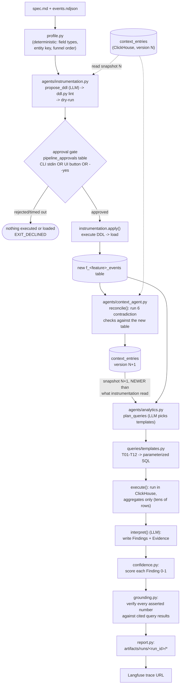

# Architecture

A code-level map of `Atlys/solution/`. For *why* the design decisions were made (schema
house rules, why the context layer is a ClickHouse table and not a vector store, the
numeric-grounding incident, etc.) see the main [`README.md`](../README.md) — this doc is
the *what's where and how it connects*. For *how any of it is checked* — the
verification stack, every statistical formula, and a real eval run — see
[`EVALUATION.md`](EVALUATION.md). For the schema as it exists in the database right
now — every table, column and comment, plus the materialized views that were measured
and **rejected** — see [`SCHEMA_CATALOG.md`](SCHEMA_CATALOG.md), which is generated by
`make schema-doc` and should never be hand-edited.

## The one sentence version

A feature spec (`spec.md` + `events.ndjson`) goes into `run_pipeline.py`; a production
ClickHouse table, an updated versioned context layer, and a PM-readable insight report
come out, inside one Langfuse trace. Three agents own three concerns — **Instrumentation**
(schema), **Context** (a living, contradiction-checked knowledge base), **Analytics**
(query + interpret) — and `contracts.py` is the frozen set of Pydantic models that let
them be developed and tested independently.

## Data flow

Step "plan" deliberately reads context **version N+1**, not the version N that
instrumentation read at the top of the run — that gap is the mechanical proof of
"context freshness" the judging rubric asks for, and every LLM span in the trace records
which version it consumed (`llm.complete_json(..., context_version=...)` — the parameter
is mandatory, not optional, so this can't be silently skipped).

The **approval gate** sits at the one point in the run where declining is free: the DDL
has proven runnable (`dry_run()` passed) but nothing has executed yet, so a reject stops
with no table, no data, nothing to roll back. It lives entirely in `run_pipeline.py`
(`_resolve_approval`), not in `agents/instrumentation.py::apply()` itself — programmatic
callers of `apply()` (the eval harness's mock-topology path, tests) are never gated,
only runs through the orchestrator are. Resolution is append-only writes to a
`pipeline_approvals` table (never `UPDATE`, same pattern as `context_entry_log`): a
`pending` row is written the instant dry-run clears, and whoever writes the next row for
that `run_id` — an interactive `y`/`N` at a real terminal, `--yes`, or the Streamlit
console's Approve/Reject button — resolves it. A non-interactive run (stdin not a TTY,
which is how the console launches its subprocess) polls that table every 2s up to
`--approval-timeout` and writes its own `timed_out` terminal row if nobody ever answers,
so the table never reports a dead run as still pending.

## Module map

### Foundation (own the primitives everything else builds on)

| Module | Owns |
|---|---|
| `contracts.py` | Every Pydantic model in the system — `SpecProfile`, `DDLProposal`, `FeatureSemantics`, `QuerySpec`, `Finding`, `InsightReport`, `ContextEntry`, `Contradiction`, `PipelineResult`, etc. Additive-only by convention: widen a `Literal`, never repurpose a field. |
| `ch.py` | The **only** module that talks to ClickHouse. `CH.run_select` / `execute_ddl` / `insert_rows` / `columns`. Enforces the read-only guard (blocks `INSERT`/`ALTER`/`DROP`/... on the analytics path) and splits multi-statement SQL correctly (comment- and string-aware, not a naive `;` split). |
| `llm.py` | The **only** module that talks to a model. Wraps the `claude -p` CLI (subscription auth, no API key) with a structured-JSON contract and a `--effort` ladder (`low` by default; escalates on retry). Set `ATLYS_LLM_BACKEND=api` to swap in the Anthropic SDK instead — every caller is unaffected. |
| `tracing.py` | Langfuse wrapper: `span()`, `generation()` (mandatorily takes `context_version`), `current_trace_id()`, `verify()` (a real `auth_check()` round-trip, not just "keys are present"). |

### Instrumentation Agent (spec → production table)

| Module | Owns |
|---|---|
| `profile.py` | Deterministic profiling of the raw NDJSON: field types/nullability/cardinality, and — the generalization-critical part — **derives** the entity key and funnel step order from three independent signals (spec-declared order, event volume, median per-entity timestamp), cross-checked, never hardcoded per feature. No LLM. |
| `mapping.py` | Raw JSON value → ClickHouse-typed value, including flattening nested objects (e.g. `payment: {amount, ...}` → `payment_amount`). No LLM. |
| `agents/instrumentation.py` | Orchestrates `profile → propose_ddl (LLM, fed `house_rules.md` + the context snapshot) → apply`. |
| `ddl.py` | Lints and dry-runs the LLM's DDL proposal before it ever touches ClickHouse (catches e.g. `Nullable` on a hot column, an `ORDER BY` leading with a unique id) and executes it once it passes. |
| `bakeoff.py` | After load, measures the agent's `ORDER BY` against a timestamp-first straw-man on the same funnel query and appends the real byte-read ratio to the proposal's rationale — a claim backed by `EXPLAIN`, not prose. |
| `house_rules.md` | The schema conventions prompt — fed verbatim into `propose_ddl`'s system prompt, and the artifact judges can read to see what the agent was told. |

### Context Agent (a living, versioned, self-checking knowledge base)

| Module | Owns |
|---|---|
| `contextlayer/schema.sql` | `context_entries` (`ReplacingMergeTree`, one row per entry version — `LIMIT 1 BY entry_id` recovers "current"), `context_changelog` (append-only), `pipeline_runs`. |
| `contextlayer/bootstrap.py` | One-time, no-LLM markdown parse of `../base_context.md` into versioned `ContextEntry` rows. |
| `contextlayer/store.py` | Versioned CRUD: write a new entry version, snapshot the current state, diff two versions. |
| `contextlayer/checks.py` | Contradiction detection — **the LLM proposes, SQL adjudicates**. Five rule-based checks run unconditionally: `C1` definition conflicts between two context entries, `C2` undefined terms, `C3` context claims vs. `system.columns` reality, `C4` self-admitted-uncomputable metrics, `C5` stale entries (e.g. an `ORDER BY` claim that no longer matches the live schema); a sixth, `check_join_assumptions`, always runs and measures actual join hit-rate between a new table and the existing 8 tables. An optional seventh (`use_llm=True`, off by default) lets an LLM *propose* additional contradictions, but every proposal still has to survive an executed SQL query before it's recorded — the LLM never gets to assert a contradiction is real. |
| `agents/context_agent.py` | `bootstrap`, `snapshot`, `reconcile` (run all checks against a newly-loaded table, write results, bump the version). |

### Analytics Agent (plan → execute → interpret)

| Module | Owns |
|---|---|
| `queries/templates.py` | The template library, **T01–T12**, parameterized by `FeatureSemantics` (derived per-feature at runtime) — never by a feature name or column literal. Includes funnel/segment/trend/cross-reference/distribution templates (T01–T10) and the two correlation templates (T11 measure-vs-measure, T12 measure-vs-funnel-completion) added to cover the problem statement's "correlations" requirement. Templates raise `TemplateError` on a degenerate combination (e.g. a measure only observable among entities who already succeeded, making "does it predict success" circular) rather than silently returning a meaningless number — caught generically wherever templates are built, never crashes the pipeline. |
| `queries/stats.py` | Pure, dependency-free statistical helpers (two-proportion z-test, MAD outlier score, Fisher-z correlation significance) — "reproducible by a judge with a calculator." |
| `agents/analytics.py` | `plan_queries` (LLM picks template ids + params from a catalog built from live `FeatureSemantics` — it never writes raw SQL), `execute` (runs them in ClickHouse, returns aggregates only), `interpret` (LLM writes `Finding`s with structured `Evidence`), `_verify_evidence` (post-hoc check that the evidence a finding cites actually contains the numbers it claims). |
| `confidence.py` | Deliberately self-contained (duplicates a little arithmetic from `queries/stats.py` on purpose, so its formula can be audited without chasing an import) four-component confidence score — `sample_adequacy`, `statistical_strength`, `context_support`, `data_quality` — dispatched by evidence `method` (`two_proportion_ztest`, `mad_outlier`, `pearson_correlation`, `descriptive`). |
| `grounding.py` | The numeric-grounding guard: every number a `Finding` asserts must appear in the query results it cites, or it's demoted to informational with an `UNVERIFIED` caveat. Deterministic Python, not a second LLM call. |
| `metric_policy.py` | Deterministic (no LLM) refusal/qualification: if a metric has an open `definition_conflict` contradiction, an answer citing it is intercepted and either qualified with both definitions or refused outright, rather than silently picking one. |

### Cross-cutting / delivery

| Module | Owns |
|---|---|
| `run_pipeline.py` | The entrypoint. Five stages (`context.load → instrumentation → context.reconcile → analytics → report`) in one Langfuse trace; every stage's status lands in `pipeline_runs` so a second shell can watch it live. Pauses between instrumentation's dry-run and execute/load for the approval gate (`--yes` to skip). Exit codes distinguish clean (0), hard failure (1, nothing written), degraded (2, partial artifacts), and declined (3, schema not approved — also nothing written). |
| `report.py` | Turns a `PipelineResult` into judge-facing artifacts: `insight_report.md`, `schema.sql`, `proposal.json`, `context_diff.md`, `semantics.json`, `trace_url.txt`. |
| `ask.py` | Interactive Q&A against an already-instrumented feature — reuses the cached template suite and derived semantics, so each question is a single LLM call over already-computed aggregates (~40s). |
| `bootstrap_db.py` | One-time environment setup: create the context/ops tables, seed the context layer. |
| `legacy.py` | Prices and fixes the legacy tables' id-leading `ORDER BY` with a measured projection, rather than just flagging it. |
| `evalharness.py` | No-LLM eval: replays the 5 known specs' run history plus 4 fresh mock topologies (`tools/mock_spec.py`) through the deterministic path, writes a measured results table. |
| `atlys_mcp/server.py` | MCP tool server exposing `ask`, `list_features`, `run_pipeline`, `get_context`, `list_contradictions`, `explain_metric`, `context_diff` to any MCP client (LibreChat, Claude Desktop, etc.) — the agent-native surface, same functions the CLI uses underneath. |
| `deploy/` | `docker-compose.ch.yml` (provisions ClickHouse itself), `docker-compose.yml` (attaches to it; runs `mcp-clickhouse` + optional LibreChat), `librechat.yaml`, `Dockerfile.mcp`. |
| `ui/app.py` | Streamlit console. Read-only dashboard views (schema timeline, findings with their four confidence components, context changelog with an entries/contradictions-over-time chart, per-run trace links) plus one deliberate exception: a "Run pipeline" view that takes a spec (existing or uploaded) and launches `run_pipeline.py` as a subprocess, then polls `pipeline_runs` for live stage status — same table every other view reads, so the subprocess is a trigger, not a second source of truth. Also embeds LibreChat (iframe, since it sets no frame-ancestors restriction — Langfuse does, so its trace pages are linked, never framed). |
| `tools/mock_spec.py` | Generates synthetic spec topologies unlike any of the 5 known specs — the "honest half" of the anti-overfitting evidence, used by `evalharness.py` and `tests/test_generalization.py`. |

### Tests (`tests/`)

| File | Guards |
|---|---|
| `test_generalization.py` | The **grep guard** — fails if any source file names a known spec or a column unique to one. The artifact to check if you suspect something got tuned to the five practice specs. |
| `test_grounding.py` | Locks in the real hallucination `grounding.py` was built to catch (see README). |
| `test_ch_guard.py` | The read-only guard actually blocks writes, and doesn't over-block (e.g. `SHOW CREATE TABLE`, `system.*` introspection). |
| `test_context_checks.py` | Each of the six contradiction checks fires on a synthetic case built to trigger it, and doesn't fire on one built not to. |
| `test_approval_gate.py` | The human-in-the-loop schema gate against live `pipeline_approvals`: auto-approve, a decision landing mid-poll, and — the real bug this pins — a timeout writing a terminal `timed_out` row instead of leaving the table saying `pending` forever. |
| `test_evalharness.py` | The eval harness's own verdict logic (see `docs/EVALUATION.md`) — the module with the least coverage of any non-trivial file, which is how its own bugs went unnoticed. |
| `test_metric_policy.py`, `test_bakeoff_legacy.py`, `test_queries_templates.py`, `test_correlation.py` | Unit coverage for their namesake modules. |

## Where to actually start reading

1. `contracts.py` top to bottom — every downstream module's inputs/outputs are defined there.
2. `run_pipeline.py`'s module docstring — the five-stage flow in prose.
3. `queries/templates.py`'s module docstring — how a template stays feature-agnostic.
4. `contextlayer/checks.py`'s module docstring — "the LLM proposes, SQL adjudicates."

Then run it: `make init` (see the main README's "Setup" section), then
`./.venv/bin/python ask.py --spec ../specs/05_instant_forex --question "..."` is the
fastest way to see the whole chain (semantics → templates → ClickHouse → LLM → grounding →
confidence → answer) execute in ~40 seconds with a real trace URL at the end.
