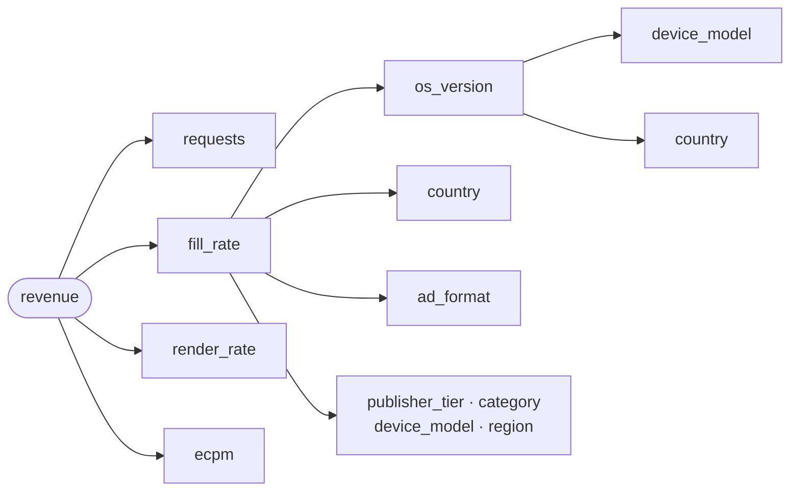
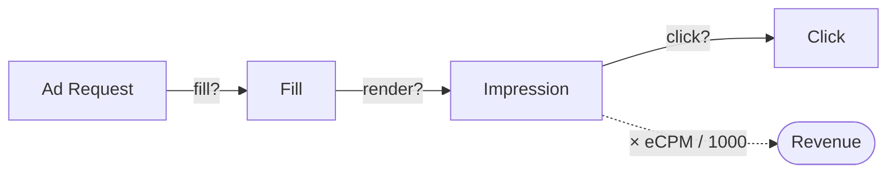
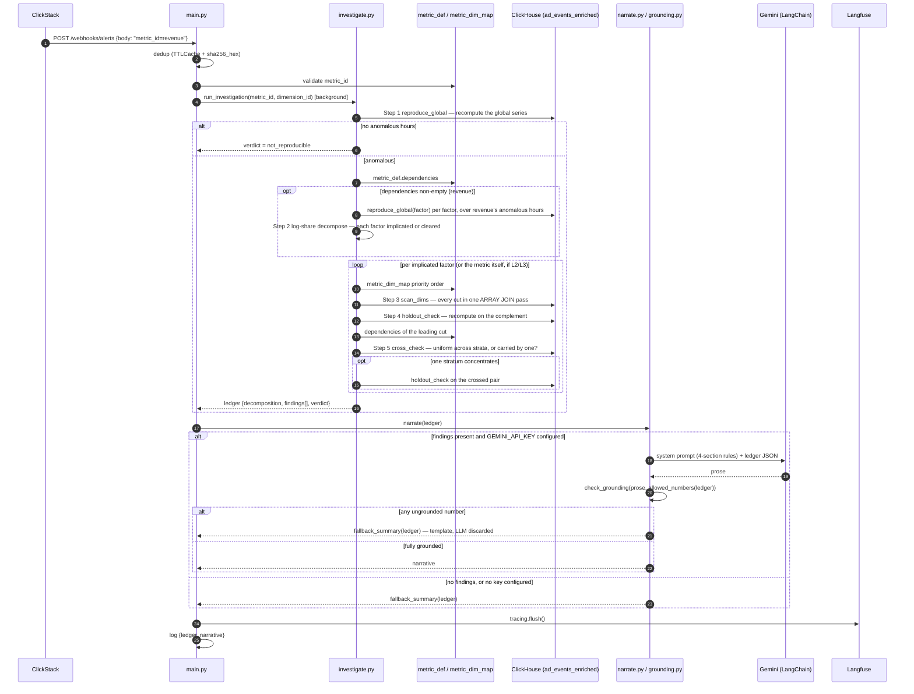

# Architecture — Automated Root-Cause Analyst

Registry-driven: detection and RCA hold no hardcoded metric or dimension
knowledge. Everything is read from two tables in `inmobi`. ClickHouse is the only
datastore and the only analytical engine — **ClickHouse computes, the LLM
narrates.** The model never sees a raw row, never does arithmetic, never picks
the next step.

**There are three objects in the database that matter:** one denormalised event
table, and two definition tables. No metric views, no pre-aggregated rollup, no
persisted incident table. `metric_def.sql` is executed directly against
`ad_events_enriched` — by the alert query and by the agent, from one builder — so
a metric is added by inserting a row and there is nothing to keep in sync.

## Architecture Diagram

Five layers, in order: raw data, the semantic layer that defines every metric and
every drill path, HyperDX detection, the RCA agent, narration. Every arrow
crossing into the agent is a parameterised ClickHouse query; nothing computes in
Python and nothing computes in the model.

```mermaid
flowchart TB
    classDef ch   fill:#fff2a8,stroke:#8a7a00,stroke-width:2px,color:#1a1a00;
    classDef sem  fill:#ffd28a,stroke:#8a5000,stroke-width:2px,color:#1a1000;
    classDef obs  fill:#a8ecff,stroke:#00697f,stroke-width:2px,color:#00232b;
    classDef py   fill:#cddff0,stroke:#20455e,stroke-width:2px,color:#0d1b25;
    classDef ai   fill:#e0d0ff,stroke:#4c1d95,stroke-width:2px,color:#1e0a3c;
    classDef io   fill:#efefef,stroke:#444,stroke-width:1px,color:#111;
    classDef gate fill:#ffffff,stroke:#c2410c,stroke-width:2px,color:#7c2d12;

    Events[/"raw ad event stream"/]:::io

    subgraph L1["1 · ClickHouse — data"]
        direction LR
        Bronze[("ad_events<br/>raw, replayed")]:::ch
        Silver[("ad_events_enriched<br/>denormalised via dictGet, event_time indexed<br/>THE surface: metrics, baselines, drill-downs")]:::ch
        Bronze -->|"MV1 — the only materialised view"| Silver
    end

    subgraph L2["2 · ClickHouse — semantic layer"]
        direction LR
        MDef[("metric_def<br/>metric_id · sql · dependencies · z_score_threshold<br/>+ detector and guard rails")]:::sem
        MMap[("metric_dim_map<br/>metric_id · dim_id · dependencies<br/>composite key, priority-ordered")]:::sem
    end

    Builder["metric_sql.deviation_sql<br/>renders metric_def into one query:<br/>hourly series → seasonal baseline → z → is_anomaly<br/>the ONLY place the detection maths exists"]:::py

    subgraph L3["3 · HyperDX / ClickStack — detection"]
        direction TB
        Glob["global tile · per alertable metric<br/>the ALL bucket — did the metric move?"]:::obs
        Marg["marginal tile · per metric with dims<br/>62 depth-1 slices, one ARRAY JOIN pass<br/>grouped: HyperDX alerts each slice alone"]:::obs
        Fresh["freshness tile<br/>every other alert goes SILENT when ingest dies"]:::obs
        Gate{"above_exclusive 0<br/>(freshness: above 1 window)"}:::gate
        Hook["webhook dispatcher"]:::obs
        Glob --> Gate
        Marg --> Gate
        Fresh --> Gate
        Gate -->|breach| Hook
    end

    subgraph L4["4 · RCA agent — RCA/app/"]
        direction TB
        Recv["main.py · webhook receiver<br/>dedup on sha256 · parse metric_id + optional dimension_id<br/>validate against metric_def · background the run"]:::py
        S1["Step 1 · reproduce_global<br/>recompute the global series — still anomalous, right now?<br/>nothing on the wire is taken as proof"]:::py
        Q1{"metric_def.dependencies<br/>non-empty?"}:::gate
        S2["Step 2 · decompose<br/>log-share allocation over the funnel identity<br/>every factor implicated or cleared"]:::py
        S3["Step 3 · scan_dims<br/>every dim_id cut in ONE pass (ARRAY JOIN fan-out)<br/>ranked by contribution, never by percentage change"]:::py
        S4["Step 4 · holdout_check<br/>recompute the metric on the complement of the cut"]:::py
        S5["Step 5 · cross_check<br/>walk that cut's dependencies one level down<br/>uniform across strata, or carried by one?"]:::py
        Ledger["ledger<br/>window · decomposition · findings · verdict"]:::py

        Recv --> S1 --> Q1
        Q1 -->|"yes · revenue"| S2
        Q1 -->|"no · a factor or context metric"| S3
        S2 -->|"per implicated factor"| S3
        S3 --> S4 --> S5 --> Ledger
    end

    subgraph L5["5 · narration"]
        direction TB
        Prompt["narrate.py · prompt generator<br/>the ledger is the ONLY input"]:::ai
        Model["Gemini via LangChain<br/>temperature 0, one call"]:::ai
        Ground{"grounding.py<br/>is every number in the prose<br/>present in the ledger?"}:::gate
        Fall["fallback_summary<br/>templated from the ledger, no LLM"]:::ai
        Prompt --> Model -->|prose| Ground
        Ground -->|"no · ungrounded number"| Fall
    end

    Out[/"evidence-backed diagnosis"/]:::io
    LF[("Langfuse trace<br/>one span per stage<br/>SQL · query_id · rows read · elapsed")]:::ai

    Events --> Bronze
    L2 --> Builder
    Builder -->|"rendered by provision_alerts.py<br/>bounds from the tile's window macros"| Glob
    Builder -.->|"rendered with bound parameters"| L4
    Hook -->|"body: metric_id=x scope=… dimension_id={{group}}"| Recv
    Ledger --> Prompt
    Ground -->|"yes"| Out
    Fall --> Out

    L4 -.->|"every step is a parameterised query over silver"| Silver
    L2 -.->|"definitions and drill paths, read live per alert"| L4
    L4 -.-> LF
    L5 -.-> LF
```



**How each node maps to a real object:**

| Diagram node | Real object |
|---|---|
| `ad_events` → `ad_events_enriched` | `sql/01_schema.sql`, `sql/03_silver.sql` (`mv_ad_events_enriched`) |
| `metric_def` | `sql/04_semantic_layer.sql` §4.1 |
| `metric_dim_map` | `sql/04_semantic_layer.sql` §4.2 |
| `metric_sql.deviation_sql` | `RCA/app/metric_sql.py`; rendered for HyperDX by `scripts/metric_query.py {alert,marginal,scan}` |
| global / marginal / freshness tiles | `scripts/provision_alerts.py --apply` — renders all of them from the registry and pushes dashboard + alerts |
| `replay_clock` | `sql/04_semantic_layer.sql` §4.3; rewritten by `scripts/compress_replay.py`, read live by both renderers |
| Steps 1–5 | `RCA/app/investigate.py` — `reproduce_global`, `decompose`, `scan_dims`, `holdout_check`, `cross_check` |
| ledger | the dict `run_investigation` returns; also the Langfuse trace payload |

```
ad_events                       raw, replayed, the only table loaded
   └─ MV1 ─▶ ad_events_enriched denormalised · event_time indexed · EVERYTHING reads this

metric_def       what a metric is, how it decomposes, when it is anomalous
metric_dim_map   which cut to try first, and what to cross it with
```

Nothing else is persisted. No rollup, no metric view, no incident table: the
hourly series, its seasonal baseline and its z-score are computed on demand by
one rendered query, so there is no second copy of a formula to drift and no
pipeline stage that can be stale when an alert fires.

## The RCA tree

`metric_def.dependencies` and `metric_dim_map.dependencies` are the two edge
sets that make the investigation a tree rather than a flat scan:



The first edge set is `metric_def.dependencies` — the funnel identity, in funnel
order. The second is `metric_dim_map` in `priority` order, for whichever factor
was implicated. The third is `metric_dim_map.dependencies` for whichever cut
led — one level down, and only that far.

Metric edges are walked first and in full — every factor gets a verdict. A metric
is never sliced by a dimension before its own factors have been accounted for.

## Where the build diverges from the plan

The plan puts the z-score threshold and the alert condition inside HyperDX, and
has the webhook carry both `metric_id` and `dimension_id`. Two ClickStack
platform limits, found during implementation, move where those land:

1. **ClickStack alerts have no SQL condition field** — only `threshold` +
   `thresholdType` + `interval`. There is no way to configure "alert when this
   query's z-score column exceeds `z_score_threshold`". So the threshold is read
   from `metric_def` and rendered *into the alert query itself*: the query returns
   `anomalies` per hour, already guard-railed, and the alert does the only thing a
   `thresholdType` can express — `above_exclusive 0` (**not** `above`, which fires
   unconditionally at zero, a real bug caught in an earlier hand-built alert).
   `scripts/metric_query.py alert <metric>` prints exactly what to paste, read
   live from the registry, so a threshold change is a registry `INSERT` and a
   re-paste rather than a code change.
2. **The webhook *body* template supports only `{{title}}`/`{{body}}`/
   `{{link}}` — but the alert *message* also substitutes `{{group}}` and
   `{{value}}`.** These are two different templates, and conflating them is what
   produced the earlier (wrong) claim in this document that a segment could never
   be named on the wire. The message is interpolated into `{{body}}`, so a
   grouped tile does report the slice that fired. `metric_id` is still a static
   string per alert; `dimension_id={{group}}` is templated. A two-column group
   renders as `dim_name:country, dim_value:CA`, so `main.py::DIMENSION_ID_RE`
   strips the optional `dim_name:` prefix to recover the dimension id.

3. **The alert interval enum bottoms out at `1m`,** and a `line` tile alert is
   rejected unless its SQL references an interval macro while a `number` tile is
   never substituted with one. Both shapes still require the window macros. This
   is why the marginal tile rolls up to `$__timeInterval(ts)` and the freshness
   tile divides by `end - start` rather than by `{intervalSeconds}`.

None of this loosens the trust boundary: the agent re-derives the window, the
trigger and every candidate live. `dimension_id` is a hint only — it narrows the
first dimension scan, and an id that fails the registry whitelist in `_dim_col`
simply widens the scan back to the full sweep. Every number in the ledger comes
from a query the agent issued itself, so a stale, duplicated or mis-templated
webhook cannot poison the diagnosis.

## Step-by-Step Execution Flow

### 1. Ingestion (ClickHouse)

Raw ad events land in `ad_events`. One materialized view fans out to
`ad_events_enriched`, where every dimension is resolved via `dictGet` so nothing
downstream ever joins, and `event_time` leads the sort key because every query is
time-bounded. That table is the whole physical surface.

Alongside it, ClickHouse holds the semantic layer as two ordinary tables.
`metric_def` is keyed on `metric_id` and carries `sql` (the metric as an aggregate
over `ad_events_enriched`), `numerator`/`denominator` (the same formula split, for
the proportion test), `dependencies` (the funnel factors this metric decomposes
into, in funnel order), `z_score_threshold`, and the detector plus guard rails.
`metric_dim_map` is keyed on `(metric_id, dim_id)` and carries `priority` (which
cut to try first) and `dependencies` (which cuts to check after this one, in
order). Together they are the RCA tree, and they are the only thing that has to
change to point this system at a different schema.

No formula, threshold, factor list or dimension list is hardcoded anywhere in
Python — including the funnel identity, which `decompose` reads from
`metric_def.dependencies`, and the dimension whitelist, which is
`SELECT DISTINCT dim_id FROM metric_dim_map`.

### 2. Detection (HyperDX / ClickStack)

There is no detection view. `RCA/app/metric_sql.py` renders a `metric_def` row
into a single query — hourly series, seasonal baseline, z-score, guard rails,
`is_anomaly` — and that builder is the only place the detection maths exists. Two
things render it: the RCA agent (with bound parameters) and
`scripts/metric_query.py` (with `now()`-relative bounds, for HyperDX). They
cannot drift apart, because there is nothing to keep in sync.

Three kinds of tile, all rendered from that one builder by
`scripts/provision_alerts.py`, which reads the alertable set from the registry
rather than listing it — a metric qualifies if it is drillable (has
`metric_dim_map` rows) or decomposable (has `dependencies`), which is what keeps
`rpr` out:

| Tile | Shape | Asks |
|---|---|---|
| **global** (one per alertable metric) | `number` | did the metric itself move? |
| **marginal** (one per metric with dims) | `line`, grouped on `dim_name`/`dim_value` | did any depth-1 slice move, even if the global series did not? |
| **freshness** (one, total) | `number` | is data still arriving? |

The marginal tile exists because global-only alerting has a measured blind spot:
the planted `os_version=iOS 18.1` fault scores **0 anomalies on the global
`fill_rate` tile** and 8.1–9.5 on the marginal one. HyperDX alerts each group
independently, so all 62 depth-1 slices are watched by one query — the same
`ARRAY JOIN` fan-out `scan_dims` uses, never the 767,984-combination
cross-product. `LIMIT 1 BY` keeps the top-contribution slice per bucket, so a
correlated fault is one webhook rather than five.

The freshness tile is the only one that fires when ingest stops. Every deviation
alert goes *silent* in that case — no rows means no anomalies — and silence is
indistinguishable from health.

Each alert fires the webhook with a static `metric_id=<x> scope=<global|marginal>`
plus, on marginal tiles, a templated `dimension_id={{group}} z={{value}}`.

### 3. Automated Drill-Down (Investigation Engine)

`main.py` receives the webhook, dedups on `sha256(title + body)` over a 5-minute
window, regex-extracts `metric_id` and the optional `dimension_id`, validates
the metric against `metric_def`, and backgrounds the investigation — the HTTP
response returns immediately.

`investigate.py` then runs a **fixed ladder**. No model is given a free-form SQL
tool; every query is parameterised.

**Step 1 — Reproduce.** `reproduce_global` recomputes the global hourly series
from silver over the live window (24h back from `max(event_time)`, so a
bulk-replayed file still investigates the current window and not the tail of the
file) and keeps the anomalous hours. It is the same rendered query the alert ran,
not a stored result read back. Nothing in the alert body is ever taken as proof
the anomaly is real.

The window is 24 **data-hours**, widened by `metric_sql.lookback_buckets()` to at
least one alert evaluation — under a compressed replay a single 1-minute
evaluation spans 30 data-hours, and reproducing a narrower window than the alert
scored would drop the very anomaly that fired it. Every span in the ladder is
counted in data-hours and converted through `replay_clock`; a literal
`timedelta(hours=24)` is correct only at real time and otherwise reaches past the
whole dataset.

If the global series is clean, the ladder does **not** stop — it falls through to
`_investigate_marginal`, which re-scores the depth-1 slices before giving up.
That branch is what makes the marginal sentinel useful: an incident too small to
move the global metric arrives with a clean global series by construction, and
returning `not_reproducible` there would drop exactly the incidents the sentinel
was added to catch. The ledger records `scope: marginal`, and the holdout in that
branch is deliberately read as weak evidence — removing a culprit from a
population already at baseline trivially leaves a residual at baseline, so the
load-bearing evidence is the slice's own z and contribution. Only when both
global and marginal come back clean is the verdict `not_reproducible`.

**Step 2 — Decompose** (any metric whose `metric_def.dependencies` is non-empty,
i.e. `revenue`). Walks the funnel identity *before* touching any dimension, via a
log-share allocation rather than a single max-z pick:

```
g_f = ln(actual_f / expected_f)                       per factor, over one shared window
G   = Σ g_f  ==  ln(revenue_actual / revenue_expected)      exact, by the identity
contribution_rel_f = (g_f / G) × revenue.delta_rel          sums to the total by construction
verdict_f = implicated  if |contribution_rel_f| ≥ min_effect_rel_f   (that factor's own registry row)
          = cleared     otherwise
```

Every factor gets a verdict, not just the loudest — so two genuinely
independent faults in one window (say `fill_rate` *and* `ecpm`) both surface
instead of one masking the other. A guard rail (`|G| < 0.005`) catches the
degenerate case where factors offset each other and a near-zero denominator
would otherwise manufacture a fake dominant cause. Full derivation:
`docs/RCA_DECOMPOSITION_MATH.md`.

**Step 3 — Dimension Isolation.** For each implicated factor (or the alerted
metric itself, if it has no dependencies), `scan_dims` scores every eligible
depth-1 slice — the drill order from `metric_dim_map`, minus that metric's
`invalid_dims` — and ranks them by `Σ |delta_abs| × sample_count`. Contribution,
never percentage change: a noisy 40% swing on 0.1% of traffic must not outrank a
real 3% move on 11%. All 62 slices cost **one** pass over silver, not 62: the
dimension fan-out is an `ARRAY JOIN` of `(dim_name, dim_value)` tuples inside the
rendered query, and every series is windowed in the same scan. If nothing comes
back, the verdict is `broad_based` and the agent deliberately does **not** name a
culprit.

**Step 4 — Holdout / disambiguation.** Recomputes the metric on the
*complement* of the top candidate — the same `metric_def.sql`, under
`NOT (dim = value)`. If
the residual sits at baseline the candidate is the sole cause (`localized`);
if removing it barely moves the residual, it is a lead, not a conclusion
(`inconclusive`). This is the step that kills bleed-through: `device_model =
Galaxy A54` and `region = EU` light up alongside `os_version = Android 15`
because those devices run that OS, and only `os_version` survives the holdout.

**Step 5 — Dependency walk (the tree, one level down).** `cross_check` reads
`metric_dim_map.dependencies` for the cut just made and walks them in order,
asking of each: is the parent's move spread evenly across this dimension, or
carried by one of its values? For every value `v` of the dependent dimension:

```
effect_v       = rate(parent AND child = v) − rate(NOT parent AND child = v)
contribution_v = effect_v × denominator(parent AND child = v)
top_share      = max |contribution_v| ÷ Σ |contribution_v|
```

The rest of the population is the control, so no depth-2 seasonal baseline is
needed — and by design none exists, since nothing is pre-aggregated. A
`top_share` at or above 0.6 means the culprit is the **pair**, not the parent, and
the pair gets its own holdout (complement of `parent AND child`) before it is
allowed to replace the parent in the verdict. Spread evenly, the parent stands and
the dependent dimension is bleed-through — which is the Android 15 case: every
Android 15 device is depressed, so `device_model` comes back uniform.

The denominator is a sum of *absolute* contributions, not the net: two strata
moving in opposite directions must not shrink it and manufacture a fake dominant
child. The walk needs a rate to compare, so it is skipped with a recorded reason
on additive metrics (`requests`, `revenue`) — a count inside a slice has no
comparable value outside it.

**Output — the ledger.** `{metric_id, window, dimension_id, decomposition,
findings[], verdict}`, where each finding carries `candidates`, `holdout`,
`interaction` and its own verdict, and the top-level `verdict` rolls up as
`localized` > `inconclusive` > `broad_based`. This single object is simultaneously
the LLM's only input and the Langfuse trace payload.

### 4. Narrative Synthesis (LLM)

One Gemini call, via LangChain, `temperature = 0`, given nothing but the ledger.
The system prompt encodes the narration rules directly: copy every number
verbatim, walk the identity only when `decomposition` is present, one paragraph
per finding, and — when the verdict is `broad_based` — say *"global movement, no
localising segment"* rather than inventing a culprit.

`grounding.py` then enforces this mechanically: it extracts every number from
the generated prose and checks each against every number reachable in the
ledger (raw, ×100, sign-dropped, plus digit runs inside strings like
`Android 15` or an ISO timestamp). One unmatched number and the entire LLM
output is discarded in favour of a summary templated straight from the ledger.
There is no retry loop — a missing narrative is cheaper than a fabricated one.

### 5. Traceability

Every ladder stage and the narrate step are wrapped in a Langfuse span, which
no-ops when `LANGFUSE_PUBLIC_KEY`/`LANGFUSE_SECRET_KEY` are unset so local runs
and tests never depend on tracing credentials. Because every query goes through
one function (`clickhouse_client.query_rows`), that is the single place SQL
text, `query_id`, rows read and elapsed time get attached to whichever span is
active — the evidence that ClickHouse, not the LLM, did the work.
`tracing.flush()` runs before the background task finishes, so a trace is never
lost to an early process exit. **No trace, no credit.**

## The rule that makes this scale

**Alert on the global series and on the marginals. Never touch the
cross-product.**

The full dimension cross-product is 767,984 combinations on 9M rows — measured,
not estimated. Nothing in this system enumerates it, at any stage:

- **Alerting** reads two series per metric: the `ALL` bucket, and the 62 depth-1
  marginals in one `ARRAY JOIN` pass. The earlier design alerted on `ALL` only;
  that is what let `os_version=iOS 18.1` through, since it never moved the global
  number. Adding the marginals costs one extra query per metric, not 62.
- **Depth 1** enumerates 62 marginal slices, exhaustively, in one pass. Marginals
  are linear in the number of dimensions; the cube is multiplicative. That is the
  whole trick.
- **Depth 2** is not enumerated either. Instead of crossing every pair, the agent
  crosses the cut that actually led with the dimensions `metric_dim_map` says are
  entangled with it — two or three queries, chosen by domain knowledge rather
  than by brute force.

**Cardinality budget:** a dimension is a candidate only if it has a row in
`metric_dim_map`, and only dimensions with ≤ ~50 distinct values are listed.
`app_id` (2,000), `geo_device_id` (5,000) and `advertiser_id` (500) are absent by
design — they stay reachable in `ad_events_enriched` for a manual drill, but the
agent never enumerates them. This is what holds at 100x.

**What removing the rollup costs, and why it is worth it.** Alert queries now scan
silver rather than a 53K-row aggregate. The trade is deliberate: one definition
that always matches what the agent investigates, no MV that can be silently
un-fired or out of date, and no ingest-time commitment to which dimensions are
alertable. If volume ever makes the scan the bottleneck, the fix is a rollup
*behind the same builder* — `deviation_sql` is the only thing that would change.

## The semantic layer

| Table | Columns |
|---|---|
| `metric_def` | `metric_id` (key), `sql`, `numerator`, `denominator`, `is_ratio`, `detector`, `dependencies`, `z_score_threshold`, `min_samples`, `min_effect_rel`, `min_effect_abs`, `invalid_dims` |
| `metric_dim_map` | `(metric_id, dim_id)` (composite key), `priority`, `dependencies`, `rationale` |

Every column is read by something. `sql` is the metric, executed as written —
`sum(is_filled) / nullIf(toFloat64(count()), 0)` — so a ratio is sum/sum by
construction and a dead hour yields `NULL` rather than `inf`, which the baseline
window then skips instead of being poisoned by. `numerator`/`denominator` are the
same formula split, because `proportionsZTest` needs the raw counts and not the
rate; for a ratio metric the two agree by construction.

`dependencies` on `metric_def` is what makes the identity part of the metric
definition rather than a Python constant — `decompose` reads the factor list, and
its order, from the row. A metric with dependencies decomposes before it is ever
sliced; a metric that appears in someone else's `dependencies` is a factor. That
relationship is the levelling, and it is data rather than a column of labels:

- **`revenue`** — the outcome, and the only row with dependencies.
- **`requests`, `fill_rate`, `render_rate`, `ecpm`** — its factors:
  `Revenue = Requests × Fill rate × Render rate × eCPM/1000`
- **`ctr`, `rpr`** — context. CTR is not a revenue factor in a CPM model, so it
  appears in nobody's dependencies.

Metrics follow `InMobi/metrics_glossary.md` exactly. Without the decomposition
step the system would report "revenue down, eCPM down, fill rate down" as three
incidents instead of one causal chain.

The identity is not arbitrary — it is the funnel every ad opportunity flows
through, with revenue realised on impressions:



`fill_rate = Fill/Request`, `render_rate = Impression/Fill`,
`ecpm = Revenue/Impression × 1000` — chain them and the funnel *is* the revenue
identity. Which funnel stage moved tells you whether the fault is supply-side,
render-side or price-side before you ever ask "which segment."

Dimension priority encodes physics, not cardinality. Fill-rate faults are
supply-side, so `os_version` and `country` lead. eCPM moves are demand-side, so
`publisher_tier` and `vertical` lead. **Validated on real data:** the largest
planted incident is `os_version='Android 15'`, which a region-first drill order
would have reached last.

`metric_dim_map.dependencies` encodes the same physics one level down: the entries
for a cut are the dimensions physically entangled with it — a device runs an OS
build, a vertical buys a campaign type — because that is exactly where
bleed-through lives, and therefore where crossing either narrows the culprit or
confirms the parent.

## Baseline and detection

All of it lives in `RCA/app/metric_sql.py`, rendered per metric from `metric_def`.

Baseline: same **hour-of-day** and same **day-type** (weekday/weekend), trailing up
to 20 matching observations, as a window function partitioned on
`(dim_name, dim_value, toHour(ts), toDayOfWeek(ts) >= 6)`. A flat average flags
every weekend; this does not. Spread uses a robust IQR, not stddev, so incidents
inside the lookback don't inflate the band and mask themselves. The query reads 10
weeks of history to score a 24-hour window, because weekend hours only recur twice
a week and 20 matching points is 10 weeks of them.

Two detectors, chosen by `metric_def.detector`:

- **Ratio metrics** (`fill_rate`, `render_rate`, `ctr`) → `proportionsZTest` on raw
  numerator/denominator against the pooled baseline. Power comes from **sample size,
  not history**, which is what makes 5 weeks of data workable.
- **Continuous metrics** (`revenue`, `ecpm`, `requests`) → robust z against the
  seasonal median.

A point is anomalous only if **all** guard rails pass: `min_samples`, ≥8 baseline
points, `|z| ≥ z_score_threshold`, minimum relative effect, and minimum absolute
effect where one is set. Loose thresholds (z≥1.5) would fire on ~13% of points by
chance across 62 series × 7 metrics × 840 hours — "crying wolf" is explicitly
penalised.

**`min_samples` is a degenerate-slice guard, never a confidence substitute.** At
5,000 it silently hid Android 15 (~1,025 req/hr). Rule: ≈5% of the global hourly
request rate.

## The RCA agent, module by module

One generic agent, not one per metric — splitting them makes identity
decomposition impossible.

| Module | Responsibility |
|---|---|
| `main.py` | Webhook receiver: dedup, extract `metric_id` + optional `dimension_id`, validate, background the investigation, flush the trace |
| `investigate.py` | The ladder (reproduce → decompose → scan → holdout → dependency walk), the log-share decomposition math and the stratified interaction math |
| `metric_sql.py` | The only place the metric/baseline/z-score SQL exists — renders a `metric_def` row into one query. Also rendered by `scripts/metric_query.py` for the HyperDX alert |
| `registry.py` | `get_metric` / `get_dim_map` / `get_dim_deps` / `known_dims` — reads the two semantic tables, never restates a formula and never restates the dimension list |
| `narrate.py` | The 4-section prompt and the single LLM call — orchestration only |
| `grounding.py` | Mechanical grounding check + templated fallback |
| `tracing.py` | Langfuse span wrapping (`@traced`), no-op when unconfigured |
| `settings.py` | One pydantic `Settings` — every env var the app reads, in one place |
| `utils.py` | Domain-free helpers: `TTLCache`, `sha256_hex`, `iter_leaves`, `content_to_text` |
| `clickhouse_client.py` | The single choke point every query passes through — also where SQL/`query_id`/rows/elapsed reach the active span |

### The ladder, per alert



### Worked example — the Android 15 incident

Measured on the replayed dataset (`fill_rate`, 2026-07-30 12:00–23:00, 12
consecutive anomalous hours). The formulas, baseline and guard rails are
unchanged by the move off the view chain, so these are the numbers to expect
again after the rebuild — **re-confirm them once the sealed data is ingested**
rather than quoting them as current:

| Stage | Result |
|---|---|
| Reproduce | global `fill_rate` 0.7499 vs expected 0.7813, peak z = −9.17 |
| Scan (top 5 by contribution) | `os_version=Android 15` **4208**, `publisher_tier=tier_2` 1791, `region=EU` 1659, `device_model=Galaxy A54` 1540, `ad_format=banner` 1273 |
| Holdout on Android 15 | residual 0.7841 vs expected 0.7813 → residual delta **+0.0029** against a candidate delta of **−0.3162** (ratio 0.009) |
| Dependency walk | crosses Android 15 with `device_model`, then `country`; both come back `uniform` — every Android 15 device is depressed, so the fault is at the OS level |
| Verdict | `localized` — the four collateral dimensions are bleed-through, not causes |

## Known artifact

A trailing baseline that includes the incident makes **recovery look like a spike**
(Android 15 on Jun 26 scores z=7.9 upward). Fix: exclude points already flagged
anomalous from future baselines.

## Confirmed detections (9M rows, measured pre-rebuild)

| Day(s) | Segment | Actual | Expected | Peak z |
|---|---|---|---|---|
| Jun 23–25 | `os_version=Android 15` | 0.434 | 0.785 | 28.1 |
| Jun 29–30 | `os_version=iOS 18.1` | 0.683 | 0.780 | 10.6 |
| Jun 23–25 | global fill rate | 0.750 | 0.785 | 11.4 |

## Not yet built

- **Depth-3 and beyond** — the dependency walk goes one level down from the
  leading cut and stops. A pair that is itself still too broad is reported as a
  pair, not decomposed further.
- **Dependency walk on additive metrics** — `cross_check` needs a rate to compare
  inside vs outside the parent slice, so on `requests` and `revenue` it records
  `skipped: additive_metric_needs_depth2_baseline` rather than inventing a
  comparison. Doing it properly needs a depth-2 seasonal baseline, which nothing
  here stores.
- **Mix vs rate as an explicit ledger field** —
  `Δrate = Σ wᵢ·Δrateᵢ + Σ rateᵢ·Δwᵢ`. The holdout catches a pure composition
  shift today (the residual fails to return to baseline), but the two effects
  are not yet reported as separate numbers.
- **Persistence** — the ledger and narrative reach the log, not a queryable
  `rca_reports` table.
- **A rollup behind the builder** — every query scans silver today. If volume
  makes that the bottleneck, the fix is an hourly rollup that `deviation_sql`
  reads instead, with no other change anywhere.

## Deliberately not doing

- **No per-metric agents** — one registry-driven agent.
- **No free-form SQL from the model** — `metric_def.sql` is executed, but it is
  operator-authored config in a table only we write, spliced into a fixed query
  shape. Nothing the LLM or the alert body produces ever reaches SQL: `metric_id`
  is validated against the registry and `dim_id` against `metric_dim_map` before
  either is used, and every value is a bound parameter.
- **No metric definitions in HyperDX** — ClickHouse is the definition store;
  ClickStack charts and alerts are *generated* from it by
  `scripts/metric_query.py`.
- **No pre-aggregated rollup and no detection view** — one definition, executed.
  See "the rule that makes this scale" for the trade.
- **No external semantic layer** (dbt, Cube.js) — the semantic map lives in
  ClickHouse tables the agent queries directly. Porting to a different base
  schema means repointing `metric_def` / `metric_dim_map`, not
  rewriting the agent.
- **No free-form SQL tool for the LLM** — the ladder is a fixed sequence of
  parameterised queries. The model's only job is prose.
