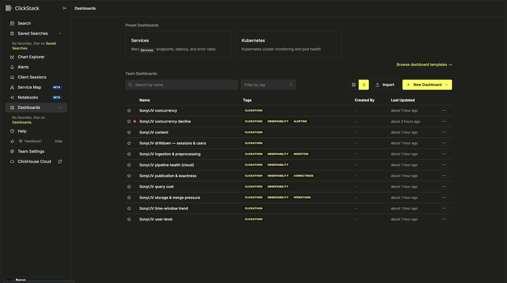
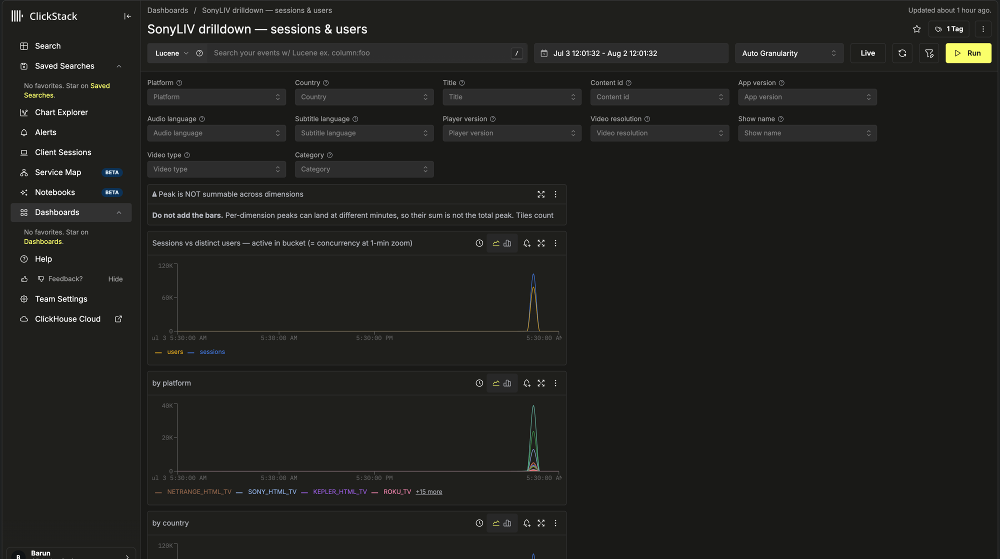
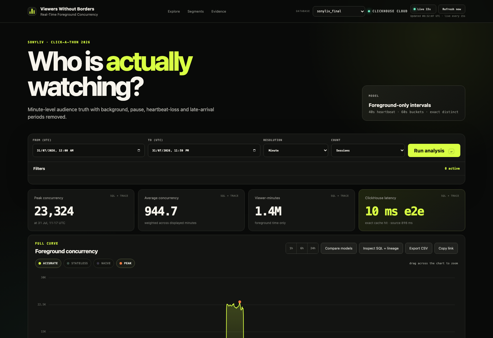

# OptimizePrime

## Track

**SonyLIV** — *Counting the crowd: foreground-only concurrency at streaming scale.*

## Project

**Viewers Without Borders** — count the people who are *actually watching*, minute by
minute, and prove it against the raw events.

## Team Members

- Barun Debnath ([@d-cryptic](https://github.com/d-cryptic))
- Mitali Laroia

## What it does

Counts how many viewers are **actively watching** each minute — excluding backgrounded,
paused and heartbeat-missing time — from session start/end events plus one-minute
heartbeats.

The tempting reading is that a session is "on" from its first event to its last. That
reading always over-counts: someone backgrounds the app, pauses, or loses signal, and the
session object survives all three while the viewer does not.

**Two signals are required, and this is the core modelling insight:**

- **Heartbeat gaps catch backgrounding** — heartbeats effectively stop while an app is
  backgrounded (**0.047/min**, against **4.72/min** while active).
- **Explicit pause/resume is required for pausing**, because heartbeats *survive* a pause
  (**0.756/min**). Gaps alone therefore cannot find paused time; it is excluded explicitly.

A model built on gaps alone silently counts every paused viewer as watching — and looks
perfectly healthy while doing it.

### Results on the official unseen file

| | |
|---|---|
| Events | 7,000,000 |
| Landing | lossless — `ev_landing` 7,000,000 = `ev_raw` 7,000,000 + **0** cast rejects |
| Semantically quarantined | **3** (`ts_out_of_range`) — kept in a table with a reason, not dropped |
| Output dates | 102, built as Cloud-legal chunks of 64 + 38 |
| **Reconciliation** | **3,201,716 minutes compared · 0 mismatched · max_abs_diff 0** |
| **Peak concurrency** | **23,324** @ 2026-07-31 11:17 UTC (sessions) · **22,279** @ 11:16 (distinct users) |
| **Time-weighted average** | **944.6986** (sessions) · 903.9986 (users) |
| Busiest hour, average | 11,277.43 (hour 11:00) |

The user peak lands **one minute before** the session peak — a real property of the data
that a summed or averaged tier would hide.

**Latency (ClickHouse Cloud, median of three, cache off):** promoted tiers **10–210 ms**,
the `uniqExact` user tier **252–323 ms**, and the single un-promoted fallback
(`video_resolution`) **6,949 ms**. That last figure is reported rather than hidden — it is
the honest cost of answering on a dimension that arrived *with* the unseen file and was
never pre-aggregated.

**The unseen day is 2026-07-31 UTC.** The file carries events on 189 calendar dates, but
one date holds **99.088%** of them and peaks at 23,324 against a next-best of 23 — a factor
of a thousand. We model all 102 derived dates anyway; dropping the tail would be choosing
the convenient number over the correct one.

**Two properties judges should not have to discover:** peak concurrency is **not summable
across dimensions** — the 19 per-platform peaks sum to 24,025 (+3.01%) and their maximum is
7,163 (−69.29%), both wrong in opposite directions against the true 23,324 — and average
concurrency is **time-weighted**, not a mean of per-minute values.

## Hosted Demo

**https://viewers-without-borders.barundebnath.com**

Live, reads ClickHouse Cloud, renders the full concurrency curve with working dataset
filters and a JUDGE MODE panel that traces any number back to its SQL and its
`system.query_log` record.

> **Set the range to `2026-07-31 00:00 → 23:59 UTC`.** The unseen day holds 99.088% of the
> data; outside that window the panels are legitimately empty.

## Demo Video

**https://www.loom.com/share/5523c9515614477fbb671268b1cd0676**

A recorded walkthrough of the live dashboard: the foreground concurrency curve for the
unseen day, the model comparison against the naive session-span reading, dataset filters
changing the curve, and ClickStack running.

## Architecture

Full document: [`docs/ARCHITECTURE.md`](docs/ARCHITECTURE.md) · every design decision with
its trade-off: [`docs/adr/`](docs/adr/) · one-page animated overview:
[`docs/artifacts/2026-08-02-solution-atlas.html`](docs/artifacts/2026-08-02-solution-atlas.html).

```
raw CSV ─▶ ev_landing         lossless, all-String, header-aware
   │                          a malformed row costs a row, not the file;
   │                          an unknown column survives in a Map
   ├─▶ ev_quarantine          3 rows · ts_out_of_range · kept WITH A REASON
   ▼
ev_raw (typed)  ORDER BY (video_session_id, event_timestamp)
   │
   ├─▶ session_intervals      ACTIVE ranges per session
   │     · heartbeat gap > 150 s closes a range   (backgrounding: heartbeats STOP)
   │     · explicit pause→resume subtracted       (pause: heartbeats SURVIVE)
   │     · ReplacingMergeTree(build_version) — re-derivation REPLACES; ranges may shrink
   │
   ├─▶ cc_minute_delta        +1 at open, −1 at close, HOUR-CLIPPED
   │     each hour's running sum is absolute — no query ever scans from t=0
   │     139,925 rows describe 3.2 million minutes
   │
   ├─▶ cc_hour_agg            peak + integral per hour, over a dimension cube
   │     peak is maxable over time but NOT summable across dimensions
   │
   ├─▶ cc_user_minute         USER concurrency — uniqExact states, never summed deltas
   │     (uniq's HLL sketch carries 1–2% error; unacceptable for a headline number)
   │
   └─▶ window + content views rolling / tumbling / range; catalogue by dictionary join
```

**The gate is what makes the numbers trustworthy.** [`tools/reconcile.sh`](tools/reconcile.sh)
recomputes concurrency **from raw events only**, using a *different implementation of the
same spec* — window functions rather than array splitting — so an error in one shows up
instead of cancelling out. It never reads the serving tables, and it fails when zero
minutes are compared, so a gate that cannot see its data cannot pass by silence. That is
exactly the spot-check the judges perform, run against ourselves on every change.

### ClickStack's role in the pipeline

ClickStack is not decoration here; it is the serving and observability surface.

- **Dashboards** read the ClickHouse Cloud service (database `sonyliv_final`) through
  declared sources — the concurrency curve, the three model comparisons, the 12 dimension
  filters, quarantine counts and publication state.
- **Our own pipeline is instrumented into it** — ingestion lag, build timing, watermark and
  the reconcile gate emit OTLP, so the dashboards show the *pipeline's* health beside the
  *product's* numbers.
- **Destination split, stated plainly:** the dashboards **read** Cloud `sonyliv_final`,
  while OTLP telemetry **writes** to the ClickStack container's bundled ClickHouse
  (`otel_metrics_gauge` / `otel_logs` / `otel_traces`), because the Cloud service exposes
  no OTLP endpoint. A reader would reasonably assume one destination; it is two.

### The ClickHouse query behind the curve

The curve is the **hour-partitioned running sum of signed minute deltas**. This is the whole
concurrency model in one statement — 1,440 minute buckets for the unseen day, from a table of
139,925 rows:

```sql
WITH series AS
(
    SELECT minute,
           toInt64(sum(d) OVER (PARTITION BY toStartOfHour(minute) ORDER BY minute
                                ROWS BETWEEN UNBOUNDED PRECEDING AND CURRENT ROW)) AS concurrent
    FROM
    (
        SELECT minute, sum(delta) AS d
        FROM cc_minute_delta
        WHERE minute >= '2026-07-31 00:00:00' AND minute < '2026-08-01 00:00:00'
        GROUP BY minute
        ORDER BY minute
          WITH FILL FROM toDateTime('2026-07-31 00:00:00')
                     TO toDateTime('2026-08-01 00:00:00') STEP toIntervalSecond(60)
    )
)
SELECT max(concurrent)                                        AS peak,
       argMax(minute, (concurrent, -toInt64(toUInt32(minute)))) AS peak_minute,
       sum(concurrent) * 60                                   AS integral,
       round(sum(concurrent) * 60 / 86400, 4)                  AS avg_concurrent
FROM series
```

**Three details that are load-bearing, not incidental:**

- **`PARTITION BY toStartOfHour(minute)`** is why this is fast and why it is *correct at any
  range*. Deltas are hour-clipped at write time, so each hour's running sum starts from zero and
  is absolute — the query reads one hour of deltas per hour displayed, never the history before it.
- **`WITH FILL` on the *delta*, inside the subquery, never on the level.** `cc_minute_delta` stores
  only change points, so a minute with no row means "no change", not "no viewers". Filling the
  delta with 0 densifies correctly; filling the *level* with `INTERPOLATE` would invent viewers
  across an hour boundary.
- **`argMax(minute, (concurrent, -minute))`** breaks peak ties toward the **earliest** minute, so
  the reported peak minute is deterministic rather than dependent on scan order.

The filtered variants, the hour and day grains, the user tier and the cross-checks are all in
[`evidence/submission/queries/`](evidence/submission/queries/) — 27 queries, each with the
`query_id` that produced its numbers.

### ClickStack, captured

**Eleven dashboards, deployed as code** from [`tools/clickstack-cloud.sh`](tools/clickstack-cloud.sh)
— concurrency, drilldown, content, time-window trend, pipeline health, query cost, user-level,
ingestion & preprocessing, publication & exactness, storage & merge pressure, and concurrency
decline alerting.



**The drilldown, with all 12 dataset filters** bound to real columns — platform, country, title,
content id, app version, audio language, subtitle language, player version, video resolution, show
name, video type, category. The first tile is a standing warning that **peak is not summable across
dimensions**, because the tiles below it are per-dimension and adding them would be wrong.



**The product UI**, reading ClickHouse Cloud live — peak **23,324**, time-weighted average
**944.7**, the unseen day selected, and a per-panel "SQL + trace" control that opens the exact
query and its `system.query_log` record.



Wiring, all committed: [`deploy/`](deploy/) (compose files) ·
[`.env.example`](.env.example) (secrets redacted, no real values) ·
[`tools/clickstack-cloud.sh`](tools/clickstack-cloud.sh) (sources and dashboards as code) ·
[`docs/CLICKSTACK.md`](docs/CLICKSTACK.md) · [`docs/OBSERVABILITY.md`](docs/OBSERVABILITY.md) ·
[`docs/CLICKSTACK_SUBMISSION.md`](docs/CLICKSTACK_SUBMISSION.md).

## Dataset filters, and the columns behind them

Full mapping with measured cardinalities, filtered peaks and query IDs:
[`docs/FILTERS.md`](docs/FILTERS.md). Unfiltered baseline **peak 23,324 @ 11:17**.

| Filter | Column · table | Filtered peak | Moves the curve? |
|---|---|---:|---|
| Platform | `platform` · ev_raw | 7,159 | −69.3% |
| **Country** | `country` · ev_raw | 23,324 | **no — see below** |
| Title | `title` · content_dim | 9,143 | −60.8% |
| Content ID | `content_id` · ev_raw | 9,143 | −60.8% |
| App version | `app_version` · ev_raw | 4,922 | −78.9% |
| Audio language | `audio_language` · ev_raw | 11,801 | −49.4% |
| Subtitle language | `subtitle_language` · ev_raw | 18,257 | −21.7% |
| Player version | `player_version` · ev_raw | 18,958 | −18.7% |
| Video resolution | `extra['video_resolution']` · ev_raw | 5,289 | −77.3% |
| Show name | `extra['show_name']` · content_dim | 9,179 | −60.6% |
| Video type | `video_type` · content_dim | 10,778 | −53.8% |
| Category | `category` · content_dim | 9,317 | −60.1% |

**`Country` is a dead filter, and we say so rather than remove it.** `country` is the
constant `'india'` in all 7,000,000 rows, so filtering on it returns the identity curve —
same peak, same minute, same support. The requirement that filters alter the curve is met
by **11 of 12, not 12 of 12**. We keep the control visible because geography is a named
example dimension and a judge should see `india` and understand the dataset is single-geo.

**New dimensions arrive without a migration.** `video_resolution` and `show_name` came
*with* the unseen file. Unknown columns land in a `Map` and become filterable the same day
— via the generic fallback path, whose cost is reported above rather than hidden.

## How we built it

- **ClickHouse Cloud** — the whole model. `ReplacingMergeTree(build_version)` for intervals,
  `AggregatingMergeTree` for minute deltas, exact `uniqExact` states for the user tier, and
  a `COMPLEX_KEY_HASHED` dictionary for the catalogue join.
- **ClickStack / HyperDX** — dashboards as code, and OTLP for our own pipeline telemetry.
- **Go** — the hosted dashboard, the reconcile parser, config resolution and the OTLP
  emitter (`cmd/`, `internal/`). `make ci` runs lint plus `go test -race`.
- **Bash + SQL** — every pipeline stage is a committed, re-runnable script in `tools/`, and
  the SQL is the source of truth rather than an ORM.

Things worth knowing about the implementation:

- **One policy declaration.** Every tuned constant lives in
  [`policy/model.policy`](policy/model.policy), is generated into SQL, and a linter fails
  the build if any consumer re-introduces a literal. Every answer names the policy version
  and hash that produced it.
- **Hour-clipping is why it is fast.** Clipping each interval to every hour it touches makes
  a query read one hour of deltas rather than all history — measured flat at
  **2.1–17.2 ms** across 1×, 10× and **100×** the audience.
- **What breaks first is named, not guessed.** At 100× (89,850,838 events) the *interval
  build* fails at default settings and needs spill plus two threads; serving does not move.
  See [`evidence/scale.txt`](evidence/scale.txt).
- **Cloud pins `max_partitions_per_insert_block` read-only at 100.** 102 output dates exceed
  it, and raising it in `SETTINGS` returns `Code: 452` unconditionally — a second failure,
  not a fix. Solved with a bounded date-chunk build.
- **Determinism has evidence.** The 27-query result matrix ran on a local container and on
  Cloud: **26 of 27 byte-identical** across two ClickHouse versions, two engine families and
  3 vs 10 threads.

## How to run it

```bash
cp .env.example .env          # fill in your ClickHouse Cloud host / user / password
tools/fetch_data.sh           # data is NOT committed; pulls from the organiser's public repo

make ci                       # build + lint + go test -race
tools/apply-sql.sh sql/*.sql  # schema
tools/load.sh                 # load the CSVs
tools/build-model.sh          # intervals -> deltas -> hour cube -> user tier
tools/reconcile.sh            # THE GATE — fails on any mismatch against raw

tools/test-all.sh --fast      # the full suite
make stack-up && make clickstack   # ClickStack + dashboards
```

Verified on a **fresh clone with no `.env`**: `demo/run.sh --offline` exits 0, and `make ci`
exits 0 with lint clean and `go test -race` green across all five Go packages.

## What we would tell a judge before they found it

- **`Country` is a dead filter** — constant `'india'`; 11 of 12 filters move the curve.
- **Explicit `AppBackgrounded` is not a state gate.** We detect backgrounding by heartbeat
  gap, not by the explicit marker, because the markers are sharply asymmetric (19,981
  backgrounds against 11,932 foregrounds; 46.8% never followed by a foreground). We measured
  the alternative end to end: it moves the peak by **17 of 23,324** and is **92.4%
  redundant** with the gap rule. The same measurement surfaced a larger effect we had not
  been looking for — tail credit past a *terminal* background, worth **−202**. Together they
  bound the exposure at **0.72%** of counted hours and **0.91%** at peak. We ship the
  reconciled reading and disclose the bound.
  ([ADR 0035](docs/adr/0035-explicit-appbackgrounded-is-not-a-state-gate.md))
- **The peak *minute* is less stable than the peak *value*.** 11:17 leads 11:16 by six
  viewers, and every alternative reading we tested reverses that ordering.
- **Session identity is not clean.** 159 session IDs carry more than one start epoch and 303
  carry more than one user, so grouping on the session alone can merge separate incarnations.
- **Point activity is an open semantic choice**, measured both ways and awaiting a call
  ([ADR 0031](docs/adr/0031-point-activity-user-attribution-and-the-densify-recipe.md)).

## Artifacts in this folder

| | |
|---|---|
| `pitch-deck.pdf` | 13-slide pitch deck (the mandatory PDF) |
| `deck/final/deck.html` | the same deck, animated, opens offline |
| `docs/artifacts/2026-08-02-solution-atlas.html` | one-page animated atlas: lineage, algorithm, model, query path, scale, evidence |
| `evidence/submission/` | the full result matrix, 27 queries verbatim, `system.query_log` extracts |
| `evidence/unseen/` | the official unseen run, end to end |
| `docs/FILTERS.md` | filter → column mapping, with proof each one moves the curve |
| `docs/adr/` | 39 architecture decision records |

**No credentials are committed.** `.env` was never committed, and the ClickHouse Cloud
password appears in **0 files and 0 commits** — verified by scan before this folder was
published. The service hostname *does* appear in evidence files, deliberately: the
submission contract requires identifying the destination service and tables.
