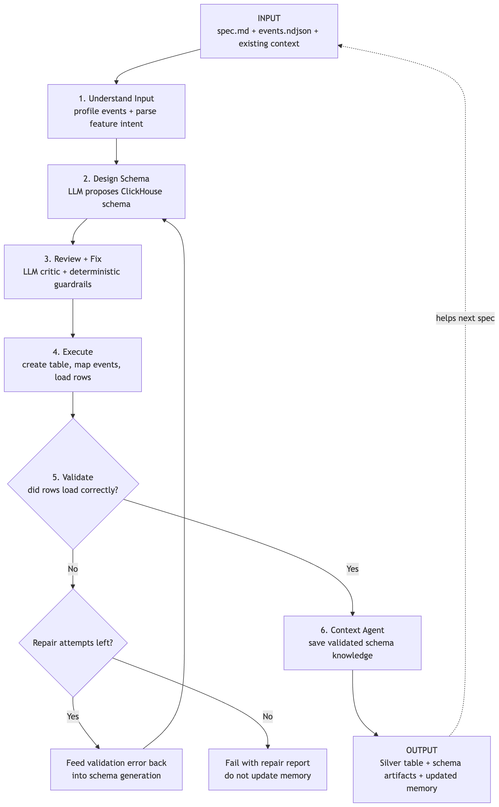
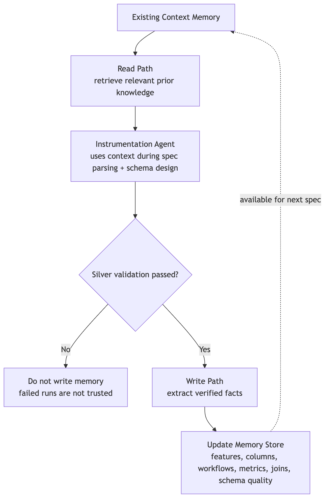
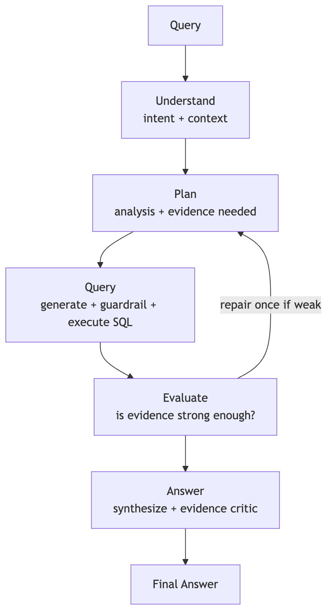

# Schema Kings — Architecture

## What we’re building

Atlys ships product fast; every feature still needs instrumentation, schema design, and analysis — and context dies in handoffs.

**Schema Kings** collapses that into one agentic loop on ClickHouse:

1. Instrument a feature from `spec.md` + sample events
2. Persist only _validated_ knowledge into a living context layer
3. Answer PM questions with warehouse-backed, evidence-checked insights

Every run is traced in Langfuse. The hosted demo is `pnpm cli serve` on Render talking to **ClickHouse Cloud** + **Langfuse Cloud**.

---

## How the three agents hand off

There is no separate “orchestrator microservice.” One pipeline, three roles, shared ClickHouse memory.

| Step | Who                 | What happens                                                                                                                                               |
| ---- | ------------------- | ---------------------------------------------------------------------------------------------------------------------------------------------------------- |
| 1    | **Instrumentation** | Spec + NDJSON → Bronze → LLM schema (+ critic/guardrails) → Silver (+ Gold). On load failure, repair loop; on exhaustion, **fail without writing memory**. |
| 2    | **Context**         | Runs only after Silver validation. Reads prior `context.*` into design; writes registries/facts only for trusted runs. Next specs inherit that memory.     |
| 3    | **Analytics**       | PM question → load `ContextBundle` + warehouse → plan → guarded SQL → evaluate evidence (one repair) → synthesize + evidence critic → report.              |

**Handoff medium:** ClickHouse itself — `silver.*` / `gold.*` for data, `context.*` for memory, `ops.job_artifacts` for run evidence the UI reads. Analytics never trusts a failed instrumentation run’s “almost schema.”

Per-agent control flow is in the diagrams below (under `source_code/assets/`).

---

## Instrumentation Agent

Turns a feature spec into a real Silver table the rest of the system can trust.

**Design choices:** LLM proposes schema; an LLM critic + deterministic guardrails review before DDL/load. Validation failures feed back into schema generation while repair attempts remain. Failed runs leave context untouched so bad schemas don’t poison memory.

**Code:** `source_code/backend/src/pipeline/instrumentation/` · `cli run`

---

## Context Agent

Shared memory for “what features exist, how they join, what’s contradictory” — not a chat log, not a vector DB.

### Where it’s stored (and why)

All context lives in ClickHouse database **`context`**:

| Table                             | Holds                       |
| --------------------------------- | --------------------------- |
| `context.context_documents`       | Source docs / narratives    |
| `context.feature_registry`        | Instrumented features       |
| `context.fact_registry`           | Business facts + confidence |
| `context.contradictions`          | Open conflicts              |
| `context.column_registry`         | Column semantics            |
| `context.workflow_registry`       | Funnel / workflow shapes    |
| `context.metric_registry`         | Metric definitions          |
| `context.join_registry`           | Join paths                  |
| `context.schema_quality_registry` | Quality notes               |

**Why ClickHouse (not files / vectors):** same engine as the warehouse — agents retrieve with SQL, judges can `SELECT` freshness via `updated_at`, and context stays co-located with Bronze/Silver/Gold with zero sync layer. Write path is gated: **no Silver pass → no memory write**.

DDL: `source_code/infra/clickhouse/init/02_context_and_ops.sql` · code: `source_code/backend/src/pipeline/context/`

---

## Analytics Agent

Answers product questions the way a PM would use them: pattern + _why_, with numbers and a critic that strips unsupported claims.

**Design choices:** Context shapes the plan; SQL is generated under guardrails (read-only execution). Weak evidence triggers **one** repair back to plan. Final prose goes through an evidence critic before it lands in the report / Ask UI.

**Code:** `source_code/backend/src/pipeline/analytics/` · `cli ask` / `POST /api/ask`

---

## Hybrid trust model

| LLM is allowed to draft           | Deterministic code decides                |
| --------------------------------- | ----------------------------------------- |
| Schema intent, SQL, insight prose | Retrieve context; gate `context.*` writes |
| Plans and critic suggestions      | Block mutating SQL; run queries           |
| Explanations for PMs              | Validate loads; strip unsupported claims  |

Rule of thumb: **event evidence and ClickHouse results beat context; context beats guessing.**

---

## Data & artifacts

**Medallion path:** `bronze.*` (audit) → `silver.*` (validated feature tables) → `gold.*` (MVs / aggregates).

**Run artifacts:** `ops.job_artifacts` keyed by `(job_id, stage, filename)`. Local Docker and Cloud use the same table via `CLICKHOUSE_*`. The report UI assembles from ClickHouse at request time — no baked `demo_artifacts` for deploy.

---

## LLM provider

**Groq** (OpenAI-compatible chat API) — `source_code/backend/src/pipeline/groq.ts`.

| Env                                                           | Role                                               |
| ------------------------------------------------------------- | -------------------------------------------------- |
| `GROQ_API_KEY`                                                | Required                                           |
| `GROQ_MODEL`                                                  | Heavier stages (default e.g. `openai/gpt-oss-20b`) |
| `GROQ_SCHEMA_MODEL` / `GROQ_CRITIC_MODEL` / `GROQ_FAST_MODEL` | Faster paths (e.g. `llama-3.1-8b-instant`)         |

**Why Groq:** multi-stage agent loops (design → critic → analytics → evidence) need low latency; we stay on hosted inference without self-hosting GPUs.

---

## Langfuse tracing

OpenTelemetry + `@langfuse/otel` — `source_code/backend/src/tracing/langfuse.ts`.

| Env                                           | Role                                         |
| --------------------------------------------- | -------------------------------------------- |
| `LANGFUSE_PUBLIC_KEY` / `LANGFUSE_SECRET_KEY` | Auth                                         |
| `LANGFUSE_BASE_URL`                           | Local Docker or `https://cloud.langfuse.com` |
| `LANGFUSE_PROJECT_ID`                         | Deep-links in the report UI                  |

**Trace roots:** `schema-kings.pipeline` (instrumentation), setup bootstrap, `schema-kings.analytics_ask` (analytics). Report UI links via `report/langfuseUrl.ts`. Hosted demo uses Langfuse Cloud so judges can open traces (no `localhost`).

We did **not** integrate ClickStack / LibreChat — Langfuse + the report UI cover tracing and visualization for this track.

---

## Visualization (demo surface)

`pnpm cli serve` → `source_code/backend/src/pipeline/report/server.ts`

| Route             | Behavior                                                 |
| ----------------- | -------------------------------------------------------- |
| `GET /`           | Assemble overview from `ops.job_artifacts` → HTML report |
| `POST /api/ask`   | Run Analytics Agent → refresh report                     |
| `GET /api/health` | Deploy health check                                      |

Live: [schema-kings.onrender.com](https://schema-kings.onrender.com)
