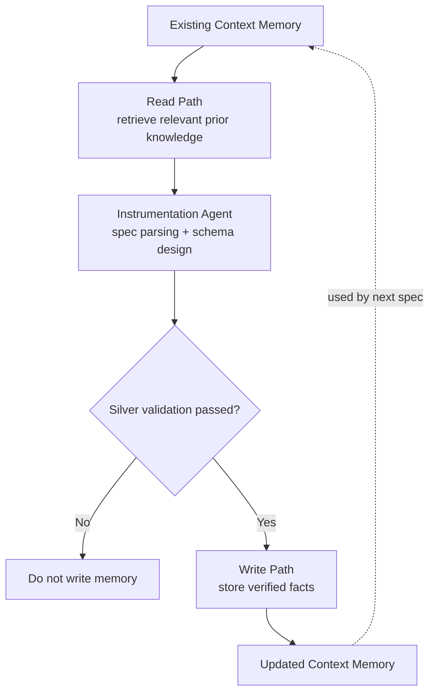

# Context Layer

This file explains the current context and memory layer used by the pipeline.

The context layer is the shared memory system. It gives the Instrumentation Agent useful prior knowledge before schema generation, and it writes back only validated facts after a Silver load succeeds.

## Current Entry Points

- `loadContextBundle(repoRoot)`: loads base context files and generated ClickHouse memory.
- `retrieveRelevantContextForSpec(...)`: picks the most relevant memory for the current spec.
- `updateGeneratedContext(...)`: writes validated schema and feature facts after Silver validation passes.
- `bootstrapContext(repoRoot)`: manually seeds context tables from base files.
- `ensureContextTables()`: creates the `context.*` ClickHouse tables.

`backend/src/pipeline/context.ts` is now only a compatibility barrel that re-exports the context module. New context code should live under `backend/src/pipeline/context/`.

## Module Layout

- `context/types.ts`: shared context and registry types.
- `context/tables.ts`: ClickHouse `context.*` table creation.
- `context/bootstrap.ts`: base document loading and bootstrap entrypoints.
- `context/read.ts`: generated context reads from ClickHouse.
- `context/write.ts`: validated memory writes.
- `context/retrieve.ts`: deterministic relevant-context retrieval.
- `context/sql.ts`: JSONEachRow insert helper.
- `context/utils.ts`: parsing, tokenization, and scoring utilities.
- `context/index.ts`: public exports for the context module.

## Read Path

The read path runs before schema generation.

Inputs:

- `base_context.md`
- `data/ddl.sql`
- `data/instrumentation_notes.md`
- existing generated memory from ClickHouse `context.*` tables

Output:

- `ContextBundle`
- compact relevant context for the spec parser and schema design prompt

Current retrieval is deterministic. It scores memory using feature slug, workflow type, entity name, event names, raw field paths, and metric hints. It is not vector search yet.

## Write Path

The write path runs only after the Silver Loader validates the loaded rows.

If validation fails, context memory is not updated.

Validated writes include:

- feature memory
- feature facts
- column memory
- workflow memory
- metric memory
- join memory
- schema quality memory

This is intentional. The memory layer should not learn from failed generated schemas.

## Context Tables

Current ClickHouse memory tables:

- `context.context_documents`: raw base context documents and hashes.
- `context.feature_registry`: generated feature-level memory.
- `context.fact_registry`: lightweight subject-predicate-object facts.
- `context.contradictions`: known context issues that prompts should treat carefully.
- `context.column_registry`: column names, types, source paths, semantic roles, samples, confidence.
- `context.workflow_registry`: workflow shape, ordered events, primary entity, segment columns.
- `context.metric_registry`: reusable metric definitions and SQL sketches.
- `context.join_registry`: reusable join keys such as `user_id` and `application_id`.
- `context.schema_quality_registry`: engine, partition key, order key, TTL, MVs, validation status.

## How Instrumentation Uses Context

The Instrumentation Agent uses context in two places:

1. Spec parsing: context helps the LLM interpret feature intent and likely workflow shape.
2. Schema generation: retrieved memory gives examples of prior columns, joins, metrics, schema quality, and contradictions.

Raw event evidence still wins over context. The schema prompt explicitly treats context as useful but fallible.

## Agentic vs Deterministic

Agentic:

- LLM spec parsing uses context.
- LLM schema design uses retrieved memory.
- LLM schema critic can challenge context-backed decisions.
- Failed load/validation feedback is sent back into schema generation for one repair retry.

Deterministic:

- context table creation
- base document ingestion
- retrieval scoring
- memory writes
- contradiction seeding
- validation gate before memory writes

This is a hybrid design on purpose. The LLM reasons over memory, but deterministic code decides what becomes trusted memory.

## Gap & Known-Issue Detection

After every validated Silver load, `detectAndWriteContextGaps` (deterministic) compares the new schema and feature semantics to base expectations and seeds open rows into `context.contradictions`:

- missing `user_id` / `application_id` (blocks base-funnel joins)
- missing all common segment dimensions
- ETA field naming mismatches (`visa_issuance_eta_days` vs `eta_shown`)
- metric hints that imply latency/device cuts without matching columns
- **known-issue links** from `base_context.md` (K1 iOS OTP, K2/K3 passport, K5 recovery, K6 coupons, …) when the feature touches those areas

Bootstrap also writes structured **known_issue** facts into `context.fact_registry` so analytics can retrieve them.

Feature registry table names are stored as `silver.<feature>_events`. Join registry stores **explicit** edges to each base funnel/support table (not only wildcards).

## Current Limitations

- Retrieval is keyword/rule based, not semantic or vector based.
- Memory writes are deterministic, not handled by a separate memory agent.
- There is no confidence decay over time.
- Conflict resolution is detect-and-surface only — it does not auto-merge competing definitions.
- Context reads are broad registry reads with limits, not per-query indexed retrieval.
- Some metric SQL sketches are useful starting points, not final analytics-grade SQL.

## Module Boundaries

The important boundary is:

- read/retrieve code prepares memory for agents
- write code stores only validated facts
- table setup code stays separate from agent behavior

## Simple Flow

