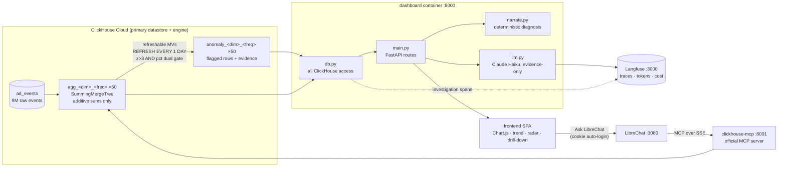
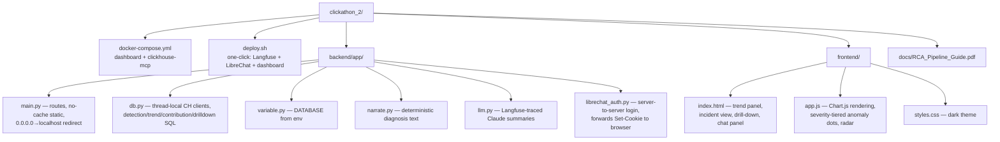

# Root-Cause Analyst — InMobi Click-a-thon 2026

> **From alert to answer:** a metric moves, and this system tells you *why* — which
> segment, which funnel factor, backed by numbers a judge can re-run, in seconds.

Built on **ClickHouse Cloud** (all analysis lives in SQL), visualized by a
FastAPI + Chart.js dashboard, narrated by a constrained LLM, traced end-to-end
in **Langfuse**, and explorable conversationally through **LibreChat + the
official ClickHouse MCP server**.

## Track

InMobi

## What it does

Root-causes ad-metric anomalies automatically: ClickHouse detects the
deviation and attributes it to a funnel factor and segment, and a
deterministic diagnosis card explains it in plain language, backed only by
numbers ClickHouse computed.

## Technology integration

| Tool | Role in this project |
|---|---|
| **ClickHouse Cloud** | Primary datastore *and* the only place computation happens — raw events, 50 SummingMergeTree rollup tables, and 50 refreshable materialized views score every (segment, bucket) against a like-for-like baseline. Every number shown anywhere in the dashboard is server-computed in ClickHouse, never in application code. |
| **MCP (Model Context Protocol)** | The official ClickHouse MCP server is embedded in LibreChat, giving it live SQL access to the same `agg_*`/`anomaly_*` tables — so a judge's follow-up question in plain English runs as a real, auditable query, not a canned answer. |
| **Langfuse** | Full investigation tracing: every incident fetch, drill-down query, trend query, and LLM generation (with token usage and cost) lands as a nested span. A judge can open any diagnosis and walk backwards to the exact queries that produced every number — *no trace, no credit*. |
| **LibreChat** | Embedded conversational layer with auto-login (no signup friction for judges), armed with the ClickHouse MCP server, enabling open-ended natural-language drill-down beyond the fixed dashboard views. |

## Team & submission links

| | |
|---|---|
| Team name | `Quvia` |
| Team members | `Ganesh`, `Parasayya`, `Syam`, `Richard` |
| Public repo (MIT) | `https://github.com/RichardMairembam/click-a-thon-26-submissions-quvia/tree/main/quvia` |
| Hosted demo | `http://20.83.176.60:8000/` |
| Demo video (≤5 min) | `https://drive.google.com/file/d/1Nw7cosQbQJhdDbPw5iwwUqawd0CrHt9b/view?usp=sharing` |

---

## Solution summary

When a business metric jumps or drops, the alert only says *that* it moved.
The expensive part is the investigation: slicing the metric across app,
device, geo, and advertiser dimensions to find the segment responsible, and
producing an explanation someone can trust. We automated that loop — with the
firm rule that **ClickHouse computes, the LLM only narrates**.

**Detection lives inside ClickHouse.** Raw ad events are rolled into
per-dimension aggregate tables (`agg_<dimension>_<freq>`, SummingMergeTree —
plain additive sums; ratio metrics are always computed sum/sum at query time
so rollups stay correct). On top of these, **refreshable materialized views**
re-score every (segment, bucket) daily against a like-for-like baseline:
window-partitioned by segment × weekday-or-weekend class × time-of-day, over
all prior history *excluding the current row*. A row is flagged only if it
clears a **dual gate**: statistically surprising (|z| > 3 against the
segment's own historical noise) **and** practically material (percent
deviation above a per-metric floor). The z-gate self-calibrates per segment —
noisy low-volume segments automatically carry a higher bar — while the
percent-gate stops microscopic wobbles on ultra-stable series from flagging.
Requests, revenue, fill rate, and eCPM are scored independently, so every
incident is immediately attributed to its funnel factor (volume, fill, or
price) via the revenue identity 

**Explanation is deterministic first, LLM second.** The diagnosis card is
generated by plain code reading numbers ClickHouse already computed — it
cannot hallucinate. The optional Claude summaries receive *only* the exact
JSON the dashboard has already rendered, with a hard instruction to phrase
those numbers and never invent a figure or a cause. Contribution analysis
ranks every dimension's segments by signed share of the deviation, which is
also how the system distinguishes **localized** incidents ("Android 15 fill
rate −45%, all other OS versions at baseline") from **platform-wide** ones
(every segment's share ≈ its traffic share) — and it reports what it
**ruled out**, not just what it found.

**Traceability is structural.** Every investigation step — incident fetch,
drill-down, trend query, and each LLM generation with token usage and cost —
lands in Langfuse. A judge can open any diagnosis and walk backwards to the
queries that produced every number. For open-ended follow-ups, an embedded
LibreChat (auto-login, no signup) carries the official ClickHouse MCP server,
so "show me fill rate by OS on June 24" becomes live SQL against the same
database — the agent queries data instead of guessing.

On the provided dataset the system recovers the planted incidents — the
platform-wide June 21 request collapse, the finance-category eCPM drop, the
Android 15 and iOS 18.1 fill-rate failures, and the gradual tier-3 CTR decay —
and the same pipeline, unchanged, processes the unseen incident: load, refresh,
diagnose, with traces as proof.

---

## How this maps to the problem statement

The InMobi brief asks for four things ([PROBLEM_STATEMENT.md](../PROBLEM_STATEMENT.md)):

| Ask | How we do it |
|---|---|
| **Detect** deviations from baseline | Refreshable MVs in ClickHouse score every (segment, bucket) against a rolling like-for-like baseline; dual gate `abs(z) > 3` **and** percent-deviation floor |
| **Automatically drill down** to the responsible segment | Signed contribution analysis across 9 dimensions, ranked per dimension; radar + drill-down in the dashboard |
| **Plain-language diagnosis, every claim backed by a computed number** | Deterministic diagnosis card built from query results; optional LLM summary constrained to the same JSON |
| **Bonus: state what was ruled out** | Factor decomposition names the funnel factor responsible *and* the metrics/dimensions that stayed at baseline |

And the two hard requirements:

- **ClickHouse is the primary datastore and analytical engine** — all raw
  events, aggregates, and anomaly scoring live in ClickHouse; every number on
  screen is server-computed.
- **Meaningful integration of ClickStack / Langfuse / LibreChat** — we use
  **two**: Langfuse (full investigation + LLM tracing) and LibreChat
  (embedded, MCP-armed conversational drill-down).

## Architecture & data flow



## Codebase map



## Run it

```bash
cp .env.example .env        # fill in ClickHouse Cloud + (optional) Anthropic keys
./deploy.sh                 # brings up Langfuse, LibreChat, dashboard + MCP
```

Required environment (see `.env.example`):

| Variable | Value |
|---|---|
| `CLICKHOUSE_HOST` | your ClickHouse Cloud host |
| `CLICKHOUSE_USER` / `CLICKHOUSE_PASSWORD` | service credentials |
| `ANTHROPIC_API_KEY` | optional — enables AI summaries |
| `LANGFUSE_PUBLIC_KEY` / `LANGFUSE_SECRET_KEY` | from your Langfuse project |


**Judge flow (2 minutes):** open the dashboard → the trend chart lands on the
anomaly cluster with severity-colored dots → click the darkest dot
(Jun 21 06:00, z=58) → KPI strip, deterministic diagnosis, factor tiles, and
the dimension-impact radar unfold → click a radar axis to drill into a
dimension → "Generate AI summary" (watch the trace land in Langfuse) →
"Ask LibreChat" → toggle the `clickhouse` MCP server on → ask a follow-up in
plain English.

## How we built it

**Stack:** ClickHouse Cloud (schema, rollups, anomaly-detection MVs — all
analysis lives here, nothing computed in application code beyond formatting),
FastAPI + Chart.js dashboard, Claude Haiku for evidence-constrained
narration, Langfuse for tracing, and LibreChat embedded with the official
ClickHouse MCP server for open-ended conversational drill-down.

**Interesting implementation details:**
- *Dual-gate detection*: every (segment, bucket) row must clear both a
  self-calibrating z-score bar (`|z| > 3` against that segment's own
  historical noise) and a per-metric percent-deviation floor — so noisy
  low-volume segments don't false-positive and ultra-stable series don't
  flag on microscopic wobbles.
- *Additive-only rollups*: `agg_<dimension>_<freq>` tables (SummingMergeTree)
  store only plain sums; ratio metrics (fill rate, eCPM) are always
  recomputed sum/sum at query time so rollups stay mathematically correct
  under merges.
- *Signed concentration bug*: when every segment in a dimension moves
  together (a platform-wide incident), a naive `delta/Σdelta` share
  calculation reads as deceptively concentrated in one segment. We found and
  fixed this with a `signed_concentration()` helper that re-signs shares
  everywhere they're displayed, which is also how the system tells
  "localized" incidents apart from "platform-wide" ones.
- *Evidence-only LLM boundary*: the Claude summary call receives only the
  exact JSON already rendered on screen and is explicitly instructed never
  to invent a number or a cause — the diagnosis card itself is generated by
  plain code, so a wrong figure can't reach the narrative.

## What makes the answers trustworthy

1. **Deterministic core** — detection, decomposition, and contribution are
   SQL; the diagnosis card is code formatting query results.
2. **Evidence-only LLM** — summaries receive the exact JSON already rendered
   on screen; the system prompt forbids inventing numbers or causes. A wrong
   number cannot enter the narrative because the LLM never computes one.
3. **Signed concentration** — when all segments fall together,
   `delta/Σdelta` is deceptively positive; a `signed_concentration()` helper
   re-signs shares everywhere they're shown (a real bug we found and fixed).
4. **Full tracing** — investigation spans + LLM generations (tokens, cost,
   latency) in Langfuse. *No trace, no credit — so everything is traced.*

## Results on the provided dataset

Incidents recovered on the ~9M-event / 5-week dataset, judged against our own
analysis (the official answer key is private):

| Incident | Segment named | Funnel factor | Evidence |
|---|---|---|---|
| Platform-wide request collapse | all segments, Jun 21 06:00 (z=58) | volume | |
| Finance-category eCPM drop | `category=finance` | price | |
| Android 15 fill-rate failure | `os_version=Android 15` | fill | |
| iOS 18.1 fill-rate failure | `os_version=iOS 18.1` | fill | |
| Gradual tier-3 CTR decay | `publisher_tier=3` | — | |

## The unseen incident

**Output:** `docs/unseen/` — diagnosis text, the numbers behind it, and the
Langfuse trace URLs proving the pipeline generated them. Generated on
release day — see runbook below.

### Runbook (release day)

```bash
# 1. load the fresh slice into the same raw table (MVs pick it up)
clickhouse client ... --query "INSERT INTO <raw> FORMAT Parquet" < unseen.parquet
# 2. force the refreshable MVs instead of waiting for the daily tick
clickhouse client ... --query "SYSTEM REFRESH VIEW py.mv_anomaly_<dim>_<freq>"   # per view
# 3. open the dashboard → new anomalies appear → generate diagnoses
# 4. export: diagnosis text + the Langfuse trace URLs proving pipeline provenance
```


