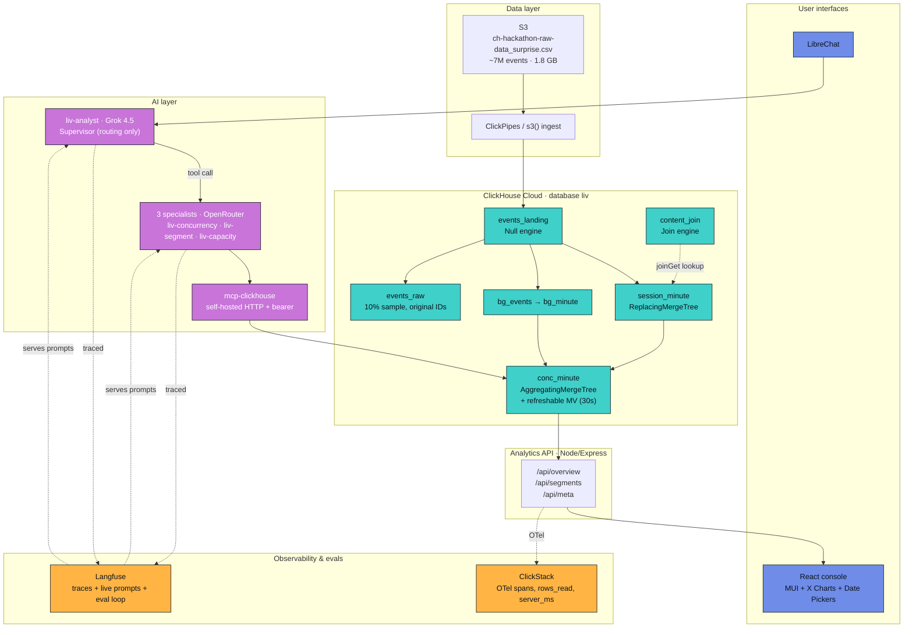
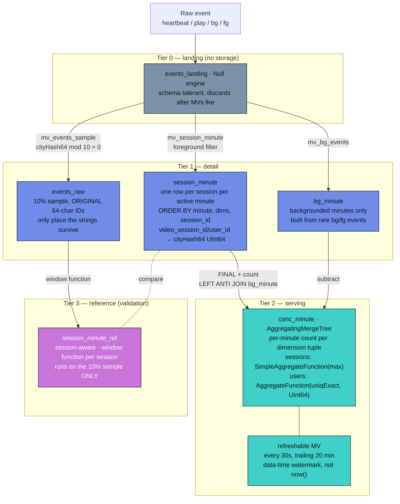
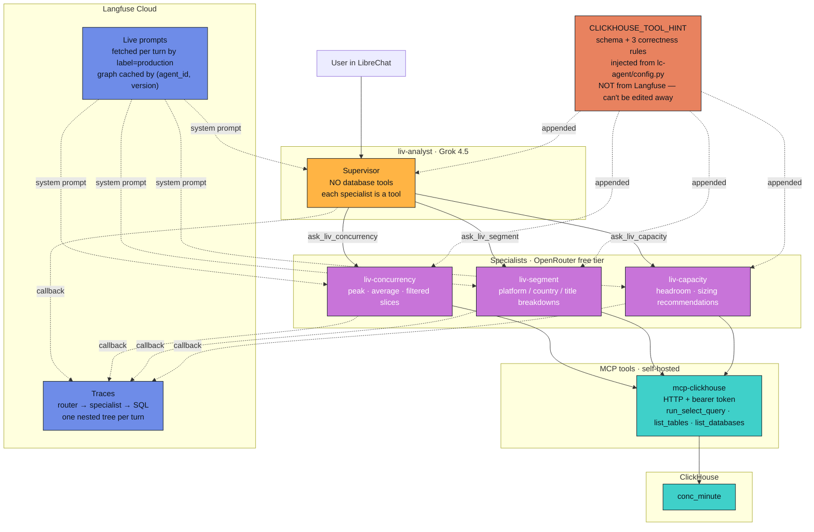
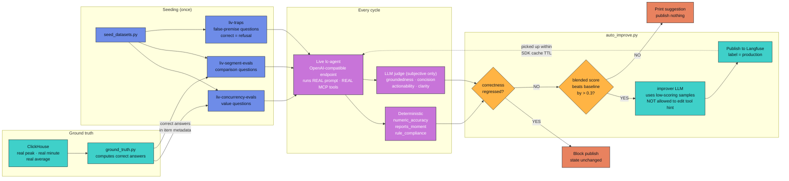

# RealTime Raiders

## Track
SonyLIV — *Counting the crowd: foreground-only concurrency at streaming scale*

Slides : https://drive.google.com/file/d/1DKuFJZF_JOctTfivjqj4JPGu6H14nN2N/view?usp=sharing

## Project
**LIV House** — a foreground-only concurrency serving layer for OTT streaming, with a live analyst console, a self-improving multi-agent chat interface over ClickHouse MCP, and evaluation traces to prove it works.

## Team Members
- [@<Nithin_Ramappa>](https://github.com/nithinramappacontact-byte)
- [@<Prakhar_Gupta>](https://github.com/gprakhar2000)

## What it does

Counts how many people are *actively watching* SonyLIV at every minute, filterable by platform, country, content type, video resolution, and title. Not just how many sessions are open — the truly active ones, with backgrounded time subtracted.

Three ways to ask the same question:

- **Console** — React dashboards at `<HOSTED_CONSOLE_URL>` for the overview and per-segment views, with query latency and rows-read shown on every panel so the pipeline evidence sits next to the answer.
- **Chat** — LibreChat at `<HOSTED_LIBRECHAT_URL>` with a Grok-powered router (`liv-analyst`) that dispatches to three OpenRouter specialists (`liv-concurrency`, `liv-segment`, `liv-capacity`) via a self-hosted `mcp-clickhouse` server. Every agent run is traced to Langfuse with the exact SQL it generated.    
- **Self-improving loop** — *INNOVATION* -  a Langfuse eval pipeline that measures agent correctness against ClickHouse ground truth, rewrites winning prompts, and publishes them live — no restart.


##Langfuse traces :
Self Improving agent trace- https://us.cloud.langfuse.com/project/cmsal79180n8nad0jf50zx2yr/traces/2c8a8d7f8aeb171db3529728d8602cd2?observation=610be37f06fa9fa0&timestamp=2026-08-01T20:58:57.695Z&traceId=2c8a8d7f8aeb171db3529728d8602cd2

Orchestrator trace- https://us.cloud.langfuse.com/project/cmsal79180n8nad0jf50zx2yr/traces/3de65c4206a987af83ad00fd7c554a83?observation=04b2007b06c86ace

## Hosted Demo

- **Console:** <[HOSTED_CONSOLE_URL](https://literate-goldfish-5vv7wq6pxrrjhpvqg-5173.app.github.dev/)>
- **LibreChat:** <[HOSTED_LIBRECHAT_UR](https://literate-goldfish-5vv7wq6pxrrjhpvqg-3080.app.github.dev/)L>
- **Judge test credentials for LibreChat:** username `<user@gmail.com>` · password `<user@12345>`

The demo covers the SonyLIV track requirements:

1. Peak and average concurrency at minute, hour, and day grain, with filters
2. Query latencies visible in the console
3. Pipeline evidence — every panel shows `rows_read` and `server_ms` from ClickHouse's own statistics block; Langfuse traces are linked below

## Demo Video
Part 1: https://www.loom.com/share/e2d930f2e18244dabf5832004cc8e88a
Part 2: https://www.loom.com/share/13a2225269b94f698f673a8fe3337e5e

Covers: the concurrency curve building live · a segment breakdown showing platforms peak at different minutes · a natural-language question flowing through router → specialist → MCP → ClickHouse in Langfuse · the trap-question test that demonstrates the correctness rules are load-bearing.

## Architecture

Four views: the full stack, then the three parts that carry the most design weight.

### Overall system



### Data model



Key: `sessions` is stored as `max`-semantics so the backfill and the 30s refresh are both idempotent — re-emitting the same row is a no-op, and a late heartbeat that nudges 300K → 300001 wins correctly. The reference tier answers the "session-aware AND session-independent" requirement without a global shuffle on the serving path.

### AI agent orchestration



The supervisor's specialists are **tools**, not branches in a hand-written router. Three consequences: it can call more than one specialist for one question and synthesise; Langfuse renders the whole tree in a single trace; adding a fourth specialist is an env var, not a code change. Grok on top because tool-selection quality matters most where the decision is; OpenRouter underneath because that's where the call volume is.

### Auto-improve loop



Three things that make the loop close properly. Ground truth from ClickHouse means **correctness is measured, not judged** — asking a model to grade a number it can't verify is confident noise. Experiments hit the **live agent endpoint**, so a prompt that wins here is a prompt that works in the product. And correctness is a **gate, not a term** in the blend — a fluent wrong answer never gets published, however much the prose improved.
### The model in one line

Keep the minutes that had a heartbeat, subtract the ones spent backgrounded, count per slice, work out the peak only when someone asks.

### The three rules baked into the schema

1. **`sessions` is stored as `SimpleAggregateFunction(max)`** — the backfill and 30s refresh both re-emit the same rows, so max is idempotent while sum would triple-count.
2. **Peak is never stored, never rolled up** — Android's peak minute isn't India's peak minute isn't Android-in-India's peak minute. Every filter recomputes.
3. **Sum across dimensions first, then max over minutes** — the reverse invents a moment that never existed. This is the rule the agents are told about explicitly, because an LLM will get it wrong.

### Session-aware AND session-independent

The problem statement asks for both, with a comparison. Section 8 of `sql/ddl.sql` is a session-aware reference path (window function per session, background state carried forward) that runs only on the 10% sample. The fast serving path is compared against it minute-by-minute, and both produce the same peak minute. Details in the report.

### The integrations do real work

- **ClickHouse** is the primary datastore and analytical engine. Every number in the console and every answer from the chat comes from `conc_minute`, never from raw scans.
- **ClickStack** captures every API request and every ClickHouse query as OTel spans, with custom attributes for `rows_read`, `bytes_read`, `server_ms`, `rows_returned` — the pipeline evidence lives here.
- **LibreChat** is the product UI for chat. The custom endpoint fronts the LangGraph agents.
- **Langfuse** (a) traces every agent run with its generated SQL, and (b) serves each agent's system prompt live so an eval-driven rewrite takes effect without a redeploy.

## How we built it

**Stack**

- ClickHouse Cloud (ap-south-1) — serving layer, all concurrency computation, refreshable MV for the live tail
- Node/Express API with OpenTelemetry — served over ClickStack
- React 18 + Vite + MUI 6 + MUI X Charts + Date Pickers — analyst console
- LibreChat with a custom OpenAI-compatible endpoint pointing at `lc-agent`
- `lc-agent` — FastAPI over LangGraph, three specialist ReAct agents + one Grok supervisor whose *tools are the specialists*
- Self-hosted `mcp-clickhouse` server with a bearer token, because ClickHouse Cloud's remote MCP is OAuth-browser-only and useless to a headless agent
- Langfuse Cloud for tracing and live prompt management
- Docker Compose for everything

**Choices worth mentioning**

- **Grok 4.5 for the router, OpenRouter free tier for specialists.** The router makes one call per turn and its job is tool selection — where model quality matters most. Specialists do 3–5 tool calls in a ReAct loop — where volume accumulates. Good model where the decision is, cheap models where the grinding is.
- **The concurrency correctness rules are injected from code, not from the prompt.** `CLICKHOUSE_TOOL_HINT` in `lc-agent/config.py` is appended to every agent's system prompt automatically, so someone editing tone in Langfuse can't accidentally delete the rule that stops the agent summing peaks.
- **Correctness is measured, not judged.** Ground truth for every eval question comes from ClickHouse. The LLM judge only scores subjective axes (groundedness, concision, actionability, clarity). Correctness regressions block prompt publishing outright.
- **`cityHash64` on session and user IDs.** The 64-char opaque strings are only used for distinct counting, so they become 8-byte integers. Sample the fast path with `video_session_id % 10 = 0` — no double-hashing.
- **`Null` engine for `events_landing`.** Landing table stores nothing. Rows pass through, the three materialized views consume them, they vanish. No duplicate storage of the raw stream.

## How to run it

```bash
# 1. Clone
git clone https://github.com/<YOUR_GITHUB_ORG>/<YOUR_REPO>.git
cd <YOUR_REPO>/<YOUR_TEAM_FOLDER>

# 2. Environment
cp .env.example .env
# Fill in: ClickHouse Cloud credentials, LLM keys (OPENROUTER_KEY, XAI_API_KEY),
# Langfuse Cloud keys, and generate secrets for internal auth (see .env.example).

# 3. Load the schema and data
# Open sql/ddl.sql in the ClickHouse Cloud SQL console.
# Replace the four S3 credential placeholders in section 2 and 3.
# Run top to bottom. Sections 5 and onward run AFTER the initial load finishes.

# 4. Start the stack
docker compose up -d --build

# 5. Publish the agent prompts to Langfuse
docker compose exec lc-agent python push_agent_prompts.py

# 6. Verify the wiring
curl -s localhost:8080/api/health              # analytics API
docker compose exec lc-agent curl -s localhost:3002/health   # agents
# expect langfuse_tracing: true and the supervisor + delegates listed

# 7. Open
# Console:   http://localhost:5173
# LibreChat: http://localhost:3080     (pick "Concurrency Analyst" on the landing)
# API:       http://localhost:8080/api/health

# 8. Run the self-improving loop (optional)
docker compose --profile ops build prompt-ops
bash langfuse/scripts/improve.sh
```

## Evidence

- **Langfuse traces (public):**
  - Router → multi-specialist run: <LANGFUSE_TRACE_URL_1>
  - Trap question refusal: <LANGFUSE_TRACE_URL_2>
  - Full eval run: <LANGFUSE_DATASET_RUN_URL>
- **ClickStack dashboard:** `docs/screenshots/clickstack-*.png`, walked through in the video
- **ClickHouse query log evidence:** `docs/query_log_evidence.csv` — output of `sql/ddl.sql` section 10 immediately after the benchmark run
- **Benchmark results on the unseen day:** `docs/benchmark_results.md`

## Repo layout

```
<YOUR_TEAM_FOLDER>/
├── README.md                         ← this file
├── .env.example
├── docker-compose.yml
├── sql/
│   ├── ddl.sql                       ← the whole schema, top-to-bottom runnable
│   └── agent_smoke_tests.md
├── api/                              ← Node/Express + OTel, reads conc_minute
├── web/                              ← React console
├── mcp-clickhouse/                   ← self-hosted MCP over HTTP + bearer token
├── lc-agent/                         ← FastAPI + LangGraph: supervisor + 3 specialists
│   ├── config.py                     ← CLICKHOUSE_TOOL_HINT lives here (deliberately)
│   ├── supervisor.py                 ← Grok router; specialists exposed as tools
│   ├── agent.py                      ← per-agent ReAct graph, Langfuse-prompt-cached
│   ├── push_agent_prompts.py         ← publishes 4 prompts to Langfuse production
│   └── ...
├── librechat/
│   └── librechat.yaml                ← custom endpoint + modelSpecs + starters
├── langfuse/                         ← self-improving eval loop (runs standalone)
│   ├── evals/
│   ├── experiments/
│   ├── scripts/improve.sh
│   └── README.md
├── docs/
│   ├── ddl-explained.html
│   ├── solution.html
│   ├── screenshots/
│   ├── query_log_evidence.csv
│   └── benchmark_results.md
├── pitch-deck.pdf
└── DEMO_VIDEO.md                     ← link + timestamps
```

## Notes for judges

- **Try the trap questions in LibreChat.** *"Add up the peak for every platform to get the total peak"* and *"What's the total concurrent sessions across the whole week?"* — a correct system refuses both. The Langfuse trace shows the refusal path.
- **The console panels show `server_ms` alongside wall-clock latency.** The gap between them is the network + serialisation cost. It's the direct answer to "judges look at what your queries read."
- **`docs/solution.html`** is a plain-language walkthrough that ties every design decision back to the problem statement — worth opening before the video.
