# Team Rudra

## Track
SonyLIV

## Project
**Livathon**: Real viewers, real time.

## Team Members
- Dhruv Thanawala (dhruv-rudra)
- Sunidhi Shende (sunidhishende)
- Hriday Keswani (hridayK)
- Fahed Khan (12fahed)

## What it does

An open app is not a watching human, and dashboards that cannot tell the difference overstate the audience that ad, capacity, and content decisions ride on. FrontRow reads the playback signals (heartbeats, pauses, backgrounding) to keep only genuinely on-screen minutes, and compacts millions of session events into a ClickHouse serving layer that answers peak and average concurrency, under any filter and at any grain, in under 25 ms, absorbing still-open sessions as they evolve. Correctness was proven twice: against an independent reference implementation on the provided synthetic day, and on **synthetically amplified data (99 M rows)** built so the expected answers stay exactly derivable, so speed never came at the cost of a wrong number.

> **Unseen-day result (2026-07-31, 7 M events):** peak concurrency **22,174**
> foreground viewers at **11:16 UTC**, computed exactly (matches an independent
> distinct-session count, 0 divergence), benchmark queries in **8-23 ms**.

| Benchmark (unseen day) | Answer | Latency |
|---|---|---|
| Peak concurrency | **22,174** (11:16 UTC) | 8 ms |
| Live-content peak / avg | 10,321 / 1,885 | 9 ms |
| Peak by platform | Android 6,518 · Jio TV 6,471 · Sony TV 3,297 | 17 ms |
| Peak by resolution | 1080p 7,156 · 720p 5,067 · 540p 3,096 | 23 ms |

Latency evidence: `system.query_log` (`query_duration_ms` plus rows/bytes read, showing queries hit the serving table, not raw history).

## Hosted Demo

**https://livathon.vercel.app/**

One place for both surfaces: the dashboard (concurrency curve + KPIs with all 11 dataset filters) and LibreChat (natural-language queries over the same tables).

**Judge credentials:** 
email: click@jurry.com
password: abcd1234

## Demo Video

https://drive.google.com/drive/folders/1RfN_xWpyJd8xCrDq24WHxcNUgBZpNfYS?usp=drive_link

## Architecture

```mermaid
flowchart LR
    classDef store fill:#eef2ff,stroke:#6366f1,color:#1e1b4b
    classDef proc fill:#ecfdf5,stroke:#10b981,color:#064e3b
    classDef biz fill:#fff7ed,stroke:#f97316,color:#7c2d12
    classDef obs fill:#f8fafc,stroke:#94a3b8,color:#334155,stroke-dasharray: 4 3

    subgraph P1["1 · Ingestion"]
        LOADER["gzip stream loader (batch)<br/>epoch to DateTime, value normalization<br/><i>ingest/load.sh</i>"]:::proc
        VECTOR["Vector collector (streaming)<br/>validate · same normalization · batch<br/>disk buffer · dead-letter<br/><i>collector/vector.yaml</i>"]:::proc
        RAW[("raw_events<br/>ReplacingMergeTree<br/>exact-duplicate dedup")]:::store
        DICT[("content_dict<br/>in-memory dictionary<br/>title · type · show · category")]:::store
    end

    subgraph P2["2 · Active-state decision"]
        MVLIVE["mv_live_sessions<br/>incremental MV, fires on every insert<br/>sticky argMax state machine"]:::proc
        LIVE[("live_sessions<br/>AggregatingMergeTree<br/>one row per session = current state")]:::store
        BACKFILL["02_backfill_hist.sql<br/>batch, event-time<br/>same state machine, reproducible"]:::proc
    end

    subgraph P3["3 · Serving storage"]
        MVREF["mv_hist_refresh<br/>REFRESH EVERY 1 MINUTE APPEND<br/>ClickHouse-native scheduler"]:::proc
        HIST[("hist_minute_full<br/>SummingMergeTree<br/>minute × full dimension tuple")]:::store
    end

    subgraph P4["4 · Business surface"]
        DASH["click-ui dashboard<br/>curve · KPIs · 11 filters · live SQL"]:::biz
        CHAT["LibreChat + ClickHouse MCP<br/>NL to SQL · on-the-fly graphs"]:::biz
    end

    subgraph OBSG["ClickStack (observability)"]
        OTEL["OTel collector"]:::obs
        HDX["HyperDX: query p95 ·<br/>rows read · ingest lag"]:::obs
    end

    CSV["Raw + content CSVs<br/>(synthetic, 7M events)"]:::store --> LOADER
    STREAM["Devices / live event stream<br/>ndjson over HTTP"]:::store --> VECTOR
    LOADER --> RAW
    LOADER --> DICT
    VECTOR --> RAW
    RAW --> MVLIVE --> LIVE
    DICT -.enrich.-> MVLIVE
    LIVE --> MVREF --> HIST
    RAW --> BACKFILL --> HIST
    DICT -.enrich.-> BACKFILL
    HIST --> DASH
    HIST --> CHAT
    LIVE -."concurrency now".-> DASH
    LOADER -.traces.-> OTEL --> HDX
    VECTOR -.metrics.-> OTEL
    DASH -."tagged queries (log_comment)".-> OTEL
    CHAT -."MCP-user queries".-> OTEL
```



### Why this shape

Before designing anything we wrote down what cannot be compromised, because each constraint kills most of the design space on its own:

1. **A dashboard query may touch data proportional to its answer, never to history.** That rules out computing overlap at query time. Something must be precomputed; the real question is the smallest correct precomputed unit.
2. **Peak is non-additive.** Max of a sum is not the sum of maxes, and every filter can move the peak to a different minute. So the unit cannot be coarser than the per-minute count per full dimension tuple; anything coarser silently breaks some filter combination.
3. **The data never stops.** Open sessions, late heartbeats, out-of-order arrival. So every stored value must be mergeable and order-independent; storing any "final" value means rebuilds.
4. **Foreground-only means deciding activity from noisy signals**, where silence is itself a signal (a died app sends nothing).

The minimal design satisfying all four is two tables: a commutative one-row-per-session state (`live_sessions`) and an additive minute × dimension-tuple table (`hist_minute_full`). Everything else in the repo exists to feed, verify, or read those two tables.

### The four parts of the problem, and what we considered

**1. Ingestion: where should cleaning live?**
- The feed is dirty: mixed-case countries, `Auto-1080p`-style resolutions, timestamps as epoch-ms strings.
- Cleaning at query time means every query pays forever; an external ETL hop means another system to run and a place for the two ingest paths to diverge.
- So we normalize at the entry edge instead: the batch loader does it in an insert-time `input()` transform, and the [Vector collector](collector/) does the identical transform in VRL, so batch and streaming land byte-identical rows in `raw_events` and the model downstream cannot tell which path fed it.
- Devices never touch the database, and the collector rejects null timestamps into a dead-letter log, after we found that one null epoch lands as 1970-01-01 and quietly corrupts every range it touches.

**2. When is a session truly active?**
- The obvious rule, any heartbeat means watching, is wrong on this data, so we profiled the feed before writing the model: `pause`/`resume` hide *inside* `VideoHeartbeat` rather than in `event_type`, 50% of pauses are followed by a stray plain heartbeat, and the heartbeat cadence measures ~40 s.
- Trusting only explicit events misses silently-died apps; trusting every beat overcounts by ~18%.
- So state is a sticky `argMax` over state-changing events only: a plain beat carries timestamp zero, which refreshes liveness but can never flip a paused session back to active.
- Silence is itself a signal: a gap longer than 90 s (2.25× the measured cadence) closes the run. Active means: from `VideoPlay`/`resume`/`AppForegrounded`/session start until `pause`/`AppBackgrounded`/`VideoSessionEnd`/gap.

**3. How should active time be stored for benchmark queries?** We walked the option space:
- Per-session interval arrays: compact, but overlap math lands in every query.
- A pure +1/−1 delta stream: cheap to write, but answering an arbitrary filtered range needs a cumulative sum over an unbounded prefix.
- Per-minute explosion of all session history: the problem statement's named failure mode.
- Per-dimension marginal tables: fast for one filter, wrong for combinations, because peaks are non-additive.
- What survives is the pair from first principles: `live_sessions` answers "now" from merged states, and `hist_minute_full` holds per-minute counts pre-grouped by the full dimension tuple, fed each minute by a refreshable MV in live mode or by an event-time batch backfill with identical semantics.
- Every benchmark query then has one cheap shape: filter, `sum(cnt)` per minute, then `max()` or `avg()` over the range. Filter first, peak last.

**4. What does the business get out of it?** A correct number nobody can act on is worthless, so the serving layer feeds every audience:
- Operations get the honest curve (peak, peak time, average) on the dashboard, under any filter combination.
- Non-SQL stakeholders get the same answers in chat, plus on-the-fly graphs.
- And because backgrounded time is excluded, ad-load, capacity, and content decisions run on viewers who can actually see the screen.

### Edge cases handled

- `pause`/`resume` arrive as sub-events inside `VideoHeartbeat`, not as `event_type`; reading only `event_type` silently misses every pause.
- 50% of pauses are followed by a stray heartbeat; the sticky argMax keeps the session paused.
- 29% of events arrive out of order; all aggregate states are commutative, so arrival order never matters.
- 82% of sessions re-enter within a minute; each session counts once per (session, minute).
- Per-event dimensions (resolution, audio) change mid-session; dims are taken as-of each minute (ASOF join), so a session never double-counts across its own dimension changes.
- Sessions still open at day end keep merging new heartbeats into their aggregate state; no rebuild, ever.
- Same-millisecond pause/resume pairs; deterministic ordering in the sort key, a bug our synthetic edge suite caught at 1× scale.

### Role of ClickStack

ClickStack is our query-performance loop: it is how we measured, and then optimized, what every query in the system costs. The [ClickStack OTel collector](observability/docker-compose.yml) receives OTLP and writes telemetry to ClickHouse `otel_*` tables, where HyperDX charts benchmark p95, rows/bytes read per query, ingest lag, and insert batch sizes. Every consumer of the data is measured, each by the mechanism that fits it:

| Consumer | Identified by | Latency + rows-read measured via |
|---|---|---|
| Pipeline scripts | OTel spans from the [instrumented client](observability/ingester/) | client-side spans + metrics over OTLP |
| Dashboard | `log_comment = 'frontrow-dashboard'`, set by the UI proxy | server-side `system.query_log` |
| LibreChat | the MCP sidecar's dedicated ClickHouse user | server-side `system.query_log` |

The server-side rows work because ClickHouse records `query_duration_ms` and `read_rows`/`read_bytes` for **every** query it executes, whoever sent it. That measures the third-party MCP sidecar without touching its code (SQL execution time; the LLM round-trip on top is a different number and we do not claim it), and it doubles as judging evidence: rows-read proves serving queries scan `hist_minute_full`, not raw history. The Vector collector's Prometheus metrics (:9598) cover the streaming path. Wiring committed: [`observability/docker-compose.yml`](observability/docker-compose.yml), [`observability/ingester/`](observability/ingester/), [`observability/.env.example`](observability/.env.example).

### Role of LibreChat

LibreChat is the conversational layer over the serving table. The official [ClickHouse MCP server](https://github.com/ClickHouse/mcp-clickhouse) runs as an SSE sidecar container; `serverInstructions` in [`librechat/librechat.yaml`](librechat/librechat.yaml) inject the schema and the filter-then-peak query rules, so the model writes correct SQL against `sonyliv.hist_minute_full` instead of guessing, one visible `run_query` tool step per answer. Beyond Q&A, it covers the ad-hoc analysis the dashboard does not: ask for "concurrency by platform for live content as a chart" and it queries, then renders an on-the-fly graph, no dashboard change needed. ClickHouse credentials live only in the sidecar's environment. All wiring committed: [`librechat/docker-compose.yml`](librechat/docker-compose.yml), [`librechat/librechat.yaml`](librechat/librechat.yaml), [`librechat/.env.example`](librechat/.env.example).

## How we built it

**Stack:** ClickHouse Cloud (all modeling and computation) · incremental + refreshable materialized views · ReplacingMergeTree / AggregatingMergeTree / SummingMergeTree · dictionary enrichment · React + [`@clickhouse/click-ui`](https://github.com/ClickHouse/click-ui) + recharts behind a read-only Express proxy · LibreChat + ClickHouse MCP (SSE sidecar) · bash/curl gzip-streaming loader.

**Alternatives we weighed and rejected** (the first-principles constraints are under [Architecture](#architecture); these are the concrete calls they forced):

- **SummingMergeTree over `uniqExactState` sets.** We benchmarked exact distinct-session states in a prototype; correct but heavy to store and merge. Counting each session once per minute at build time makes plain `UInt32` counts additive, an order of magnitude cheaper to merge and query.
- **State decided at ingest, not at query.** The sticky argMax resolves active/paused/background per event insert, O(1) per event. The alternative (window functions over session history at query time) is exactly the rescan-the-past pattern the problem forbids.
- **Refreshable MV over an external scheduler.** The per-minute history snapshot is ClickHouse's own cron (`REFRESH EVERY 1 MINUTE APPEND`), one less moving part, and the batch backfill reproduces its semantics in pure event time so batch and streaming outputs are identical.
- **Dictionary over JOIN.** Content attributes resolve via `dictGet` in aggregation; the hot path never joins.

The model was hardened in an earlier prototype: a pure-Python reference oracle as ground truth, synthetic load tests to 99 M rows with provably exact expected answers (91 K events/s sustained, 28.7× compression), and a generated edge-case suite. Every rule in this repo earned its place by fixing a measured wrong answer there.

## Benchmark results & pipeline evidence

Measured on the unseen day (`sonyliv.raw_events`, 6,974,862 events). **Peak** = `max` of the
per-minute concurrency (a maximum, so grain-invariant); **average** = session-minutes ÷ 1440.
Full tables, latencies and the reproducible `query_log` trace live in
[`docs/BENCHMARK.md`](docs/BENCHMARK.md); the tagged queries in [`sql/05_benchmark.sql`](sql/05_benchmark.sql).

**Total session concurrency — minute / hour / day grain**

| grain | peak | peak at (UTC) | avg /min |
|---|---|---|---|
| minute · hour · day | **22,174** | 11:16 · hour 11:00 · 2026-07-31 | 885 |

**With dimension filters (day grain)** — all 11 dataset dimensions filterable, exact:

| filter | peak | avg /min |
|---|---|---|
| `platform = ANDROID_PHONE` | 6,518 | 245 |
| `video_type = live` | 10,321 | 365 |
| `platform=ANDROID_PHONE + video_type=live + audio_language=hin` | 1,503 | 53 |
| `content` = top show | 8,788 | 316 |

**Latency — base table vs read-optimized rollup tier** (identical answers, from `query_duration_ms`):

| query | base `hist_minute_full` | rollup tier | serving table |
|---|---|---|---|
| total | 8 ms · 663,151 rows | **5 ms · 8,192** | `dim_minute` |
| single-dim (incl. content) | 9–10 ms · 663,151 | **6–7 ms · 8–16 K** | `dim_minute` |
| multi-dim combo | 18 ms · 663,151 | **7 ms · 24,576** | `concurrency_1m` (dims-first) |

The rollup tier ([`sql/04_serving.sql`](sql/04_serving.sql)) is the same data re-laid-out —
`dim_minute (dim, value, minute)` marginals (total + any single-dim → one keyed granule) and
`concurrency_1m` dims-first (multi-dim → prefix-pruned). It adds **+2.13 MiB** (or **−34%** if it
replaces the base, since dims-first compresses 2.3× better) and stays bounded at scale
(`minutes × dim-cardinality`), so the 27–81× row-read win grows toward ~10,000× at 10,000× volume.

**Evidence:** every benchmark query is tagged with `log_comment='sonyliv-bench*'`; ClickHouse
records `query_duration_ms` and `read_rows` for each in `system.query_log`, proving the run and
that queries scan the serving tables (8–25 K rows), not raw history:
```sql
SELECT log_comment, query_duration_ms, read_rows, arrayStringConcat(tables,',') AS tables_used
FROM system.query_log WHERE type='QueryFinish' AND log_comment LIKE 'sonyliv-bench%' ORDER BY event_time DESC;
```

## How to run it

Prereqs: a ClickHouse Cloud service (or local ClickHouse ≥ 24.x), `curl` + `gzip` + `python3`, Node ≥ 20.6, Docker with compose.

**1) Load data and build the model**
```bash
cp ingest/.env.example ingest/.env    # ClickHouse URL/creds + paths to the two CSVs
bash ingest/load.sh
# schema → content + dictionary → 7M raw events (gzip-streamed, transformed on insert)
# → hist backfill. Prints row counts and the peak. ~15 s end to end.
```

**1b) Optional: stream instead of batch-load** (live-demo path)
```bash
cd collector
cp .env.example .env                  # ClickHouse endpoint + creds, RAW_CSV path
docker compose up -d                  # Vector on :8080/ingest
python3 simulator.py --speed 3600     # replay the day as a live stream (~24 s)
# or: --speed 60 --rebase-now         # timestamps shifted to "now" so the live MV
#                                     # snapshots concurrency in real time
```

**2) Dashboard** (curve, KPIs, all 11 filters, live SQL panel)
```bash
cd ui
cp .env.example .env                  # ClickHouse URL + a READ-ONLY user
npm install && npm run dev            # UI on http://localhost:5173, proxy on :8787
```

**3) LibreChat + ClickHouse MCP**
```bash
cd librechat
cp .env.example .env                  # LLM key, CH_* creds (go to the MCP sidecar only)
docker compose up -d                  # http://localhost:3080
docker compose logs api | grep -i tools   # → "1 configured server and 3 tools"
```
Register at `http://localhost:3080/register`, pick the configured model (or an Agent with the **clickhouse** tools), ask *"peak concurrency on 31 July?"*: it runs SQL, then answers **22,174**. Details and an optional read-only ClickHouse user for the LLM: [`librechat/README.md`](librechat/README.md).

**4) ClickStack observability** (pipeline telemetry into HyperDX)
```bash
cd observability
cp .env.example .env                  # ClickHouse endpoint the telemetry lands in
docker compose up -d                  # OTLP collector on :4317/:4318
cd ingester && uv sync
uv run python examples/peak_concurrency.py   # traced benchmark queries -> HyperDX
```

## Repo layout
```
sql/        01_tables.sql (tables + MVs) · 02_backfill_hist.sql · 03_queries.sql
            04_serving.sql (read-optimized rollup tier: concurrency_1m + dim_minute) · 05_benchmark.sql
docs/       BENCHMARK.md (submission results, latencies, query_log evidence)
ingest/     load.sh (batch gzip-stream loader with insert-time transform) · .env.example
collector/  Vector streaming collector (validate/normalize/batch/buffer) + live-replay simulator
observability/  ClickStack OTel collector compose + instrumented ClickHouse client (traced queries)
ui/         React + click-ui dashboard + read-only ClickHouse proxy
librechat/  docker-compose.yml · librechat.yaml (MCP wiring + schema instructions) · .env.example
```

## Scaling: general by design, fast at 100×

- **Nothing is tuned to this dataset.** The state machine keys on event types, not on this day's data; the 90 s timeout is derived from measured cadence and is a single constant; dimensions are plain columns, so adding one is an ALTER, not a redesign; batch and streaming share one schema and one set of semantics.
- **Both serving structures grow sub-linearly with event volume.** `live_sessions` is bounded by concurrent sessions, not events; `hist_minute_full` is bounded by minutes × active dimension tuples, and late or repeated rows just sum in background merges. No per-minute explosion of session history exists anywhere.
- **Measured, not assumed.** 99 M rows at 28.7× compression, 91 K events/s sustained ingest with zero loss, serving queries verified via `system.query_log` to read only the serving table. At 100× the query shape is unchanged: one partition-pruned range scan of pre-aggregated rows.
