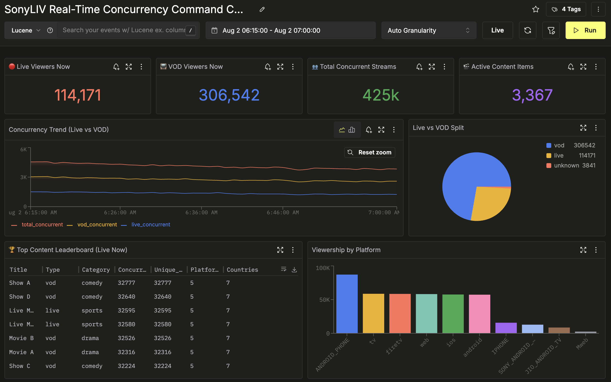
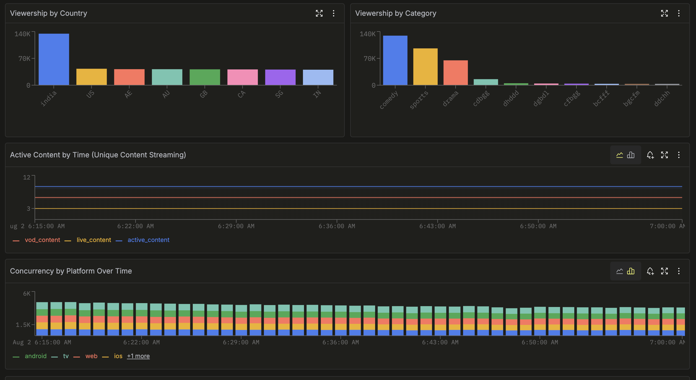
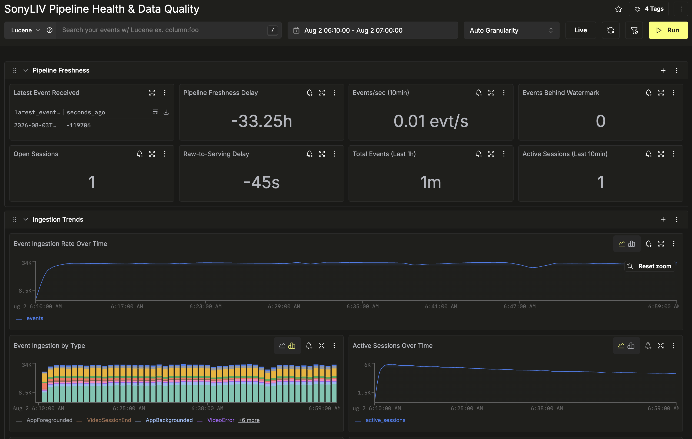
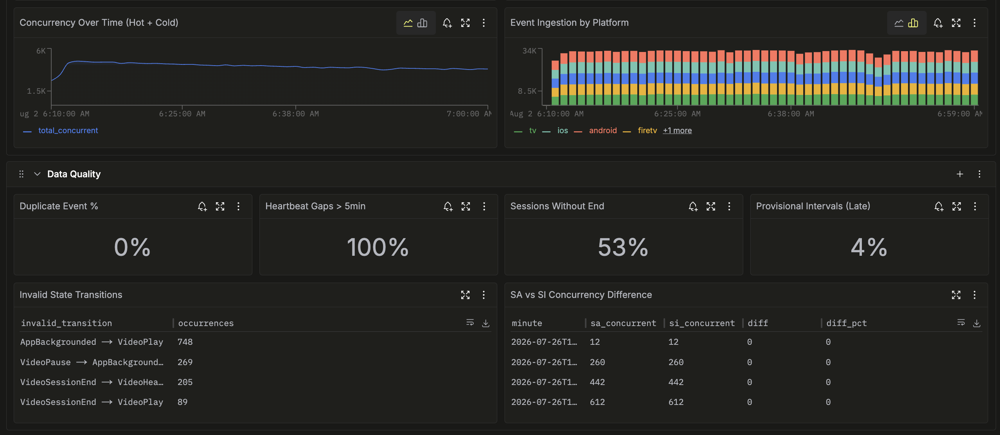
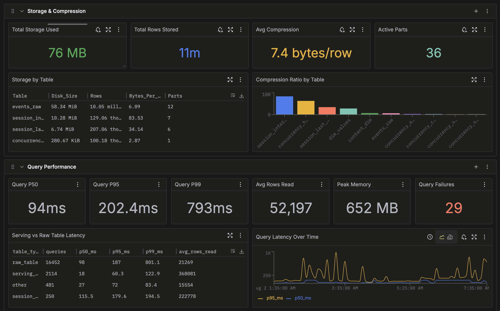
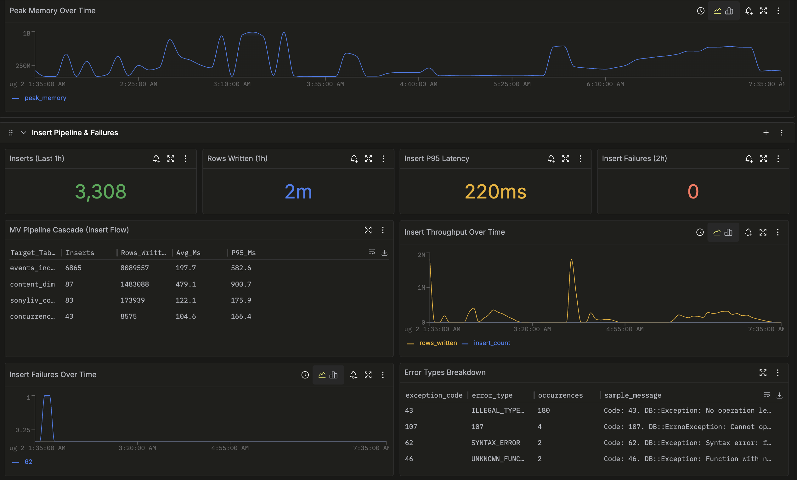
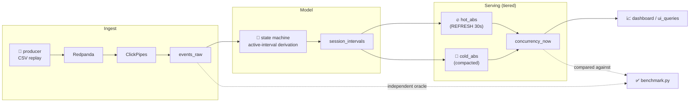

<h1> Snorlax</h1>

**Foreground-only concurrency, at streaming scale — on ClickHouse.**

Snorlax answers *"how many sessions are truly watching, right now?"* — not how many are open, paused, backgrounded, or silently timed out. Built for [Click-a-thon 2026](problem/PROBLEM_STATEMENT.md)'s SonyLIV challenge.

[](LICENSE)
[](https://clickhouse.com/)
[](producer/requirements.txt)
[](https://snorlax.streamlit.app/)
[](plan/PLAN.md)

<p align="center">
  
</p>

---

## 📋 Submission

**Team Name:** Snorlax

### Track

**SonyLIV** — real-time concurrency at streaming scale on ClickHouse.

### Project

**Snorlax** — *Foreground-only concurrency, at streaming scale — on ClickHouse.*

### Team Members

- Nikhil Wagh
- Tarun Anand
- Monika Nayak
- Abhishek Surve

### What it does

Snorlax answers *"how many sessions are truly watching, right now?"* — not how many are open, paused, backgrounded, or silently timed out. A CSV-replaying producer streams session events through Redpanda → ClickPipes → ClickHouse; an active-interval state machine turns raw `play` / `pause` / `background` / `heartbeat` / `ad` events into truly-active windows per session; and a hot/cold tiered serving layer answers every concurrency query as `filter → sum → max/avg`, with zero full-history rescans. Every served number is cross-checked against an independent raw-events oracle. (Full detail in [What it does](#-what-it-does) below.)

### Hosted Demo

🖥️ **[Hosted demo (Google Drive)](https://drive.google.com/drive/folders/1ZBgu-ubutGvgHx7VvPi2Tf8M6kyegFPR)** — live product dashboard walkthrough. The Streamlit app is also live at **[snorlax.streamlit.app](https://snorlax.streamlit.app/)** — real-time concurrency curve, dimension filters, KPI tiles, and Daily Wrapped, reading straight off the serving layer. See [See it live](#-see-it-live) for the engine-plane ClickStack / HyperDX dashboards that prove the pipeline is fast, healthy, and correct.

### Demo Video

🎥 **[Demo video (Google Drive)](https://drive.google.com/drive/folders/1ZBgu-ubutGvgHx7VvPi2Tf8M6kyegFPR)** — 2–3 minute walkthrough.

### Architecture

See [Architecture](#-architecture) below for the full pipeline diagram, [`docs/DATA_FLOW.md`](docs/DATA_FLOW.md) for the traced-from-code data flow, and [`docs/SCHEMA.md`](docs/SCHEMA.md) for every table's DDL and reasoning.

### How we built it

**ClickHouse Cloud** for storage and the tiered serving layer; a **Python** CSV-replay producer streaming into **Redpanda → ClickPipes**; an active-interval **state machine** with deterministic same-millisecond tie-breaking; **Streamlit + clickhouse-connect + Plotly** for the product dashboard; **ClickStack (HyperDX)** for engine observability with **OpenTelemetry** traces from the dashboard; and an **Insights Copilot** built on **LibreChat + ClickHouse/ClickStack MCP** on a local **Ollama** model, traced by **Langfuse**. See [How we built it](#-integrations--four-planes-each-with-a-job) and [Design principles](#-design-principles) for the reasoning.

### How to run it

Quickstart is in [Runbook — running it locally](#-runbook--running-it-locally); the full contributor guide is in [SETUP.md](SETUP.md).

---

## 🔗 See it live

One system, watched at **two altitudes** — the product plane the business reads, and the engine plane the operators trust it on.

### 🟢 Product plane — what the business sees

🖥️ **[snorlax.streamlit.app](https://snorlax.streamlit.app/)** — the real-time concurrency curve, dimension filters, and KPI tiles, reading straight off `concurrency_now`. This is the *insight* layer: peak/average concurrency, top content, per-platform splits — the numbers a content or ad-ops team actually makes calls on. Four panes — 📈 Concurrency, 🚨 Errors, 🧭 Insights, 🔬 Drill-down — plus an **✨ Insights Copilot** that answers questions in plain English (see [Integrations](#-integrations--four-planes-each-with-a-job)).

The full source lives in [`sonyliv-dashboard-py/`](sonyliv-dashboard-py/) (Streamlit + `clickhouse-connect` + Plotly) — run it locally with `streamlit run app.py`, see that folder's [README](sonyliv-dashboard-py/README.md).

<!-- 📸 Streamlit product-plane screenshots go here -->

### 🔵 Engine plane — what the operators see

📊 **ClickStack / HyperDX dashboards** — dev- and infra-level observability over Snorlax's own pipeline and the ClickHouse engine beneath it. This is where we *prove* the system is fast, healthy, and correct — not just claim it:

| Dashboard | Watches | Answers |
|---|---|---|
| 🎛️ [Real-Time Concurrency Command Center](https://hyperdx.clickhouse.cloud/dashboards/6a6e919fe5fff1717667f95c) | live concurrency + ingest, end to end | *"Is the pipeline keeping up with the live event, right now?"* |
| 🩺 [Pipeline Health & Data Quality](https://hyperdx.clickhouse.cloud/dashboards/6a6e7e8ee5fff1717667c9ed) | ingestion lag, dropped/late events, verification drift | *"Can I trust today's numbers?"* |
| ⚙️ [ClickHouse Engine & Query Performance](https://hyperdx.clickhouse.cloud/dashboards/6a6e91c3e5fff1717667fa5d) | query latency + `read_rows` from `system.query_log` | *"Are dashboards reading the serving layer, not raw history?"* |

<details>
<summary>🎛️ <b>Real-Time Concurrency Command Center</b> — live viewers, live-vs-VOD split, top-content leaderboard, per-platform/country/category breakdowns</summary>




</details>

<details>
<summary>🩺 <b>Pipeline Health & Data Quality</b> — freshness delay, ingestion rate, and data-quality checks (duplicate %, heartbeat gaps, SA-vs-SI agreement)</summary>




</details>

<details>
<summary>⚙️ <b>ClickHouse Engine & Query Performance</b> — storage/compression, query P50/P95/P99, serving-vs-raw latency, insert pipeline cascade</summary>




</details>

> The **serving-vs-raw latency** panel is the headline proof: the serving tables answer at **P95 ≈ 60 ms** reading ~370K rows, while the same questions over raw history sit at **P95 ≈ 187 ms** reading far more — exactly the "read the serving layer, not raw history" property the challenge is judged on.

> 🔭 **Closing the loop:** the Streamlit product plane is instrumented with **OpenTelemetry** ([`sonyliv-dashboard-py/otel_setup.py`](sonyliv-dashboard-py/otel_setup.py)) — spans + metrics export over OTLP into the same ClickStack pipeline, so UI-side request latency lands right next to ingestion lag and engine query performance. One trace, front door to back end. (Set `OTEL_EXPORTER_OTLP_ENDPOINT`; falls back to a safe no-op if OTel isn't installed.)
>
> 🔐 HyperDX dashboard links require ClickHouse Cloud access — the screenshots above are the shareable evidence.

---

## 🎯 Why "Snorlax"?

Because most sessions are, mechanically, asleep — paused, backgrounded, silent — and counting them as "watching" inflates every downstream decision (ad load, capacity, content calls). Snorlax's whole job is telling awake from asleep, at every minute, for every filter combination, without ever re-reading raw history.

## ✨ What it does

- 🔴 **Live ingestion** — a CSV-replaying producer streams session events into **Redpanda → ClickPipes → ClickHouse**, continuously.
- 🧠 **A real active-interval state machine** — turns raw `play` / `pause` / `background` / `heartbeat` / `ad` events into truly-active `[start, end)` windows per session, with deterministic tie-breaking and gap/grace handling.
- 🧊🔥 **Hot/cold serving** — absolute concurrency per `(dimensions, minute)`, tiered so dashboards read `filter → sum → max/avg` and nothing else. No cumulative sums, no carry-in terms, no full-history rescans.
- ♻️ **Update-friendly** — open sessions and late heartbeats are absorbed incrementally (30s hot refresh, 1min cold compaction) — never a full rebuild.
- ✅ **Self-verifying** — every served number is checked against an independent, raw-events oracle. Zero mismatches is the bar.
- 📊 **Filterable at query time** — platform, country, content, video type, and (on the extended path) app/player version + audio/subtitle language.

## 📱 Dashboard & Daily Wrapped

A Streamlit dashboard ([`sonyliv-dashboard-py/`](sonyliv-dashboard-py/)) reads the serving layer directly — `filter → sum → max/avg`, nothing else. Alongside the analyst views, **Daily Wrapped** (shown above) turns a single day of viewing into a Spotify-Wrapped-style story: vivid gradient cards you step through one insight at a time, auto-anchored to the busiest day in the data, ending in a shareable recap poster.

> _The hero image is a vector mock of the cover card. To use a real screenshot, save it as `docs/images/daily-wrapped.png` and update the `src` reference. Add more cards (e.g. `daily-wrapped-primetime.png`, `dashboard-overview.png`) to the same folder and reference them here._

## 🏗️ Architecture



See [`docs/DATA_FLOW.md`](docs/DATA_FLOW.md) for the full, traced-from-code pipeline diagram, and [`docs/SCHEMA.md`](docs/SCHEMA.md) for every table's DDL and reasoning.

## 🧩 The hard part, in one paragraph

A session isn't "active" just because it's open. `VideoSessionStart` seeds a session active immediately (heartbeats before the first explicit `Play` shouldn't be dropped); `pause` / `AppBackgrounded` / `VideoError` / ad-breaks end an active stretch; a heartbeat gap over **90s** closes it, with a **60s** grace tail. Events are collapsed per `(session, millisecond)` — with deactivate beating reactivate beating neutral — because ~29% of raw events tie on timestamp and an unresolved tie is nondeterministic across engines. The result is one row per session, an array of active islands, expanded to minute buckets, and counted with `uniqExact` — the "once per minute, no matter how many islands touch it" dedupe, for free. Full reasoning and every edge case: [`plan/PLAN.md`](plan/PLAN.md).

## 🔌 Integrations — four planes, each with a job

The challenge asks for *meaningful* integration of **at least one** of ClickStack, Langfuse, or LibreChat. Snorlax ships **all three** — plus a product UI — and each sits at a different altitude with a distinct audience. No box-ticking; every layer earns its place.

```
  ask in English ─► ✨ Insights Copilot (in the Streamlit sidebar)
                          │
                          ▼
                    💬 LibreChat  (local, Docker — the hub)
                          │  runs each turn on ▼        ├─► 🧰 ClickHouse MCP  (queries the data)
                    🦙 Ollama (llama3.2:3b, local)      └─► 🧰 ClickStack MCP  (queries the telemetry)
                          │  traced by ▼
                    🔭 Langfuse — LLM observability (prompt / latency / cost)

  business insight ─► 🟢 Streamlit ── product plane (KPIs, curves, filters, drill-down)
                          │ OTel traces ▼
  engine & pipeline ─► 🔵 ClickStack (HyperDX) ── engine plane (health, latency, correctness)

                    ─────────  all reading  ─────────►  ⚡ ClickHouse
```

| Plane | Tool | Audience | What it does |
|---|---|---|---|
| 🟢 **Product** | **Streamlit** ([demo](https://snorlax.streamlit.app/) · [source](sonyliv-dashboard-py/)) | business / content / ad-ops | Concurrency curves, KPI tiles, dimension filters, drill-down — the *insights* people act on. |
| 🔵 **Engine** | **ClickStack (HyperDX)** | engineers / operators | Internal & dev-level metrics: ingestion lag, data-quality drift, query latency / `read_rows`. Proves the system is fast, healthy, and reading the serving layer — not raw history. Also ingests the Streamlit app's **OpenTelemetry** traces, so UI latency joins the same picture. |
| 💬 **Conversational** | **LibreChat** + **[ClickHouse MCP](https://github.com/ClickHouse/mcp-clickhouse)** + ClickStack MCP, on a local **Ollama** model | anyone, no SQL | The in-app **Insights Copilot** routes through LibreChat, which runs the turn on a local Ollama model and hands it MCP tools to query the data and the telemetry directly. Local model, no paid key — every request still flows through LibreChat. Falls back to direct-Ollama if LibreChat is down. |
| 🔭 **LLM observability** | **Langfuse** | LLM / integrations dev | Traces the Copilot's turns — prompt, latency, cost — so the AI layer is measured, not guessed. |

**The split that matters:** ClickStack watches the *machine* (is the pipeline healthy, are queries cheap, is the data correct); Streamlit surfaces the *product* (what's the audience doing right now); LibreChat + MCP open both to anyone who can type a question; Langfuse keeps that AI layer honest. Same ClickHouse underneath — four lenses on top.

<!-- 📸 LibreChat conversational-plane screenshots go here -->
<!-- 📸 Langfuse trace screenshots go here -->

## 📂 Repository layout

```
.
├── problem/     📋 the challenge brief, dataset dictionary, and starting notes
├── plan/        🗺️  the design doc — decisions, trade-offs, and why we rejected alternatives
├── producer/            📼 event-stream simulator → Redpanda/ClickHouse (pauses, ads, drops, marathons, late arrivals)
├── migrations/          🛠️  idempotent schema migrations + the run_sql.py runner (build / reset / verify)
├── sonyliv-dashboard-py/ 🖥️  Streamlit product dashboard + Insights Copilot (LibreChat/MCP) + OTel instrumentation
├── docs/                📖 traced-from-code architecture & schema reference
├── benchmark/           ✅ the query set we're judged on, verified against an independent raw-events oracle
└── assets/              📸 dashboard & UI screenshots used across the docs
```

## 🏃 Runbook — running it locally

> 📖 For the full contributor-facing setup guide (offline vs. live paths, dataset loading, troubleshooting), see **[SETUP.md](SETUP.md)**. The quickstart below is the short version.

### Prerequisites

- 🐍 Python 3.9+
- ☁️ A [ClickHouse Cloud](https://clickhouse.com/cloud) service (or any reachable ClickHouse instance) — Snorlax connects to it directly, nothing runs "in" ClickHouse locally
- 🔑 Credentials for that service: host, port, user, password, database name

> The producer and the migration runner share **one** `.env` file (`producer/.env`), so you only fill in credentials once.

### 1 — Configure credentials

```bash
cd producer
cp .env.example .env
```

Edit `producer/.env`:

```
CLICKHOUSE_HOST=<your-service>.clickhouse.cloud
CLICKHOUSE_PORT=8443
CLICKHOUSE_USER=default
CLICKHOUSE_PASSWORD=<your-password>
CLICKHOUSE_DATABASE=sonyliv_concurrency
CLICKHOUSE_SECURE=true
```

### 2 — Set up the Python environment

```bash
python -m venv .venv
source .venv/bin/activate          # Windows: .venv\Scripts\activate
pip install -r requirements.txt
```

Reuse this same virtualenv for `migrations/` and `benchmark/` — all three share `clickhouse-connect` + `python-dotenv`.

### 3 — Build the schema

```bash
cd ../migrations
python run_sql.py --reset --build     # 💥 drops everything, recreates structure fresh
# or, on an existing deployment:
python run_sql.py --migrate           # ✅ applies pending numbered migrations only
```

`--reset` is destructive (see [`migrations/README.md`](migrations/README.md)) — use `--migrate` once a service is already live. `run_sql.py -i` drops you into an interactive REPL if you want to poke around (`\q` to quit).

### 4 — Seed or stream data

Either replay the sample dataset once for a quick smoke test, or run the live producer continuously:

```bash
cd ../producer
python produce_events.py
```

Tune throughput with env vars — `EVENTS_PER_SECOND`, `PRODUCER_THREADS`, `PRODUCER_PROCESSES` (see the file's own header for the full knob list). Stop with `Ctrl-C`; every worker flushes its buffer first.

### 5 — Watch it build

Give the pipeline ~30–60s to catch up (hot MV refreshes every 30s, cold compaction every 1min), then either:

- Open the local Streamlit UI (if running one against your service), or the [hosted demo](https://snorlax.streamlit.app/) pointed at your data, or
- Query `sonyliv_concurrency.concurrency_now` directly (see [`benchmark/BENCHMARK_QUERIES.md`](benchmark/BENCHMARK_QUERIES.md) for example shapes).

### 6 — Verify correctness

```bash
cd ../benchmark
pip install -r requirements.txt
python benchmark.py
```

`benchmark.py`'s exit code is the number of failed checks — `0` means the serving layer matches an independently-derived, raw-events reference to the row. Useful flags: `--grace-seconds N` (skip the still-provisional hot edge on live traffic), `--since` / `--until` (restrict the window), `--no-extended` (skip drill-down checks). Full detail in [`benchmark/BENCHMARK_QUERIES.md`](benchmark/BENCHMARK_QUERIES.md).

### 🧹 Resetting

```bash
cd migrations
python run_sql.py --reset --build
```

Drops every Snorlax object and rebuilds from scratch — useful between test runs or before a fresh sealed-dataset ("unseen day") replay.

### 🩹 Troubleshooting

| Symptom | Likely cause |
|---|---|
| `run_sql.py` can't connect | Check `producer/.env` values; confirm the ClickHouse Cloud service is running and your IP/network is allowed. |
| `concurrency_now` stays empty | Give the `REFRESH EVERY 30 SECOND` MVs a cycle to run, or force one with `SYSTEM REFRESH VIEW mv_session_intervals` via `run_sql.py -i`. |
| `benchmark.py` reports mismatches on live data | Add `--grace-seconds` — you're likely comparing against the still-provisional hot edge. |

## 🧪 Design principles

| Principle | How Snorlax applies it |
|---|---|
| **Correct over clever** | Every served number is cross-checked against a *structurally different* oracle re-derived straight from raw events — not just the same pipeline run twice. |
| **Absolute, not delta** | Both hot and cold tiers store absolute concurrency per `(dims, minute)` — queries are always `filter → sum → max/avg`, never a running cumulative sum. |
| **Incremental, not rebuilt** | Open sessions and late heartbeats update in place (30s/1min refresh cycles); nothing is ever recomputed from full history on a schedule. |
| **Scale-aware** | Serving-table size is proportional to *minutes × dimension combinations*, independent of event volume — the property that survives a 100× dataset. |

## 🗺️ Status & roadmap

Built against the plan in [`plan/PLAN.md`](plan/PLAN.md) — see §10 there for the live status, resolved pitfalls, and what's still open (pipeline execution on Cloud, ClickStack integration, dashboard polish, the sealed "unseen day" run).

- [x] Active-interval state machine, deterministic under same-millisecond ties
- [x] Hot/cold tiered serving with a race-free compaction boundary
- [x] Independent verification oracle (`benchmark/`, `migrations/*verify*`)
- [x] ClickStack (HyperDX) observability wired into the live pipeline
- [x] Streamlit dashboard ([live demo](https://snorlax.streamlit.app/) · [source](sonyliv-dashboard-py/))
- [x] Streamlit → OpenTelemetry traces into ClickStack
- [x] Insights Copilot: LibreChat + ClickHouse/ClickStack MCP on a local Ollama model
- [x] Langfuse tracing over the Copilot
- [ ] Unseen-day sealed run

## 🤝 Contributing

This is a hackathon build — see [`plan/PLAN.md`](plan/PLAN.md) §12 for the current team split and open workstreams. Schema changes go through [`migrations/`](migrations/README.md) as numbered, idempotent files — no stray `.sql` scattered around.

## 📄 License

[MIT](LICENSE)
