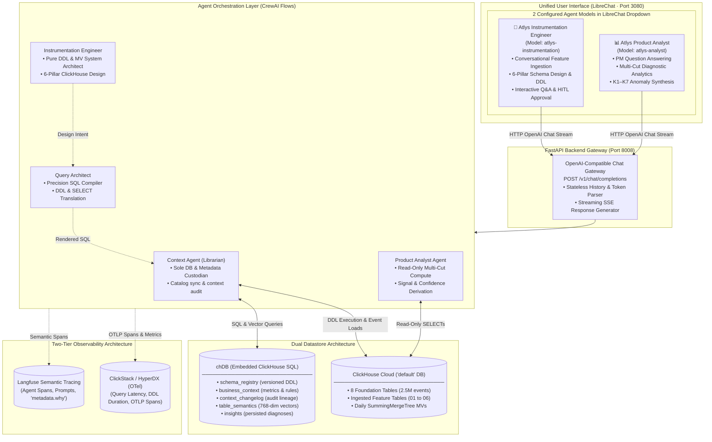
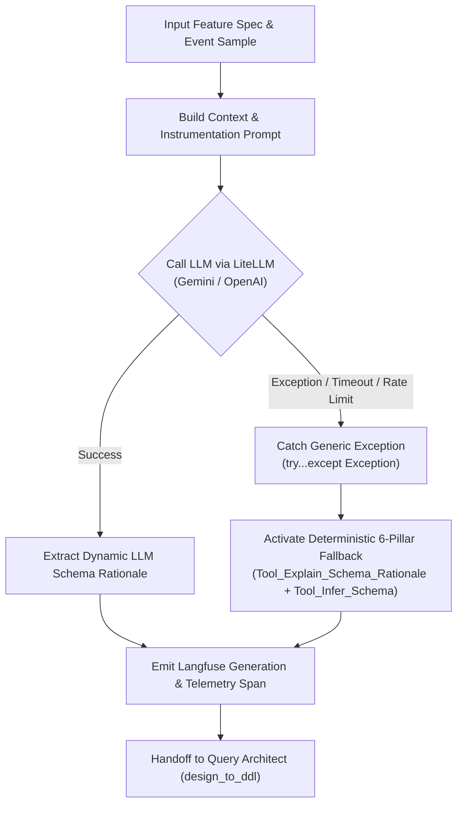
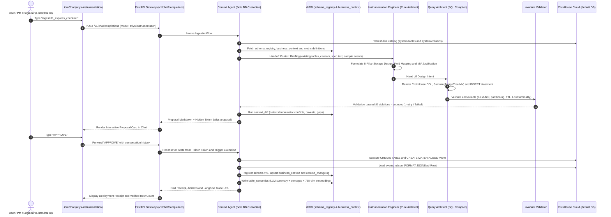
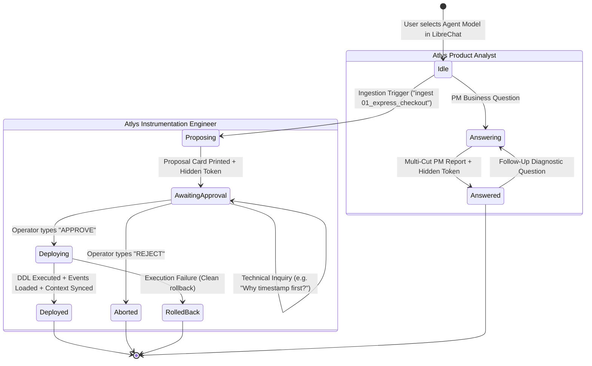
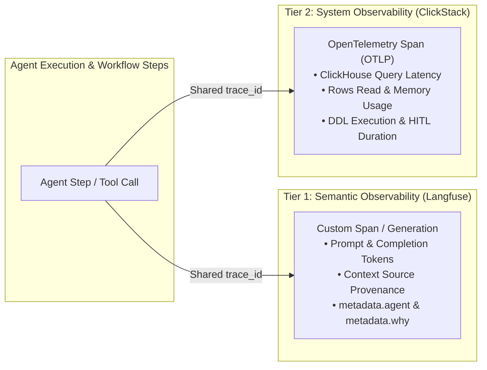

# InsightMesh System Architecture
### Click-a-thon 2026 — Official ATLYS Track Architecture Document

> **Track:** Atlys — *"From feature spec to insight: agents that instrument, analyze, and explain."*  
> **Backend Datastore:** ClickHouse Cloud (`CLICKHOUSE_DATABASE=default` · 2,479,858 historical events across 8 tables)  
> **Context Storage:** Embedded `chDB` (In-process ClickHouse SQL & vector engine)  
> **Agent Orchestration:** CrewAI Flows (`memory=False` · Deterministic Sequential Pipelines)  
> **Observability:** Langfuse (Semantic Traces) + ClickStack / OpenTelemetry (System Traces)  
> **Unified User Interface:** LibreChat (Port 3080 · Docker Compose) with 2 Configured Agent Models  

---

## 1. Executive Architecture Overview

**InsightMesh** is an autonomous, multi-agent data engineering and product analytics platform designed for Atlys. It replaces the slow, manual lifecycle between product specification (`spec.md`), event stream logs (`events.ndjson`), schema creation, and product diagnostic insights.

```
                    ┌───────────────────────────────────────────────────────────┐
                    │                   InsightMesh C4 Model                    │
                    ├─────────────────────────────┬─────────────────────────────┤
                    │  Unified Interface          │  LibreChat (2 Agent Models) │
                    │  1. Instrumentation Agent   │  ClickHouse 6-Pillar DDL    │
                    │  2. Context Agent           │  chDB Custodian & Vectors   │
                    │  3. Query Architect         │  Precision SQL Translation  │
                    │  4. Product Analyst Agent   │  Multi-Cut PM Diagnostics   │
                    └─────────────────────────────┴─────────────────────────────┘
```

### 1.1 C4 Component Interaction Diagram



---

## 2. Agent Roster, Naming Consistency & Custodianship Model

InsightMesh enforces a strict **Least-Privilege & Data Custodianship Boundary**:

```
                    ┌───────────────────────────────────────────────────────────┐
                    │                   Data Custodianship                      │
                    ├─────────────────────────────┬─────────────────────────────┤
                    │  Context Agent              │  ✅ Sole DB & Metadata Custodian │
                    │  Instrumentation Engineer   │  ❌ Zero Database Access    │
                    │  Query Architect            │  ❌ Zero Database Access    │
                    │  Product Analyst Agent      │  🔍 Read-Only SELECT Only   │
                    └─────────────────────────────┴─────────────────────────────┘
```

| Agent Persona | Codebase Binding (`agents.py`) | Langfuse Span Prefix | DB / Metadata Access | Core Responsibilities |
| :--- | :--- | :--- | :---: | :--- |
| **`Context Agent`**<br>*(Context Librarian)* | `build_context_agent()`<br>`build_context_librarian()` | `context_agent::...` | ✅ **Sole Custodian**<br>(Read/Write `chDB` + ClickHouse DDL & Loads) | Exclusive owner of `chDB` and ClickHouse Cloud DDL/load operations. Refreshes live catalogs, builds context briefings, runs semantic audits, deploys approved schemas, loads events, and updates versioned table semantics. |
| **`Instrumentation Engineer`**<br>*(Schema Architect)* | `build_instrumentation_agent()`<br>`build_instrumentation_engineer()` | `instrumentation_agent::...` | ❌ **Zero Direct Access** | Pure ClickHouse systems architect. Reasons over specs (`spec.md`) and event streams (`events.ndjson`) to design 6-pillar ClickHouse schemas, field mappings, and materialized view justifications without touching any database. |
| **`Query Architect`**<br>*(SQL Compiler)* | `build_query_architect()` | `query_architect::...` | ❌ **Zero Direct Access** | Precision SQL translation compiler shared across CUJ 1 (`design_to_ddl`) and CUJ 2 (`plan_queries`). Outputs typed `PlannedQuery` objects with origin metadata (`architect_llm` vs `architect_fallback`). |
| **`Product Analyst Agent`**<br>*(Analytics Scientist)* | `build_analytics_agent()`<br>`build_product_analyst()` | `analytics_agent::...` | 🔍 **Read-Only Analytics**<br>(Strict `SELECT` Only) | Analytics scientist that pushes multi-cut aggregations into ClickHouse Cloud, performs result audits, calculates concentration ratios and date coincidences, computes calibrated confidence scores, and synthesizes executive PM reports. |

---

## 3. Where the Context Layer is Stored and Why (`chDB`)

The business context layer is stored in **embedded `chDB`** (`CHDB_PATH=./chdb_data`, backed by an in-process ClickHouse SQL session with SQLite fallback in `chdb_client.py`).

### 3.1 Why chDB Was Chosen Over Alternatives
1. **ClickHouse SQL Dialect Parity:** Because `chDB` executes the exact ClickHouse SQL dialect locally, there is zero translation mismatch between metadata logic and ClickHouse Cloud schemas.
2. **Zero Network Latency & High Isolation:** Runs in-process with zero network hops, guaranteeing sub-millisecond metadata lookups for JIT retrieval.
3. **Transparent & Inspectable:** Unlike opaque vector stores or proprietary memory frameworks, all business rules, schema versions, and audit logs are inspectable via standard SQL (`SELECT * FROM business_context`).
4. **Native Vector Cosine Distance:** Uses ClickHouse's native `cosineDistance(embedding, {question_vector})` function for semantic similarity search, eliminating the need for a separate vector database.
5. **No Hidden LLM Memory (`memory=False`):** Eliminates context drift and hallucinations by fetching active context at runtime via deterministic SQL queries.

### 3.2 The Five Metadata Tables in `chDB`

```sql
-- 1. Schema Version Registry
CREATE TABLE schema_registry (
    "table" String,
    ddl String,
    columns_json String,
    spec_id String,
    version UInt16,
    created_at DateTime
) ENGINE = MergeTree ORDER BY ("table", version);

-- 2. Living Business Context & Domain Rules
CREATE TABLE business_context (
    id UInt32,
    section String,
    key String,
    definition String,
    version UInt16,
    valid_from DateTime,
    source String,
    status String
) ENGINE = MergeTree ORDER BY (section, key, version);

-- 3. Immutable Governance Changelog (Lineage Audit)
CREATE TABLE context_changelog (
    ts DateTime,
    change_type String,
    before String,
    after String,
    agent String,
    trace_id String
) ENGINE = MergeTree ORDER BY ts;

-- 4. Vector Semantic Layer (CUJ 1 -> CUJ 2 Handoff)
CREATE TABLE table_semantics (
    table_name String,
    spec_id String,
    description String,
    concepts String,
    embedding Array(Float32),
    version UInt16,
    created_at DateTime
) ENGINE = MergeTree ORDER BY (table_name, version);

-- 5. Durable Diagnostic Memory
CREATE TABLE insights (
    finding_key String,
    spec_id String,
    question String,
    answer_md String,
    confidence Float32,
    cuts_json String,
    trace_id String,
    created_at DateTime
) ENGINE = MergeTree ORDER BY (finding_key, spec_id, created_at);
```

---

## 4. Generic LLM Error Handling Architecture

In [`src/atlys_agentic/flows/ingestion_flow.py`](file:///usr/local/google/home/deepeshmw/github/InsightMesh/src/atlys_agentic/flows/ingestion_flow.py#L245-L285) and [`src/atlys_agentic/conversational_ingestion.py`](file:///usr/local/google/home/deepeshmw/github/InsightMesh/src/atlys_agentic/conversational_ingestion.py#L295-L330), an explicit generic LLM error handling mechanism is positioned immediately before the Instrumentation Engineer step:



### Verified Implementation Attributes:
- **Exception Shielding:** Wraps external LLM provider calls in a `try...except Exception:` block, shielding the pipeline from network timeouts, quota limits, or malformed provider responses.
- **Deterministic 6-Pillar Fallback:** If the LLM call fails, the pipeline immediately substitutes the verified 6-pillar storage rationale generated by `Tool_Explain_Schema_Rationale` and `Tool_Infer_Schema`.
- **Continuous Telemetry Record:** The Langfuse generation span (`instrumentation_agent::design_schema`) is recorded with the active model name, prompt, and fallback output, ensuring a complete reasoning trace without pipeline interruptions.

---

## 5. Startup Data Sync & Semantic Layer Architecture

### 5.1 Startup Sequence & Live Table Synchronization
Upon backend startup ([`src/atlys_agentic/run_chat.py`](file:///usr/local/google/home/deepeshmw/github/InsightMesh/src/atlys_agentic/run_chat.py#L48-L55)):
1. **Schema Initialization:** `chdb_client.init_schema()` initializes the 5 metadata tables in `chDB`.
2. **Base Context Chunking:** `chdb_client.init_base_context()` parses `problem statment/base_context.md` into granular paragraphs, populating `chDB.business_context`.
3. **Live Catalog Synchronization:** `Tool_Refresh_CHDB_From_Live()` queries ClickHouse Cloud (`CLICKHOUSE_DATABASE=default`) `system.tables` (`name`, `engine`, `partition_key`, `sorting_key`) to sync live tables and detect schema drift against `schema_registry`.
4. **Foundation Semantic Seeding:** `Tool_Bootstrap_Base_Semantics(force=True)` seeds semantic metadata for all 8 foundation tables plus all cataloged feature spec directories.

### 5.2 Semantic Table Descriptions (All 8 Tables + New Specs)

In [`src/atlys_agentic/tools_cuj2.py`](file:///usr/local/google/home/deepeshmw/github/InsightMesh/src/atlys_agentic/tools_cuj2.py#L77-L126), `BASE_TABLE_SEMANTICS` defines rich semantic descriptions and search concepts for all 8 core tables:

1. **`destination_card_clicked`**: Top-of-funnel browse and card click events (`is_guest_browse`, `destination`, `co_travelers`, `card_type`, `flow`).
2. **`application_started`**: Stage 1 core visa application initiation (`application_id`, `destination`, `co_travelers`, `visa_issuance_eta_days`).
3. **`document_uploaded`**: Stage 2 KYC passport image uploads (`doc_type`, `capture_mode`, `retry_count`, `is_crossed_failed_attempt_threshold`).
4. **`pay_now_clicked`**: Checkout initiation click (`payment_method`, `currency`, `discount_amount`, `amount`).
5. **`purchase_completed`**: Stage 4 payment conversion (`value`, `currency`, `coupon_applied`, `insurance_amount`, AOV).
6. **`search_typed`**: Destination search queries (`search_term`, `is_zero_results`, character length).
7. **`landing_page_scrolled`**: Discovery feed scrolling behavior (`scroll_depth_pct`, `time_on_page_s`, `page_version`).
8. **`auth_completed`**: Authentication and signup completion (`auth_method`: phone OTP, Google OAuth, email; `is_new_user`).

**Safe Embedding Helper Fallback:**
In [`src/atlys_agentic/tools_common.py`](file:///usr/local/google/home/deepeshmw/github/InsightMesh/src/atlys_agentic/tools_common.py#L131-L164), `embed_text()` wraps embedding generation in a safe try-except block. If the embedding provider fails or is offline, it returns an empty list `[]` (0 dimensions) rather than throwing an exception. Downstream, `table_semantics` records the row, and CUJ 2 treats it as an **unranked candidate**, ensuring newly created tables remain accessible.

---

## 6. Deterministic CUJ 1 & CUJ 2 Workflows in LibreChat

### 6.1 CUJ 1: Schema Ingestion & Evolution (12-Phase Pipeline)



### 6.2 CUJ 2: Telemetry Analytics & PM Diagnosis (11-Phase Pipeline)

```mermaid
flowchart TD
    Q(["PM Natural-Language Question<br/>(Typed in LibreChat: atlys-analyst)"]) --> GUARD["Phase 0: Guardrail Validation<br/>(Greeting / Abusive / Scope Check)"]
    GUARD --> C1

    subgraph Phase1 ["Phase 1: 3-Guard Semantic Retrieval & Live Probe"]
        C1["1a. Vector Search over table_semantics<br/>cosineDistance(embedding, question_vec)<br/>Rank Top-3 Raw Table Candidates"]
        C2["1b. Load Context & Semantics<br/>Fetch column types, metrics, K1–K7 rules,<br/>context version, prior finding_key"]
        C3["1c. Live Aggregate Probe<br/>Row counts, date range, unique users,<br/>null shares (device_type, os)"]
        C1 --> C2 --> C3
    end

    subgraph Phase2 ["Phase 2: Resolution & Answerability Check"]
        ANS{"2+3. Answerability Contract<br/>(LLM Evaluates 3 Candidates)<br/>• Metric formula verified?<br/>• Post-purchase boundary trap?"}
    end

    subgraph Phase3 ["Phase 3: Query Planning & Invariant Check"]
        PLAN["5. Query Architect Planning<br/>• 5 Cuts: device, geo, destination, stage, guest<br/>• 1 Multi-cut intersection<br/>• 1 Time series (trend / date break)<br/>• 1 Alt-denominator headline"]
        VAL{"6. SELECT-Only & Column Invariant Check"}
        PLAN --> VAL
    end

    subgraph Phase4 ["Phase 4: Execution & Signal Derivation"]
        EXEC["7. ClickHouse Cloud Execution<br/>(Zero raw rows into LLM context)"]
        AUD["8. Result Audit (Empty cuts, null shares)"]
        DERIVE["9. Deterministic Signal Derivation<br/>• Concentration Ratio (delta_top / sum_delta)<br/>• Date Coincidence vs K-issue date<br/>• Trend State (new / persisting / reversed)<br/>• Calibrated Confidence Score"]
        EXEC --> AUD --> DERIVE
    end

    subgraph Phase5 ["Phase 5: Synthesis & Persistence"]
        SYN["10. PM Synthesis & Sufficiency Review<br/>Carries 'the why', recommends next step,<br/>highlights denominator conflicts"]
        OUT["11. Stream LibreChat Markdown<br/>+ Persist chDB.insights (finding_key)<br/>+ Write insight_report.md & .json<br/>+ Attach Langfuse Trace URL"]
        SYN --> OUT
    end

    Q --> GUARD
    C3 --> ANS
    ANS -->|"Unanswerable Trap (e.g. Post-purchase SLA)"| DECLINE(["Honest Refusal Response<br/>Explains missing columns & boundary;<br/>Zero queries executed, zero hallucinated numbers"])
    ANS -->|"Answerable / Partial"| PLAN
    VAL -->|"Pass"| EXEC
    DERIVE --> SYN
```



---

## 7. Stateless Conversation State Machine (LibreChat Integration)

To support multi-turn HITL workflows without server sessions, state is reconstructed statelessly from LibreChat conversation history via invisible HTML comment tokens:



### Turn Token Format:
- **Proposal Token:**
  `<!-- atlys:proposal spec_id=01_express_checkout table=express_checkout trace=73a9709f1bf3253b218413155ae16c4f -->`
- **Insight Token:**
  `<!-- atlys:insight table=express_checkout metric=conversion_rate finding_key=express_checkout::conversion_rate::device_type::ios trace=ce7dce3da46846962595f3a26d4e3d5e -->`

---

## 8. Observability & Tracing Architecture

InsightMesh satisfies the *"no trace, no credit"* mandate through two complementary observability tiers:



### Standard Span Metadata Schema:
Every Langfuse span recorded by InsightMesh adheres to a standardized contract:
- `input`: Serialized arguments, questions, and upstream context.
- `output`: Result payload, DDL status, or computed metrics.
- `metadata.agent`: Assigned persona (`context_agent`, `instrumentation_agent`, `query_architect`, `analytics_agent`).
- `metadata.why`: A concise sentence explaining the decision (e.g. *"led ordering key with (timestamp, user_id) because funnel queries filter by time range before user cohort"*).
- `metadata.trace_url`: Deep link to the Langfuse inspection dashboard.

---

## 9. LLM Provider(s) Used and Justification

- **Primary Provider:** **Google Gemini** (`gemini/gemini-3-flash-preview` via LiteLLM).
- **Embedding Provider:** **Google Gemini** (`text-embedding-004`, 768 dimensions).
- **Why Chosen:**
  1. **Sub-Second Latency:** Gemini 3 Flash delivers fast completion times (~200–400ms per agent generation), keeping full end-to-end multi-agent pipelines under 5 seconds.
  2. **High Structured Reasoning Quality:** Excels at zero-shot SQL generation, complex ClickHouse syntax (`SummingMergeTree`, `windowFunnel`), and nuanced PM markdown report synthesis.
  3. **Zero Temperature (`temperature=0.0`):** Enforces strict determinism across invariant validation, strategy decisions, and query planning.
  4. **LiteLLM Native Integration:** Enables automatic callbacks to Langfuse for request/response logging, token accounting, and cost tracking.

---
*Video Link* https://github.com/deepesh17feb/InsightMesh/blob/main/Arch1.mov
---
*Created for the Click-a-thon 2026 Official Submission by Surfer AI.*
