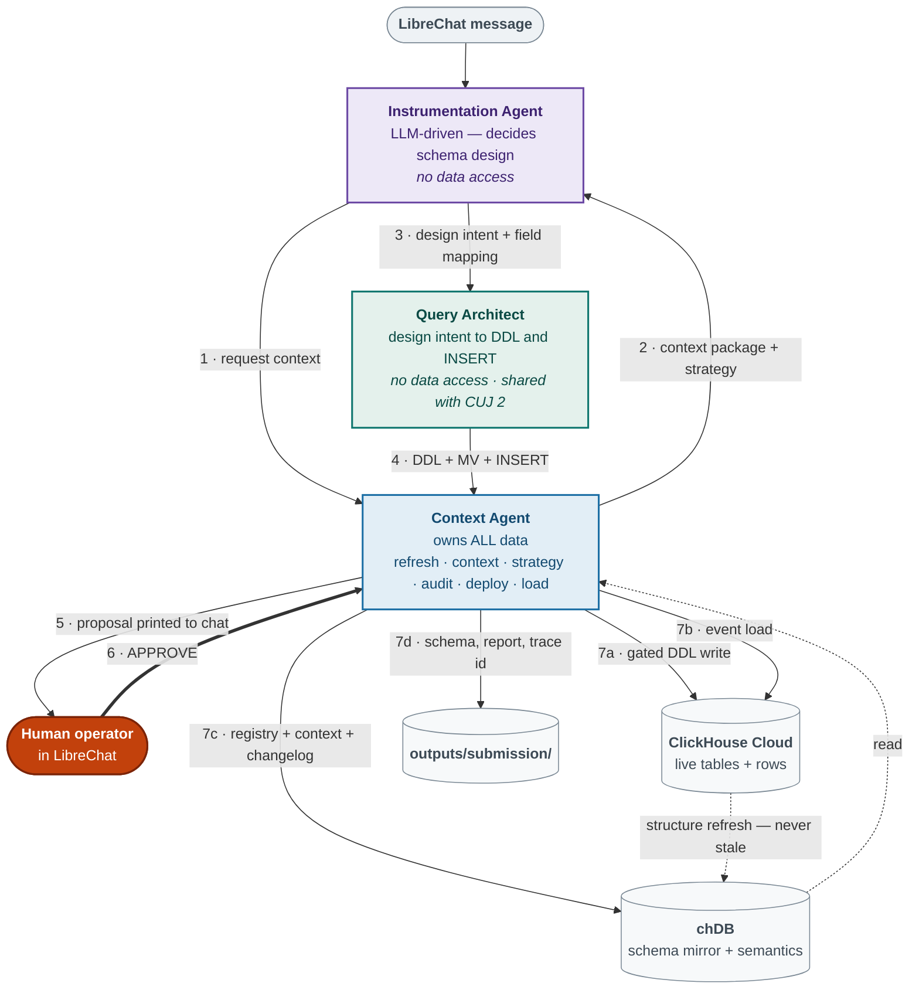
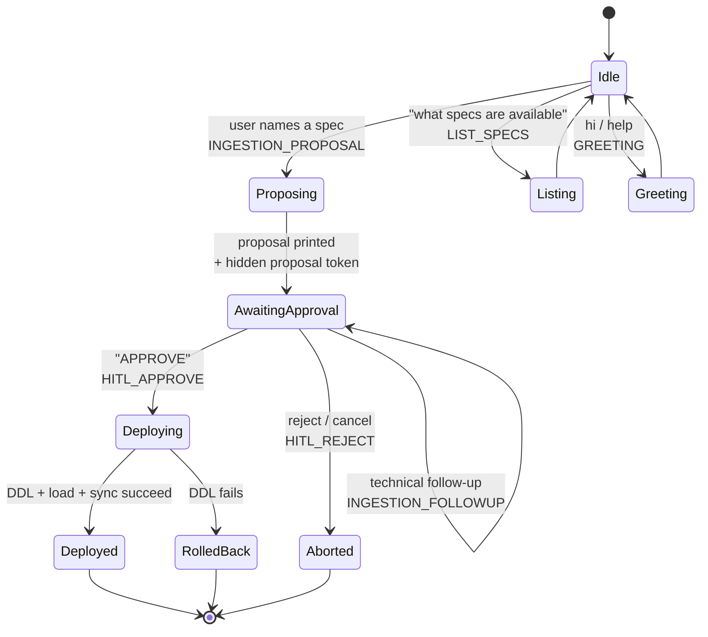

# CUJ 1 — Instrumentation Agent (LOCKED DESIGN)

**Status:** locked. Supersedes the CUJ 1 sections of `cuj_architecture.md` and `cuj_architecture_v2.md`.
**Surface:** LibreChat only. Every output a human sees is printed as chat markdown.
**Branch:** targets `refactor/cuj-deterministic-pipeline`.

---

## 1. Scope

Given a feature spec (`spec.md`) and its raw event sample (`events.ndjson`), produce a
production-ready ClickHouse table, load the events into it, sync the context layer, and
emit a traced, reviewable record of every decision — all through a LibreChat conversation.

Maps to the problem statement's **Instrumentation Agent** deliverable:

| Requirement | Where satisfied |
| :--- | :--- |
| Design an optimal ClickHouse table schema (column types, ordering keys, partitioning, TTL) | Phase 5 — Instrumentation Agent |
| Generate and execute the `CREATE TABLE` statements | Phase 6 → Phase 11a |
| Map raw events to the schema | Phase 5 field mapping → Phase 11b load |
| Define any materialized views or aggregations needed | Phase 5 MV justification → Phase 11a |
| Auto-update context when new tables or columns are added | Phase 11c |
| Ensure the Analytics Agent always works from the latest context | Phase 11c `write_table_semantics` → § 6a |
| Surface contradictions or gaps in the context layer | Phase 8 |
| Tracing — what each agent did, why, on what context | Section 7 |
| Submission artifacts — schema, summary, trace | Section 8 |

---

## 2. Locked decisions

These were settled during design review. Recorded here so they are not relitigated.

1. **The LLM decides the schema, not a rule cascade.** The Instrumentation Agent
   reasons over spec text + event sample + context package. The previous deterministic
   type-inference cascade is retired as a *generator*.
2. **Invariants become a validator, not a generator.** Four assertions run against the
   produced DDL. A system prompt biases the model toward correct design; the validator
   guarantees the non-negotiables. Prompt for quality, assertion for safety.
3. **Context Agent owns all data.** It is the only agent that touches chDB or
   ClickHouse Cloud. The Instrumentation Agent and the Query Architect have zero data access.
4. **chDB refreshes from live before every run.** `system.tables` / `system.columns` is
   ground truth for structure; `schema_registry` is a mirror, not an authority. Drift
   between them is surfaced as a governance finding, not silently overwritten.
5. **Field mapping is a design decision, owned by the Instrumentation Agent.** Which event key lands in
   which column, and how nested keys flatten (`payment.amount` → `payment_amount`), is
   design intent. The Query Architect renders it into DDL and the `INSERT`; it does not
   decide it.
6. **Bounded retry, never open-ended ReAct.** One redesign attempt carrying the violations
   as feedback. Second failure falls back to a conservative template and says so in the
   report.
7. **HITL happens across two chat turns.** No blocking `input()`. State is reconstructed
   from LibreChat's message history — the server holds no session.
8. **Events are loaded into the table.** A created-but-empty table fails the Analytics
   Agent downstream, and "map raw events to the schema" is an explicit requirement.

---

## 3. Agent roster

### Naming

Agent names follow the problem statement: **Instrumentation Agent**, **Analytics Agent**,
**Context Agent**. The Query Architect is a fourth agent the problem statement does not name —
it exists because SQL translation is a distinct responsibility from schema design (CUJ 1) and
from result interpretation (CUJ 2).

| Agent | Appears in |
| :--- | :--- |
| **Instrumentation Agent** | CUJ 1 |
| **Analytics Agent** | CUJ 2 |
| **Context Agent** | CUJ 1 + CUJ 2 |
| **Query Architect** | CUJ 1 + CUJ 2 |

These names are used everywhere — prose, diagrams, Langfuse span names, and code.

### Roles

| Agent | Owns | Never | Tools |
| :--- | :--- | :--- | :--- |
| **Context Agent** | All data. chDB refresh, context package, strategy decision, semantic audit, DDL execution, event loading, registry + context sync. | Designs schemas. Translates intent into SQL. | `refresh_chdb_from_live`, `build_context_package`, `decide_strategy`, `context_diff`, `execute_ddl`, `load_events`, `register_schema_version`, `context_upsert`, `append_context_changelog`, `write_table_semantics` |
| **Instrumentation Agent** | Schema design — ordering key, partitioning, column types, TTL, MV justification, event→column field mapping. LLM-driven. | Touches any database. Emits SQL. | `design_schema` (LLM) |
| **Query Architect** | Rendering design intent into ClickHouse DDL, MV DDL, and the `INSERT` statement. **Shared with CUJ 2**, where the same agent emits `SELECT` statements — see `docs/CUJ2.md` § 3. | Touches any database. Makes design decisions. | `design_to_ddl` (LLM) |

**The Human operator is not an agent.** They own the approval gate (phase 10) by typing
`APPROVE` in LibreChat. Deliberately kept out of the roster above: the gate exists precisely
because a human, not an agent, authorises production DDL. The `human::approval_gate` span
records the decision but carries no `metadata.agent` — see § 7.

**What "never writes SQL" means.** The boundary is *translation*, not the presence of SQL
strings. Turning intent — a design, a question, a metric formula — into SQL belongs to the
Query Architect exclusively. A Context Agent tool holding a fixed query (`SELECT ... FROM
system.tables`, `INSERT INTO context_changelog ...`) is not translation: the query shape is
authored in version-controlled tool code, is testable, and does not vary with the request.

---

## 4. Orchestration flow

```mermaid
flowchart TD
    PROMPT(["<b>LibreChat message</b><br/>ingest spec 01_express_checkout"]) --> IE1

    IE1["<b>1 · Instrumentation Agent receives request</b><br/>parses spec intent + event sample shape<br/><i>zero data access — must ask for context</i>"]
    IE1 -->|"request context"| CL1

    CL1["<b>2 · Refresh chDB from live</b><br/>read ClickHouse system.tables + system.columns<br/>surface drift vs schema_registry"]
    CL1 --> CL2

    CL2["<b>3 · Build context package</b><br/>existing table shapes + versions<br/>business_context metrics, caveats, known issues"]
    CL2 --> CL3

    CL3{"<b>4 · Decide strategy</b><br/>table registered?<br/>columns missing?"}
    CL3 -->|"exists, unchanged"| STOP(["REUSE_EXISTING<br/>nothing to deploy — report and end"])
    CL3 -->|"not registered"| IE2
    CL3 -->|"exists, new columns"| IE2

    IE2["<b>5 · Design schema — LLM-driven</b><br/>ordering key · partitioning · column types · TTL<br/>MV justification · <b>event to column field mapping</b><br/><i>outputs design intent, not SQL</i>"]
    IE2 -->|"design intent"| QA

    QA["<b>6 · Render to SQL</b><br/>CREATE TABLE / ALTER TABLE · CREATE MV · INSERT<br/><i>syntax only, no design decisions</i>"]
    QA --> VAL

    VAL["<b>7 · Invariant validator</b><br/>no id-first ORDER BY · no UUID-first<br/>PARTITION BY present · TTL present"]
    VAL --> GV{"violations?"}

    GV -->|"yes — retry 1 of 1"| IE2
    GV -->|"yes — retry exhausted"| FB["Conservative template<br/>+ unresolved violations carried into report"]
    GV -->|clean| CL4
    FB --> CL4

    CL4["<b>8 · Semantic audit</b><br/>context_diff against business_context<br/>denominator conflicts · caveats · undocumented columns"]
    CL4 --> PROP

    PROP["<b>9 · Print proposal to LibreChat</b><br/>rationale · DDL · MV · context diff · trace link<br/>+ hidden proposal token for the next turn"]
    PROP --> GATE

    GATE{"<b>10 · HUMAN IN THE LOOP</b><br/>next chat turn — APPROVE?"}
    GATE -->|"reject / anything else"| ABORT(["<b>Abort</b><br/>nothing written anywhere"])
    GATE -->|APPROVE| EX

    EX["<b>11a · Execute DDL</b><br/>CREATE TABLE + CREATE MV on ClickHouse Cloud<br/>rollback on failure"]
    EX --> LOAD

    LOAD["<b>11b · Load events</b><br/>INSERT events.ndjson FORMAT JSONEachRow<br/>using the Instrumentation Agent's field mapping"]
    LOAD --> SYNC

    SYNC["<b>11c · Sync context</b><br/>register_schema_version · context_upsert · append_context_changelog<br/><b>write_table_semantics</b> — description + concepts + embedding from spec.md"]
    SYNC --> ART

    ART["<b>12 · Emit submission artifacts</b><br/>schema.sql · run_report.md · run_report.json"]
    ART --> RECEIPT(["<b>Print receipt to LibreChat</b><br/>rows loaded · version · artifact paths · trace URL"])

    classDef lib fill:#e2eef6,stroke:#1d6fa5,stroke-width:2px,color:#134a70
    classDef eng fill:#ede8f7,stroke:#6d4aa5,stroke-width:2px,color:#3d2270
    classDef arch fill:#e4f1ec,stroke:#0f766e,stroke-width:2px,color:#0a4a44
    classDef gate fill:#fff8e6,stroke:#b45309,stroke-width:2px,color:#7c3d06
    classDef hitl fill:#c2410c,stroke:#7c2408,stroke-width:3px,color:#ffffff
    classDef stop fill:#f5e6e2,stroke:#a8412a,stroke-width:2px,color:#6b2418
    classDef io fill:#eef2f5,stroke:#7a8894,stroke-width:1px,color:#3d4a55

    class CL1,CL2,CL3,CL4,EX,LOAD,SYNC,ART lib
    class IE1,IE2 eng
    class QA,VAL arch
    class GV gate
    class GATE hitl
    class ABORT,FB stop
    class PROMPT,PROP,RECEIPT,STOP io
```



---

## 5. Ownership and data planes



**Plane rule:** metadata versus analytical data, not chDB versus ClickHouse. The Context Agent
reads `system.columns` (structure, no rows) and owns chDB (semantics). It writes rows to
ClickHouse Cloud only during the gated load. The Instrumentation Agent and Query Architect read
neither.

---

## 6. LibreChat conversation state machine

LibreChat resends the full message history on every turn, so the HITL gate needs **no
server-side session store**. State is reconstructed by scanning `messages[]`.



### Carrying state across turns

The current implementation reconstructs the pending proposal by regexing the assistant's
own prior markdown for `CREATE TABLE`. That works but is brittle — it breaks the moment
proposal formatting changes.

**Locked approach:** the proposal message embeds a machine-readable token as an HTML
comment. LibreChat renders markdown, so the comment is invisible to the user but present
in the history the next turn receives.

```html
<!-- atlys:proposal spec_id=01_express_checkout table=express_checkout trace=abc123 -->
```

Next turn parses that token instead of the rendered DDL. Formatting becomes free to change;
state extraction stays stable.

### Intent routing

Reuses `conversational_ingestion.detect_chat_intent`, which returns one of
`LIST_SPECS`, `HITL_APPROVE`, `HITL_REJECT`, `INGESTION_PROPOSAL`, `INGESTION_FOLLOWUP`,
`GREETING`, `ANALYTICS`. CUJ 1 owns all but the last.

`HITL_APPROVE` fires only on an explicit affirmative (`approve`, `deploy`, `authorize`,
`lgtm`, `ship it`). Everything else in the `AwaitingApproval` state is treated as a
follow-up question, never as consent.

---

## 6a. Semantic layer — what CUJ 1 hands to CUJ 2

`spec.md` is the richest description of a feature that exists anywhere in the pipeline. CUJ 1
reads it for schema design and, without this step, discards it. CUJ 2 would then be left
resolving tables from names and column lists — `visa_fast_track` with columns
`[timestamp, user_id, device_type]` carries almost no signal about what the feature does.

Phase 11c therefore writes a semantic record alongside the schema registration.

```sql
CREATE TABLE table_semantics (
    table_name  String,
    spec_id     String,
    description String,          -- LLM summary of spec.md, 2-3 sentences
    concepts    String,          -- "expedited processing, premium upgrade, SLA promise"
    embedding   Array(Float32),  -- embed(description + concepts + column names)
    version     UInt16,
    created_at  DateTime
) ENGINE = MergeTree ORDER BY (table_name, version)
```

Example row for a spec CUJ 1 has just ingested:

```
table_name:  visa_fast_track
spec_id:     06_unseen
description: Fast Track lets applicants pay a premium for expedited visa processing,
             chosen at checkout after destination selection. Covers upgrade impressions,
             selection, payment, and the SLA promise shown to the applicant.
concepts:    expedited processing, premium upgrade, SLA promise, checkout add-on
metrics:     upgrade attach rate, incremental revenue per application
```

Versioned like every other context write, and the accompanying `context_changelog` entry
records when the description was written and under which trace. That makes the CUJ 1 → CUJ 2
handoff evidence rather than assertion: when a judge ingests a spec and immediately asks a
question about it, CUJ 2 resolves the new table **because** this row exists, and the changelog
proves when it appeared.

Embeddings come from the same provider as the rest of the pipeline (`GEMINI_API_KEY`). If the
embedding call fails the row is still written with an empty `embedding`, and CUJ 2 treats such
rows as unranked candidates rather than invisible ones — a just-created table is never
excluded from consideration.

---

## 7. Langfuse tracing

One trace per ingestion run. Everything nests under a single root span via OTEL context
propagation — no manually-passed trace id, which is what produces orphan spans.

### Span tree

```mermaid
flowchart TD
    ROOT["<b>ingestion::{spec_id}</b> — ROOT<br/><i>trace URL captured here</i>"]

    ROOT --> S1["context_agent::refresh_chdb_from_live<br/>out: tables_refreshed, drift_detected"]
    ROOT --> S2["context_agent::build_context_package<br/>out: existing_tables, metrics, caveats"]
    ROOT --> S3["context_agent::decide_strategy<br/>out: CREATE_NEW / ALTER_EXISTING + <b>why</b>"]
    ROOT --> S4["instrumentation_agent::design_schema — GENERATION<br/>in: context + spec + sample<br/>out: design intent + field mapping + <b>why</b>"]
    ROOT --> S5["query_architect::design_to_ddl — GENERATION<br/>in: design intent · out: DDL, MV, INSERT"]
    ROOT --> S6["validator::invariant_check<br/>out: violations[]"]
    S6 -.->|if violations| S6R["instrumentation_agent::redesign_retry — GENERATION<br/>in: violations as feedback"]
    ROOT --> S7["context_agent::context_diff<br/>out: additions, conflicts, gaps"]
    ROOT --> S8["human::approval_gate<br/>in: proposal · out: APPROVE / abort"]
    ROOT --> S9["context_agent::execute_ddl<br/>out: status, rollback?"]
    ROOT --> S10["context_agent::load_events<br/>out: rows_loaded"]
    ROOT --> S11["context_agent::register_schema_version<br/>out: version"]
    ROOT --> S12["context_agent::sync_context<br/>out: upserts, changelog entries"]
    ROOT --> S12B["context_agent::write_table_semantics — GENERATION<br/>out: description, concepts, embedding dims"]
    ROOT --> S13["report::emit_artifacts<br/>out: paths, trace URL"]

    classDef root fill:#c2410c,stroke:#7c2408,stroke-width:3px,color:#ffffff
    classDef lib fill:#e2eef6,stroke:#1d6fa5,stroke-width:2px,color:#134a70
    classDef gen fill:#ede8f7,stroke:#6d4aa5,stroke-width:2px,color:#3d2270
    classDef chk fill:#fbeae1,stroke:#c2410c,stroke-width:2px,color:#8a2f08
    classDef hum fill:#fff8e6,stroke:#b45309,stroke-width:2px,color:#7c3d06

    class ROOT root
    class S1,S2,S3,S7,S9,S10,S11,S12,S13 lib
    class S4,S5,S6R,S12B gen
    class S6 chk
    class S8 hum
```



### Span contract

Every span carries three things:

| Field | Content |
| :--- | :--- |
| `input` | what the step received |
| `output` | what it produced |
| `metadata.agent` | `context_agent` / `instrumentation_agent` / `query_architect` |
| `metadata.why` | one sentence explaining the decision |

`metadata.why` is what turns a timing log into the reasoning chain judges are told to
follow. A span without it is not traceable in the sense the problem statement means.

`human::approval_gate` is the one span with **no `metadata.agent`** — the approval is a human
decision, not agent work, and labelling it with an agent would misattribute the authorisation
that the whole gate exists to record. It still carries `input`, `output` and `why`.

### Trace URL

Captured inside the root span while it is still active — `get_current_trace_id()` then
`get_trace_url()` — because the id is unavailable once the context manager exits.

Surfaced in **three** places:

1. In the proposal message, so the operator can inspect the reasoning before approving.
2. In the deployment receipt, so the completed run is linkable.
3. Inside `run_report.md`, so the artifact is self-contained.

Because the HITL gate spans two chat turns, the second turn resumes the **same** trace id
carried in the hidden proposal token — one trace covers the whole journey, not two.

---

## 8. Submission artifacts

> *"Your submission must include what your pipeline produced for it: the generated schema,
> the insight summary, and the trace that proves your system generated them."*

Written on every approved run:

```
outputs/submission/{spec_id}/
├── schema.sql          # deployed DDL + MV, verbatim
├── run_report.md       # human / judge readable
└── run_report.json     # machine readable, feeds the viz layer
```

### `run_report.md` sections

| Section | Content |
| :--- | :--- |
| Header | spec id, table, timestamp, **trace URL**, run mode |
| What was decided | `CREATE_NEW` / `ALTER_EXISTING` / `REUSE_EXISTING` and why |
| Schema design rationale | per pillar — ordering key, partitioning, types, MV, TTL — each with the Instrumentation Agent's actual reasoning, not restated boilerplate |
| Field mapping | event key → column, including nested flattening |
| Materialized view | the MV, or an explicit "no MV — did not earn its keep, because…" |
| Context audit | additions / conflicts / gaps, with the contradiction text where one fired |
| Approval | what was shown, what the operator typed, when |
| Deployment | DDL status, **rows loaded**, schema version, MV status |
| Context written | `business_context` upserts and changelog entries, before → after |
| Reasoning chain | ordered span list with each `why` — the trace, readable without opening Langfuse |

That last section is deliberate redundancy: a judge who never clicks the Langfuse link
still sees the full chain.

The **entire report is also printed into LibreChat** on the deployment turn. Files exist for
the submission package; chat is the surface a human actually reads.

---

## 9. Example user journey (LibreChat)

---

**User**

> what specs are available?

**Atlys Instrumentation Agent**

> ### Cataloged Feature Specs
>
> | Spec | Table | Status |
> | :--- | :--- | :--- |
> | `01_express_checkout` | `express_checkout` | not yet instrumented |
> | `02_group_family` | `group_family_applications` | not yet instrumented |
> | `03_social_referral` | `social_referral` | not yet instrumented |
> | `04_abandoned_checkout_recovery` | `abandoned_checkout_recovery` | not yet instrumented |
> | `05_multi_currency_pricing` | `multi_currency_pricing` | not yet instrumented |
>
> Say *"ingest 01_express_checkout"* to design a schema.

---

**User**

> ingest 01_express_checkout

**Atlys Instrumentation Agent**

> ### Schema Proposal — `express_checkout`
>
> **Strategy:** `CREATE_NEW` — no table named `express_checkout` exists in ClickHouse Cloud
> or `schema_registry`. Refreshed live catalog: 8 tables present, none matching.
>
> #### Design rationale
>
> **Ordering key — `(timestamp, user_id)`**
> Funnel queries filter by time window first and then narrow to a user cohort. Leading with
> `timestamp` lets ClickHouse prune granules before touching `user_id`. The event `id` is a
> UUID — leading with it would randomize sort order and destroy compression.
>
> **Partitioning — `toYYYYMM(timestamp)`**
> Monthly partitions match the 12-month retention window and keep partition count bounded at
> 12. Daily partitioning on this volume would create thousands of small parts.
>
> **Column types**
> `device_type`, `currency`, `os` → `LowCardinality(String)`: each shows fewer than 6 distinct
> values across the sample. `otp_success` → `UInt8`: strictly 0/1. `shown_amount`,
> `payment_latency_ms` → `Nullable(...)`: absent on roughly half the sampled events, since
> they only appear on the confirmation event.
>
> **Retention — `TTL timestamp + INTERVAL 12 MONTH`**
> Matches the documented analytics retention policy in the base context.
>
> **Materialized view — yes, earns its keep**
> `device_type` and `geoip_country_code` are both present, and the base context defines
> conversion cuts along exactly those dimensions. A daily `SummingMergeTree` rollup turns the
> mandatory 3-way cut from a full scan into a partition-pruned lookup.
>
> #### Field mapping
>
> | Event key | Column |
> | :--- | :--- |
> | `timestamp` | `timestamp` |
> | `user_id` | `user_id` |
> | `payment.amount` | `payment_amount` |
> | `payment.currency` | `payment_currency` |
> | `payment.latency_ms` | `payment_latency_ms` |
>
> #### Proposed DDL
>
> ```sql
> CREATE TABLE IF NOT EXISTS express_checkout
> (
>     id UUID,
>     timestamp DateTime,
>     user_id String,
>     application_id Nullable(String),
>     device_type LowCardinality(String),
>     os LowCardinality(String),
>     geoip_country_code LowCardinality(String),
>     destination Nullable(String),
>     otp_success UInt8,
>     shown_amount Nullable(Float64),
>     payment_amount Nullable(Float64),
>     payment_currency LowCardinality(String),
>     payment_latency_ms Nullable(Int64)
> )
> ENGINE = MergeTree
> PARTITION BY toYYYYMM(timestamp)
> ORDER BY (timestamp, user_id)
> TTL timestamp + INTERVAL 12 MONTH;
> ```
>
> #### Materialized view
>
> ```sql
> -- justification: pre-aggregates the three mandatory Analytics Agent cut dimensions daily,
> -- turning repeated funnel scans into partition-pruned lookups.
> CREATE MATERIALIZED VIEW IF NOT EXISTS express_checkout_daily_mv
> ENGINE = SummingMergeTree
> ORDER BY (day, device_type, geoip_country_code)
> AS SELECT
>     toYYYYMMDD(timestamp) AS day,
>     device_type,
>     geoip_country_code,
>     count() AS events,
>     sum(otp_success) AS otp_successes
> FROM express_checkout
> GROUP BY day, device_type, geoip_country_code;
> ```
>
> #### Context audit
>
> - **13 new attributes** to sync into `business_context`
> - **1 conflict:** telemetry may record `os = NULL` when `device_type = 'android'`. Analytics Agent
>   queries must coalesce `os` with `device_type` or Android will silently under-count.
> - **0 undocumented gaps**
>
> #### Validation
>
> All four invariants passed — no id-first ordering, no UUID-first ordering, partitioning
> present, TTL present.
>
> 🔍 **Trace:** https://us.cloud.langfuse.com/trace/abc123def456
>
> ---
> **Reply `APPROVE` to deploy to ClickHouse Cloud and load the event sample. Anything else aborts.**
>
> <!-- atlys:proposal spec_id=01_express_checkout table=express_checkout trace=abc123def456 -->

---

**User**

> why not order by application_id first?

**Atlys Instrumentation Agent**

> `application_id` is `Nullable(String)` in this event stream — it is absent on
> `express_checkout_shown`, present only once an application exists. A nullable leading key
> forces ClickHouse to sort nulls into their own range, which fragments the primary index and
> makes time-range pruning ineffective for the exact queries the Analytics Agent runs.
>
> It is a good *secondary* key if you need per-application drill-down. Say
> *"add application_id after user_id"* and I will regenerate the proposal.
>
> 🔍 Trace: https://us.cloud.langfuse.com/trace/abc123def456

---

**User**

> APPROVE

**Atlys Instrumentation Agent**

> ### ✅ Deployed — `express_checkout`
>
> | Step | Result |
> | :--- | :--- |
> | `CREATE TABLE` | ok |
> | `CREATE MATERIALIZED VIEW` | ok — `express_checkout_daily_mv` |
> | Event load | **5,507 rows** from `events.ndjson` |
> | Schema registry | version `1` |
> | Business context | 13 attributes upserted |
> | Changelog | 13 entries, attributed to this trace |
> | Table semantics | description + concepts written, embedded (768 dims) — the Analytics Agent can now resolve this table |
>
> #### Context written
>
> - `express_checkout.otp_success` — *new: 1 when the OTP challenge succeeded on this event*
> - `express_checkout.payment_latency_ms` — *new: milliseconds from pay-now click to gateway confirmation*
> - *…11 more*
>
> #### Reasoning chain
>
> 1. **context_agent::refresh_chdb_from_live** — refreshed 8 live tables; no drift vs registry
> 2. **context_agent::decide_strategy** — `CREATE_NEW`; no matching table in live catalog or registry
> 3. **instrumentation_agent::design_schema** — led ordering with `timestamp` because funnel queries filter by window before cohort
> 4. **query_architect::design_to_ddl** — rendered design intent into DDL, MV, and INSERT
> 5. **validator::invariant_check** — 0 violations
> 6. **context_agent::context_diff** — flagged the `os IS NULL` on Android caveat
> 7. **human::approval_gate** — operator typed `APPROVE`
> 8. **context_agent::execute_ddl** — table + MV created
> 9. **context_agent::load_events** — 5,507 rows inserted
> 10. **context_agent::sync_context** — registry v1, 13 upserts, 13 changelog entries
>
> #### Artifacts
>
> ```
> outputs/submission/01_express_checkout/schema.sql
> outputs/submission/01_express_checkout/run_report.md
> outputs/submission/01_express_checkout/run_report.json
> ```
>
> 🔍 **Full trace:** https://us.cloud.langfuse.com/trace/abc123def456
>
> The table is live and populated. Ask an analytical question to run CUJ 2 against it.

---

## 10. Rejection path

**User**

> reject

**Atlys Instrumentation Agent**

> ### 🛑 Ingestion aborted — `express_checkout`
>
> Nothing was written. ClickHouse Cloud and chDB are untouched, no rows loaded, no registry
> version created.
>
> The proposal is still in this conversation if you want to revise it — say what you would
> change, or `ingest 01_express_checkout` to start again.
>
> 🔍 Trace: https://us.cloud.langfuse.com/trace/abc123def456

---

## 11. Not covered here

- **CUJ 2** (Analytics Agent) — see `cuj_architecture_v2.md` § 4 and the CUJ 2 orchestration
  blueprint. The bounded drill-down design is not yet locked.
- **Foundation table loading.** The 8 existing tables load from parquet via
  `problem statment/data/load.sh`. Those parquet files are currently Git LFS pointers that
  404 on the server, so `bootstrap_existing_tables()` cannot run. This does not block
  spec-table ingestion — `events.ndjson` files are real — but it does block CUJ 2 analysis
  over the existing tables and leaves *"load the dataset into your ClickHouse Cloud service"*
  unmet. **Open blocker.**
- **Unattended approval for the unseen spec.** HITL is explicitly allowed by the problem
  statement, but if nobody is at the keyboard when the sixth spec drops, the run stalls and
  produces no trace. A non-interactive path (`dry_run` auto-approve, or a
  `--auto-approve` flag on the unseen run) must exist and must still emit a real trace.
  **Open decision.**
