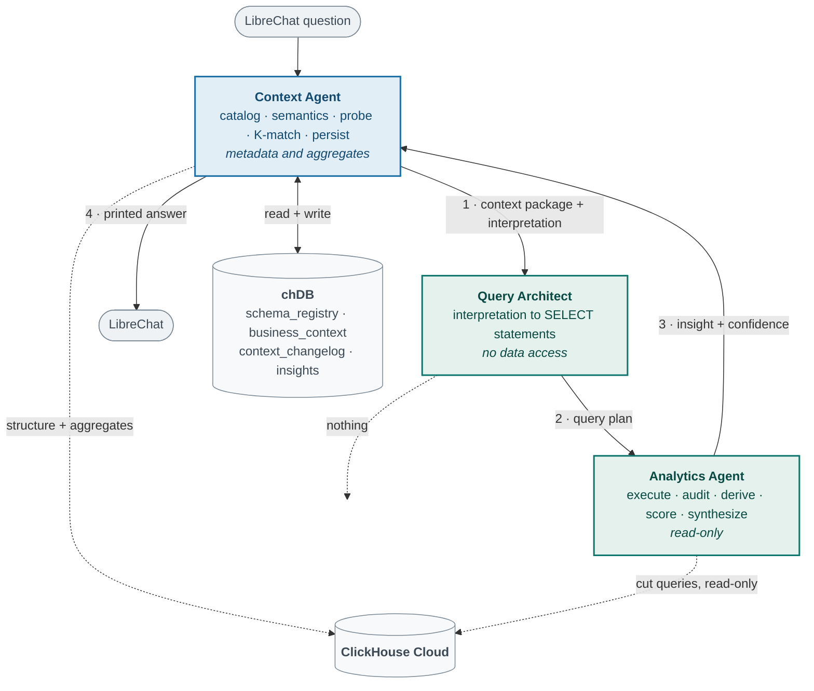
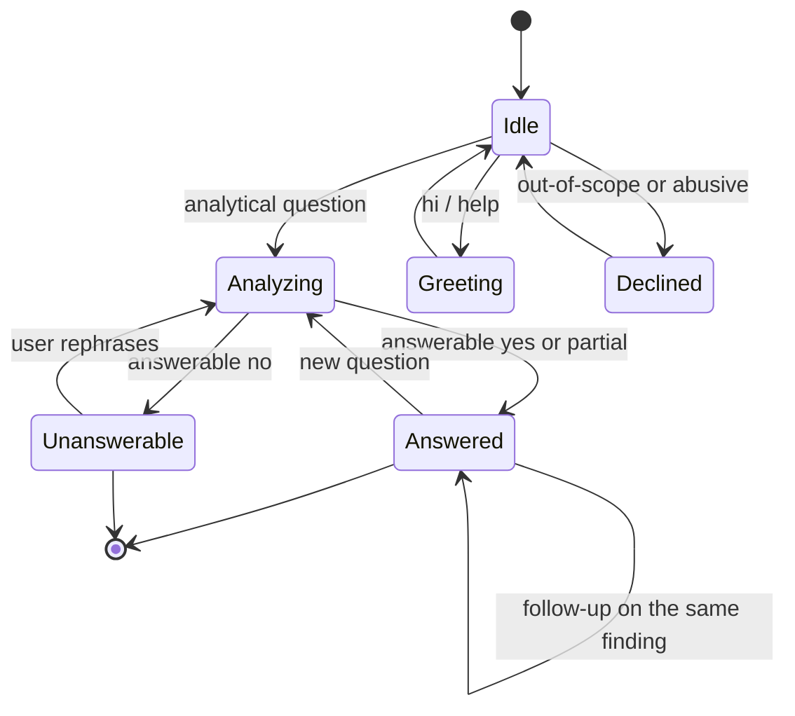
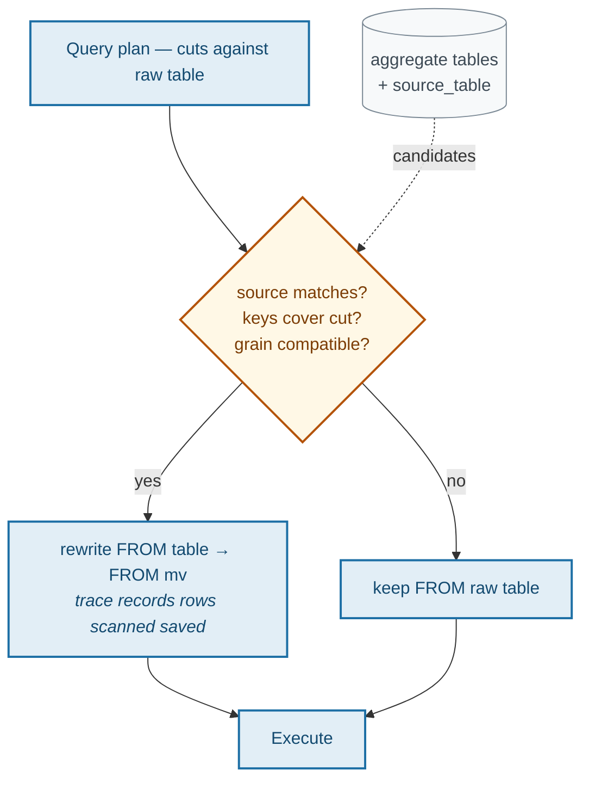

# CUJ 2 — Analytics Agent (LOCKED DESIGN)

**Status:** locked for hackathon MVP. Supersedes the CUJ 2 sections of `cuj_architecture.md` and `cuj_architecture_v2.md`.
**Surface:** LibreChat only. Every output a human sees is printed as chat markdown.
**Scope:** hackathon MVP — meets the Analytics Agent acceptance criteria. Production concerns are listed in § 11 as extended goals, not built.
**Branch:** targets `refactor/cuj-deterministic-pipeline`.

---

## 1. Scope

Given a product manager's natural-language question, resolve which instrumented table
answers it, decide whether it *can* be answered at all, run multi-cut aggregation entirely
inside ClickHouse, interpret the numbers against the business context layer, and print a
PM-actionable insight with a confidence score and a trace link.

Maps to the problem statement's **Analytics Agent** deliverable:

| Requirement | Where satisfied |
| :--- | :--- |
| Run statistical analysis — trends | Phase 9 trend state via `finding_key` + time series |
| Run statistical analysis — anomalies | Phase 9 segment delta vs probed baseline + K1–K7 match |
| Run statistical analysis — segment comparisons | Phase 5 five cuts, each compared against the baseline |
| Run statistical analysis — correlations | Phase 9 concentration ratio + date coincidence |
| Apply business context to interpret numbers | Phase 1b caveats + K-match, Phase 10 synthesis |
| Multiple cuts — device, geo, funnel stage, user segment | Phase 5 |
| Output actionable insights, not just charts | Phase 10 + § 9 worked example |
| *"push computation into ClickHouse, let the LLM interpret results, not fetch them"* | Phase 7 — aggregates only, never raw rows |

Evaluation criteria:

| Criterion | Where satisfied |
| :--- | :--- |
| **Insight quality** — carries the *why* | baseline delta → concentration → K-link → trend → recommendation |
| **Context freshness** — reasons with updated context, not a stale snapshot | Phase 1a semantic layer written by CUJ 1 + Phase 1b `context_changelog` citation |
| **Traceability** — follow the reasoning chain | § 7 span tree, `why` on every span |
| **The unseen spec** | Phase 1a semantic retrieval over CUJ 1-written descriptions — no keyword ladder |
| Viz layer — insights with confidence scores, context diff | `insights` table + `context_changelog` + `Tool_Emit_Viz` |

---

## 2. Locked decisions

1. **Table resolution is semantic, never keyword-driven.** The existing
   `infer_domain_from_question()` keyword ladder is retired. It hardcodes the five known
   specs and silently defaults to `01_express_checkout`, which means the unseen spec would
   be analysed against the wrong table with full confidence. This is the single highest-risk
   defect in CUJ 2 and the fix is not optional. Replacement is vector retrieval over
   `table_semantics`, whose descriptions CUJ 1 derives from `spec.md` at deploy time.
2. **Answerability is checked before any analytical query runs.** The base context contains
   a metric-boundary trap — post-purchase metrics are not derivable from pre-purchase funnel
   telemetry. Answering that with a fabricated number is the worst available failure. Three
   outcomes: `yes`, `partial`, `no`. On `no` the agent declines and explains.
3. **Interpretation correctness is not machine-verified.** Whether the interpretation matches
   what the user *meant* requires the user. The system's job is to make the interpretation a
   one-line glance, printed with every answer — not to claim it verified intent.
4. **Denominator conflict: primary for cuts, both for the headline.** Primary is the highest
   `version` in `business_context`. All cuts use it. The headline number is computed both
   ways — one extra query — and the contradiction is stated with the numeric delta.
5. **Correlations are computed, not claimed.** Concentration ratio and date coincidence, both
   derived from data already fetched. No Pearson coefficients are asserted that were not
   calculated.
6. **Prior insights are read, not just written.** Matching is an exact `finding_key` lookup,
   never fuzzy text comparison. Three trend states: new, persisting, reversed.
7. **Raw versus aggregate is decided deterministically**, by `system.tables.engine`, never by
   naming convention or LLM. Resolution considers raw tables only; probing an aggregate would
   return rollup row counts and destroy the baseline.
8. **Bounded retry, never open-ended ReAct.** One replan attempt on validation failure.
   Iterative drill-down is explicitly out of MVP scope — see § 11.
9. **`memory=False` holds.** Cross-question continuity comes from reading the `insights`
   table, which is an explicit tool call, not opaque model recall.
10. **Query Architect ownership is enforced structurally, not by convention.** The executor
    accepts a typed `PlannedQuery`, never a bare SQL string, so there is no path by which
    ad-hoc SQL reaches ClickHouse. See § 4 *Query provenance*.
11. **Never fabricate data.** When every query path fails, the cut is empty and the result
    audit says so. The current implementation substitutes `[{"dim": dim, "events": 100}]`
    (`analysis_flow.py:367`) and continues analysing an invented number all the way into the
    PM report — this must be deleted, not preserved.

---

## 3. Agent roster

### Naming

Agent names follow the problem statement: **Instrumentation Agent**, **Analytics Agent**,
**Context Agent**. The Query Architect is a fourth agent the problem statement does not name —
it exists because SQL translation is a distinct responsibility from schema design (CUJ 1) and
from result interpretation (CUJ 2).

| Agent | Appears in |
| :--- | :--- |
| **Instrumentation Agent** | CUJ 1 |
| **Analytics Agent** | CUJ 2 |
| **Context Agent** | CUJ 1 + CUJ 2 |
| **Query Architect** | CUJ 1 + CUJ 2 |

These names are used everywhere — prose, diagrams, Langfuse span names, and code.

### Roles

| Agent | Owns | Never | Reads / writes |
| :--- | :--- | :--- | :--- |
| **Context Agent** | Catalog, table semantics, live profile probe, known-issue match, insight persistence. Sole writer. | Translates intent into SQL. Interprets results for the PM. | reads chDB + `system.tables` + aggregates; writes chDB |
| **Query Architect** | Translating the interpretation into SELECT statements — 5 cuts, intersection, alt-denominator headline, baseline metric. **Shared with CUJ 1**, where the same agent emits DDL, MV and `INSERT` — see `docs/CUJ1.md` § 3. | Touches any database. Decides what a metric means. | nothing |
| **Analytics Agent** | Executing the plan, auditing results, deriving signals, scoring confidence, PM synthesis. | Translates intent into SQL. Writes to any database. | reads ClickHouse rows via aggregates only |

**Plane rule:** metadata versus analytical data, not chDB versus ClickHouse. The Context Agent
reads structure and aggregates; only the Analytics Agent executes the analytical cut queries. No agent
pulls raw rows into LLM context.

**What "never writes SQL" means.** The boundary is *translation*, not the presence of SQL
strings. Turning intent — a question, a metric formula, a design — into SQL belongs to the
Query Architect exclusively. A Context Agent tool holding a fixed query is not translation: the
shape is authored in version-controlled tool code, is testable, and does not vary with the
request. Phases 1a, 1b and 1c are templated queries of this kind. The one genuinely
generative piece in the context-load path — the **baseline metric**, which requires rendering
a `business_context` formula string into SQL — is deliberately deferred to the Query
Architect in phase 5 rather than embedded in the probe.

---

## 4. Orchestration flow

```mermaid
flowchart TD
    Q(["LibreChat question"]) --> G["Guardrail — greeting / abusive / out-of-scope"]
    G -->|analytical| C1

    C1["<b>1a · Semantic retrieval</b> — Context Agent<br/>embed question · cosineDistance over table_semantics<br/>top-3 candidates + live system.tables classification"]
    C1 --> GD{"best distance<br/>within threshold?"}

    GD -->|"no confident match"| DECLINE
    GD -->|yes| C2

    C2["<b>1b · Table semantics</b> — Context Agent, chDB<br/>columns + version · metric formulas + denominators<br/>caveats · K1–K7 · changelog · prior insights by finding_key<br/><i>loaded for all 3 candidates</i>"]
    C2 --> C3

    C3["<b>1c · Live probe</b> — aggregates only<br/>row count · date range · uniq users<br/>dim cardinality + null share"]
    C3 --> ANS

    ANS["<b>2+3 · Resolve + answerability</b> — LLM, one call<br/>picks among the 3 candidates <b>and</b> decides answerability<br/>metric · denominator · conflict · what's missing"]
    ANS --> GA{"answerable?"}

    GA -->|"<b>no</b>"| DECLINE(["<b>Decline honestly</b><br/>what's missing and why<br/>no query, no fabricated number"])
    GA -->|"yes / partial"| KI

    KI["<b>4 · Known-issue match</b> — deterministic, once"]
    KI --> PLAN

    PLAN["<b>5 · Query plan</b> — Query Architect<br/>5 cuts: device · geo · destination · funnel stage · <b>user segment</b><br/>+ intersection query + headline on alt denominator + baseline metric<br/>date range and caveats applied"]
    PLAN --> VAL

    VAL{"<b>6 · Check</b> — SELECT-only · columns exist"}
    VAL -->|"fail, retry 1"| PLAN
    VAL -->|ok| EX

    EX["<b>7 · Execute</b> — Analytics Agent<br/>aggregation pushed down, no raw rows"]
    EX --> AUD

    AUD["<b>8 · Result audit</b> — empty? null-heavy dim?"]
    AUD --> DERIVE

    DERIVE["<b>9 · Derive — deterministic, no extra queries</b><br/>segment delta vs baseline · <b>concentration ratio</b><br/><b>date coincidence</b> vs K-issue · trend state via finding_key<br/>confidence score"]
    DERIVE --> SYN

    SYN["<b>10 · Synthesize + sufficiency</b> — LLM<br/>answer with the why, or state 'no significant signal'<br/>cite prior insight · cite context version · flag denominator conflict"]
    SYN --> OUT

    OUT(["<b>11 · Print to LibreChat</b><br/>+ persist insights with finding_key<br/>+ insight_report.md / .json + trace URL"])

    CHDB[("<b>chDB</b> — Context Agent<br/>schema_registry · business_context<br/>context_changelog · insights")]
    LIVE[("<b>ClickHouse Cloud</b>")]

    CHDB -.->|read| C1
    CHDB -.->|read| C2
    LIVE -.->|structure| C1
    LIVE -.->|aggregates| C3
    LIVE -.->|cut queries| EX
    OUT -.->|write| CHDB

    classDef lib fill:#e2eef6,stroke:#1d6fa5,stroke-width:2px,color:#134a70
    classDef arch fill:#e4f1ec,stroke:#0f766e,stroke-width:2px,color:#0a4a44
    classDef gate fill:#fff8e6,stroke:#b45309,stroke-width:2px,color:#7c3d06
    classDef stop fill:#f5e6e2,stroke:#a8412a,stroke-width:2px,color:#6b2418
    classDef store fill:#f7f9fa,stroke:#7a8894,stroke-width:1px,color:#3d4a55
    classDef io fill:#eef2f5,stroke:#7a8894,stroke-width:1px,color:#3d4a55

    class C1,C2,C3,KI,AUD,DERIVE lib
    class PLAN,EX,SYN arch
    class VAL,GA,GD gate
    class DECLINE stop
    class CHDB,LIVE store
    class Q,G,OUT io
```



### Phase notes

**1a · Semantic retrieval.** Table names and column lists are thin signal — `visa_fast_track`
with columns `[timestamp, user_id, device_type]` says nothing about what the feature does.
CUJ 1 therefore writes a description derived from `spec.md` into `table_semantics` at deploy
time (see `docs/CUJ1.md` § 6a). Retrieval embeds the question and ranks against it:

```sql
SELECT table_name, spec_id, description,
       cosineDistance(embedding, {question_embedding}) AS dist
FROM table_semantics
WHERE length(embedding) > 0
ORDER BY dist ASC
LIMIT 3
```

`cosineDistance` is native to ClickHouse, so the semantic layer adds no storage dependency —
it lives in the primary datastore, which is also the answer to the problem statement's
*"judges will ask why you chose what you chose"* about context-layer storage.

Every object is still classified deterministically, and **only raw tables are candidates**:

```python
def classify(engine: str) -> str:
    agg = ("MaterializedView", "SummingMergeTree", "AggregatingMergeTree")
    return "aggregate" if any(a in engine for a in agg) else "raw"
```

Probing an aggregate returns rollup row counts, not event counts, and `uniq(user_id)` does not
survive aggregation — that would silently corrupt the baseline and every confidence score
derived from it.

**Three guards on retrieval.** Vector search always returns a nearest neighbour, so on its own
it can never say *"none of these"* — it would happily rank a fulfilment-sounding table first
for a question about delivery SLAs even when that table has no `delivery_status` column. The
guards restore that ability:

| Guard | Behaviour |
| :--- | :--- |
| Distance threshold | best `dist` above τ → no confident candidate, decline rather than force a pick |
| Embedding failure | fall back to passing the full catalog to the LLM — the pre-vector design, now the degraded path |
| Missing embedding row | table included as an unranked candidate, never invisible — a table created ninety seconds ago must still be reachable |

Retrieval narrows; **phase 2+3 decides**. A candidate can rank first and still be rejected as
unanswerable.

**2+3 · Resolve and answerability, one LLM call.** Merging these was awkward when resolution
needed the entire catalog in the prompt. With three candidates it is natural: the call receives
each candidate's description, columns, metric formulas and caveats, then returns the chosen
table *and* the answerability verdict together. Net LLM budget drops from five calls to four.

The question embedding and the top-3 distances are recorded on the span, so resolution becomes
inspectable — a judge sees *"matched `visa_fast_track` at 0.14, next best `express_checkout`
at 0.61"* rather than taking a model's word for it.

**1c · Live probe — one SQL query, zero LLM calls.** The candidate dimension list comes from
`system.columns` **types**, not from a hardcoded set of column names, so it stays correct on
the unseen spec.

```sql
SELECT
  count()                                 AS rows,
  min(timestamp)                          AS from_ts,
  max(timestamp)                          AS to_ts,
  uniq(user_id)                           AS users,
  uniq(device_type)                       AS device_type_card,
  countIf(device_type IS NULL) / count()  AS device_type_null_share,
  countIf(os IS NULL) / count()           AS os_null_share
FROM {raw_table}
```

The **date range** matters as much as the row count: without it the planner can filter to the
last 7 days against data that ends three months ago, return nothing, and report "no signal" —
confidently wrong.

The **baseline metric** is rendered by the Query Architect in phase 5 (it requires turning a
`business_context` formula string into SQL) and executed alongside the cuts in phase 7. Phase
1c stays LLM-free.

**3 · Answerability contract.**

```json
{
  "answerable": "yes | partial | no",
  "interpretation": "conversion = purchases / application_started on express_checkout, cut by device, geo, destination, funnel stage, guest status",
  "metric": "conversion_rate",
  "denominator_used": "application_started",
  "denominator_conflict": "business_context v2 also defines this as / sessions",
  "missing": ["no delivery_status column — post-purchase metrics not derivable here"],
  "required_cuts": ["device_type", "geoip_country_code", "destination", "event", "is_guest"]
}
```

This single call replaces a separate metric-resolution step — consolidation, not addition.

**5 · Query provenance.** The Query Architect owning all SQL translation is enforced by the
type system, not by discipline. The executor takes a plan item; a bare string is a `TypeError`,
so no ad-hoc path exists to bypass it.

```python
class PlannedQuery(BaseModel):
    purpose: str      # "cut:device_type" | "baseline" | "intersection" | "timeseries" | "headline_alt"
    sql: str
    origin: Literal["architect_llm", "architect_fallback"]


def Tool_Analytics_Compute(query: PlannedQuery) -> dict:
    _assert_select_only(query.sql)
    ...
```

`origin` exists because SQL generation is **LLM-driven with a deterministic fallback**, and the
fallback is currently silent. `query_architect.generate_sql` returns a template on three paths:
no API key or running under pytest, LLM output missing a mandatory dimension, or any exception
(rate limit, timeout, malformed JSON). That template emits raw event counts per dimension — not
the metric — so a degraded run does not answer a weaker version of the question, it answers a
*different* question, with nothing in the output to say so.

Recording `origin` on the span makes the claim checkable: a judge opening the trace sees whether
the LLM authored that SQL. Under *"no trace, no credit"* the distinction matters. When
`origin == "architect_fallback"`, the report says so and confidence is capped.

Note also that the `PYTEST_CURRENT_TEST` guard means every test exercises the template path —
the LLM path has no CI coverage by construction.

**9 · Derived signals — all arithmetic on rows already fetched, no extra queries.**

| Signal | Rule |
| :--- | :--- |
| Segment delta | segment metric minus probed baseline |
| **Concentration ratio** | share of the total deficit sitting in the top cross-dimension value. 80% in one country → correlated with geo. Spread evenly across twelve → not geo |
| **Date coincidence** | first date the trend breaks versus the date on the matched K-issue |
| **Trend state** | exact `finding_key` lookup — `new` / `persisting` / `reversed` |
| Confidence | sample size, effect size, K-match, cut consistency, answerability level, prior-insight agreement, result-audit warnings |

`finding_key = f"{table}::{metric}::{top_dimension}::{top_segment}"` — stored on write so
matching is an exact string lookup, never fuzzy. Requires one new column on the `insights`
table.

### Budget per question

| | Count |
| :--- | :--- |
| LLM calls | 4 — guardrail, resolve+answerability (merged), plan, synthesize (+1 on replan) |
| Embedding calls | 1 — the question |
| ClickHouse queries | 9 — 1 probe, 5 cuts, 1 intersection, 1 alt-denominator headline, 1 time series |
| Raw rows into LLM context | **0** |

The **time series** is not optional: phase 9 claims a trend and a date coincidence — *"first
date the trend breaks versus the date on the matched K-issue"* — and neither is derivable from
the cuts, which are aggregated across the whole window. It is generated by the Query Architect
in phase 5 like every other query, with `purpose="timeseries"`.

---

## 5. Ownership and data planes



---

## 6. LibreChat conversation state machine

CUJ 2 is single-turn by default — no approval gate. Follow-ups are supported by carrying a
hidden token in the answer, the same mechanism CUJ 1 uses for its HITL gate.



The answer embeds:

```html
<!-- atlys:insight table=express_checkout metric=conversion_rate finding_key=express_checkout::conversion_rate::device_type::ios trace=abc123 -->
```

LibreChat renders markdown, so the comment is invisible to the user but present in the history
the next turn receives. Follow-ups resume the same trace rather than opening a second one.

---

## 7. Langfuse tracing

One trace per question. Everything nests under a single root span via OTEL context
propagation — no manually-passed trace id, which is what produces orphan spans.

```mermaid
flowchart TD
    ROOT["<b>analysis::{spec_id}</b> — ROOT<br/><i>trace URL captured here</i>"]

    ROOT --> S1["context_agent::semantic_retrieval<br/>out: top-3 candidates + distances, raw/aggregate classification"]
    ROOT --> S3["context_agent::load_table_semantics<br/>out: metrics, caveats, K-issues, context_version, prior_finding"]
    ROOT --> S4["context_agent::live_probe<br/>out: rows, date_range, users, null_shares"]
    ROOT --> S5["context_agent::resolve_and_answerability — GENERATION<br/>out: chosen table · yes/partial/no · interpretation · missing · <b>why</b>"]
    ROOT --> S6["context_agent::known_issue_match<br/>out: matched K-id or none"]
    ROOT --> S7["query_architect::plan_queries — GENERATION<br/>out: 8 SELECTs + <b>why each cut</b>"]
    ROOT --> S8["validator::check_queries<br/>out: violations[]"]
    S8 -.->|if violations| S8R["query_architect::replan_retry — GENERATION"]
    ROOT --> S9["analytics_agent::execute_cuts<br/>out: rows per cut"]
    ROOT --> S10["analytics_agent::result_audit<br/>out: warnings[]"]
    ROOT --> S11["analytics_agent::derive_signals<br/>out: delta, concentration, date_coincidence, trend_state"]
    ROOT --> S12["analytics_agent::score_confidence<br/>out: score + rationale"]
    ROOT --> S13["analytics_agent::synthesize — GENERATION<br/>out: PM insight + <b>why</b>"]
    ROOT --> S14["context_agent::persist_insight<br/>out: finding_key, version"]
    ROOT --> S15["report::emit_artifacts<br/>out: paths, trace URL"]

    classDef root fill:#c2410c,stroke:#7c2408,stroke-width:3px,color:#ffffff
    classDef lib fill:#e2eef6,stroke:#1d6fa5,stroke-width:2px,color:#134a70
    classDef gen fill:#ede8f7,stroke:#6d4aa5,stroke-width:2px,color:#3d2270
    classDef anal fill:#e4f1ec,stroke:#0f766e,stroke-width:2px,color:#0a4a44
    classDef chk fill:#fbeae1,stroke:#c2410c,stroke-width:2px,color:#8a2f08

    class ROOT root
    class S1,S3,S4,S6,S14,S15 lib
    class S5,S7,S13,S8R gen
    class S9,S10,S11,S12 anal
    class S8 chk
```



### Span contract

| Field | Content |
| :--- | :--- |
| `input` | what the step received |
| `output` | what it produced |
| `metadata.agent` | `context_agent` / `query_architect` / `analytics_agent` |
| `metadata.why` | one sentence explaining the decision |

`metadata.why` is what turns a timing log into the reasoning chain judges are told to follow.
A span without it is not traceable in the sense the problem statement means.

The trace URL is captured inside the root span while it is still active — `get_current_trace_id()`
then `get_trace_url()` — and surfaced in the chat answer, the artifact, and the `insights` row.

---

## 8. Submission artifacts

> *"Your submission must include what your pipeline produced for it: the generated schema, the
> insight summary, and the trace that proves your system generated them."*

CUJ 2 owns the insight summary:

```
outputs/submission/{spec_id}/
├── insight_report.md      # human / judge readable
└── insight_report.json    # machine readable, feeds the viz layer
```

| Section | Content |
| :--- | :--- |
| Header | question, resolved table, timestamp, **trace URL** |
| Interpretation | what was actually computed, metric and denominator |
| Answerability | yes / partial, and what was missing if partial |
| Headline | baseline, observed, delta — plus the alt-denominator number and the contradiction |
| Cuts | five cuts with segment deltas against the baseline |
| Correlation | concentration ratio, date coincidence |
| Business context applied | matched K-issue, caveats honoured, **context version used and when it last changed** |
| Trend | new / persisting / reversed, with the prior finding cited |
| Confidence | score and its inputs |
| Recommendation | what a PM should do next |
| Reasoning chain | ordered span list with each `why` — readable without opening Langfuse |

The full report is also **printed into LibreChat**. Files exist for the submission package;
chat is the surface a human actually reads.

---

## 9. Example user journey (LibreChat)

---

**User**

> conversion on express checkout looks off this month — what's going on?

**Atlys Analytics Agent**

> ### Express Checkout — conversion regression, concentrated on iOS in the UAE
>
> **Interpretation:** conversion = `purchase_completed / application_started` on
> `express_checkout`, over 2026-03-01 → 2026-03-31, cut by device, country, destination,
> funnel stage and guest status.
>
> #### Headline
>
> | | Value |
> | :--- | :--- |
> | Baseline (Feb) | 62.4% |
> | Observed (Mar) | 47.2% |
> | **Delta** | **−15.2pp** |
> | Sample | 5,507 events · 1,650 users |
>
> ⚠️ **Contradiction in the context layer.** `business_context` v3 defines conversion as
> `purchases / application_started`; v2 defines it as `purchases / sessions`. Under v2 the drop
> is **−8.3pp**, not −15.2pp. The two definitions disagree materially — the team should resolve
> this before acting on the magnitude. The direction is the same either way.
>
> #### Where it is concentrated
>
> | Cut | Worst segment | vs baseline |
> | :--- | :--- | ---: |
> | Device | `ios` | −31.4pp |
> | Country | `AE` | −22.1pp |
> | Destination | evenly spread | −2.1pp |
> | Funnel stage | `otp_challenge_shown` | −28.9pp |
> | Guest status | `is_guest = 1` | −4.0pp |
>
> **Concentration:** 78% of the missing conversions sit in `ios × AE`. This is not a broad
> platform regression — it is one device on one market. Android and web are within noise.
>
> **Timing:** the trend breaks on **2026-03-12**. Known issue **K1 — iOS WebKit OTP autofill
> regression** was logged **2026-03-11**. The drop begins the day after, and it is concentrated
> at the `otp_challenge_shown` funnel stage, which is exactly where K1 bites.
>
> #### The why
>
> iOS users in the UAE are failing at the OTP step specifically, starting the day after K1 was
> documented. The autofill regression means the OTP is not populating, users abandon at the
> challenge screen, and the application never completes. Guest status is not a factor; the
> `is_guest` cut is inside noise.
>
> #### Trend
>
> 🔁 **Persisting.** A prior insight on 2026-03-18 recorded the same finding
> (`express_checkout::conversion_rate::device_type::ios`). This has been unresolved for 13 days.
>
> #### Context applied
>
> - Matched **K1** from `business_context` v4
> - Context last updated **2026-03-30** via ingestion of `05_multi_currency_pricing`
> - Caveat honoured: `os` coalesced with `device_type`, since telemetry records `os = NULL` on
>   Android and would otherwise undercount
>
> #### Confidence — `0.87 / 1.0`
>
> Large sample (5,507 events), large effect (−15.2pp), documented known-issue match, consistent
> across five cuts, no result-audit warnings.
>
> #### Recommended next step
>
> Ship the K1 WebKit autofill fix to iOS and confirm recovery at the `otp_challenge_shown` stage
> in the UAE cohort specifically. Expected recovery is roughly 12pp of the 15.2pp — the residual
> is spread across segments with no single cause.
>
> 🔍 **Trace:** https://us.cloud.langfuse.com/trace/abc123def456
> 📄 `outputs/submission/01_express_checkout/insight_report.md`
>
> <!-- atlys:insight table=express_checkout metric=conversion_rate finding_key=express_checkout::conversion_rate::device_type::ios trace=abc123def456 -->

---

## 10. Decline path

**User**

> what's our on-time visa delivery rate?

**Atlys Analytics Agent**

> ### I can't answer that from the instrumented tables
>
> **What you asked for:** on-time delivery rate — a post-purchase fulfilment metric.
>
> **Why it isn't derivable:** the resolved table `express_checkout` carries pre-purchase funnel
> telemetry only. There is no `delivery_status`, `fulfilment_time`, or `sla_target` column, and
> no other registered table carries them either. `business_context` documents this boundary
> explicitly: post-purchase metrics cannot be computed from funnel conversion tables alone.
>
> **What I could answer instead:**
> - conversion through to `purchase_completed`, cut by device, geo, destination
> - drop-off at any funnel stage present in the event stream
> - payment latency at the confirmation step
>
> No query was run and no number was estimated.
>
> 🔍 Trace: https://us.cloud.langfuse.com/trace/def789ghi012

---

## 11. Extended goals — not in MVP

Recorded so the boundary is deliberate rather than accidental.

### 11.1 Materialized-view routing

The catalog already classifies aggregates deterministically (§ 4, phase 1a). The extended goal
is to *use* them: rewrite a planned cut query to read from an MV instead of the raw table when
it is safe.

```
for each planned cut query:
    if an MV exists where
        mv.source_table == resolved_table
        AND mv.group_keys ⊇ cut.dimensions
        AND mv.time_grain is compatible with cut.window
    then rewrite FROM {table} → FROM {mv}
```

Pure arithmetic on the catalog — no model involved. Worth doing because it makes the MV
**visibly earn its keep**, which is a CUJ 1 evaluation criterion. The trace would then show
*"cut on `device_type` served from `express_checkout_daily_mv` — 14 rows scanned instead of
5,507"*, proving the MV was used rather than merely justified.



Blocked on nothing — it is scope, not risk. Deferred because MVP correctness does not depend
on it.

### 11.2 Multi-table funnel joins

MVP is single-table. Funnel stage comes from the `event` column inside a spec table, which
works because CUJ 1 writes all funnel steps into one table. Cross-table funnel questions over
the original eight tables need join-key resolution (`application_id` > `app_session_id` >
`user_id`) and are out of scope. Also blocked by § 12.

### 11.3 Bounded drill-down

MVP answers *"iOS is down, concentrated in AE at the OTP stage."* It does not iteratively
narrow to *"iOS 17.2 specifically."* The designed replacement is a depth-capped drill-down with
a deterministic continuation rule — drill into the largest effect whose sample clears a noise
floor, stop at depth 3 — never open-ended ReAct, which has no reliable termination signal and
will find signal in noise given enough depth.

The single intersection query covers the stated example scenario at a fraction of the cost,
which is why drill-down is deferred.

### 11.4 Intent confirmation turn

MVP prints the interpretation line and moves on. The extended version backtranslates the query
plan to plain English and asks the user to confirm when the interpretation is ambiguous. Cut
because it adds a turn to every uncertain question and the printed interpretation already gives
the user a one-line correction opportunity.

### 11.5 Hybrid re-ranking

MVP retrieves top-3 by cosine distance and lets one LLM call choose among them. That works
while the catalog fits comfortably in a prompt — roughly a dozen tables here. Past that, the
extended shape is a two-stage retrieve-and-rerank: widen vector retrieval to top-k, then score
candidates on structural fit (does the table actually carry the columns the metric needs?)
before the LLM sees them.

Not needed at this scale, and adding it now would tune a retrieval pipeline against thirteen
rows.

---

## 12. Not covered — open blockers

- **Foundation table data.** The eight existing tables load from parquet via
  `problem statment/data/load.sh`. Those files are currently Git LFS pointers that return 404,
  so `bootstrap_existing_tables()` cannot run. Spec tables are unaffected — `events.ndjson` is
  real — but any question targeting the original eight tables has no data behind it, and
  *"load the dataset into your ClickHouse Cloud service"* remains unmet. **Open blocker.**
- **`insights.finding_key`.** The trend logic requires one new column on the `insights` table
  (`spec_id, question, answer_md, confidence, cuts_json, trace_id, created_at` today). Schema
  change pending.
- **`table_semantics` table + embedding provider.** New table (§ 4, phase 1a) written by CUJ 1
  and read by CUJ 2. Embeddings come from the existing `GEMINI_API_KEY`; the distance threshold
  τ needs calibrating against the five known specs before the unseen one lands.
- **Backfill for the eight foundation tables.** They predate the pipeline, so no
  `table_semantics` row exists for them. Either backfill descriptions from `ddl.sql` plus
  `base_context.md`, or accept that they surface only as unranked candidates. Decide before
  relying on questions that target them.
- **Retirement of `infer_domain_from_question()`.** Locked decision 1 requires deleting the
  keyword ladder. Until then the unseen spec resolves to the wrong table. **Highest-priority
  implementation item.**
