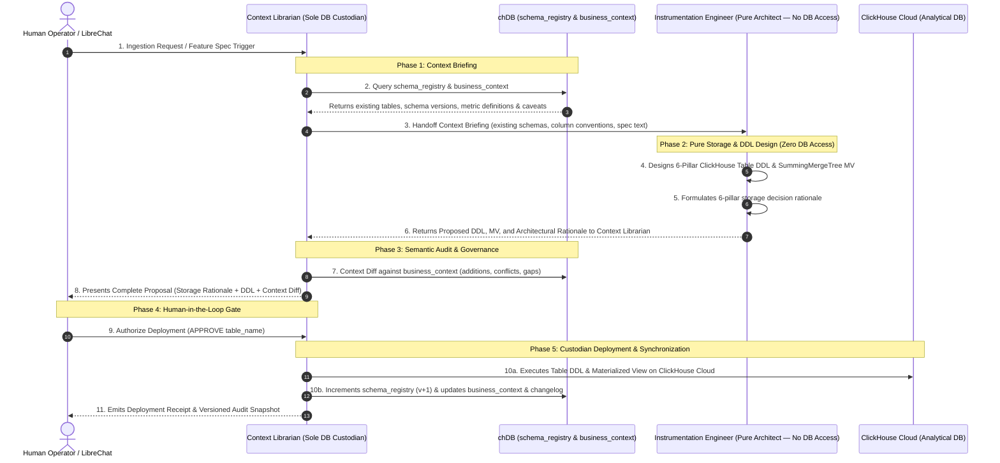
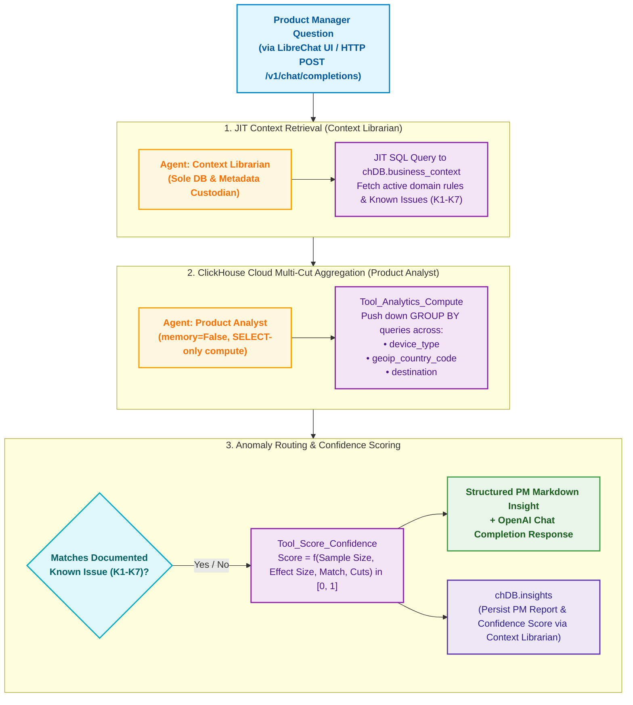

# Critical User Journeys (CUJ) & Multi-Agent Architecture

This document details the two Critical User Journeys implemented in the Atlys Agentic Analytics System:

- **CUJ 1**: Automated Feature Ingestion & Context Audit Pipeline (Human-in-the-Loop Gated)
- **CUJ 2**: Analyst Query & Anomaly Detection Interface (Read-Only Multi-Cut Analytics)

---

## 1. Core Agent Personas & Data Custodianship Model

The architecture enforces a strict **Least-Privilege & Data Custodianship Boundary**:

| Agent Persona | Direct DB / Metadata Access? | Assigned Tools | Architectural Role & Responsibilities |
| :--- | :---: | :--- | :--- |
| **`Context Librarian`** | ✅ **Sole DB & Metadata Custodian** | • `consult_internal_tables`<br>• `context_diff`<br>• `execute_ddl`<br>• `context_upsert` | **Data Governance Gatekeeper & DB Custodian**: Exclusive custodian of `chDB` (`schema_registry` + `business_context` + `context_changelog`) and ClickHouse Cloud DDL deployment. Briefs the Instrumentation Engineer with existing table schemas and versions, audits proposed DDL against business rules, manages operator proposals, and executes live DDL + registry sync upon operator approval. |
| **`Instrumentation Engineer`** | ❌ **Zero Direct DB Access** | • `infer_schema`<br>• `generate_mv`<br>• `explain_schema_rationale` | **Pure ClickHouse Systems Architect**: Operates as a pure design & reasoning engine without direct database access. Receives context briefings from the Context Librarian, computes optimal ClickHouse DDL (`ORDER BY`, `PARTITION BY`, `LowCardinality`, `TTL`), generates `SummingMergeTree` MVs, and delegates the proposed design back to the Context Librarian for auditing and deployment. |
| **`Product Analyst`** (CUJ 2) | 🔍 **Read-Only Analytics** | • `analytics_compute` (SELECT-only)<br>• `score_confidence` | **Analytics & Diagnostics Scientist**: Obtains domain context and known issues (`K1`–`K7`) through the Context Librarian, executes strictly read-only multi-cut `SELECT` queries against ClickHouse Cloud, evaluates statistical confidence, and delegates finalized insight storage to the Context Librarian. |

---

## 2. CUJ 1: Feature Ingestion & Context Audit Pipeline

### Purpose
Automates the transition from a product feature specification (`spec.md`) and raw event data (`events.ndjson`) to production ClickHouse tables and materialized views, with an interactive Human-in-the-Loop approval gate and automatic `chDB` context synchronization.

### Workflow Sequence Diagram



### Steps Breakdown

1. **Step 1: Context Consultation (`Context Librarian`)**:
   - **`Tool_Consult_Internal_Tables`**: Context Librarian inspects `chDB.schema_registry` and `chDB.business_context` for existing tables, schema versions, and known metric definitions.
   - Generates a context briefing for the Instrumentation Engineer.

2. **Step 2: Schema & Materialized View Design (`Instrumentation Engineer`)**:
   - **`Tool_Infer_Schema`**: Analyzes the NDJSON events stream and feature Markdown spec. Generates production ClickHouse DDL adhering to strict engineering constraints:
     - `ORDER BY (timestamp, user_id)` (never leads with UUID).
     - Monthly partitioning via `toYYYYMM(timestamp)`.
     - 12-month data retention TTL via `TTL timestamp + INTERVAL 12 MONTH`.
     - Flattens nested JSON objects (e.g. `payment.amount` $\rightarrow$ `payment_amount`).
     - Uses `LowCardinality(String)` for low-cardinality categorical attributes (e.g. `device_type`, `currency`).
   - **`Tool_Generate_MV`**: Inspects inferred columns for slice/segment dimensions (`device_type`, `geoip_country_code`, `destination`) and generates a companion daily pre-aggregation `SummingMergeTree` Materialized View.
   - **`Tool_Explain_Schema_Rationale`**: Formulates deep-dive technical reasoning across all 6 storage mechanics pillars.
   - Delegates proposed design back to the **Context Librarian**.

3. **Step 3: Semantic Audit (`Context Librarian`)**:
   - **`Tool_Context_Diff`**: Compares new table columns against `chDB.business_context`. Detects metric denominator contradictions and flags undocumented columns.
   - Formulates the comprehensive proposal for operator review.

4. **Step 4: Human-in-the-Loop (HITL) Gate**:
   - Presents the proposed DDL, Materialized View, 6-Pillar Rationale, and Context Diff to the operator.
   - Requires explicit literal input `"APPROVE"` to proceed. Any other input aborts immediately without touching ClickHouse Cloud.

5. **Step 5: Cloud Execution & Context Synchronization (`Context Librarian`)**:
   - **`Tool_Execute_DDL`**: Executes DDL on ClickHouse Cloud and records versioned schema snapshot in `chDB.schema_registry`.
   - If an MV is generated, executes the `SummingMergeTree` MV on ClickHouse Cloud.
   - **`Tool_Context_Upsert`**: Upserts new metrics and column definitions into `chDB.business_context` with incremental versioning and appends audit trails to `chDB.context_changelog`.

---

## 3. CUJ 2: Analyst Query & Anomaly Detection Interface

### Purpose
Provides product managers with an intuitive, hallucination-free conversational interface (via LibreChat UI or HTTP API). All analytical computations are executed natively in ClickHouse Cloud, and domain anomalies (K1–K7) are checked against a versioned business context layer.

### Workflow Diagram



### Steps Breakdown

1. **Just-In-Time (JIT) Context Retrieval (`Context Librarian`)**:
   - Queries `chDB.business_context` using SQL (`SELECT key, definition FROM business_context WHERE ...`).
   - Retrieves active metric formulas and documented anomalies (`K1`–`K7`).
   - Eliminates hidden LLM memory drift (`memory=False`).

2. **Mandatory Multi-Cut ClickHouse Aggregation (`Product Analyst`)**:
   - The **Product Analyst** agent has read-only access (`SELECT` only). Non-select operations are strictly blocked.
   - Pushes down dimension aggregation queries directly to ClickHouse Cloud across mandatory cut dimensions:
     - `device_type`
     - `geoip_country_code`
     - `destination`

3. **Anomaly Routing & Confidence Scoring**:
   - **Routing**: Evaluates question keywords and dimension aggregations against retrieved context definitions (e.g. matching `K1: iOS WebKit OTP autofill regression`).
   - **`Tool_Score_Confidence`**: Calculates a deterministic confidence score:
     $$ \text{Score} = f(\text{Sample Size } N, \text{Effect Size } \Delta, \text{Known Issue Match}, \text{Cut Consistency}) \in [0, 1] $$
   - **Synthesis**: Formats a structured PM report, delegates insight persistence in `chDB.insights` to the Context Librarian, logs the Langfuse trace span, and returns an OpenAI-compatible JSON payload to LibreChat.

---

## 4. Metadata Architecture & Semantic Storage Layer (`chDB`)

InsightMesh leverages embedded `chDB` to maintain four foundational metadata stores that govern agent reasoning:

```
        ┌─────────────────────────────────────────────────────────────┐
        │                     InsightMesh Engine                      │
        ├──────────────────────────────┬──────────────────────────────┤
        │  1. schema_registry          │  Contract & DDL Evolution    │
        │  2. business_context         │  Semantic Layer & Caveats    │
        │  3. context_changelog        │  Data Lineage & Audit Log    │
        │  4. insights                 │  Durable Agent Findings      │
        └──────────────────────────────┴──────────────────────────────┘
```

| Table | Industry Pioneer / Equivalent | When Popularized & Problem Solved | Role in Multi-Agent Execution |
| :--- | :--- | :--- | :--- |
| **`schema_registry`** | **Confluent Schema Registry**, AWS Glue Catalog | **~2015**: Event streaming explosion; prevented downstream breaking schema changes across distributed teams. | Tracks versioned ClickHouse table schemas; informs the **Context Librarian** and **Instrumentation Engineer** whether to `CREATE_NEW`, `REUSE_EXISTING`, or `ALTER_EXISTING`. |
| **`business_context`** | **Looker LookML**, **dbt Semantic Layer**, Atlan | **~2012–2021**: Solved metric divergence (conflicting definitions across teams) and codified data quality caveats. | Single source of truth for metric formulas, caveats (e.g. `OS NULL on Android`), and known issues `K1`–`K7`. Governed by the **Context Librarian**. |
| **`context_changelog`** | **OpenLineage**, **Marquez** (Linux Foundation), Monte Carlo | **~2020–2022**: Data observability revolution; provided immutable audit logs of who changed business rules and when. | Append-only governance audit log tracking every definition updated by the **Context Librarian** with author agent and Langfuse trace ID. |
| **`insights`** | **Feature Stores** (Feast, Tecton), Langfuse Agent Observability | **~2020–2025**: Analytical findings previously died in Slack/slides; AI agents require durable memory to cite verified findings. | Persists structured anomaly diagnoses, multi-cut segment deltas, and statistical confidence scores produced by the **Product Analyst**. |
