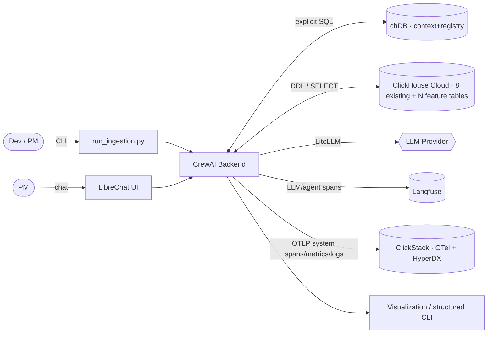
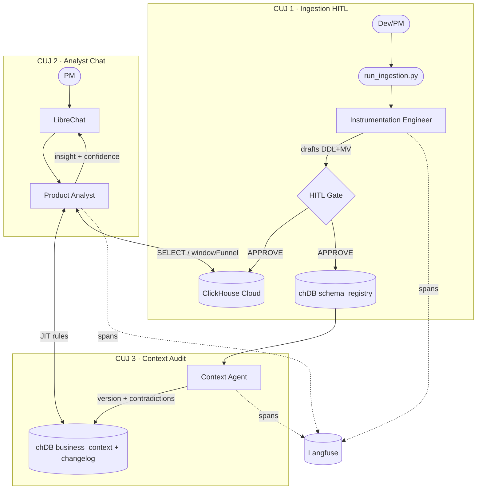

# Atlys Agentic Analytics System — Technical Design Document (Final)

> **Submission-ready design** for Click-a-thon 2026 (Atlys). This document merges the original
> `atlys_tech_design.md` with every gap surfaced in `report1.md`, so it maps 1:1 to the four
> required deliverables and the five scored evaluation axes (Schema quality, Insight quality,
> Context freshness, Traceability, Unseen 6th spec).
>
> *All data is **synthetic** — no real customer data, PII, or production records.*

---

## 0. Deliverables ↔ Evaluation Map (read this first)

| Judge Axis (PROBLEM_STATEMENT) | Weight | Where covered in this doc |
|---|---|---|
| **Schema quality** (order keys, partition, types, TTL, MVs earn keep) | High | §5.1, §7.1, §8.2 |
| **Insight quality** (PM would act; the *why*) | High | §5.2, §7.2, §9 |
| **Context freshness** (reasons with *updated* context) | High | §5.3, §6 (CUJ 3), §8.3 |
| **Traceability** (no trace, no credit) | High | §5.4, §10 (Langfuse semantic + ClickStack system) |
| **The Unseen 6th spec** (schema + insight + trace) | **Highest** | §6 (CUJ 4), §11 (Day-2 runbook) |
| Visualization layer (schema history, insights+confidence, context diff) | Required #4 | §5.5, §9.4, §12 |

Required deliverables: (1) Instrumentation Agent §5.1/§8.1, (2) Analytics Agent §5.2/§8.1,
(3) Context Agent §5.3/§8.1, (4) Tracing (§10) + Visualization (§12), (5) **Unseen-spec output** (§11).

---

## 1. Goal

Build a fully automated, **agentic data pipeline** for Atlys that collapses the manual
"tracking-PRD → schema → analysis" loop. Given a product feature spec (Markdown) and raw event
logs (NDJSON), the system automatically:

1. **Instruments** — designs and executes production-grade ClickHouse schemas + materialized views.
2. **Maintains context** — evolves a living, versioned business-context layer and surfaces its contradictions.
3. **Analyzes** — writes PM-actionable insights (with the *why* and a confidence score) by pushing computation into ClickHouse.
4. **Traces & visualizes** — Langfuse spans across all agents + a view of schema history, insights, and context diffs.
5. **Produces the unseen 6th-spec deliverable** — schema + insight summary + trace, provably from the pipeline.

**Stack:** **CrewAI** (multi-agent orchestration) · **ClickHouse Cloud** (primary datastore) ·
**chDB** (embedded ClickHouse for the context/metadata layer) · **Langfuse** (LLM/agent tracing) ·
**ClickStack** (OpenTelemetry-based system-level observability on ClickHouse + HyperDX UI) ·
**LibreChat** (analyst chat UI) · **LiteLLM** (provider routing + Langfuse callbacks).

**Two-tier observability:** **Langfuse** owns the *semantic/LLM* trace (agent reasoning, prompts,
tokens, context provenance); **ClickStack** owns the *system* trace (OTel spans/metrics/logs for
tool calls, ClickHouse query latency, DDL execution, HITL gate timing, errors). Together they give a
judge both "why the agent decided X" **and** "how the pipeline behaved end-to-end."

---

## 2. Design Principle & Reconciled Memory Constraint

> [!IMPORTANT]
> **No hidden LLM memory.** We prohibit CrewAI's generic Short-term/Long-term/Entity memory to
> prevent context hallucination. All context is retrieved at runtime via **explicit, inspectable
> SQL against `chDB`** (JIT retrieval).

**Reconciliation (fixes report1 §3.2 conflict):** "No hidden memory" governs **runtime retrieval
only**. The *living context layer* (a hard requirement — R8/R9/R11) is implemented as an
**explicit, traced evolution loop**, not as opaque agent memory:
- Context changes are **rows in chDB** (`business_context`, `context_changelog`), **versioned**, timestamped, and attributed to a `trace_id`.
- Evolution runs as a first-class **Context Agent task** (CUJ 3), fully visible in Langfuse.
- This is *more* traceable than native memory, and satisfies "living context" without hallucination risk.

---

## 3. Bundle / Repository Structure (Monorepo)

```
atlys_agentic/
├── main.py                     # entry point / CLI wrapper (CUJ 1 & 4)
├── agents.py                   # 3 agent personas (memory-free)
├── tasks.py                    # Sequential task graph
├── tools.py                    # deterministic skills (schema/DDL/analytics/context/confidence/viz)
├── viz/                        # structured-CLI + dashboard renderer (deliverable #4)
├── config/
│   └── .env.example            # CH creds, Langfuse keys, LLM key (see §13)
├── context/
│   └── base_context.md         # seed context (loaded into chDB on init)
├── data/                       # the 8 EXISTING tables: ddl.sql, load.sh, *.parquet
├── specs/
│   ├── 01_express_checkout/ … 05_instant_forex/
│   └── 06_unseen/              # populated on Day 2
├── outputs/
│   ├── schemas/  insights/  traces/
├── submission/
│   └── 06_unseen/{schema.sql, insight.md, trace.json}   # final deliverable bundle
├── tests/                      # per-axis verification (§14)
└── README.md
```

Execution paths (CUJ 1 ingestion vs CUJ 2 analysis) are **decoupled for safety** — a chatbot can
never trigger DDL — but share config, tools, and the `chDB` context layer.

---

## 4. High-Level Design (HLD)

### 4.1 System Context (C4-L1)



**Where it runs:** local — CLI, CrewAI backend, chDB, LibreChat, viz, ClickStack (docker `otel-collector` +
HyperDX + its ClickHouse); remote — ClickHouse Cloud, Langfuse, LLM API. Out of scope (per PS): auth,
prod deploy, streaming, polished FE.

### 4.2 Data Flow (includes the 8 existing tables — fixes report1 R16)

1. **Bootstrap:** `data/load.sh` creates DB + loads the **8 existing raw tables** (`ddl.sql`, ~2.5M rows) into CH Cloud. `context/base_context.md` is chunked into chDB `business_context`.
2. **Ingestion (CUJ 1):** spec + NDJSON → inferred DDL/MVs → HITL approve → executed on Cloud + mirrored to chDB `schema_registry`.
3. **Context evolution (CUJ 3):** new schema diffed vs context → proposals + contradictions → versioned write + changelog.
4. **Analysis (CUJ 2):** PM question → Librarian JIT context + new & existing tables → aggregated SQL → insight + confidence → Langfuse (semantic) + ClickStack (system) trace → viz.
5. **Unseen run (CUJ 4):** §11 runbook → `submission/06_unseen/`.

Every step above is instrumented with OpenTelemetry; the OTel SDK exports to a local **ClickStack**
collector (see §10.2) so system-level behavior is queryable in HyperDX alongside the raw ClickHouse data.

### 4.3 Non-Functional Requirements

| NFR | Target |
|---|---|
| Token budget | Push all aggregation into ClickHouse; LLM sees JSON summaries only (never raw rows). |
| Determinism | LLM temp `0` for DDL/analysis; explicit SQL context (no memory). |
| Idempotency | `CREATE TABLE IF NOT EXISTS`; re-runs upsert registry rows by version. |
| Latency (chat) | ≤ ~10s typical analytical answer. |
| Rollback | DDL failure after approve → cleanup partial objects; chDB↔Cloud parity check. |
| Traceability | Every agent step, tool call, and context source → Langfuse span (semantic) **and** OTel span → ClickStack (system). |
| System observability | ClickHouse query latency, DDL exec time, HITL wait, error rates visible in HyperDX dashboards. |

---

## 5. Component Deep-Dive (the 4 required deliverables)

### 5.1 Instrumentation Agent (Deliverable #1)
- **Role:** Senior ClickHouse DBA. **Goal:** turn `spec.md` + `events.ndjson` into production DDL + MVs.
- Infers column types from NDJSON, **flattens nested objects** (e.g. Express `payment{amount,currency,latency_ms}` → flat columns), selects order/partition/TTL keys (rules in §7.1), executes via `Tool_Execute_DDL` behind the HITL gate.
- Emits DDL to `outputs/schemas/` and `schema_registry` (enables schema-history view).

### 5.2 Analytics Agent (Deliverable #2)
- **Role:** Principal Data Scientist. **Goal:** answer PM questions with actionable insight + *why*.
- **Mandatory multi-cut** (fixes R6): always analyze by ≥ device, geo, destination, plus feature-relevant segments before concluding (base_context §7).
- Uses `windowFunnel` / `sequenceMatch` and segment/anomaly/trend comparisons; joins new feature tables with the **8 existing** funnel tables.
- Applies **all K1–K7 known issues** (§5.3 traps) to interpret numbers (e.g. Express iOS OTP drop ↔ **K1**).
- Emits `{answer_md (PM-audience), confidence, cuts, trace_id}` to `insights`.

### 5.3 Context Agent (Deliverable #3) — living + suspicious
- **Role:** Business-Logic Gatekeeper + Auditor. Two jobs:
  1. **JIT retrieval** — fetch only the rules relevant to the current question via explicit SQL.
  2. **Evolution & audit (CUJ 3)** — on new tables/columns: propose definitions, **version** them, write `context_changelog`, and **surface contradictions/gaps** (fixes R8/R9/R11).
- **Context traps it must flag** (base_context is deliberately imperfect):
  1. Conversion-rate **denominator conflict** (÷ sessions vs ÷ application_started).
  2. `os` NULL while `device_type='android'` — data-quality caveat.
  3. Legacy `ORDER BY (id,…)` anti-pattern — do **not** inherit for new tables.
  4. On-time delivery rate **not computable** from funnel tables (post-purchase) — refuse.
  5. Entity lag — undocumented columns (e.g. `failed_attempt_threshold`).
  6. K1–K7 wired as interpretation hooks.

### 5.4 Tracing (Deliverable #4a — Langfuse + ClickStack)
Two complementary layers (see §10):
- **Langfuse (semantic):** LiteLLM callback routes every LLM call to Langfuse. Custom spans wrap each **agent step, tool call, SQL executed, and context source** so a judge can follow *what/why/based-on-what-context*. Trace URL exported for the unseen submission.
- **ClickStack (system):** OpenTelemetry SDK emits spans/metrics/logs (tool latency, ClickHouse query time, DDL execution, HITL gate duration, errors) to a local ClickStack collector; explored in HyperDX. Correlated to Langfuse via a shared `trace_id`. Satisfies PS's optional "ClickStack works for the system-level view if you want to go further."

### 5.5 Visualization (Deliverable #4b) — fixes R13
Structured-CLI (PS allows CLI) + optional lightweight dashboard rendering three required views:
1. **Schema changes over time** ← `schema_registry`.
2. **Insights with confidence scores** ← `insights`.
3. **Context diff / changelog** ← `context_changelog`.

---

## 6. Critical User Journeys (CUJs)

### CUJ 1 — Ingestion Pipeline (DevOps / CLI, HITL)
Actor: PM/Dev · Trigger: new spec merged · `python run_ingestion.py --spec_dir specs/NN`.
Agents: Instrumentation Engineer + Context Librarian. **HITL gate:** proposed `CREATE TABLE` /
`MATERIALIZED VIEW` printed to terminal; human types `APPROVE`. Outcome: tables live on Cloud,
`schema_registry` updated, context evolved.

### CUJ 2 — Analyst Interface (LibreChat, read-only)
Actor: PM · Trigger: analytical question · LibreChat → Product Analyst backend. **Strictly
read-only** (`SELECT` only). Librarian supplies JIT context; Analyst runs aggregations across new +
existing tables; returns PM insight + confidence, natively in chat.

### CUJ 3 — Context Refresh / Audit *(NEW — serves Context-freshness)*
Trigger: new table landed OR scheduled. Context Agent diffs `schema_registry` vs
`business_context`, proposes updates, versions them, writes `context_changelog`, and surfaces the
§5.3 contradictions. Guarantees the Analyst always reads the **latest** context.

### CUJ 4 — Unseen-Spec Submission Run *(NEW — highest weight)*
The Day-2 runbook (§11): ingest sealed spec → approve DDL → analyze → PM report → capture Langfuse
trace → assemble `submission/06_unseen/{schema.sql, insight.md, trace.json}`.



---

## 7. Schema-Quality & Insight Rules (encoded, not implied)

### 7.1 Schema rules the Instrumentation Engineer follows (fixes R1/R3)
- **ORDER BY:** lead with query predicates — `ORDER BY (timestamp, user_id[, segment])`. **Never** copy the legacy `id`-first key (base_context flags it as a template mistake; queries never filter by `id`).
- **PARTITION BY** `toYYYYMM(timestamp)` (matches existing convention).
- **Types:** `LowCardinality(String)` for `device_type/os/currency/channel/saved_method_type`; `UInt8` booleans; `DateTime` timestamps; tight ints; flatten nested objects.
- **TTL:** raw events `TTL timestamp + INTERVAL 12 MONTH` (state explicitly — was missing).
- **MVs that earn their keep:** per-feature funnel rollups (`windowFunnel` state) + daily segment aggregates; each MV justified in the DDL comment.

### 7.2 Insight rules the Analyst follows
Multi-cut mandatory · interpret via K1–K7 · carry the *why* · attach confidence · PM-audience
language (no DB jargon) · never pull raw rows into the LLM.

---

## 8. Low-Level Design (LLD)

### 8.1 Modules
| File | Responsibility |
|---|---|
| `main.py` | Load `.env`, wire LiteLLM→Langfuse callbacks, init OTel→ClickStack tracer, map CLI arg (spec dir) → `crew.kickoff()`. |
| `observability.py` | Sets up OTel tracer/exporter (OTLP→ClickStack) + shared `trace_id` stamped on both Langfuse and OTel spans. *(NEW)* |
| `agents.py` | 3 memory-free personas (Instrumentation Engineer, Context Librarian, Product Analyst) with system prompts + output contracts. |
| `tasks.py` | Sequential graph: `setup_context → instrumentation → context_audit → context_retrieval → generate_insights`. |
| `tools.py` | Deterministic skills (below). |
| `viz/` | Renders the 3 required views. |

### 8.2 Tool signatures (I/O contracts)
- `Tool_Init_chDB_Context() -> None` — chunk `base_context.md` → `business_context`.
- `Tool_Infer_Schema(ndjson_path, spec_md) -> ddl_str` — type inference, nested flatten, order/partition/TTL selection. *(NEW)*
- `Tool_Generate_MV(table) -> ddl_str` — funnel/aggregation MVs. *(NEW)*
- `Tool_Execute_DDL(ddl_str) -> status` — run on Cloud + mirror to chDB `schema_registry` for 1:1 parity.
- `Tool_Analytics_Compute(select_sql) -> json` — aggregate on Cloud, return JSON (no raw rows).
- `Tool_Context_Diff(new_schema) -> {additions, conflicts, gaps}` — contradiction/gap detector. *(NEW)*
- `Tool_Context_Upsert(entry, version) -> None` — versioned write + `context_changelog`. *(NEW)*
- `Tool_Score_Confidence(result) -> {score, rationale}` — sample size + effect size vs baseline + known-issue match. *(NEW)*
- `Tool_Emit_Viz() -> None` — write structured output for the 3 views. *(NEW)*

All tools: typed args, explicit return, error modes + retry/rollback (DDL failure → cleanup partial objects).

### 8.3 chDB data models
```sql
business_context(id, section, key, definition, version, valid_from, source, status)
schema_registry(table, ddl, columns_json, spec_id, version, created_at)
context_changelog(ts, change_type, before, after, agent, trace_id)
insights(spec_id, question, answer_md, confidence, cuts_json, trace_id, created_at)
```

---

## 9. Insight Confidence Scoring (fixes R7)
`score = f(sample_size, effect_size_vs_baseline, known_issue_match, cut_consistency)` → 0–1, with a
short **rationale** string. Example: a 15% iOS checkout drop with large n **and** a matching **K1**
known issue → high confidence; a small-n single-cut blip → low. Stored in `insights.confidence`,
displayed in the viz layer.

---

## 10. Tracing Plan (Langfuse + ClickStack — "no trace, no credit")

### 10.1 Langfuse — semantic / LLM trace
- LiteLLM callback → all LLM calls traced (tokens, cost, latency).
- Custom spans wrap each agent step, tool call, executed SQL, and **context source row** (provenance — fixes R12).
- One root trace per run tagged `spec_id`; URL/JSON exported for submission (§11).

### 10.2 ClickStack — system-level observability
- **What it is:** ClickHouse's OpenTelemetry-native observability stack (OTel collector → ClickHouse → **HyperDX** UI) for spans, metrics, and logs.
- **Deployment:** single container `docker run -p 8080:8080 -p 4317:4317 -p 4318:4318 docker.hyperdx.io/hyperdx/hyperdx-all-in-one` (bundles OTel collector + ClickHouse + HyperDX). Config in `config/.env.example` (§13).
- **Instrumentation:** wrap `main.py`, each tool in `tools.py`, and each ClickHouse call with OTel spans (`opentelemetry-sdk` + `opentelemetry-instrumentation`); export OTLP to `localhost:4318`.
- **What it captures:** end-to-end pipeline span tree, per-tool latency, ClickHouse **query duration & rows read**, DDL execution time, HITL gate wait, retries, and error/exception events.
- **Correlation:** the CrewAI run's `trace_id` is stamped as an OTel attribute **and** a Langfuse trace id → jump between the "why" (Langfuse) and the "how/how-fast" (HyperDX) for the same run.
- **Why both, not one:** Langfuse is blind to system performance (query cost, DDL timing, failures); ClickStack is blind to agent reasoning/prompts/context provenance. Together they cover the full reasoning **and** execution chain a judge may inspect.

### 10.3 Division of responsibility
| Concern | Langfuse | ClickStack (HyperDX) |
|---|---|---|
| Agent reasoning / prompts / context provenance | ✅ | — |
| Tokens & LLM cost | ✅ | — |
| Tool & ClickHouse query latency | partial | ✅ |
| DDL execution time, HITL wait, retries, errors | — | ✅ |
| System dashboards / alerting view | — | ✅ |
| Submission trace (unseen spec) | ✅ (primary) | ✅ (supporting) |

---

## 11. Day-2 Unseen-Spec Runbook (CUJ 4 — highest weight)
1. Drop sealed files into `specs/06_unseen/{spec.md, events.ndjson}`.
2. `python run_ingestion.py --spec_dir specs/06_unseen` → review DDL/MV → type `APPROVE`.
3. Run analyst pipeline → **PM-audience** `insight.md` (why, not just what; multi-cut; confidence).
4. Export Langfuse **trace URL + JSON** (semantic provenance) **and** a ClickStack/HyperDX link or exported OTel spans (system provenance, same `trace_id`).
5. Assemble `submission/06_unseen/{schema.sql, insight.md, trace.json, clickstack_trace.(json|link)}`.
6. **Rehearse** this exact flow on a known spec (e.g. `01_express_checkout`) before Day 2.

---

## 12. Visualization Layer (Deliverable #4b)
Structured-CLI (min) / lightweight dashboard rendering: **(a)** schema changes over time, **(b)**
insights with confidence scores, **(c)** context diff/changelog — sourced from `schema_registry`,
`insights`, `context_changelog`.

---

## 13. Configuration Contract (`config/.env.example`)
```
CLICKHOUSE_HOST=  CLICKHOUSE_USER=  CLICKHOUSE_PASSWORD=  CLICKHOUSE_SECURE=true
LANGFUSE_PUBLIC_KEY=  LANGFUSE_SECRET_KEY=  LANGFUSE_HOST=
# ClickStack / OpenTelemetry (system observability)
OTEL_EXPORTER_OTLP_ENDPOINT=http://localhost:4318
OTEL_SERVICE_NAME=atlys-agentic
HYPERDX_API_KEY=            # from the HyperDX all-in-one container
LLM_PROVIDER=  LLM_MODEL=  LLM_API_KEY=  LLM_TEMPERATURE=0
```
**LLM choice:** state provider/model explicitly (temp 0 for determinism; JSON-summary strategy for token budget).

---

## 14. Verification Plan (per judge axis)
| Axis | Test |
|---|---|
| Setup | `load.sh` loads 8 tables; `SELECT count() FROM atlys.destination_card_clicked` = 1,000,000. |
| Tool path | `test_tools.py` runs dummy `clickhouse_connect` query → validates Cloud connectivity. |
| Context sync | pytest boots chDB, asserts `base_context.md` chunks land in `business_context`. |
| Schema quality | assert generated DDL uses non-legacy `ORDER BY`, has TTL, LowCardinality types. |
| Insight | golden-question check on a known spec returns multi-cut answer + confidence. |
| Context freshness | after new table, `context_changelog` has a new versioned row; contradiction flagged. |
| Traceability | Langfuse shows root trace with agent/tool/context spans. |
| System obs | HyperDX shows the run's OTel span tree with ClickHouse query latency; `trace_id` matches Langfuse. |
| **E2E rehearsal** | full CUJ 4 dry-run on `01_express_checkout` produces a valid `submission/` bundle. |

**Manual:** verify `.env` matches Atlys Cloud; Langfuse "Clickathon Run" traces populate; HyperDX/ClickStack
receives OTLP spans; Cloud Query Console shows the new feature tables.

---

## 15. Tech Choices & Justification (judges ask "why")
| Decision | Choice | Why | Alternatives | Trade-off |
|---|---|---|---|---|
| Orchestration | CrewAI (Sequential) | Role/task abstraction, HITL, LiteLLM→Langfuse | LangGraph, custom | less graph flexibility |
| Datastore | ClickHouse Cloud | mandated; `windowFunnel` analytics | — | — |
| **Context storage** | **chDB (embedded ClickHouse)** | **same SQL dialect ⇒ 1:1 DDL parity, local, inspectable, no hidden memory** | file/MD, vector store, CH table | not semantic-search; needs explicit routing |
| Semantic tracing | Langfuse via LiteLLM | "no trace, no credit"; agent spans + cost + context provenance | Phoenix, LangSmith | not system-level |
| System tracing | **ClickStack (OTel + HyperDX)** | PS-suggested "system-level view"; OTel-native, stores in ClickHouse (dogfoods stack), query latency + errors | Grafana/Tempo, Jaeger | extra local container |
| Analyst UI | LibreChat | fast read-only chat (FE out of scope) | Streamlit, CLI | not a schema/context view ⇒ still need §12 |
| Memory policy | no CrewAI memory; explicit SQL context | determinism + traceability | native memory | must build evolution loop (CUJ 3) |
| Nested fields | flatten to columns | columnar perf, simpler funnel SQL | `Nested`/JSON | loses nesting shape |
| LLM | *state provider/model* | token budget + quality | — | — |

---

## 16. Assumptions & Risks
- Token budget preserved only if all aggregation stays in ClickHouse (enforced by `Tool_Analytics_Compute`).
- HITL gate blocks full automation of the unseen run → plan an operator present on Day 2.
- chDB↔Cloud parity can drift → parity check after each DDL.
- Dirty `os` / NULL data → Analyst coalesces; Context Agent notes the caveat.

---

## 17. Verdict / Readiness
This final design covers **all four deliverables** and **all five scored axes**, including the
previously missing **unseen-spec runbook, visualization layer, confidence scoring, and living/
audited context** — with explicit schema rules, **two-tier tracing (Langfuse semantic + ClickStack
system, correlated by `trace_id`)**, and design-choice justification. Gaps from `report1.md` are
closed additively, and the optional ClickStack "go further" system-level view is now integrated.
