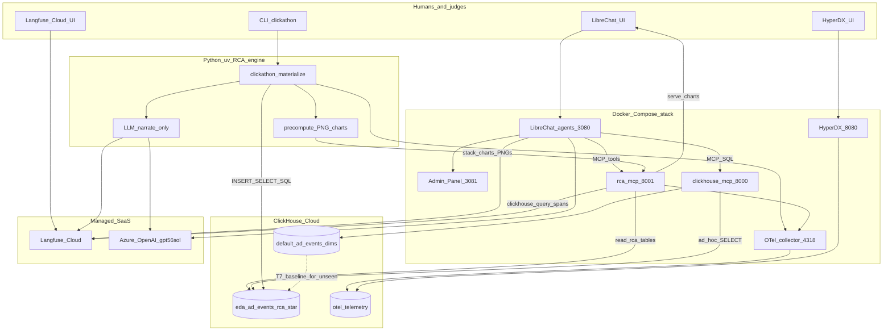
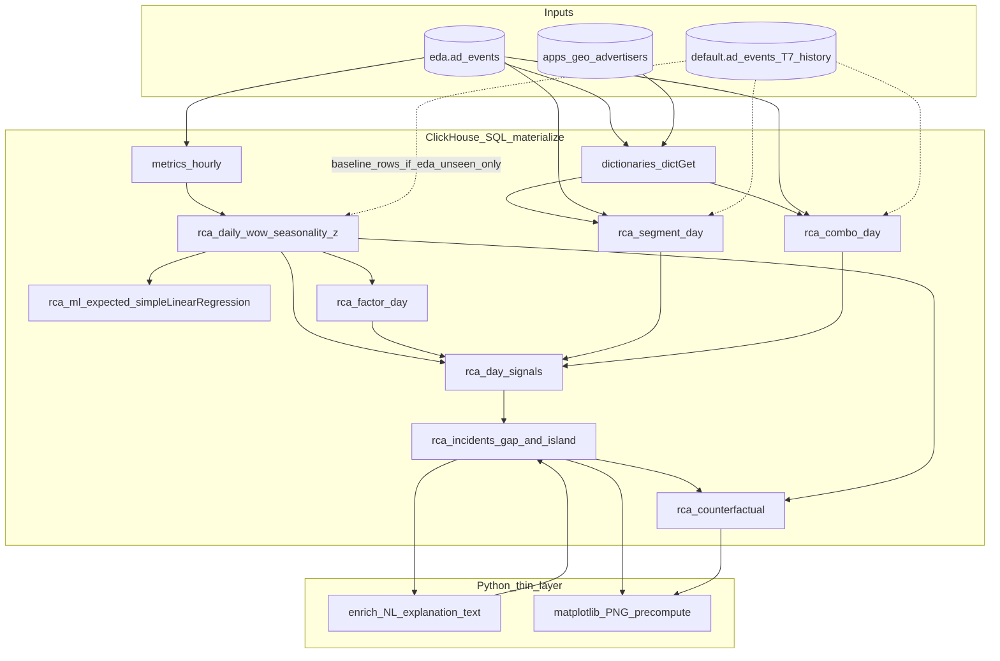
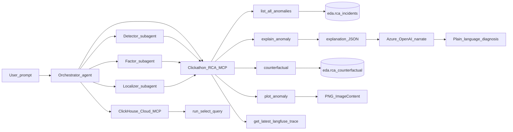
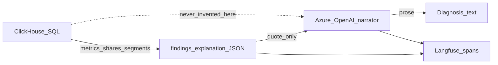

# Architecture — Metric Mind (Team-Disha · InMobi)

**For judges:** where analysis runs, how we detect / attribute / localize, and how ClickStack, Langfuse, and LibreChat each do real work — not checkbox wiring.

---

## How we approached the problem

The brief is **alert → answer**: notice a metric move, find the responsible segment, and write a short diagnosis where **every number is reproducible**. We treated that as a data problem first and a chat problem second.

**What we refused to do:** let the LLM discover anomalies by freestyle SQL or by guessing segments. In early sketches that path was fast to demo and easy to fake. It fails the trustworthiness bar the moment a single invented percentage appears.

**What we did instead:**

1. Put the star schema in **ClickHouse Cloud** (`default`), and keep an analytical workspace in **`eda`** so demos and Day-2 loads never mutate the original load.  
2. Encode the investigation as a **batch SQL pipeline** (`clickathon materialize`) that writes layered result tables `eda.rca_*`.  
3. Expose those tables through a thin **RCA MCP** so LibreChat agents *read* incidents; they do not invent them.  
4. Use the LLM only to **narrate** an explanation pack that already contains deltas, shares, segments, rule-outs, and counterfactuals.  
5. Prove the run with **Langfuse** (product traces + `clickhouse.query` spans) and watch ops latency in **ClickStack / HyperDX**.

One-line contract: **ClickHouse computes → JSON findings → LLM narrates → Langfuse shows the receipt.**

---

## Overview



LibreChat and the CLI are two frontends over the **same** ClickHouse tables. Changing the dataset means re-running materialize; agents keep the same tools and prompts.

---

## How detection and attribution work

We follow the glossary identity  
`Revenue ≈ Requests × Fill × eCPM / 1000`  
and always compare a day to the **same weekday seven days earlier** (like-for-like, not trailing-7-average).

### Step by step inside ClickHouse

1. **Roll up** `ad_events` → `metrics_hourly` → daily totals.  
2. **WoW join** (`rca_daily_wow`): today vs T−7 for requests, fill, eCPM, revenue. Flag hard moves with glossary-aligned thresholds.  
3. **Seasonality gate:** within each weekday, compute z-scores of those WoW changes against prior like-weeks. Thin history (e.g. Day-2’s short window) loosens the gate so real shocks still surface; rich history suppresses “weekend looks weird” false alarms.  
4. **Factor decomposition** (`rca_factor_day`): turn the revenue move into **contribution shares** for requests / fill / eCPM so judges see *which lever* moved, not only that revenue fell.  
5. **Localization** (`rca_segment_day`, `rca_combo_day`): slice by OS, region, format, category and combos (e.g. `video × APAC`, `iOS 17.5 × APAC`) using ClickHouse **dictionaries** (`dictGet`) so dim joins stay in the engine. Rank by fill impact or |Δ revenue| depending on the primary factor.  
6. **Signals → incidents** (`rca_day_signals` → `rca_incidents`): gap-and-island clustering turns consecutive bad days into incident windows with a probe day, shape (`localized` vs `layered`), and ruled-out list.  
7. **Counterfactuals** (`rca_counterfactual`): what revenue would have been if fill, eCPM, or requests had stayed at the T−7 baseline — a direct check that the named primary factor explains the money.  
8. **ML expected baseline** (`rca_ml_expected`): `simpleLinearRegression(T-7 → actual)` in SQL plus residual z-scores. Additive evidence (“how weird is this day vs the learned T−7 relationship?”), not a replacement for the WoW story.

Python’s job after SQL is narrow: stitch a readable **explanation** string from those rows, optionally ask Azure OpenAI for a narrative that must quote the pack, and precompute **PNG charts** for LibreChat (`plot_anomaly`).



### Where each stage runs

| Stage | Runs in | Artifact |
|---|---|---|
| Rollups / baselines | **ClickHouse SQL** | `metrics_hourly`, `rca_daily_wow` |
| Factor attribution | **ClickHouse SQL** | `rca_factor_day` |
| Segment localization | **ClickHouse SQL** | `rca_segment_day`, `rca_combo_day` |
| Incident clustering | **ClickHouse SQL** | `rca_day_signals` → `rca_incidents` |
| Counterfactuals | **ClickHouse SQL** | `rca_counterfactual` |
| ML expected baseline | **ClickHouse SQL** | `rca_ml_expected` |
| Charts | Python at materialize time | PNGs via RCA MCP |
| Narration | Azure OpenAI | Text only |

Rebuild: `uv run clickathon materialize [--rollup]`.

---

## How the chat demo works (LibreChat)

We did not build a custom UI. LibreChat is the judge-facing front door, with four persisted agents:

| Agent | Responsibility |
|---|---|
| **Orchestrator** | End-to-end RCA; can spawn specialists |
| **Detector** | Catalog / scan via `list_all_anomalies` |
| **Factor Analyst** | Decomposition / shares |
| **Localizer** | Segment and combo drills |

Tools are split on purpose:

- **Clickathon-RCA MCP** — deterministic readers (`list_all_anomalies`, `explain_anomaly`, `counterfactual`, `plot_anomaly`, Langfuse helpers). Numbers only from `eda.rca_*`.  
- **ClickHouse Cloud MCP** — optional deeper `run_select_query` when a judge asks for a custom cut.

Typical turn: *“What are the anomalies?”* → `list_all_anomalies` → for each id `explain_anomaly` + `counterfactual` → optional `plot_anomaly` → *“Give me the trace for this”* → Langfuse URL.



---

## Trust boundary (why this is hard to fake)



- The LLM never chooses the incident catalog; `rca_incidents` does.  
- Segment names and percentages in the answer must appear in the tool JSON.  
- Reviewers can re-run `uv run python stack/scripts/verify_unseen_rca.py` and match `unseen_incident/numbers.md` without trusting the chat transcript.  
- Langfuse stores the tool sequence and the SQL that produced the numbers (`clickhouse.query` spans).

---

## Day-2 unseen dataset — how we handled it

The sealed slice is **Jul 6–10 only** (1.5M events) with **regenerated dimension attributes**. Requirements conflict if you naively truncate history: same-DOW T−7 needs Jun 29–Jul 3, which are not in the sealed file.

We chose a deliberate split:

| Store | Contents |
|---|---|
| `eda.ad_events` + dims | **Unseen only** (separate workspace; no append of history into `eda`) |
| `default.ad_events` | Untouched original history, used **read-only** as T−7 baselines |
| Dim joins for baselines | `default` events labeled with **`eda` dictionaries** (new attributes, same IDs) |

So the probe window stays a clean Day-2 database, while like-for-like baselines remain glossary-correct. Load path: `upload_unseen.py` → `materialize --rollup` → `verify_unseen_rca.py` → LibreChat → Langfuse link in `unseen_incident/trace.md`.

---

## How the three integrations earn their keep

| Integration | What we actually use it for |
|---|---|
| **LibreChat** | Multi-agent conversational demo; Orchestrator + specialists; MCP tool loop ([hosted](https://metric-mind.ashiqabdulkhader.dev/login) via Cloudflare Tunnel, or local `:3080`) |
| **Langfuse Cloud** | Product truth: AgentRun traces, tool names, SQL spans, final answer; agents can surface the URL on request |
| **ClickStack** | Ops truth: OTel → Cloud `otel.otel_logs` / `otel.otel_traces` → HyperDX (see `evidence/clickstack/`) — complementary to Langfuse, not a second diagnosis store |

---

## LLM provider

**Azure OpenAI Foundry** (`gpt-5.6-sol`, OpenAI-compatible endpoint).

We use it for agent planning and for turning the explanation pack into prose. We do **not** use it to invent metrics, pick segments, or decide whether a day is anomalous. Sampling stays conservative (and we disable LibreChat parameter overrides where this model rejects non-default sampling).

---

## Demo loop (end to end)

1. Materialize (or load unseen + materialize).  
2. LibreChat: `What are the anomalies?`  
3. Deep dive: `explain_anomaly` + `counterfactual` (+ `plot_anomaly` if useful).  
4. `Give me the trace for this` → open Langfuse.  
5. Optional: `verify_unseen_rca.py` to reprint ClickHouse numbers beside the diagnosis.

---

## Data model (ClickHouse Cloud)

Star schema (synthetic InMobi package):

```text
apps (2K)                         advertisers (500)
    \                                 /
     \                               /
      ad_events (≈9M build / 1.5M Day-2) ──── geo_device (5K)
```

| Table | Grain / keys |
|---|---|
| `ad_events` | One ad request; `event_time`, `app_id`, `geo_device_id`, `advertiser_id`, `ad_format`, funnel flags, `revenue` |
| `apps` | `app_id` → category, publisher_tier |
| `advertisers` | `advertiser_id` → vertical, campaign_type |
| `geo_device` | `geo_device_id` → region, country, device_model, os_version |

`advertiser_id` is empty on unfilled requests — advertiser dimensions only apply to filled events.

### Databases we use

| Database | Role |
|---|---|
| `default` | Original Jun 1–Jul 5 load (untouched); T−7 history for Day-2 |
| `eda` | Analytical workspace: events + dims + `metrics_hourly` + all `rca_*` |
| `otel` | ClickStack sink: `otel_logs`, `otel_traces`, metrics |

### Metrics (glossary-aligned, always sum/sum)

| Metric | Formula |
|---|---|
| Fill rate | `sum(is_filled) / count(*)` |
| CTR | `sum(is_click) / sum(is_impression)` |
| eCPM | `sum(revenue) / sum(is_impression) * 1000` |
| Revenue identity | `Revenue ≈ Requests × Fill × eCPM / 1000` |

Never averages of ratios.

### Dimensions used for localization

| Source | Dimensions |
|---|---|
| `ad_events` | `ad_format` |
| `apps` | `category`, `publisher_tier` |
| `geo_device` | `region`, `country`, `device_model`, `os_version` |
| `advertisers` | `vertical`, `campaign_type` (filled events only) |

Fixed combo scans: `os_version × region`, `ad_format × region` (catch offsetting / hidden incidents that global-only detection misses).

---

## Result tables (`eda.rca_*`)

| Table | Role |
|---|---|
| `dict_apps` / `dict_geo_device` / `dict_advertisers` | Dimension dictionaries (`dictGet`) |
| `metrics_hourly` | Hourly rollup from `ad_events` |
| `rca_daily_wow` | Day vs T−7 + seasonality z-scores / `seasonal_ok` |
| `rca_ml_expected` | `simpleLinearRegression(T-7 → actual)` + residual_z |
| `rca_factor_day` | Requests / fill / eCPM contribution shares |
| `rca_segment_day` | Single-dim segment WoW (dict-enriched) |
| `rca_combo_day` | OS×region / format×region WoW |
| `rca_day_signals` | Per-day candidate signals |
| `rca_incidents` | Gap-and-island clustered catalog |
| `rca_counterfactual` | What-if revenues holding factors at baseline |

### SQL layout (`source_code/sql/`)

| File | Purpose |
|---|---|
| `00_metrics_hourly.sql` | Truncate+insert rollup |
| `rca/01_functions.sql` | Metric / flag UDFs |
| `rca/01b_dictionaries.sql` | Star-schema dictionaries |
| `rca/02_tables.sql` … `03_daily_wow.sql` | DDL + WoW + seasonality |
| `rca/03b_expected_ml.sql` | Linear-regression expected baselines |
| `rca/04_factor_day.sql` … `06_combo_day.sql` | Factor / segment / combo layers |
| `rca/07_day_signals.sql` | Signal assembly |
| `rca/08_incidents.sql` | Gap-and-island clustering |
| `rca/09_counterfactual.sql` | Counterfactual pack |

Rebuild: `uv run clickathon materialize [--rollup]`. After a new Day-2 load, always `--rollup`. Do **not** use `--calibration` on unknown data (that flag is for the planted Jun build windows only).

---

## Docker Compose topology (`source_code/stack/`)

```bash
docker compose -f stack/docker-compose.yml --env-file .env up -d
```

| Service | Port(s) | Notes |
|---|---|---|
| `librechat` | 3080 | Chat UI + multi-agent RCA |
| `admin-panel` | 3081 | LibreChat config |
| `mongodb` | 27017 (localhost) | LibreChat state |
| `clickhouse-mcp` | 8000 | → Cloud CH (TLS), ad-hoc SELECT |
| `rca-mcp` | 8001 | Deterministic RCA tools + chart PNGs |
| `hyperdx` | 8080 (UI), 8002 (API) | ClickStack UI |
| `otel-collector` | 4317, 4318 | OTLP → Cloud `otel` |
| `clickstack-db` | internal | Mongo for HyperDX |

**Not in compose (by design):** local Langfuse, local app ClickHouse, RAG/pgvector, Meilisearch.

ASCII view of the same topology (from the development `architecture.md`):

```text
┌──────────────────────────────────────────────────────────────────────────┐
│  Humans / judges                                                         │
│    • LibreChat agents (http://localhost:3080) — multi-agent RCA          │
│    • CLI: uv run clickathon investigate YYYY-MM-DD                       │
│    • Langfuse Cloud UI                                                   │
│    • HyperDX UI (http://localhost:8080)                                  │
└─────────────┬──────────────────────────┬───────────────────┬─────────────┘
              │                          │                   │
              ▼                          ▼                   ▼
     ┌────────────────┐         ┌────────────────┐   ┌────────────────┐
     │ LibreChat      │         │ RCA engine     │   │ HyperDX        │
     │ modelSpecs +   │         │ (Python / uv)  │   │ (ClickStack)   │
     │ Admin :3081    │         │ CLI + MCP      │   │                │
     └────────┬───────┘         └───────┬────────┘   └────────▲───────┘
              │ MCP                     │                     │
              ├──────────────┐          │                     │
              ▼              ▼          │            ┌────────┴───────┐
     ┌──────────────┐ ┌─────────────┐   │            │ OTel collector │
     │ clickhouse-  │ │ rca-mcp     │◄──┘            │ :4317 / :4318  │
     │ mcp :8000    │ │ :8001       │                └────────┬───────┘
     └──────┬───────┘ └──────┬──────┘                         │
              │              │                                │
              ▼              ▼                                ▼
     ┌────────────────────────────────────────────────────────────────────┐
     │              ClickHouse Cloud  (Hackathon service)                 │
     │  default: ad_events…   eda: enriched copies   otel: telemetry      │
     └────────────────────────────────────────────────────────────────────┘
                                      ▲
                                      │ LLM generations + investigation spans
                             ┌────────┴────────┐
                             │ Langfuse Cloud  │
                             └─────────────────┘
```

---

## Tool surface (RCA MCP + Langfuse)

**Clickathon-RCA** (`:8001`) — numbers only from `eda.rca_*`:

| Tool | Purpose |
|---|---|
| `list_all_anomalies` | Catalog from `rca_incidents` |
| `explain_anomaly` | Full explanation pack for one incident id |
| `counterfactual` | What-if revenues from `rca_counterfactual` |
| `plot_anomaly` | Precomputed PNG (`ImageContent` + `/charts/...`) |
| `get_metrics_glossary_tool` | Hackathon metrics glossary (scoped) |
| `get_latest_langfuse_trace_tool` | “Give me the trace for this” |
| `get_langfuse_trace_tool` / `get_langfuse_session_tool` | Specific trace / session |
| `list_langfuse_clickhouse_queries_tool` | Recent `clickhouse.query` spans |

**ClickHouse-Cloud-MCP** (`:8000`) — optional `run_select_query` for judge-driven custom cuts.

Langfuse records CH query + investigation spans; LibreChat threads appear as Langfuse **sessions**. ClickStack records OTel (latency, errors, infra) into Cloud `otel` — complementary to Langfuse, not a second diagnosis store. Evidence: [`evidence/clickstack/`](./evidence/clickstack/), Day-2 traces: [`unseen_incident/trace.md`](./unseen_incident/trace.md).

Seed agents after first bring-up:

```bash
uv run python stack/scripts/seed_librechat_agents.py
```

---

## Approaches we considered (and what we kept)

Industry RCA for ad/revenue metrics splits into detect → factor → localize → rule-out → narrate. We researched baselines (ThirdEye same-week-prior, Prophet/STL, trailing means), multi-dim localizers (Adtributor, HotSpot, Squeeze, CMMD), and LLM-as-analyst patterns. Full write-up: [`design-notes/RESEARCH.md`](./design-notes/RESEARCH.md).

| Option | Verdict |
|---|---|
| Same-DOW T−7 baseline | **Keep** — weekends ~−20% volume; trailing means false-alarm |
| Prophet / Isolation Forest as primary | **Defer** — short history; hard to defend every number |
| Full Squeeze / HotSpot / CMMD ports | **Defer as libraries** — steal ideas (impact, residual, combos), implement in SQL |
| Global-only WoW detection | **Reject alone** — misses hidden / offsetting segment incidents |
| Identity-first factor decomposition | **Keep** — glossary-aligned triage before dims |
| Impact-ranked segments + fixed combos | **Keep** — `os×region`, `format×region` always scanned |
| Advertiser dims for *fill* RCA | **Reject** — selection bias (`fill≡1` on advertiser rows) |
| LLM-written SQL as source of truth | **Reject** — CH materialize + RCA MCP only |
| CTR / render as primary planted drivers | **Monitoring only** for this dataset |

Threshold intuition from build-data EDA (quiet days): |rev| ≲ 3%, |fill| ≲ 0.5pp, |eCPM| ≲ 0.012 — hard flags sit above that band; seasonality z-scores gate “this weekday always looks like this.”

---

## Config surface

| Concern | Mechanism |
|---|---|
| CH / Langfuse / OTel / Azure OpenAI | `.env` + `pydantic-settings` (`source_code/.env.example`) |
| LibreChat MCP servers | `source_code/stack/librechat.yaml` |
| Compose images/ports | `source_code/stack/*-compose.yml` |
| Metric formulas | `source_code/src/clickathon/metrics.py` |
| Narration LLM | Azure OpenAI Foundry via `openai` SDK (`base_url` + `responses.create`) |
| Agent prompts | `source_code/stack/agents/*.md` |

### Security notes (hackathon)

- Compose binds DB/MCP ports to localhost where possible  
- Cloud credentials only in `.env` (never committed)  
- MCP is read-oriented for agents; mutating RCA DDL/DML stays in controlled scripts/CLI  

---

## Component roles (summary)

| Component | Where it runs | Responsibility |
|---|---|---|
| **ClickHouse Cloud** | Managed | Primary analytical engine; star schema; `eda.rca_*`; OTel DB `otel` |
| **RCA engine** | Local Python (`uv`) | Materialize orchestration, thin NL enrich, charts, CLI |
| **Azure OpenAI** | Managed | Narration + agent planning only |
| **Langfuse Cloud** | cloud.langfuse.com | Product traces judges open |
| **LibreChat** | Docker Compose | Conversational demo (local / video) |
| **ClickHouse MCP** | Docker Compose | Ad-hoc SELECT bridge |
| **RCA MCP** | Docker Compose | Deterministic readers over `rca_*` |
| **ClickStack** | Docker Compose | HyperDX + OTel → Cloud `otel` |

---

## Related submission artifacts

| Doc | Contents |
|---|---|
| [`README.md`](./README.md) | Run instructions, OSS evidence table |
| [`design-notes/RESEARCH.md`](./design-notes/RESEARCH.md) | Algorithms considered / rejected / chosen |
| [`unseen_incident/`](./unseen_incident/) | Day-2 diagnosis + numbers + Langfuse |
| [`evidence/clickstack/`](./evidence/clickstack/) | HyperDX ↔ `otel` proof |
| [`source_code/sql/README.md`](./source_code/sql/README.md) | Materialize playbook |
| [`source_code/stack/README.md`](./source_code/stack/README.md) | Compose URLs and agent seed |
