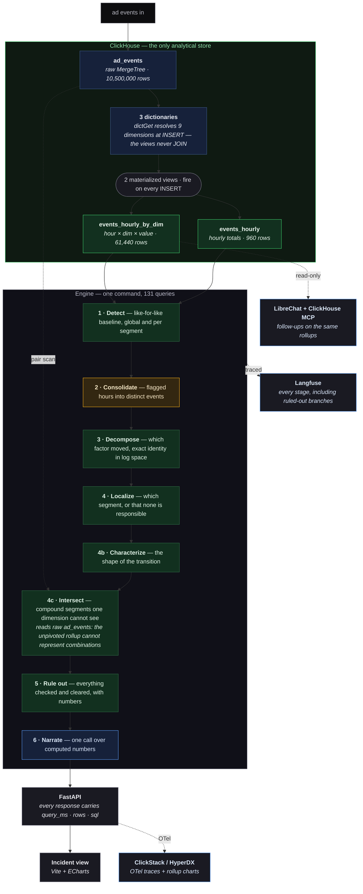

# Architecture

Answers the four things the InMobi guidelines ask for: how detection, drill-down and diagnosis fit together and **where the analysis actually runs**; the detection and attribution approach; which OSS products are meaningfully integrated and how; and the LLM provider rationale.

---

## 1. Where the analysis runs

**In ClickHouse.** Seven of the eight stages are SQL. Python does orchestration and one division on already-aggregated rows. The LLM writes one paragraph and never sees an event.



**Deployment.** ClickHouse Cloud (`ap-south-1`) is the only data store. The OSS stack — LibreChat, Langfuse, HyperDX, the ClickHouse MCP server — runs on a GCP VM (`n2-standard-8`, `asia-south1`). API and UI run locally. The default posture is Tailscale-only with the firewall restricted to a small allow-list; it is opened to the internet solely for the review window, with read-only logins in the submission [README](README.md#reviewer-access), and closed again afterwards.

**Delete stage 6 and the diagnosis is unchanged.** That is the trustworthiness argument in one sentence, and it is testable: `./investigate.sh --no-narrate` produces the same structured output minus the prose.

---

## 2. Schema — and the measurement that produced it

We built the obvious design first and rejected it on evidence.

> A fully-crossed hourly rollup (hour × all 9 dimensions) produced **7,247,816 rows from 7.2M events** — about 9,437 distinct combinations per hour against ~9,400 events per hour. Nearly every event was its own combination, so the rollup compressed nothing and cost a second copy of the data.

Across all nine dimensions there are only **62 distinct values in total**. So an *unpivoted* grain — one row per `(hour, dimension, value)` — is **53,760 rows**: 167× smaller than the raw events, and exactly the shape contribution ranking reads.

Four decisions, each with a reason:

- **`SummingMergeTree`, not `AggregatingMergeTree`.** Every measure is additive and every ratio is defined as sum/sum on read. There is no `uniq`, `quantile` or `avg` to preserve, so `-State`/`-Merge` would add ceremony and an alias-shadowing failure mode without buying anything.
- **Dictionaries, not JOINs.** Dimension tables are tiny (2,000 / 500 / 5,000 rows). Loading them as dictionaries lets the MV resolve nine dimensions with `dictGet()` at insert time instead of running a JOIN inside an insert trigger. `LIFETIME(MIN 0 MAX 0)` — the harness issues an explicit `SYSTEM RELOAD DICTIONARY`, so reload timing is deterministic rather than incidental.
- **`ORDER BY (dim_name, dim_value, hour)`** — lowest cardinality first, time last. Baseline queries read one dimension across *scattered, non-contiguous* hours (same weekday+hour over trailing weeks), so leading with time would not produce a contiguous range anyway.
- **No statistic is materialized.** Median and stddev are computed per query, because the baseline window is a *parameter*. Freezing it at write time would silently return the wrong answer when the window changes.

**The trade:** an unpivoted rollup cannot represent *combinations*. Compound detection therefore reads raw `ad_events`. That is a deliberate split — see §6.

---

## 3. Detection and attribution

Full derivations with worked numbers in [METHOD.md](METHOD.md).

**Baseline — like-for-like.** Traffic has daily and weekly rhythm (hour 0 ≈ 256K requests, hour 12 ≈ 465K; weekdays ≈ 1.38M, weekends ≈ 1.05M). Compare against a flat average and every weekend night is an emergency. So each hour is judged against the *same weekday and same hour-of-day* over trailing weeks, using the **median** — with only ~4 comparable hours, one contaminated week drags a mean badly.

**Two gates, always.** An hour is flagged only when it is *both* statistically unusual (|z| ≥ 3) **and** materially large (|Δ%| ≥ 8%). In 9M rows, trivial deviations reach significance constantly.

**Spread floor scales with the metric.** A fixed 2%-of-baseline floor produced **102 false CTR alarms out of 600 hours**. Clicks are 0.83% of requests, so hourly CTR's binomial counting noise alone is ~10.5% of CTR — a 21% swing is 2σ, not 10σ. Proportions now floor their spread at the binomial standard error `√(p(1−p)/n)`, which scales correctly with the denominator. CTR flags fell **102 → 4**; nothing else changed.

**Which factor — exact identity, log space.** `Revenue = Requests × FillRate × RenderRate × (eCPM/1000)` telescopes exactly. Taking logs makes it additive with no cross-terms, so each factor's share is its log-change over the total and the shares sum to exactly 100%. Measured residual: **−5.4 × 10⁻¹⁷**.

**Which segment — excess over expected.** When a metric falls 44% globally, every large segment also falls ~44%. Ranking by size of drop ranks by *size*, then confidently names the biggest. The right question is which segment fell *more than its own size explains*:

```
expected_delta = baseline_segment × global_pct_change
excess         = actual_delta − expected_delta
```

**Two gates here too, and the second is load-bearing.** Share-of-excess alone is a ratio of two possibly-tiny numbers. On 2026-06-21 it named `publisher_tier=tier_1` "responsible for 100% of the excess" on an excess of **315 requests out of an incident of 97,027** — 0.3%. So attribution also requires the excess to be material: `excess_share ≥ 50% AND |excess|/|total_delta| ≥ 10%`. With that, 06-21 correctly returns **no responsible segment**.

**Compound segments.** A cell is reported only when it moved **≥2× more than its strongest parent**. An earlier rule required both parents to be flat — backwards, because a compound big enough to matter drags its own parent. That rule discarded `iOS 18.1 × APAC` at −50.6% and reported a diluted −23.2% proxy instead.

**Shape of the transition.** Step vs. gradual (what fraction of the change landed in the largest single hour), whether onset aligns with a day boundary, duration, whether it reversed, and which factors held steady. This is where "why" lives: a one-hour step on a day boundary that self-reverts after exactly three days with volume untouched is consistent with a *scheduled, demand-side change with an end date* — not a degradation.

**Explainability over sophistication.** No ML, no black box. Every verdict is a comparison between two numbers, both recomputable from the queries in [`artifacts/queries.md`](artifacts/queries.md).

---

## 4. OSS integrations

| Product | What it does here | Depth |
|---|---|---|
| **ClickHouse** | The only analytical store. Raw `MergeTree` + 2 `SummingMergeTree` rollups + 3 dictionaries. 131 queries and 934M rows per investigation | Core |
| **Langfuse** | A span per stage carrying its inputs, verdict and timing — **including the ruled-out branches**. The SQL itself lives in [`artifacts/queries.md`](artifacts/queries.md); the trace shows *what was checked, in what order, and why*, which is the evidence that our system produced the answer rather than a human | Meaningful |
| **LibreChat + ClickHouse MCP** | A saved *InMobi Analytics* agent with a fixed system prompt and the MCP tool, querying the same tables read-only (`mcp_agent`, verified unable to write) | Meaningful |
| **ClickStack / HyperDX** | OTel traces of the FastAPI service, plus a dashboard charting the rollups directly — so the anomalies are visible as raw shapes, independent of our engine's claims about them | Working |

**The chat layer as independent validation.** Asked cold, the agent reached the same conclusions by a different route — including answering *"which segment caused the 06-21 drop?"* with **"No segment caused it — that's the finding"**, and independently rejecting `Android 15 × region` as a real intersection because *"OS version alone is the explanation; region adds nothing."* Two implementations agreeing is a stronger claim than either alone.

It also produced one finding the pipeline does not: that the two three-day windows five days apart share a signature, *"possibly a staged rollout where Android 15 was the first cohort and APAC iOS 18.1 the second."* The engine treats events independently.

---

## 5. LLM provider and why

**Anthropic Claude Opus 5** (`claude-opus-5`), for one call per incident.

- **The job is narrow: prose over a JSON payload of finished numbers.** The model never sees an event row, so it has nothing to compute and nothing to invent.
- **Instruction adherence matters more than raw capability here.** The system prompt fixes a three-paragraph structure — what moved, which factor and segment plus the transition shape, what was ruled out and what to check next — and forbids stating any number not present in the payload. Output is then verified programmatically.
- **Verification, not trust.** Every figure in the prose is extracted and matched back to the payload; anything untraceable **fails the run with a non-zero exit**. Cost is ~$0.026 per narration.
- **Replaceable by design.** `engine/narrate.py` is one function behind one interface. Swapping providers, or removing the LLM entirely with `--no-narrate`, changes nothing about the diagnosis.

The same model backs the LibreChat agent, where the job is genuinely different — it writes and runs its own SQL through MCP, so tool use and multi-step reasoning are what matter.

---

## 6. Known bottleneck, measured

We measured where the work goes rather than assuming the rollup made everything fast:

| | Rows read | ClickHouse time | Reads |
|---|---:|---:|---|
| Compound scan (stage 4c) | 1,211,930,496 | 43.2 s | **raw `ad_events`** |
| Everything else — detect, decompose, localize, characterize, rule out | 6,104,532 | 9.7 s | rollups |
| **Total** | **1,217,174,868** | **36.7 s** | |

**One stage is 99.5% of the rows and 82% of the time.** Everything the method rests on is the other 0.4%.

**What scales structurally.** `events_hourly_by_dim` grows with `distinct values × hours`, not with traffic — and the unseen dataset demonstrated it rather than us asserting it. Adding 1.5M events over 5 days took the raw table from 9,000,000 to 10,500,000 rows (**+17%**) while the rollup went 53,760 → 61,440 (**+14%**), exactly tracking the 840 → 960 hours and not the event count. At 100× the events over the same window it would not move at all. The materialized views are insert triggers, so streaming ingestion needs no new code and no new maths; and because no statistic is materialized, nothing drifts or needs rebuilding.

**What doesn't.** Compound detection reads raw events — at 100× that is ~93 billion rows per investigation. **The fix is the trick already applied once:** a materialized *pair* rollup. `os_version (8) × region (5) × 840 hours = 33,600 rows`. Summed across all 21 pairs it is still under a million rows, because pairs are bounded by cardinality products, not by event count. The cost is write amplification, which is why you would materialize the two or three pairs that matter rather than all of them, and keep a periodic full raw sweep for anything they miss.

**We did not build it.** These figures are measured at 1× and extrapolated; no load test was run.

---

## 7. Real-time

The materialized views fire on every `INSERT` regardless of source — Kafka, ClickPipes, an HTTP POST from an edge collector. One pass over a 48-hour window is ~1.2 s, so a 60-second poll is under 5% duty cycle. `./investigate.sh --watch 60` is the same engine on a loop, with alert dedup so a three-day incident pages once rather than 72 times.

**The one genuinely streaming-specific bug**, which batch testing cannot surface: under continuous ingestion the newest hour is always incomplete. Run at 14:30 and hour 14 holds thirty minutes of traffic — against a full-hour baseline that reads as a **~50% collapse, on every run, forever**. The arithmetic is correct, the baseline is correct, the comparison is invalid. It never appears in testing because the provided dataset ends on a complete hour, and would appear within minutes of going live. Fixed: an inferred window stops one hour short, because in an append-only stream an hour is only provably complete once a later hour exists.

Not built, and listed honestly in [PRODUCTION.md](PRODUCTION.md): incident state that survives restarts, backfill-aware baselines for late-arriving events, per-tenant isolation, and alert routing.
