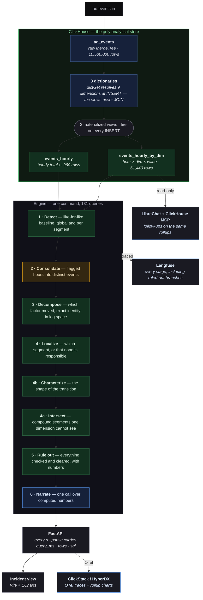
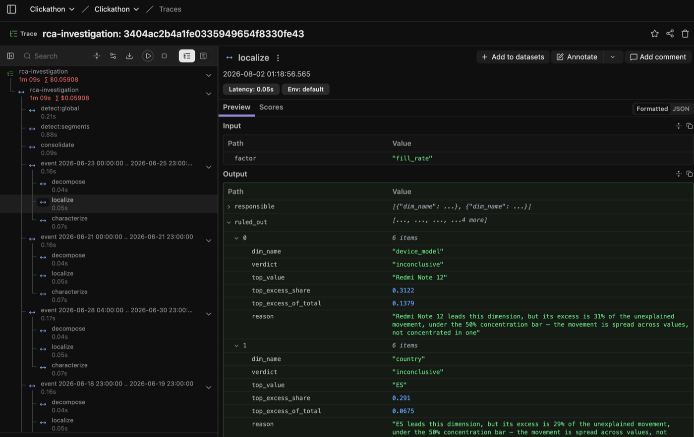
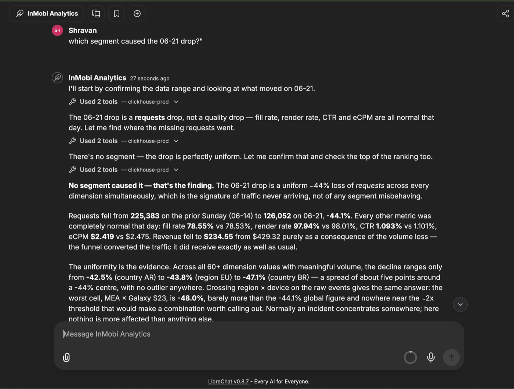
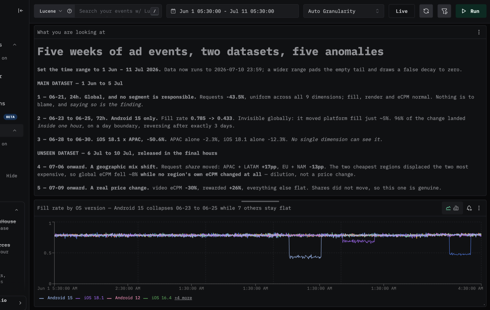

# Team Sapphire

## Track

InMobi — *"From alert to answer: the automated root-cause analyst."*

## Project

**From alert to answer** — your alert says revenue moved. This says *why*, which segment, and what it ruled out.

## Team Members

- Shravan A — shravan@bytebeam.io
- Gowthami Shravan — gowthami@bytebeam.io

## What it does

Every data-driven team watches a handful of numbers — revenue, fill rate, eCPM, CTR. When one moves, an alert reports *what* happened. The expensive question is *why*, and today an analyst answers it by drilling through dashboards for hours.

This does the drilling. Point it at a window and in about a minute it returns a diagnosis with the arithmetic attached:

- **Detects** deviations against a *like-for-like* baseline — same weekday, same hour-of-day, median over trailing weeks — so a Sunday-night trough is not an incident
- **Decomposes** the movement through the exact revenue identity to name the responsible *factor*: volume, fill, render, or price
- **Localizes** the responsible *segment* by excess over what each segment's own size explains, across nine dimensions independently
- **Finds compound segments** — `iOS 18.1 × APAC` — that no single-dimension scan can see
- **Reads the shape** of the transition: step vs. gradual, day-boundary aligned, what held steady. This is where "why" lives
- **Records what it ruled out**, with numbers. On a uniform drop the correct answer is *"no segment is responsible"*, and saying so is a finding
- **Narrates once** with an LLM over computed numbers only — then verifies every figure in the prose against the computed evidence and **exits non-zero if one cannot be traced**

**The analysis is SQL. The LLM writes the sentence.** Delete the narration stage and the structured diagnosis is unchanged.

## Hosted Demo

**https://shravankgl.github.io/teamsapphire-click-a-thon-26-submissions/TeamSapphire/demo/**

The incident view showing all six detected events across both datasets — the unseen incident ranks first by severity — with the responsible segments, the ruled-out ledger for every dimension, the compound findings, and the query-latency envelope.

It fetches the live API first and falls back to a committed snapshot of a real `./investigate.sh` run — so the hosted version shows genuine engine output with no backend, and says so in a banner rather than passing a cached run off as live. That snapshot is regenerated from the harness, never hand-authored: this system's whole claim is that every number was computed from the data, so a plausible-looking hand-written fixture would be the one thing capable of putting a fabricated figure on screen.

| Service | URL | Login | What to look at |
|---|---|---|---|
| **LibreChat** | <http://35.200.218.190:3080> | `shravan@bytebeam.io` / `Clickathon2026Review` | The **InMobi Analytics** agent ([prompt](stack/agents/inmobi-analytics.md)), plus 7 saved conversations already in the sidebar |
| **Langfuse** | <http://35.200.218.190:3000> | `admin@clickathon.local` / `9880012f09e03ab8a94bb3faAa!` | Project *clickathon-project* — every stage of every run, including ruled-out branches |
| **ClickStack / HyperDX** | <http://35.200.218.190:8080> | `shravan@bytebeam.io` / `Admin@123456` | Dashboard **Ad Metrics — Anomalies**. Set the range to **1 Jun – 11 Jul 2026** |
| **ClickHouse** | `x6fcqwjunt.ap-south-1.aws.clickhouse.cloud:8443` | `dashboard_ro` / `a35b92256a9df1542e4bc356cf6b758081e57ba5Aa1!@#` · db `inmobi` | Re-run anything from [`artifacts/queries.md`](artifacts/queries.md) and check our numbers |

`dashboard_ro` is `readonly = 1` — verified unable to `INSERT`, `ALTER` or `DROP`:

> **Note on the schema.** Events before `2026-07-06` are joined to the original
> dimension tables (`geo_device_old`, `apps_old`, `advertisers_old`) and events from
> `2026-07-06` to the regenerated ones. The unseen dataset reuses the same IDs with
> different attributes, so a single dimension table across both periods misattributes
> every segment — see [`artifacts/unseen/README.md`](artifacts/unseen/README.md).

## Pitch Deck

**[pitch-deck.pdf](pitch-deck.pdf)** — 15 slides. Also readable in the browser at
[deck.html](https://shravankgl.github.io/teamsapphire-click-a-thon-26-submissions/TeamSapphire/deck.html).

## Demo Video

**https://youtu.be/_F8omESczWM**

End to end: the pipeline running, the diagnosis and its ruled-out ledger, the Langfuse
trace expanded on a cleared branch, the LibreChat agent answering through the ClickHouse
MCP server, and the HyperDX dashboard charting the rollups directly.

## Architecture

See **[ARCHITECTURE.md](ARCHITECTURE.md)** for the full 2-pager: how detection, drill-down and diagnosis fit together, where the analysis actually runs, the attribution approach, the OSS integrations, and the LLM provider rationale.

In one diagram:



**Seven of the eight stages are SQL.** Python does orchestration and one division on
already-aggregated rows; the LLM writes one paragraph and never sees an event row.
Delete stage 6 and the structured diagnosis is unchanged.

## Artifacts

**[`artifacts/`](artifacts/)** — the graded outputs.

| | |
|---|---|
| [`diagnoses/`](artifacts/diagnoses/) | One file per detected incident: plain-language diagnosis, the factor decomposition, the segment named (or that none is), the transition shape, and the full ruled-out ledger |
| [`queries.md`](artifacts/queries.md) | **All 131 queries**, with the exact SQL, rows read and timing. Every number in every diagnosis comes from one of these |
| [`compound-segments.md`](artifacts/compound-segments.md) | The 27 two-dimension findings, each with both parents' movement for comparison |
| [`unseen/`](artifacts/unseen/) | The unseen-incident bundle — diagnosis, numbers, and trace |

These are generated from the run itself by [`scripts/build_artifacts.py`](scripts/build_artifacts.py), not written by hand.

## What it found

### Main dataset — 1 Jun to 5 Jul

Unassisted:

| | When | Shape | Diagnosis |
|---|---|---|---|
| 1 | 2026-06-21, 24h | global, uniform across all 9 dimensions | requests **−43.5%**; fill, render and eCPM normal → traffic arrival, and **no segment is responsible** |
| 2 | 06-23 → 06-25, 72h | localized to `os_version = Android 15` | fill rate **0.785 → 0.433**; requests normal |
| 3 | 06-28 → 06-30, 3 days | **compound** — `iOS 18.1 × APAC` | fill rate **−50.6%** |

Incident 3 is the one that matters. On 2026-06-28: global **−1.0%**, APAC alone **−2.3%**, iOS 18.1 alone **−12.3%**, and `iOS 18.1 × APAC` **−50.6%**. No single-dimension scan can see it — it is the problem statement's own worked example.

Incident 2 shows why shape matters: **96% of its total change landed inside one hour**, exactly on a day boundary, reversing just as sharply after exactly three days while requests, render rate and eCPM held steady. That is consistent with a scheduled, demand-side change with an end date — not a degradation. We state it as what the evidence is consistent with, never as an established mechanism.

### The unseen incident — 6 to 10 Jul

1,500,000 fresh events, loaded and analysed cold by the same command. Full bundle,
with every query and the exported trace, in
[`artifacts/unseen/`](artifacts/unseen/).

**The data contains two anomalies, with different mechanisms.**

| | When | What is actually there |
|---|---|---|
| A | 07-06 onward | **A geographic mix shift.** Request *share* moved — APAC + LATAM **+17pp**, EU + NAM **−13pp**. The two cheapest regions displaced the two most expensive, so global eCPM fell ~8% **while no region's own eCPM changed at all**. Dilution, not a price change |
| B | 07-09 onward | **A real price change.** video eCPM **−30%**, rewarded **+26%**, everything else flat. Shares did not move |

**What our system reported:**

| Run | Verdict | |
|---|---|---|
| [`B/`](artifacts/unseen/B/) | `ecpm` in `ad_format=video` **−35.0%** vs −12.0% globally | ✅ **Correct** — segment, magnitude and direction all match |
| [`A/`](artifacts/unseen/A/) | `requests` in `campaign_type=CPC` **+139.5%** vs +8.6% | ⚠️ Right window and factor. It also named `region=APAC`, 5th of seven responsible — but the headline picked CPC |
| [`FULL/`](artifacts/unseen/FULL/) | one 119 h event, `ecpm` in `ad_format=video` | ⚠️ Merged A and B into a single event |

**Where it fell short, and why.** Our attribution asks *"did this segment's **metric**
move more than its own size explains?"* In a mix shift the answer is no for every
segment — APAC's eCPM did not move, EU's did not move. Only their **weights** did. So
the system reached for segments whose metric *did* move (CPC, news, iOS 17.5), all of
which are correlates of the incoming APAC/LATAM traffic rather than causes. Catching
this needs a share-of-volume decomposition alongside the metric one; that is a standard
technique and we did not build it. The consolidation also merged two back-to-back
incidents into one on the full-window run.

**What held up:** the like-for-like baseline worked across a dataset boundary, the
revenue identity closed to ~1e-17 on every run, the ruled-out ledger correctly cleared
publisher_tier, category, campaign_type and vertical as uniform, the shape analysis
separated a gradual onset (A) from a step (B), and every narrated number was verified
against computed evidence — all three runs exited 0.

## How we built it

**ClickHouse** is the only analytical store. Raw `MergeTree`, two `SummingMergeTree` rollups maintained by materialized views, three dictionaries.

The schema is small on purpose, and the small schema is the design work. We built the obvious fully-crossed rollup first and measured it: **7,247,816 rows from 7.2M events** — nearly every event had its own dimension combination, so it compressed nothing and cost a second copy of the data. Across all nine dimensions there are only **62 distinct values in total**, so an *unpivoted* `(hour, dim_name, dim_value)` grain is **53,760 rows** — 167× smaller, and exactly the shape contribution ranking reads.

Rest of the stack:

- **Python** — orchestration, and one division on already-aggregated rows. No analysis lives here
- **FastAPI** — a `query_ms` / `rows_scanned` / `sql` envelope on every response, so any panel can show what it cost and what it ran
- **Vite + React + shadcn/ui + ECharts** — the incident view
- **Langfuse** — a span per stage, including the branches that were ruled out
- **LibreChat + ClickHouse MCP** — follow-up questions against the same rollups, read-only. The *InMobi Analytics* agent runs on **Anthropic Claude Opus 5** (`claude-opus-5`) with the four MCP tools; definition and full system prompt in [`stack/agents/`](stack/agents/inmobi-analytics.md)
- **ClickStack / HyperDX** — OTel traces of our own API, and dashboards charting the rollups directly

**Testing:** 15 integration tests against the real database. Mocking ClickHouse would test our mocks; every failure this project actually had was in the interaction between SQL, real data and Python arithmetic.

## How to run it

Prerequisites: Python 3.11+, a ClickHouse endpoint, and an Anthropic API key — the key is needed **only** for narration; everything else runs without it and the structured diagnosis is complete either way.

**1. Install.** The `[async]` extra is not optional — plain `clickhouse-connect` imports fine and then throws at API startup.

```bash
python3 -m venv .venv
.venv/bin/pip install -r requirements.txt
```

**2. Configure.** Copy the template and fill it in. Nothing is hardcoded, so one `.env` change moves the system between ClickHouse Cloud and a local server.

```bash
cp .env.example .env
```

| Variable | | Required |
|---|---|---|
| `CLICKHOUSE_HOST` | host only, no scheme | yes |
| `CLICKHOUSE_PORT` / `CLICKHOUSE_SECURE` | `8443` / `true` for Cloud | yes |
| `CLICKHOUSE_DATABASE` | `inmobi` | yes |
| `CLICKHOUSE_USER` / `CLICKHOUSE_PASSWORD` | `SELECT` + `dictGet` to investigate | yes |
| `CLICKHOUSE_ADMIN_USER` / `CLICKHOUSE_ADMIN_PASSWORD` | needed only to create schema and load | for setup |
| `ANTHROPIC_API_KEY` | narration only — omit and use `--no-narrate` | no |
| `LANGFUSE_HOST` / `LANGFUSE_PUBLIC_KEY` / `LANGFUSE_SECRET_KEY` | stage tracing; absent → tracer is a no-op | no |

**3. Create the schema.** Order matters — the rollup views resolve dimensions through the dictionaries at insert time.

```bash
.venv/bin/python scripts/ch.py run-file sql/01_dictionaries.sql
.venv/bin/python scripts/ch.py run-file sql/02_rollups.sql
```

**4. Load a dataset.** The loader validates the shape and refuses a window that overlaps data already present, since double-counted hours corrupt every baseline.

```bash
.venv/bin/python scripts/load.py /path/to/dataset-dir
.venv/bin/python scripts/backfill.py --verify     # if raw was populated before the views existed
```

**5. Investigate — the one command.**

```bash
./investigate.sh                                    # the data already loaded
./investigate.sh /path/to/new-data-dir              # load that slice first, then investigate
./investigate.sh --start "2026-07-06 00:00:00" \
                 --end   "2026-07-10 22:00:00"      # an explicit window
./investigate.sh --watch 60                         # the same engine on a loop
./investigate.sh --no-narrate                       # skip the LLM entirely
```

Writes `out/diagnosis.md`, `out/diagnosis.json` and a trace URL. **Exit code 0 means every narrated number was traced back to computed evidence** — a non-zero exit means one could not be, and that output should never be shipped.

Without `--start`/`--end` the window is inferred from the newest data and deliberately stops one hour short of it: under continuous ingestion the newest hour is always partial, and against a full-hour baseline that reads as a ~50% collapse on every run.

**6. Artifacts and traces.**

```bash
.venv/bin/python scripts/build_artifacts.py out/diagnosis.json artifacts/
.venv/bin/python scripts/export_trace.py    out/diagnosis.json artifacts/traces/
```

**7. API and UI (optional).** The API re-reads `out/diagnosis.json` whenever it changes on disk, so a fresh `./investigate.sh` appears without a restart.

```bash
./dev.sh          # API on :8010, incident view on :3100
```

**Tests:** `.venv/bin/python -m pytest tests/ -v` — 15 integration tests against the real database, skipping cleanly if it is unreachable.

**Inspecting a single stage.** Each stage has a standalone runner — this is how the pipeline was built and debugged:

```bash
.venv/bin/python scripts/try_detect.py        # also: try_decompose, try_localize,
.venv/bin/python scripts/try_characterize.py  # try_segments, try_narrate
.venv/bin/python scripts/ch.py query "SELECT count() FROM inmobi.ad_events"
```

## The OSS stack

**LLM provider: Anthropic Claude Opus 5** (`claude-opus-5`) — used in exactly two places, the
narrator (one call per incident, over computed numbers) and the LibreChat agent. Rationale for
the choice is in [ARCHITECTURE.md §5](ARCHITECTURE.md).

Everything below runs on a GCP VM (`n2-standard-8`, `asia-south1`). Logins are in
[Reviewer access](#reviewer-access) above. **The wiring is committed** — see
[`stack/`](stack/): `docker-compose.yml`, `librechat.yaml`, and every `.env` as a
redacted `.example`, so how each tool is connected is readable without redeploying
anything.

| Service | Role | Port |
|---|---|---|
| **ClickHouse Cloud** (`ap-south-1`) | The only analytical store — raw table, 2 rollups, 3 dictionaries | 8443 |
| **Langfuse** | Traces every investigation stage, including the ruled-out branches | 3000 |
| **LibreChat** | The *InMobi Analytics* agent — `claude-opus-5` over the ClickHouse MCP server | 3080 |
| **ClickStack / HyperDX** | OTel traces of the API + dashboards charting the rollups | 8080 |
| **ClickHouse MCP** | Read-only bridge from the agent to ClickHouse (`mcp_agent`, verified unable to write) | — |

### How each tool is wired

The guidelines ask for the wiring, not a claim. All of it is in [`stack/`](stack/) —
compose file, LibreChat config, and every environment file as a redacted `.example`.

| Tool | Where it is configured | What it writes to | Where it appears in the pipeline |
|---|---|---|---|
| **Langfuse** | [`engine/trace.py`](engine/trace.py) — a span per stage; keys via `LANGFUSE_*` in [`.env.example`](.env.example). Self-hosted in [`stack/docker-compose.yml`](stack/docker-compose.yml) | Its own ClickHouse (`default.*` on the VM) + Postgres + MinIO | Wraps every stage of `investigate()` — detect, decompose, localize, characterize, intersect, narrate — **including the branches that were ruled out** |
| **ClickStack / HyperDX** | `clickstack-otel-collector` in [`stack/docker-compose.yml`](stack/docker-compose.yml); the app instruments itself in [`api/main.py`](api/main.py) via `OTEL_EXPORTER_OTLP_ENDPOINT` | ClickHouse database **`otel`** (`HYPERDX_OTEL_EXPORTER_CLICKHOUSE_DATABASE=otel`), tables `otel_traces`, `otel_logs`, `otel_metrics_*` | Traces the FastAPI service itself, and its dashboards chart `inmobi.events_hourly_by_dim` **directly** — the anomalies as raw shapes, independent of anything our engine claims |
| **LibreChat** | [`stack/librechat.yaml`](stack/librechat.yaml) declares the `clickhouse-prod` MCP server; [`stack/librechat.env.example`](stack/librechat.env.example) has the rest; the agent itself — model, tools and full system prompt — is exported to [`stack/agents/`](stack/agents/) | Its own MongoDB (conversations, the agent definition) | The *InMobi Analytics* agent queries `inmobi.*` through the official ClickHouse MCP server as `mcp_agent`, read-only — the same rollups the engine reads |
| **ClickHouse MCP** | `mcp-clickhouse-prod` in [`stack/docker-compose.yml`](stack/docker-compose.yml) | — (read path only) | The bridge between the agent and ClickHouse. `mcp_agent` is verified unable to write: `DROP TABLE` returns `Code: 497 … Not enough privileges` |


### Seen live

The guidelines are explicit that a screenshot is not proof of integration — each of
these is walked through in the demo video, and the first three are reachable with the
logins above while the VM is up.

**Langfuse** — the `localize` stage expanded, showing `ruled_out` with each dimension's
verdict, excess share and full reason. Not a trace screenshot; a trace screenshot *of
the branches we cleared*.



**LibreChat + ClickHouse MCP** — the agent asked *"which segment caused the 06-21
drop?"*, answering **"No segment caused it — that's the finding"**, with three tool
calls against `clickhouse-prod` visible. An independent implementation reaching our
engine's conclusion by a different route.



It runs on `claude-opus-5`, the same model as the narrator — but the job is different: here it writes and runs its own SQL through MCP, so tool use and multi-step reasoning are what matter, whereas the narrator does one constrained call over finished numbers. Its full system prompt is committed verbatim at
[`stack/agents/inmobi-analytics.md`](stack/agents/inmobi-analytics.md) — exported from the
running instance, not transcribed.

**ClickStack / HyperDX** — the *Ad Metrics — Anomalies* dashboard charting
`inmobi.events_hourly_by_dim` directly, across both datasets. Three dips are visible
in one chart without any of our engine's reasoning in between: Android 15 collapsing
06-23 → 06-25 while seven other OS versions hold flat, iOS 18.1 sagging 06-28 → 06-30,
and the July movement in the unseen slice. The anomalies as raw shapes.



### Reading the traces without a login

Langfuse's own share links are unauthenticated URLs on the same host, so they are no use once the VM is shut down.

Every trace is therefore **exported and committed** — `artifacts/traces/<id>.json` is the full export (every span, input, output, timing) and `<id>.md` is a readable stage-by-stage summary. That is the same object the Langfuse UI renders. Regenerate with `scripts/export_trace.py`.

### Reproducing on your own infrastructure

Everything is env-driven — point `.env` at your own ClickHouse and the pipeline runs unchanged. Langfuse and OTel are optional: absent their variables the tracer degrades to a no-op and the investigation proceeds normally. The agent layer is the reference compose from [ClickHouse/agentic-data-stack](https://github.com/ClickHouse/agentic-data-stack), with the ClickHouse MCP server pointed at a read-only user.

## Does it work in real time?

Yes, and it needed no new maths — full detail in **[PRODUCTION.md](PRODUCTION.md)**.

The materialized views are insert triggers: they fire on every `INSERT` regardless of
source — Kafka, ClickPipes, an HTTP POST from an edge collector — so the rollups stay
current with no batch job and no cron. Nothing downstream knows or cares whether a row
arrived a month ago or four seconds ago. And because no statistic is materialized,
there is nothing to drift or rebuild. One pass over a 48-hour window is ~1.2 s, so a
60-second poll is under 5% duty cycle. `./investigate.sh --watch 60` is the same
engine on a loop, with alert dedup so a three-day incident pages once, not 72 times.

**The one bug that only streaming produces**, and which batch testing structurally
cannot surface: under continuous ingestion the newest hour is always incomplete. Run
at 14:30 and hour 14 holds thirty minutes of traffic — against a full-hour baseline
that reads as a **~50% collapse, on every run, forever**. The arithmetic is correct,
the baseline is correct, the comparison is invalid. It never appears in testing
because the provided datasets end on complete hours, and it would appear within
minutes of going live. Fixed: an inferred window stops one hour short, because in an
append-only stream an hour is only provably complete once a later hour exists.

Not built, and listed honestly in [PRODUCTION.md](PRODUCTION.md) §4: incident state
that survives restarts, backfill-aware baselines for late-arriving events, per-tenant
isolation, and alert routing.

## Honest limitations

- **Compound scanning is the bottleneck.** It reads raw `ad_events` and accounts for 99.6% of all rows read and 88% of query time. At 100× that is ~93 billion rows per run and not viable. The fix is a materialized pair rollup (~33,600 rows for `os_version × region`) — we did not build it.
- **Thresholds are judgment calls** anchored to measurements on one dataset. [`METHOD.md`](METHOD.md) #5 lists every one with what motivated it and how it fails. We ran no sensitivity sweep.
- **A correlated dimension can still be named responsible** — `region = EU` is flagged alongside Android 15 because Android 15 skews European. It is a reflection, not a second cause. The UI shows it with that caveat rather than hiding it.
- **Compound search is pairs, not triples.**
- **We see the shape of a change, not the system that caused it.** We say what the evidence is consistent with and name the specific thing a human should check.

## License

MIT — see [LICENSE](LICENSE).
