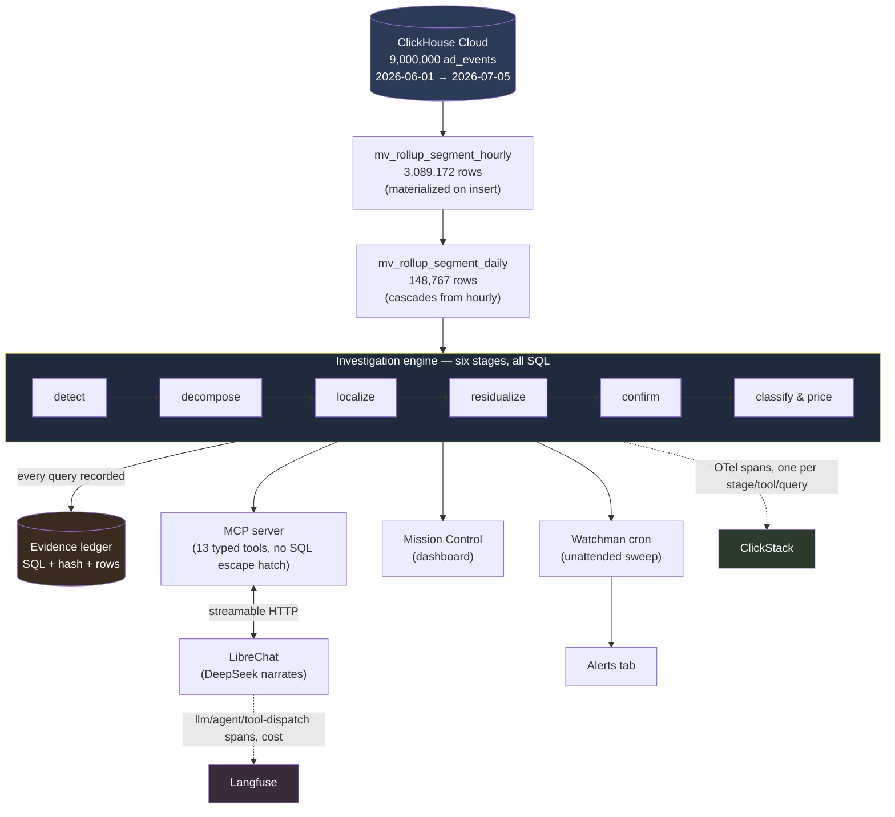

# The Boring Team

## Track

InMobi — _From alert to answer: the automated root-cause analyst._

## Project

**Sherlook** — an automated root-cause analyst for an ad marketplace. It notices a metric moved,
finds the segment responsible, rules out the segments that only looked responsible, prices the
damage, and says what to do about it in plain English. Deterministic code does the analysis; the LLM
only narrates.

## Team Members

- Sam Melvin M ([@imsammelvin](https://github.com/imsammelvin))
- Loges S ([@LogesS25](https://github.com/LogesS25))
- Samarth Dhawan ([@samarth8765](https://github.com/samarth8765))
- Mohansundar K ([@Mohansundark](https://github.com/Mohansundark))

## What it does

Point it at a ClickHouse table of ad events and it answers the question an on-call analyst actually
has at 3am: **what broke, where, how much did it cost, and what do I do?**

It runs six stages, all of them SQL:

1. **Detect** — every metric, every day, against a same-weekday trailing baseline.
2. **Decompose** — which part of the funnel moved (requests → fill → render → CTR → price).
3. **Localize** — which segment values across 8 dimensions and their pairs carry the move.
4. **Residualize** — the differentiator. Greedy deflation removes the cause's contribution and
   re-measures everything else, so segments that moved only because they contain the cause are
   **explicitly cleared** rather than blamed. On the flagship incident this clears **840 slices**.
5. **Confirm** — is the survivor still significant once the cause is accounted for?
6. **Classify & price** — technical break vs. mix shift vs. demand, an owner, and dollars per day.

Then a **grounding check** re-reads the finished prose and asserts that every numeral in it resolves
to a recorded evidence row with the SQL that produced it. A number that cannot be traced to a query
is a failure, not a rounding difference.

The same engine runs unattended on a schedule (the "watchman"), so an anomaly found while nobody was
looking shows up on the Alerts tab with a full diagnosis attached.

## Hosted Demo

**http://161.97.122.198:4500/**

Mission Control — five tabs: **Chat** (LibreChat against the MCP server, for follow-up questions),
**Anomalies** (a live sweep from the investigation engine, with a date range), **Alerts** (what the
watchman found unattended, each with a full diagnosis and an "Ask in chat" button), **AI Insights**
(two sub-views: **Cost Overview** — Langfuse token/cost attribution by model, and **Recent Prompts** —
the last few real chat prompts with cost, latency and a plain-English decision tree of what was
checked and found for each one) and **System Health** (per-stage p50/p95 from ClickStack traces).

Nothing on it is a mock — every number is read back out of ClickHouse or Langfuse on request.

## Demo Video

Link: https://drive.google.com/drive/folders/1T0uHlCDiszv5Iy5FFigzzhwIhb5eEvSm?usp=sharing

## Architecture

_Also available as a standalone file: [docs/architecture.md](docs/architecture.md) /
[docs/architecture.png](docs/architecture.png)._

**Data lineage, and exactly where the AI layer sits versus where a human designed the logic:**
[docs/data-lineage-and-human-intelligence.md](docs/data-lineage-and-human-intelligence.md). Short
version — the model touches nothing upstream of a fully-verified result object, and every threshold,
formula and classification rule in this system is deterministic code a person wrote, not a model's
judgment call.

**Proof, not just a diagram — the literal SQL text, per stage, from a real production trace:**
[docs/clickstack-tracing.md](docs/clickstack-tracing.md).
Link: https://hyperdx.clickhouse.cloud/search?chcServiceId=fae2f5ab-faa6-44e8-84e2-a5f20335948f&source=6a6dbfb89438499c968280be&where=TraceId%2520%253D%2520%272dc755ccf1ec14e01638ef948c2114d7%27&select=&whereLanguage=sql&filters=%255B%257B%2522type%2522%253A%2522sql%2522%252C%2522condition%2522%253A%2522SpanName%2520IN%2520(%27ledger.run.get_metric%27)%2522%257D%255D&orderBy=&from=1785650133000&to=1785651033000&isLive=false&eventRowWhere=%257B%2522id%2522%253A%2522SpanName%253D%27investigation%27%2520AND%2520Timestamp%253DparseDateTime64BestEffort(%272026-08-02T05%253A57%253A35.182000000Z%27%252C%25209)%2520AND%2520SpanId%253D%27409481f2cecab96f%27%2520AND%2520ServiceName%253D%27clickhouse-inmobi-mcp%27%2520AND%2520(Duration)%252F1e9%253D9.788444235%2520AND%2520ParentSpanId%253D%277b42a5245053103b%27%2520AND%2520StatusCode%253D%27Unset%27%2522%252C%2522type%2522%253A%2522trace%2522%252C%2522aliasWith%2522%253A%255B%255D%252C%2522traceId%2522%253A%25222dc755ccf1ec14e01638ef948c2114d7%2522%257D

### Where the analysis runs

**In ClickHouse. The LLM never writes SQL and cannot.**

This is enforced structurally, not by instruction. The MCP server exposes **13 tools** and not one of
them accepts SQL:

```
describe_data      list_dimension_values   get_metric        compare_periods
rank_segments      find_incidents          investigate       explain_revenue
get_evidence       export_trace            watch_this        list_watches
stop_watching
```

Every statement is composed in `backend/mcp/query.ts` from typed parameters — metric enum, dimension
enum, ISO dates. There is no `run_sql`, no query passthrough, no string the model controls. The
`bun run sanity` gate asserts this on every run: it speaks JSON-RPC to the server, reads the tool
list, and **fails if any tool name matches `/sql|query|exec|raw/`**. An untested architectural claim
is just a claim.

The model's entire job is to read a JSON result and write a paragraph.



### Detection and attribution

Chosen for defensibility over sophistication. Every threshold has a reason we can say out loud.

**Baselines — median + MAD, never mean + standard deviation.** An incident in the trailing window
inflates the standard deviation and hides the very anomaly it contains; the median and median
absolute deviation do not move. Baselines are **same-weekday** — a Saturday is compared to previous
Saturdays — because this marketplace has a hard weekly cycle, and comparing Saturday to Friday
manufactures an anomaly every weekend. A `MIN_COEFF_VARIATION` floor stops a flat series from making
every tiny wobble look like 40σ. Theil–Sen detrending handles underlying growth.

**Attribution — contribution analysis with residualization.** A naive drill-down blames everything
correlated with the cause. Removing the cause's contribution and re-measuring separates _carried the
move_ from _contained the cause_. The cleared list is a first-class output: the diagnosis states what
it checked and dismissed, with each residual as proof.

**Trustworthiness is a gate, not an aspiration.** `checkGrounding` maps every numeral in the finished
prose back to an evidence row at the precision printed.

### ClickStack · Langfuse · LibreChat

All three, and none of them decoratively.

- **ClickStack (OpenTelemetry → ClickHouse)** — the whole pipeline is traced. One span per stage,
  per tool call, per SQL statement, with the statement (`db.query.text`) and the row count on the
  span. A slow answer is followed down to the query that made it slow. This is also what makes
  criterion 3 satisfiable: the trace proving the system generated a diagnosis is a by-product of
  doing the work. Spans land in the `otel_traces` table of the same ClickHouse Cloud service used for
  the data itself; collector config is committed at `backend/observability/collector.ts`. The
  dashboard's own System Health tab is a live query against that table (`/api/system-health`), so the
  p50/p95-per-stage view a judge sees in the hosted demo is a real search, not a screenshot.
- **Langfuse** — LLM cost and token attribution, plus the dashboard's own "Recent Prompts" view reads
  Langfuse's public API server-side to show the last few real prompts, their cost, and a plain-English
  breakdown of what was checked for each one. The narration call carries `gen_ai.*` attributes so it
  lands as a generation with model and token counts rather than an anonymous span. A real trace is
  exported as JSON at [`pitch/langfuse-evidence/`](pitch/langfuse-evidence/) for judges without project
  access.
- **LibreChat** — the chat client, talking to the MCP server over streamable HTTP. Identity flows
  through as `{{LIBRECHAT_USER_ID}}` / `{{LIBRECHAT_USER_EMAIL}}` headers, so a watch belongs to a
  person. The Alerts tab deep-links into a pre-filled chat for follow-ups. LibreChat itself is a
  standard install of the upstream project, not something we wrote — what we authored is the wiring,
  committed at [`frontend/LibreChat/librechat.yaml`](frontend/LibreChat/librechat.yaml) (keys are
  environment variable references, nothing literal to redact). The rest of LibreChat's own source is
  intentionally not vendored into this repo (see `.gitignore`) — it's the same public project anyone
  can `git clone`, and shipping its ~3,700 files here just bloated every diff without adding anything
  ours.

### LLM provider

**DeepSeek** (`deepseek-chat`, OpenAI-compatible endpoint, temperature 0). Chosen because the model
is doing the easiest job in the system — turning a JSON result into a paragraph — so cost per token
mattered more than reasoning ceiling, and because an OpenAI-compatible endpoint means the provider is
one environment variable (`NARRATE_BASE_URL` / `NARRATE_MODEL` / key) rather than an SDK dependency.

The consequence of giving the model so little to do is that the failure surface is small enough to
test. `bun run narrate` feeds it a real investigation and grounding-checks its prose. It has already
caught a fabricated figure — see _Known issues_.

## How we built it

**Stack:** ClickHouse Cloud · Bun + TypeScript · hand-rolled MCP (JSON-RPC 2.0, stdio + streamable
HTTP) · OpenTelemetry → ClickStack · Langfuse · LibreChat · DeepSeek · vanilla JS dashboard.

Things worth pointing at:

- **No LLM in the analysis path.** Asserted by a gate, not by convention (above).
- **Evidence ledger.** Every query a stage runs is recorded with its SQL, a hash and the rows it
  returned. `get_evidence` resolves any number in an answer back to the statement that produced it.
- **Materialized views.** `ad_events` → hourly → daily, cascading, computed on insert. `bun run
parity` runs the same investigation twice — once served by the rollup, once forced to raw — and
  asserts every recorded number is identical. It also detects its own vacuity: if no stage actually
  read the rollup, it says so rather than passing.
- **Refusals are a feature.** `fill_rate` broken down by `advertiser_id` is refused with the reason
  (`advertiser_id` is only populated on filled events, so the denominator is unavailable). Four such
  refusals are gated in the eval.
- **Tested against data the engine has never seen.** `bun run synth:build` generates a fresh dataset
  with the same schema, different values and planted deviations; `synth:verify` scores the engine
  against them. This is how we avoided tuning to the incidents we happened to find.
- **The tool layer is capped for the LLM's own good.** Every tool response that could scale with data
  size (row counts, ruled-out lists, incident windows) is sliced to a small, meaningful head with an
  explicit count and note about the rest — not because the data isn't there, but because an
  agent conversation replays every prior tool result on every later turn, and an uncapped response
  compounds into real latency a few turns later. Verified against real production Langfuse traces,
  not assumed.

### Verification

```
bun run sanity          # 16 gates — everything, ~8 min
bun run sanity --quick  # ~90s
bun run verify          # the 7 answer-correctness gates
```

Most recent full run:

| Gate               | Result                                                             |
| ------------------ | ------------------------------------------------------------------ |
| `mcp:eval`         | 16/16 cases, **60/60 gated accuracy**                              |
| `criteria`         | `criteria.failed=0 criteria.total=4`                               |
| `ch:verify-rollup` | 283 probes compared, 265 served from the rollup                    |
| `parity`           | all 5 scenarios read the rollup; every recorded number matched raw |
| `synth:verify`     | 0 gated failures on an unseen synthetic dataset                    |
| `mcp:handshake`    | 13 tools, **no SQL escape hatch**                                  |
| `secrets`          | no credential in any tracked file                                  |

## The unseen incident

One command, no arguments, nothing hand-written:

```bash
bun run diagnose                                  # sweep everything, investigate the top incidents
bun run diagnose -- --from 2026-07-06 --to 2026-07-12 --top 3 --out submission/unseen
```

It runs `describe_data → find_incidents → rank → group → investigate top N → report` and writes
`report.md`, `report.html` and `report.json`, plus the session trace.

Two things in the middle are what make it a digest rather than a dump. **Rank and cut**: dozens of
firing windows are scored by a stated severity proxy and only the top N investigated — everything not
escalated is still listed with its numbers and the reason, because a digest that silently drops what
it saw is how a real incident gets missed. **Group**: one incident lights up several metrics, so the
weaker views are attached to the strongest and the report says "one incident, not three" — while each
is still investigated over its own detected window, never a union.

Everything runs through `callTool`, so the trace, the evidence and the cost attribution are
by-products of doing the work rather than a summary written afterwards.

**Deliverables for the release:** `submission/unseen/report.md` (the diagnosis),
`report.json` (every number, with the evidence id behind it), and the trace file named in the report
header. `get_evidence <id>` resolves any figure back to its SQL.

## How to run it

**Prerequisites:** [Bun](https://bun.sh) ≥ 1.3, a ClickHouse Cloud service, a DeepSeek API key
(optional — everything except narration works without one).

```bash
git clone https://github.com/sidagarwal04/click-a-thon-26-submissions.git
cd "click-a-thon-26-submissions/The Boring Team"
bun install

cp .env.example .env        # then fill in:
#   CLICKHOUSE_URL=https://<your-service>.clickhouse.cloud:8443
#   CLICKHOUSE_USER / CLICKHOUSE_PASSWORD
#   DEEPSEEK_API_KEY=...            (optional; narration only)

bun run ch:setup            # schema, load, materialized views, verify. ~5 min.
bun run ch:ping             # confirm the service answers
```

Then any of:

```bash
# 1. the whole investigation loop, one incident, plain English
bun run explain -- --metric fill_rate --from 2026-06-23 --to 2026-06-25

# 2. unattended: sweep everything and write the report bundle
bun run diagnose

# 3. Mission Control  ->  http://localhost:4500
bun run dashboard

# 4. the MCP server, for LibreChat
bun run mcp:http            # streamable HTTP on :3333
bun run mcp:stdio           # or stdio

# 5. the watchman sweep (cron-able)
bun run watch

# 6. prove it works
bun run sanity
```

**LibreChat:** point it at `http://localhost:3333/mcp` and pass identity through:

```yaml
mcpServers:
  sherlook-mcp:
    type: streamable-http
    url: http://localhost:3333/mcp
    headers:
      X-User-Id: "{{LIBRECHAT_USER_ID}}"
      X-User-Email: "{{LIBRECHAT_USER_EMAIL}}"
```

Try: _"Why did fill rate drop between 23 and 25 June?"_ · _"Was the revenue dip a volume problem or a
price problem?"_ · _"Did anything break in the second half of June?"_
