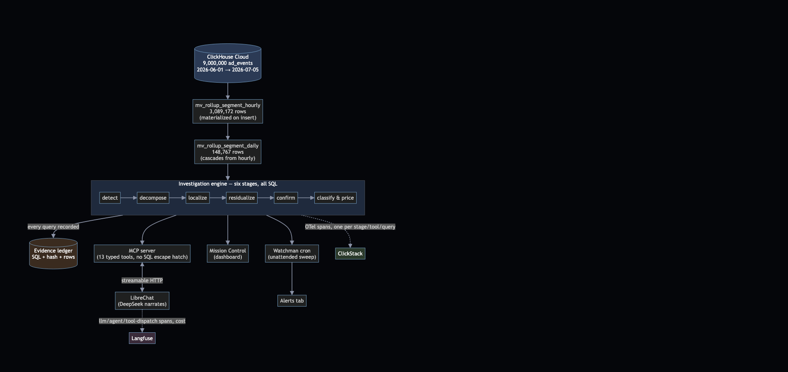
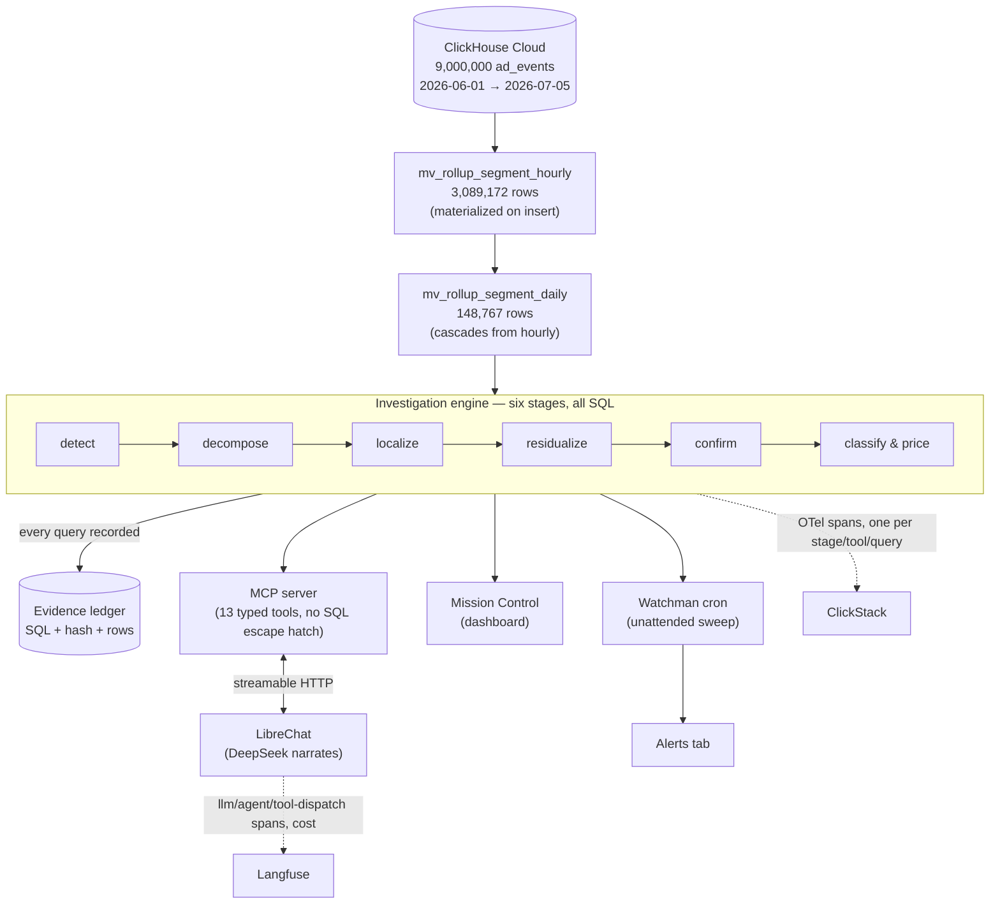

# Architecture — Sherlook

**One line:** ClickHouse does the analysis. Everything else observes it, narrates it, or triggers it.



## Where the analysis runs

**In ClickHouse. The LLM never writes SQL and cannot.**

This is enforced structurally, not by instruction. The MCP server exposes **13 tools** and not one of
them accepts SQL:

```
describe_data      list_dimension_values   get_metric        compare_periods
rank_segments      find_incidents          investigate       explain_revenue
get_evidence       export_trace            watch_this        list_watches
stop_watching
```

Every statement is composed in `backend/mcp/query.ts` from typed parameters — metric enum, dimension
enum, ISO dates. There is no `run_sql`, no query passthrough, no string the model controls. The
`bun run sanity` gate asserts this on every run: it speaks JSON-RPC to the server, reads the tool
list, and **fails if any tool name matches `/sql|query|exec|raw/`**. An untested architectural claim
is just a claim.

The model's entire job is to read a JSON result and write a paragraph.

## The data path

```
ClickHouse Cloud (9,000,000 ad_events, 2026-06-01 → 2026-07-05)
        │  materialized on insert
mv_rollup_segment_hourly (3,089,172 rows)
        │  cascades — not a second independent aggregation, so the two grains cannot drift apart
mv_rollup_segment_daily (148,767 rows)
        │
Investigation engine — six stages, all SQL
detect → decompose → localize → residualize → confirm → classify & price
```

Every query any stage runs is recorded to an **evidence ledger** — the SQL, a hash, and the rows
returned. `get_evidence` resolves any number in a diagnosis back to the statement that produced it.
`bun run parity` runs the same investigation twice, once served by the rollup and once forced to raw,
and asserts every recorded number is identical — the rollup is a cost optimization, never a second
source of truth.

## The six stages

1. **Detect** — every metric, every day, against a same-weekday trailing baseline (median + MAD, never
   mean/stddev — an incident inside the trailing window inflates the standard deviation and hides
   itself; the median does not move).
2. **Decompose** — which part of the funnel moved: requests → fill → render → CTR → price.
3. **Localize** — which segment values, across 8 dimensions and their pairs, carry the move.
4. **Residualize** — the differentiator. Greedy deflation removes the cause's contribution and
   re-measures everything else, so segments that only moved because they *contain* the cause are
   **explicitly cleared** rather than blamed. On the flagship incident this clears 840 slices.
5. **Confirm** — is the survivor still significant once the cause is accounted for?
6. **Classify & price** — technical break vs. mix shift vs. demand, an owner, and dollars per day.

A **grounding check** then re-reads the finished prose and asserts that every numeral in it resolves
to a recorded evidence row at the precision printed. A number that cannot be traced to a query is a
failure, not a rounding difference.

## Where each surface reads from

- **MCP server** (13 typed tools) — the single execution path both the CLI and LibreChat call through.
- **Mission Control** (dashboard) — the live sweep, alerts, LLM cost/prompt insights, and system health,
  all reading real data on request, nothing mocked.
- **Watchman cron** — the same engine run unattended on a schedule; a firing shows up on the Alerts tab
  with a full diagnosis already attached, not just a threshold breach.
- **LibreChat** — the chat surface, talking to the MCP server over streamable HTTP. Identity flows
  through as `{{LIBRECHAT_USER_ID}}` / `{{LIBRECHAT_USER_EMAIL}}` headers, so a scheduled watch belongs
  to a person and a follow-up question carries the same evidence as the first answer.

## Observability

- **ClickStack (OpenTelemetry → ClickHouse)** — one span per stage, per tool call, per SQL statement,
  with the statement text (`db.query.text`) and row count on the span. A slow answer traces down to
  the exact query that made it slow.
- **Langfuse** — LLM cost and token attribution per model, plus the dashboard's own "Recent Prompts"
  view, which reads Langfuse's API server-side to show real prompts, their cost, and a plain-English
  breakdown of what was checked for each one.

## LLM's role

**DeepSeek** (`deepseek-chat`, OpenAI-compatible, temperature 0) does the easiest job in the system —
turning a JSON result into a paragraph — so cost per token mattered more than reasoning ceiling. The
consequence of giving the model so little to do is that the failure surface is small enough to test:
`bun run narrate` feeds it a real investigation and grounding-checks its prose.

---

### Diagram source (Mermaid)

The image above is rendered from this source — reproduce or edit it at <https://mermaid.live>, or see
`README.md`, which embeds the same diagram inline (GitHub renders Mermaid natively).


