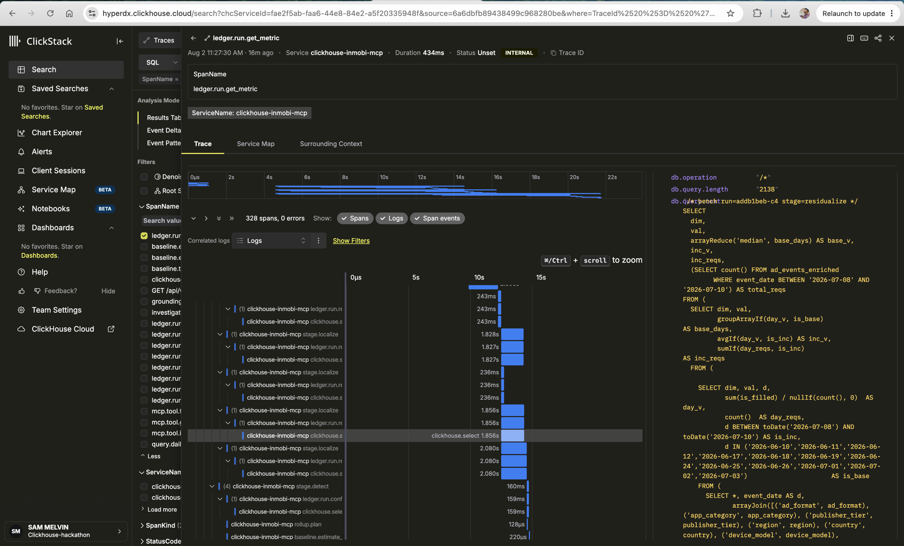

# ClickStack tracing — where the query actually lives

`docs/data-lineage-and-human-intelligence.md` walks the path a number takes from raw event to
narrated sentence. This doc is the other half: proof that every step on that path is a real,
inspectable span in production, down to the literal SQL text — not a diagram of intent.

## What this is

A real trace from the running system, opened directly in ClickStack (HyperDX):

- **Service:** `clickhouse-inmobi-mcp`
- **Root span:** `ledger.run.get_metric`
- **328 spans, 0 errors**, root duration 434ms
- Span names in the waterfall match the engine's own stage names —
  `stage.detect`, `stage.localize`, `baseline.estimate_*`, `grounding.*`, `rollup.plan` — because each
  stage emits its own span rather than being inferred after the fact.

Clicking any `clickhouse.select` span surfaces three attributes on the right: `db.operation`,
`db.query.length`, and — the one that matters — **`db.query.text`**, the exact statement ClickHouse
ran. The span pictured is from `stage=residualize`: the greedy-deflation query computing `base_v`,
`inc_v`, and `inc_reqs` per segment by comparing an incident window against a baseline window, read
straight off `ad_events_enriched`.

## Why this, and not Langfuse

Langfuse traces the conversation: what the model was asked, what it called, what it said back. It
was never meant to carry SQL, because **the model itself never sees SQL** — its only input is the
already-computed Investigation object. Asking "where's the query" under an `llm` span in Langfuse is
asking the wrong layer.

ClickStack traces the engine itself, one OpenTelemetry span per stage and per statement, with the
statement text attached as a span attribute. This is the layer that answers "where's the query" —
by design, not as a workaround.

## What to check when reading a trace

- **Span duration vs. total** — the waterfall shows which stage actually cost the time (in this
  trace, the `stage.localize` calls, at ~1.8–2.0s each, dominate; the root call finishes in 434ms
  because these are concurrent segment scans, not the full pipeline serialized end to end).
- **`db.query.text`** — the literal statement, comment header included (`/* bench run=... stage=... */`),
  so a query can be matched back to the exact engine stage and run that produced it.
- **Span count and error count** — 328 spans / 0 errors on a real production call is the trace-level
  evidence for "every query is recorded," not just a claim in a README.
