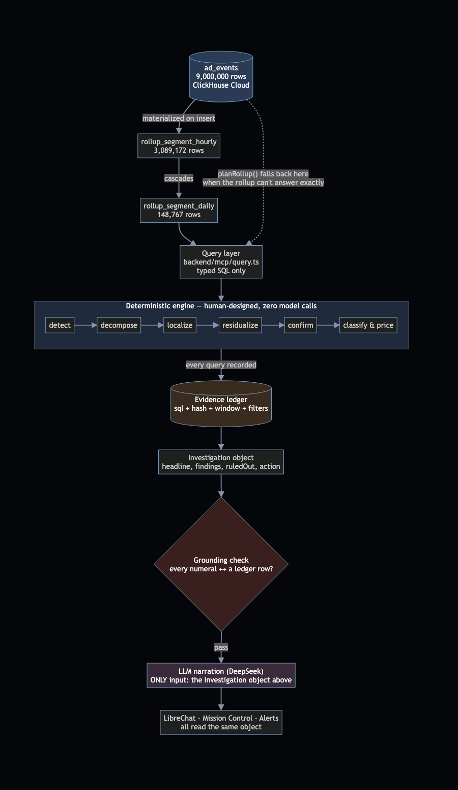
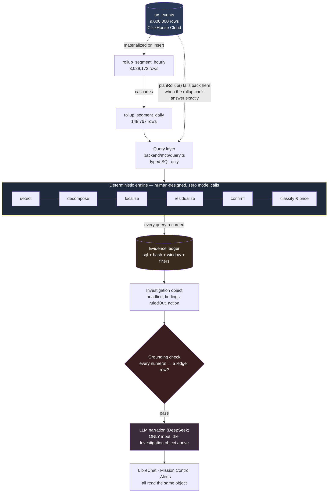

# Data lineage, and where the intelligence actually lives

Two questions, answered together because they're the same question asked two ways: **where does a
number come from**, and **who — or what — decided what that number means**.



## Data lineage

Every number in a diagnosis can be walked backward, mechanically, to a single row in ClickHouse. The
path never branches into something unverifiable:

```
ad_events                              raw fact table, 9,000,000 rows, ClickHouse Cloud
    │  INSERT trigger (materialized view, not a batch job)
    ▼
rollup_segment_hourly                  3,089,172 rows — one row per (hour, dimension, value)
    │  cascades from the hourly table (not a second independent aggregation)
    ▼
rollup_segment_daily                   148,767 rows
    │
    │  planRollup() picks rollup vs. raw per query shape — recorded on every response as
    │  `servedFrom`, never silent
    ▼
Query layer (backend/mcp/query.ts)     typed SQL, built from parameters — no string the caller
                                        controls ever reaches ClickHouse
    ▼
Engine stages                          detect → decompose → localize → residualize → confirm →
                                        classify & price — six deterministic passes, zero model
                                        calls anywhere in this box
    │  every single query any stage runs is recorded here, not summarized after the fact
    ▼
Evidence ledger                        { sql, sqlHash, window, filters, value } per number
    ▼
Investigation object                   { headline, findings, ruledOut, action, planSteps }
    │
    ├──► grounding check ──► pass/fail: does every numeral in the rendered prose resolve to a
    │                        ledger row, at the precision printed?
    ▼
LLM narration (DeepSeek)                the ONLY step that touches a model, and the ONLY input it
                                        receives is the Investigation object above — never a raw
                                        table, never a query result set
    ▼
Delivery: LibreChat · Mission Control · Alerts (watchman)   all three read the same object; none
                                                              of them recompute anything
```

The two checkpoints that make this a lineage rather than a story: `servedFrom` (which physical table
actually answered this specific call) and the evidence ledger (which physical query produced this
specific number). Both are printed with the answer, not reconstructed by a judge from source.

## Where the intelligence actually lives

The honest split, because "AI-powered" is doing a lot of work in most people's projects and almost
none in this one:

| Decision | Made by | Example |
| --- | --- | --- |
| What "normal" means | **Human** — statistics | Same-weekday median + MAD, never mean/stddev (an incident in the trailing window inflates a standard deviation and hides itself; the median doesn't move) |
| Whether a move is real | **Human** — two-gate design | `\|Δ%\| ≥ 3` **and** `\|σ\| ≥ 2.5` for the per-metric sweep; `\|Δ%\| ≥ 10` **and** `\|σ\| ≥ 5` for the cross-metric incident sweep. Sigma alone calls 2–4 noisy points significant; size alone flags every weekend. Both, together, is what keeps the output quiet enough to read. |
| Which segment is the cause vs. dilution | **Human** — the residualization algorithm | Greedy deflation: take the top contributor, remove it, re-measure everyone else, repeat. Not a model's guess — arithmetic, run to convergence. |
| Technical break vs. demand vs. supply | **Human** — a decision tree over verified signals | Advertiser count flat + render rate flat + eCPM flat + fill rate driving the move ⇒ `technical_break`. Every input is a number from the ledger, not a judgment call at generation time. |
| Which segment matters most | **Human** — the ranking formula | `contribution = \|Δ_abs\| × share`, not raw `%` move — a 60-point swing on 0.1% of traffic ranks below a 3-point swing on 40%. |
| Whether a number is trustworthy enough to print | **Human** — the grounding check | Re-parses the rendered prose, extracts every numeral, and asserts each one matches a ledger row at the same precision. This runs on every answer, not just in testing. |
| What the model is allowed to touch | **Human** — the tool contract | 13 tools, none of which accept SQL (`bun run sanity` fails the build if any tool name matches `/sql\|query\|exec\|raw/`). The model cannot query anything that wasn't pre-computed and verified. |
| Turning the verified result into a sentence | **AI** — one LLM call | `DeepSeek`, temperature 0, fed only the Investigation object above. Its entire job is phrasing. |

**The AI layer, measured honestly, is one function call wide.** It never sees a raw event, never
writes a query, never picks a threshold, never decides what counts as a cause. Every one of those
decisions was made by a person, encoded as deterministic logic, and is reproducible by rerunning the
same code against the same data — which is exactly what `bun run parity` and `bun run synth:verify` do
on every change, against data the thresholds were never tuned against.

The reason this split matters isn't philosophical. It's the direct answer to the rubric's own framing:
*"a single fabricated figure costs more than a missed anomaly."* A system where the model can only
narrate a pre-verified object has no path to fabricating a figure — the failure mode the grounding
check exists to catch is a **rounding** disagreement, not an invented one. That's a consequence of
where the intelligence sits, not a feature bolted on afterward.

---

### Diagram source (Mermaid)


