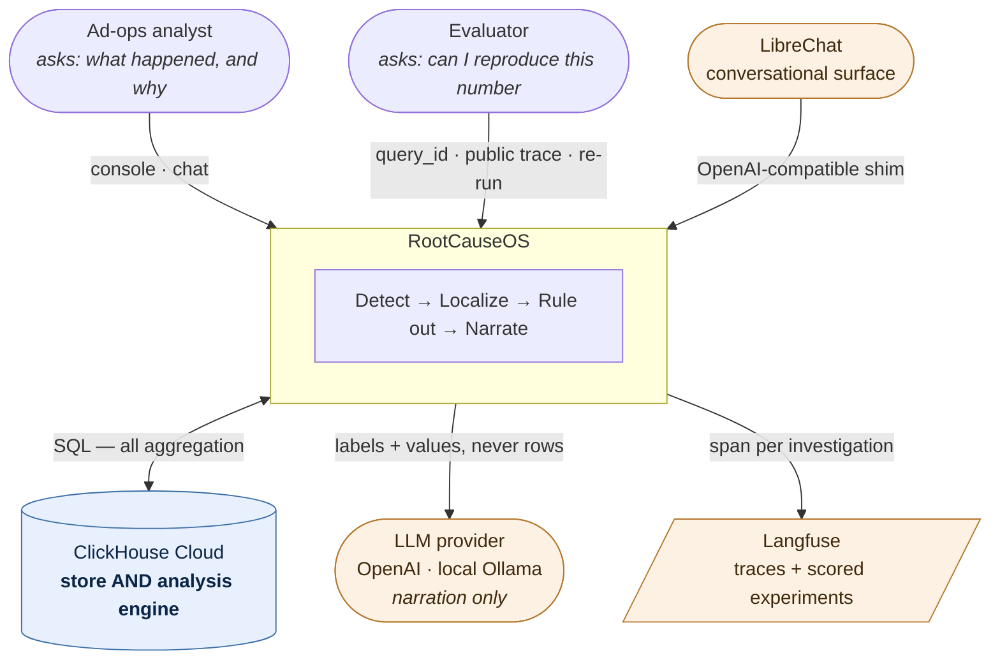
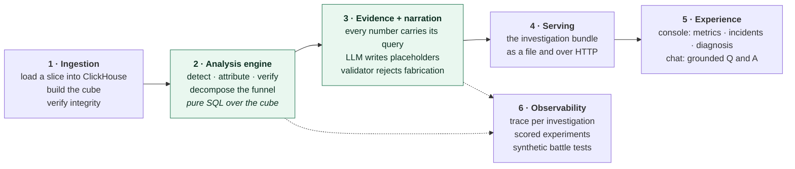
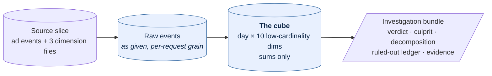
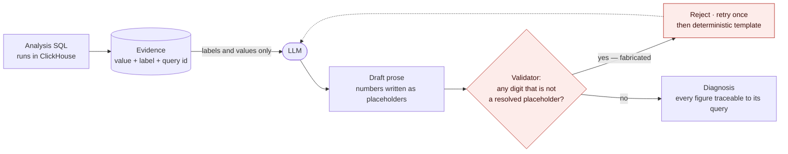
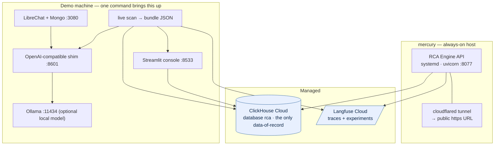

# High-Level Design — RootCauseOS

**What it is:** an automated root-cause analyst for ad metrics. A metric moves; the system detects
it, localizes the responsible segment in ClickHouse SQL, rules out the look-alikes, and narrates a
diagnosis in which every number is computed rather than generated.

**Audience:** anyone who needs to understand the system without reading code — mentors, judges, a
teammate joining mid-build. Implementation detail lives in [`LLD.md`](LLD.md); frozen interfaces in
[`CONTRACTS.md`](CONTRACTS.md).

---

## 1. Problem and scope

An ad-ops analyst seeing "revenue is down" today opens dashboards and slices by hand: by region, by
OS, by app category, by ad format — then repeats it for every metric in the funnel. On this dataset
that search space is **1,709 candidate segments × 8 metrics = 13,672 checks ≈ 114 analyst-hours**.
The analyst does not do 13,672 checks; they do twenty, guided by hunches, and the answer is
whichever slice they happened to look at.

**In scope:** revenue and its funnel — requests → fill_rate → render_rate → eCPM — over one
historical ad-events slice, with a hard requirement that the system also works on an unseen slice it
was never tuned against.

**Out of scope:** external/correlated data sources, real-time streaming ingestion, alert routing,
multi-tenant deployment.

**Success is defined by four properties**, in priority order:

| Property | Means | How the design serves it |
|---|---|---|
| **Trustworthy** | No number in the output is invented | Evidence-placeholder narration + a rejecting validator (§5) |
| **Localized** | Names the *right* segment, including 2-D interactions | Lift-based attribution + concentration test + exclusion re-run |
| **Honest** | Says "global, no single cause" when that is the truth; shows what it ruled out | `GLOBAL_UNLOCALIZED` is a first-class verdict; a ruled-out ledger with residual numbers |
| **Fast** | Seconds, not hours | Pre-aggregated cube; all analysis pushed into ClickHouse |

Trustworthy outranks the rest: one fabricated figure costs more than one missed anomaly.

## 2. System context



The LLM sits at the **far edge**. It receives label/value pairs and returns prose. It never sees a
row and never performs arithmetic — that is the single constraint the whole trust story rests on.

## 3. Logical architecture

Six subsystems. Each has one responsibility and one interface to the next.



| # | Subsystem | Responsibility | Boundary it exposes |
|---|---|---|---|
| 1 | **Ingestion** | Load any slice (seen, synthetic, unseen) into its own database; build the cube on demand; assert integrity | A populated `<db>.cube` |
| 2 | **Analysis engine** | Find real movements, name the responsible segment or declare it global, prove what is *not* the cause | An in-memory investigation set |
| 3 | **Evidence + narration** | Attach a query to every figure; produce prose that cannot contain an ungrounded number | The **investigation bundle** |
| 4 | **Serving** | Make one bundle available as a file, an HTTP resource, and a UI-shaped projection | JSON, stable shape |
| 5 | **Experience** | Render the bundle; answer follow-ups under the same grounding rule | Console pages + an OpenAI-compatible endpoint |
| 6 | **Observability** | Prove the reasoning happened and score it against ground truth | Public traces, experiment scores, precision/recall |

**The investigation bundle is the system's spine.** Subsystems 4, 5 and 6 all consume the same
object; nothing downstream re-derives a number. If a figure is not in the bundle, no surface renders
it. Its shape is frozen in `CONTRACTS.md` §8/§8.1.

## 4. Data architecture



Three design rules, each with a reason that survives contact with the data:

- **One cube, no table sprawl.** The cube is the *same data pre-aggregated* — an index over the
  given slice, not a new dataset. Measured on the seen slice: 9,000,000 rows / 161 MB → 4,511,141
  rows / 37 MB. That is a 2× row reduction and a 4.4× byte reduction; the speed comes from the
  narrow low-cardinality columnar shape and the day grain, not from a dramatic rollup.
- **Sums only, ratios at read time.** Storing `fill_rate` per row would make roll-ups wrong
  (an average of ratios is not the ratio of sums). Every rate is computed `sum/sum` in SQL.
- **High-cardinality ids are not dimensions.** App, advertiser and device ids add ~7,500 candidate
  segments and carry no anomaly — they are pure false-positive surface. They stay in the raw data
  as drill-in targets, never as scan candidates.

**The metric tree** is the one identity the whole analysis rests on:

```
revenue/day  ≡  requests × fill_rate × render_rate × (eCPM / 1000)
```

Because it telescopes, a decomposition of a revenue move across these four factors is *exact*. That
is what lets the system say "it was not the price, and here is the number" rather than staying
silent about the factors that did not move.

## 5. The trust model

This is the differentiator, and it is architectural rather than a prompt instruction.



| Guarantee | Mechanism |
|---|---|
| The LLM cannot invent a figure | It only ever receives label/value pairs; the validator blanks placeholders first, then rejects any surviving digit |
| The LLM cannot do arithmetic | Every derived quantity — deltas, shares, contributions — is computed in SQL *before* narration |
| Failure degrades to grounded, never to wrong | If the model is unavailable or keeps fabricating, a deterministic composer writes the diagnosis from the same evidence |
| An evaluator can verify without us | Every figure resolves to a ClickHouse `query_id` re-runnable against `system.query_log`, and the trace is public |

The same rule is enforced twice — once in the engine's narrator and once in the chat layer — because
a chat surface that skipped it would reopen the hole the design exists to close.

## 6. Runtime views

Three flows, deliberately decoupled: the console never waits on the engine, and the chat never
queries raw data.

| Flow | Trigger | Path | Latency |
|---|---|---|---|
| **Investigation** (batch) | CLI or API refresh | cube → detect → attribute → verify → decompose → narrate → bundle + trace | **13.9 s** measured end-to-end over a 9.9M-row unseen slice |
| **Console read** | Page load | events table → aggregate → render with provenance | Sub-second per panel; every panel shows its `query_id`, rows read and elapsed ms |
| **Conversation** | Question in LibreChat or the chat dock | question + bundle evidence → LLM → numeric validation → answer | Model-bound; no ClickHouse in the loop |

The investigation is computed once and cached because the dataset is static. `POST /refresh`
recomputes. This is a deliberate simplification of a system that would otherwise need a scheduler.

## 7. Deployment topology



The demo machine is disposable — a single script runs the live scan, then starts the console, the
shim and LibreChat, and health-checks each. The always-on host exists so the engine has a public URL
that does not depend on someone's laptop being awake.

## 8. Key design decisions

| Decision | Alternative rejected | Why |
|---|---|---|
| ClickHouse is the analysis engine, not just storage | Pull rows into pandas | Aggregation is what the database is for; pulling 9M rows into Python would be slower and would break the "every number has a `query_id`" guarantee |
| Pre-aggregated cube as the only read surface for analysis | Query raw events per drill-down | Bounds every drill-down to tens of milliseconds; the cost is a build step, made safe by building it on demand |
| Rank segments by **lift** (share of the loss ÷ share of the traffic) | Rank by largest percentage drop | A big segment always shows a big absolute move. Measured on this data: a genuinely global collapse tops out at lift 1.26 while real causes start at 10.6 — that gap is what makes "global, no culprit" a decision rather than a guess |
| Verdict set of exactly three: localized-1D, localized-2D, global | An elaborate state machine | Three outcomes cover every observed case and are explainable in one sentence each |
| Narration by placeholder + rejecting validator | Prompt instructions ("do not invent numbers") | Instructions are advisory; a validator is structural. The failure mode we cannot accept must be impossible, not discouraged |
| The bundle is the contract between every subsystem | Each surface queries the engine itself | Lets the console, chat, API and traces be built in parallel against a fixture, and guarantees they all show the same numbers |
| Load an unseen slice into its own database | Load into the same database | A new slice cannot corrupt the historical baselines, and a bad load is thrown away by dropping one database |
| One-file engine, no orchestration framework | LangGraph-style node graph | The pipeline is linear with two branches; a framework would add a dependency and a layer of indirection for no behavioural gain |

## 9. Failure modes and degradation

The system is designed to degrade to something honest rather than to fail or to fake.

| Failure | Behaviour | Visible to the user? |
|---|---|---|
| Cube missing (fresh database) | Built on demand from the raw tables before the scan | A build line in the log |
| ClickHouse unreachable from the console | Charts fall back to a checked-in fixture series | **Yes** — provenance says `source: fixture` |
| LLM key absent, dead, or rate-limited | Deterministic composer writes the diagnosis from the same evidence | **Yes** — the diagnosis is labelled with its source and the reason |
| LLM keeps fabricating figures | Two rejections, then the deterministic path | **Yes** — the rejection count is reported |
| Langfuse not configured | Scan completes; no trace emitted | A log line |
| A metric moves but no segment is responsible | `GLOBAL_UNLOCALIZED` with the best lift shown | **Yes** — stated as the verdict |
| The engine has emitted only shallow depth for an incident | The deep panels say so explicitly | **Yes** — never filled with placeholder numbers |

## 10. Portability to an unseen dataset

The scored moment is a slice nobody has seen. The design constraints that make that survivable:

- The loader reads column names from the file rather than assuming them.
- The scan takes a database name; it builds its own cube if there isn't one.
- Baselines are derived from whatever history the slice contains — no hardcoded dates.
- Incident windows are discovered, not configured; the console's time axis derives from the data and
  the incidents.
- Every surface is repointed with one environment variable each.

Verified end to end against a 9.9M-row synthetic slice built from scratch, with a ground-truth
manifest to score against.

## 11. Known gaps

| Gap | Impact |
|---|---|
| **ClickStack / HyperDX not wired** | The fourth integration has no code. Latency is measured but not visualised as telemetry. |
| Speed not packaged as a headline artefact | The numbers exist; there is no before/after benchmark to point at. |
| Detection sensitivity floor ~10–12% | Measured, not assumed. Planted anomalies in scope are 34–51%, so the margin holds, but a subtler move would be missed. |
| Two full-size event tables | The engine and the console read differently shaped copies of the same 9M rows. Intentional, but it exceeds the "minimal footprint" principle. |

---

Detailed module contracts, algorithms, formulas, thresholds and API specifications:
[`LLD.md`](LLD.md).
