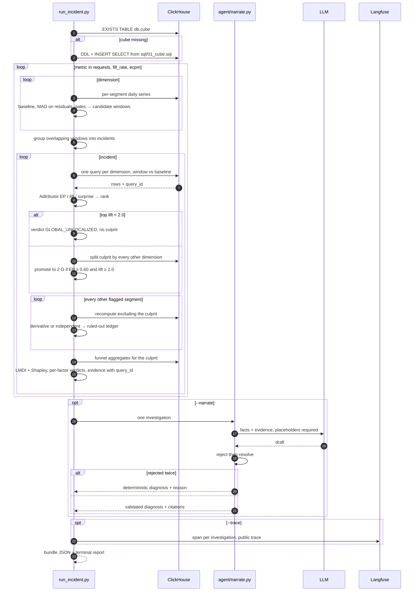
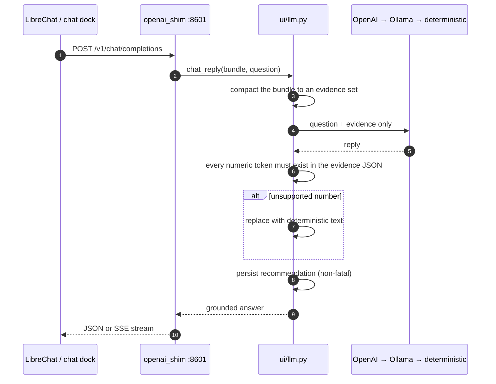

# Low-Level Design — RootCauseOS

Implementation-level design: schemas, algorithms with their formulas, module interfaces, sequences,
tuned constants, and failure handling. System-level rationale is in [`HLD.md`](HLD.md); the frozen
cross-team interfaces are in [`CONTRACTS.md`](CONTRACTS.md).

Everything below reflects the code as built. Where a threshold has a measured justification, the
measurement is stated — those numbers are why the value is what it is.

---

## 1. Module inventory

| Layer | Module | Responsibility | Key entry points |
|---|---|---|---|
| Ingestion | `scripts/load_clickhouse.py` | Load a slice into a named database; integrity asserts | `--parquet` · `--database` · `--verify-only` |
| Ingestion | `sql/01_cube.sql` | Cube DDL + populate from raw + dimension joins | executed by `ensure_cube()` |
| Engine | `run_incident.py` | Detection, attribution, verification, decomposition, bundle assembly, tracing | `scan()` · `build_bundle()` · `log_bundle()` |
| Trust | `agent/narrate.py` | Evidence-only narration + rejecting validator | `narrate(inv, cfg, corrupt=False)` |
| Serving | `api/server.py` | HTTP access to the bundle, cached | `/scan` `/investigations` `/investigation/{id}` `/refresh` |
| Serving | `scripts/emit_ui_bundle.py` | Project the bundle into the console's incident-card shape | writes `contracts/fixtures/scan_bundle.json` |
| Experience | `ui/app.py` | Console shell, routing, Metrics page | `?page=metrics\|incidents\|diagnosis` |
| Experience | `ui/data.py` | Live ClickHouse over HTTP with provenance | `daily_series()` · `series()` · `incident_series()` · `query()` |
| Experience | `ui/bundle.py` | Bundle loading + `{{ev_N}}` resolution | `load()` · verdict metadata |
| Experience | `ui/incidents.py` · `ui/storyboard.py` | Incident cards + guided case files | `incidents()` — the single swap point |
| Experience | `ui/diagnosis.py` | Per-anomaly RCA read-out at whatever depth exists | `render_page(incident)` |
| Experience | `ui/playbook.py` | Deterministic rules → origin, controllability, actions | rules table, first match wins |
| Experience | `ui/llm.py` | Chat brain + numeric validation + persistence | `chat_reply()` · `summarize()` · `persist_recommendations()` |
| Integration | `integrations/openai_shim.py` | OpenAI-compatible surface for LibreChat | `/v1/chat/completions` · `/v1/models` |
| Integration | `integrations/librechat/` | Self-hosted LibreChat + Mongo | docker compose, `librechat.yaml` |
| Ops | `scripts/demo_up.sh` · `scripts/deploy_mercury.sh` | One-command local bring-up; API redeploy | idempotent, health-checked |
| Test | `tests/battletest.py` · `stress_test.py` · `experiment.py` · `e2e/` | Generalization, sensitivity, scored evaluation | precision/recall vs ground truth |

## 2. Data structures

### 2.1 The cube

```sql
CREATE TABLE <db>.cube (
    day             Date,
    region, country, device_model, os_version,
    category, publisher_tier,
    vertical, campaign_type,            -- '' on unfilled requests (no advertiser)
    ad_format                           -- all LowCardinality(String)
    requests, fills, impressions, clicks  UInt64,
    revenue                               Float64
) ENGINE = MergeTree
ORDER BY (day, region, os_version, category, ad_format);
```

Populated by `INSERT … SELECT` from raw events LEFT JOINed to the three dimension tables. Not a
materialized view: `ensure_cube()` creates it on demand, which is what makes a fresh database
runnable without a setup step.

**Invariants**

- Sums only. Every rate is `sum(num)/sum(den)` at read time.
- `vertical` and `campaign_type` are `''` for unfilled requests — structural, never dropped.
- The sort key leads with `day` because every query filters a window first.

### 2.2 The investigation bundle

The contract every downstream surface consumes (CONTRACTS §8.1).

```
{
  scan_summary: {
    database, metrics_scanned[], real_incidents, ruled_out,
    gates: { candidates, volume, significant, effect, unique },
    wall_clock_s, baseline
  },
  investigations: [ {
    id, metric, window: [lo, hi], verdict, headline,

    culprit: null | {                       // null ⇒ GLOBAL_UNLOCALIZED
      dimension, segment, deviation_pct,
      explanatory_power,                    // gross: share of total movement, [0,1]
      explanatory_power_net,                // signed: share of the net delta
      surprise_js, size_share, lift,
      co_cut: null | { dim: value },        // present for 2-D verdicts
      denominator                           // the volume the rate is computed over
    },

    attribution: {
      method, best_lift, best_explanatory_power,
      lift_floor, ep_floor, concentration_rule,
      advertiser_blank_excluded[],
      queries: [ { dim, sql, query_id } ]   // one per dimension scanned
    },

    decomposition: [ {                      // one row per funnel factor + ctr
      factor, window_value, baseline, deviation_pct,
      lmdi_contribution, shapley_contribution, pct_effect, verdict
    } ],
    decomposition_meta: {
      method, cross_check, lmdi_shapley_max_divergence_pct, stable,
      delta_revenue_per_day, identity, reconciliation_note, baseline_window
    },

    ruled_out: [ { segment, deviation_pct, residual_after_exclusion_pct, why } ],
    evidence:  [ { id, label, value, sql, query_id } ],
    diagnosis: { diagnosis, citations[], source, rejected, fallback_reason? }   // --narrate only
  } ]
}
```

**Rules that hold across the whole document**

- Every figure a surface renders comes from this object. No surface computes.
- `evidence[].id` is the `ev_N` a narration placeholder resolves to.
- A field the engine could not compute is **omitted or null**, never estimated.

### 2.3 Gate counters — what they actually count

`scan_summary.gates` is instrumentation, **not a single monotonic funnel**. The counters have
different units and must not be drawn as one descending chart:

| Counter | Unit | Meaning | Seen slice |
|---|---|---|---|
| `candidates` | segment-series | (metric × dimension × segment) series examined | 168 |
| `volume` | segment-days | day observations that cleared the volume floor | 5,810 |
| `significant` | segment-days | day observations breaching both z and relative-change | 75 |
| `effect` | windows | candidate windows surviving the contribution floor | 60 |
| `unique` | incidents | windows grouped into distinct investigations | 4 |

The "1,709 candidate segments" figure quoted in the problem framing is the *analyst's* search space
(all one- and two-dimension combinations); the engine reaches two-dimension segments by descent
rather than by enumerating them, which is why `candidates` is 168 and not 1,709.

## 3. Algorithms

### 3.1 Baseline construction

Two rules, both measured rather than assumed.

**Like-for-like days.** The baseline for a window is the **same weekdays of the 3 preceding weeks**,
with the window itself excluded. Preceding, not surrounding: a live run has no future, and letting
later days in is leakage — measured, it shifted one incident's magnitude from −43.5% to −45.2%.
Fallback to following same-weekdays only when the window sits at the very start of the slice.

**Per-metric baseline shape.** Volume is weekday-seasonal, so `requests` uses a same-weekday median.
Ratios are flat across weekdays on this data, so `fill_rate` and `ecpm` use an overall median.

Never a flat mean over "all other days": the slice carries a −20% weekend dip and a 1.8× hour-of-day
swing, so a flat baseline reports a Sunday outage as −51.7% when the true same-weekday drop is
−43.5%.

### 3.2 Detection — robust z on residuals

For each (metric, dimension, segment) daily series:

```
value      v_d   = numerator_d / denominator_d      (ratio metrics)
                 = numerator_d                      (volume metrics)
baseline   b_d   = median over like-for-like days
residual   r_d   = v_d − b_d
mr               = median(r)
MAD              = median(|r − mr|)                  (floored at 1e-9)
robust z   z_d   = 0.6745 · (r_d − mr) / MAD
relative   rel_d = (v_d − b_d) / b_d
```

Flag day `d` when `|z_d| > 3.5` **and** `|rel_d| > 0.10` **and** `volume_d ≥ 1500`.

**MAD is taken on residuals, never on raw values.** Taking it on raw values bakes the weekday spread
into the scale — measured, that inflates MAD 2.2× and lifts the `requests` detection floor from
−15% to −32%, silently missing milder days.

Consecutive flagged days are merged into a window; windows that overlap across metrics and
dimensions are grouped into one incident.

**Contribution gate.** A window survives only if
`(volume × window_days / metric_total_volume) × |rel| ≥ 0.005` — it must explain at least 0.5% of
the metric. This is what stops a tiny segment with a huge percentage move from becoming a finding.

### 3.3 Attribution — Adtributor

One SQL query per dimension returns, for every value `k` of that dimension, the window and baseline
aggregates. Deltas are absolute so that children's deltas sum to the parent's:

```
ratio metric:   wv = wn/wd,      bv = bn/bd,      vol = wd
                delta = wn − bv·wd                       (missing fills / missing revenue)
volume metric:  wv = wn/wdays,   bv = bn/bdays,   vol = wn
                delta = wn − bv·wdays                    (missing requests)
```

Then, across the values of one dimension:

```
p_k  = |delta_k| / Σ|delta|          gross share of the movement
q_k  =  vol_k    / Σ vol             share of the traffic
m    = (p_k + q_k) / 2

explanatory_power  = delta_k / Σ delta            (signed — share of the NET delta)
explanatory_power_gross = p_k
size_share         = q_k
lift               = p_k / q_k
surprise           = ½·p_k·log₂(p_k/m) + ½·q_k·log₂(q_k/m)     (sums to JS divergence)
```

**Lift is the ranking signal, not deviation.** A segment holding 40% of the traffic and 40% of the
loss is innocent however large its percentage drop; one holding 40% of the traffic and 98% of the
loss is the cause.

Candidates are filtered to `vol ≥ 1500` and `|EP| ≥ 0.20`, ranked by `|lift|`. The culprit is the
**largest-EP** segment among those clearing the lift floor — not the purest small one.

**Global verdict.** If no segment clears `lift ≥ 2.0`, the verdict is `GLOBAL_UNLOCALIZED` and no
culprit is named. Measured basis: a genuinely global collapse tops out at lift 1.26 while real
causes start at 10.6. All the sibling segments that flagged are collapsed into **one** ruled-out
line, not 53 near-identical ones — they are the same global move relabelled.

**Advertiser-side exclusion.** `vertical` and `campaign_type` are `''` on unfilled requests, so that
pseudo-value's traffic share moves with fill *by identity*. Un-gated, it ranks top on every fill
incident — the metric restated, not a cause. Excluded from attribution; the rows stay in the cube.

### 3.4 Two-dimensional refinement

Is the named segment actually a dilution artifact of an interaction?

```
for each other dimension d2:
    split the parent segment by d2  (SQL WHERE parent_dim = parent_value)
    require ≥ 2 child cells with vol ≥ 1500
    w = child with the largest signed EP
    promote if  EP(w) ≥ 0.60  AND  lift(w) ≥ 2.0
among all promotions, keep the one with the largest |rel|
```

**Both conditions are required.** With concentration alone, a `category × campaign-type` pair
(EP 0.604, lift 1.00) is wrongly promoted — it is merely the biggest slice of its parent, absorbing
exactly its fair share. The lift term is what distinguishes an interaction from a big child.

On promotion the parent is logged in the ruled-out ledger as a dilution artifact, with its number.

### 3.5 Verification — Simpson's exclusion check

For every other flagged segment in the window, recompute it with the culprit's rows **removed**:

```
WHERE NOT (<culprit segment filter>)
derivative  ⇔  |rel_after_exclusion| < 0.10
```

Derivative segments are recorded as *explained by* the culprit, with both the original and the
residual deviation. Segments that survive exclusion are kept as independent findings. Nothing is
assumed — every sibling is tested and the number is in the ledger either way.

### 3.6 Funnel decomposition — LMDI with a Shapley cross-check

The identity `revenue/day ≡ requests × fill_rate × render_rate × (eCPM/1000)` telescopes, so:

```
V₁ = Π x₁ᵢ ,  V₀ = Π x₀ᵢ ,  ΔV = V₁ − V₀
L(V₁,V₀) = (V₁ − V₀) / ln(V₁/V₀)                     log-mean
LMDI contribution ᵢ = L(V₁,V₀) · ln(x₁ᵢ / x₀ᵢ)        Σ contributions = ΔV exactly
```

A zero residual is therefore **guaranteed by construction and validates nothing** — it would also be
zero on a wrong metric tree. What is validated is agreement with exact Shapley values (the mean
marginal contribution over all 24 orderings of the four factors):

```
max_divergence_pct = maxᵢ |LMDIᵢ − Shapleyᵢ| / |ΔV| × 100      stable ⇔ ≤ 10
```

Per-factor verdicts feed the ruled-out story with numbers attached:

| Condition | Verdict |
|---|---|
| factor is the incident's driving metric | `driver` |
| `|pct_effect| < 5%` | `normal → ruled out` |
| `|deviation| > 10%` | `contributing` |
| otherwise | `normal → ruled out` |
| `ctr` | `context (not a CPM revenue factor)` — never a verdict |

### 3.7 Narration and validation

```
1. facts     ← labels + values only: metric, window, verdict, culprit label,
               per-factor deviations and verdicts, ruled-out look-alikes
2. evidence  ← {{ev_N}} = value  (label)     one line per evidence object
3. prompt    ← hard rule: every metric NUMBER must be written as its {{ev_N}} placeholder
4. draft     ← model completion
5. validate  ← REJECT-THEN-RESOLVE:
                 a. blank every known placeholder  (so a resolved value can never be
                    mistaken for an invented one)
                 b. any leftover  {{ … }}  ⇒ reject (leaked or unknown placeholder)
                 c. remove allow-listed literals: segment names, evidence values, window
                    dates — longest first, so '18.1' inside 'iOS 18.1' is consumed by the name
                 d. any surviving digit ⇒ fabricated ⇒ reject
6. retry     ← once, at a DIFFERENT temperature (0.0 → 0.4); an identical retry wastes the attempt
7. fallback  ← deterministic composer over the same evidence
```

**The allow-list is named bundle fields only.** An earlier version harvested numerals out of the
prompt text with a regex; the window date `2026-06-23` then contributed `2026`, `06` and `23` to the
allowed set, so the model could write "fill rate fell 23%" and pass. Segment names are the only
legitimate source of literal digits — an OS version genuinely contains them.

**Demo toggle.** `narrate(..., corrupt=True)` replaces the first placeholder in the draft with a
fabricated figure so the guard can be shown firing live. It is a demo path, not a code path used in
a real run.

## 4. Sequences

### 4.1 One scan



### 4.2 A question in chat



No ClickHouse in this path: the chat answers from the bundle, so a follow-up cannot introduce a
number the engine never computed.

## 5. Configuration

### 5.1 Tuned constants (`run_incident.py`)

| Constant | Value | Role | Basis |
|---|---|---|---|
| `BASE_WEEKS` | 3 | Same-weekday baseline depth | Enough history without reaching into a different regime |
| `Z` | 3.5 | Robust-z threshold | Above the noise floor of residual scatter |
| `MINREL` | 0.10 | Minimum relative deviation | Also the "collapsed" threshold in the exclusion check |
| `MINVOL` | 1500 | Per-day volume floor | Below this, ratio estimates are dominated by sampling noise |
| `MINCONTRIB` | 0.005 | Window must explain ≥0.5% of the metric | Kills tiny-segment noise |
| `MIN_EP` | 0.20 | Culprit explains ≥20% of the window delta | Adtributor floor |
| `LIFT_FLOOR` | 2.0 | …and absorbs ≥2× its fair share | Globals top out at 1.26; real causes start at 10.6 |
| `CONC` | 0.60 | 2-D: child holds ≥60% of the parent delta | — |
| `CONC_LIFT` | 2.0 | …disproportionately | Without it, an EP 0.604 / lift 1.00 child is wrongly promoted |
| `SCAN_METRICS` | requests, fill_rate, ecpm | What is scanned | `ctr` and `render_rate` are flat and not CPM revenue drivers — firing on them is fabricating |

### 5.2 Environment

| Variable | Consumer | Effect |
|---|---|---|
| `CLICKHOUSE_HOST` / `_USER` / `_PASSWORD` / `_DATABASE` | engine, console | Connection; read from repo-root `.env`, never logged |
| `LLM_API_KEY` (or `OPENAI_API_KEY`), `LLM_MODEL`, `LLM_BASE_URL` | narration, chat | Model selection; absence degrades to deterministic |
| `LANGFUSE_PUBLIC_KEY` / `_SECRET_KEY` / `LANGFUSE_BASE_URL` | engine | Tracing; absence skips tracing |
| `RCOS_TABLE` | console | Events table for charts, KPIs, row counts, dataset clock |
| `RCOS_SCAN_BUNDLE` | console | Incident cards, grid shading; windows derived from it |
| `RCOS_BUNDLE` | console | Per-anomaly diagnosis depth |
| `RCOS_DATA=fixture` | console | Force the offline fixture path |
| `RCOS_DB`, `RCOS_RESCAN`, `RCOS_VENV` | `demo_up.sh` | Which database to scan; force a re-scan; interpreter |
| `SHIM_PORT`, `LIBRECHAT_URL` | shim, console | Ports and deep links |

**Bring-up ordering matters.** `demo_up.sh` runs a live scan *before* starting the console and the
shim. Without it both fall back to the hand-written example bundle — which on an unseen dataset
means every panel and every chat answer quotes authored numbers from the seen slice.

## 6. Interfaces

### 6.1 Engine API (`api/server.py`, FastAPI)

| Method | Path | Returns |
|---|---|---|
| GET | `/health` | `{status, db, investigations}` |
| GET | `/scan?db=` | The full bundle |
| GET | `/investigations?db=` | `investigations[]` only |
| GET | `/investigation/{id}?db=` | One investigation, or `{error, id}` |
| POST | `/refresh?db=` | Recompute and replace the cache |

Computed once at startup and cached per database — the dataset is static. CORS is open for local
development. Deployed as systemd `rca-api` on :8077 behind a cloudflared tunnel.

### 6.2 Chat shim (`integrations/openai_shim.py`, stdlib HTTP)

| Method | Path | Notes |
|---|---|---|
| POST | `/v1/chat/completions` | JSON, or SSE when `"stream": true` |
| GET | `/v1/models` | One model: `rootcauseos-rca` |

Registered in `librechat.yaml` as a custom endpoint pointing at
`http://host.docker.internal:8601/v1`.

### 6.3 Console data contract (`ui/data.py`)

Every public function returns `(data, provenance)`:

```
provenance = { source: "clickhouse" | "fixture", query_id, read_rows, elapsed_ms }
```

The console renders those values next to each panel, so any figure on screen can be traced to a
query in `system.query_log`. Rules enforced in this layer: ratios are `sum/sum` in SQL, never an
average of daily ratios; credentials travel only in request headers and are never logged; no
Streamlit import, so the module stays testable.

### 6.4 Incident card shape (`ui/incidents.incidents()`)

The single swap point between the console and any incident source:

```
{ id, severity, title, window: [start, end], panes[],
  headline: { label, observed, expected, delta },
  verdict, diagnosis: { cause, mechanism, contribution, uniformity, confidence },
  ruled_out[], actions: [ { urgency, text } ] }
```

`scripts/emit_ui_bundle.py` projects the engine bundle into this shape. Bundle-first with a static
fallback, `RCOS_SCAN_BUNDLE` overrides.

## 7. Error handling

| Condition | Handling | Surfaced as |
|---|---|---|
| `db.cube` missing | Built from `sql/01_cube.sql`, retargeted to the database | Build line with row count |
| A factor is zero or missing | LMDI/Shapley skipped for that investigation | `method: "unavailable (a factor is zero or missing)"` |
| Baseline has no like-for-like days | Predicate degrades to `0` (no baseline rows) → segment skipped | Absent from the results |
| LLM error / missing key | Caught, **never swallowed**; deterministic path taken | `source: "deterministic"`, `fallback_reason: "<type>: <message>"` |
| Validator rejects twice | Deterministic path | `rejected: 2` in the diagnosis |
| Langfuse SDK missing or unconfigured | Tracing skipped | `(Langfuse not configured)` |
| ClickHouse unreachable from console | Fixture series | `provenance.source = "fixture"` |
| Warehouse write for recommendations fails | Swallowed deliberately | Nothing — the UI must not break on a write |

The one place errors are deliberately *not* swallowed is the LLM path: a dead key once made every
diagnosis silently fall back to the template while the banner still claimed the LLM was narrating.
The differentiator quietly not existing is worse than it failing loudly.

## 8. Test design

| Harness | Method | Asserts |
|---|---|---|
| `tests/battletest.py` | Builds `rca_synth` — a copy of the raw events with randomly planted drops (fill / eCPM / CTR / global volume), seeded | Precision and recall against the injected ground truth. Proves generalization beyond the four known incidents |
| `tests/stress_test.py` | Plants fill-rate drops of decreasing magnitude (−40% … −5%) | Recall vs magnitude — the sensitivity cliff. Measured: catches ≥12%, misses <10% |
| `tests/experiment.py` | Runs the detector against the Langfuse `anomaly-eval-set` as a dataset run | Localization and verdict scores, visible under Langfuse → Experiments |
| `scripts/gen_e2e_dataset.py` + `tests/e2e/` | Generates a 10M-row dataset from scratch in `rca_e2e` with a manifest, then scores | Cold start: blank database → cube → diagnosis → trace. Measured wall clock 13.9 s |

The injector and the scorer are the durable parts — the detector under test can be swapped without
touching them.

## 9. Extension points

| To add… | Change | Watch out for |
|---|---|---|
| A metric | `METRICS` (numerator, denominator) and `SCAN_METRICS` | Flat or non-revenue-driving metrics must stay out of `SCAN_METRICS` |
| A dimension | Cube DDL + `DIMS` (with its request-side flag) | Cardinality: high-card ids are false-positive surface, not signal |
| A funnel factor | `FACTORS` and the value map in the decomposition | The identity must still telescope, or LMDI stops being exact |
| A surface | Consume the bundle | Never re-derive a number; if it is not in the bundle, do not render it |
| An incident source | Replace `ui.incidents.incidents()` | Keep the card shape in §6.4 |

## 10. Not implemented

- **ClickStack / HyperDX.** No OTel instrumentation exists; the only reference in the repo is a
  comment in `teamkit/setup.sh`. The natural shape would be a span per scan stage exported to
  HyperDX, which would turn the measured 13.9 s into visible per-stage telemetry.
- **`rca.v_daily_global`** — a view with no caller. Dead.
- **Sensitivity below ~10%.** Measured limitation, not a bug: lowering `Z` / `MINREL` would trade
  precision for it.
