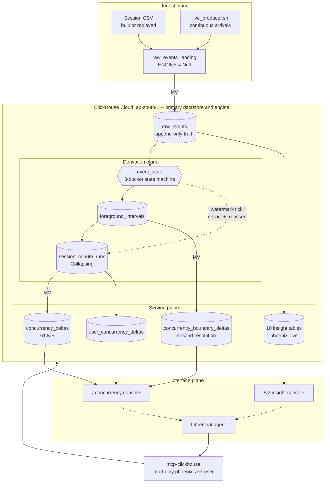
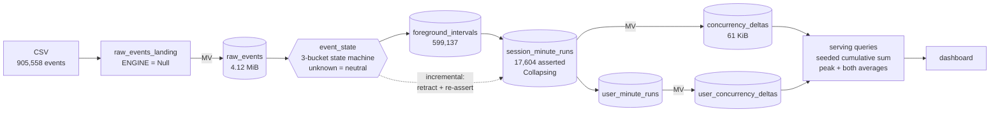

# The Phoenix

## Track

SonyLIV

## Project

**Phoenix Concurrency**: foreground-only concurrency at streaming scale, counting only the
audience that is actually watching, and proving it.

## Team Members

- Yogin Chauhan ([@yogin-123](https://github.com/yogin-123))
- Shail Sheth ([@DynamiteC](https://github.com/DynamiteC))
- Vinesh Chauhan ([@shyam8888](https://github.com/shyam8888))
- Abhishek Surendran ([@abhishek-surendran106](https://github.com/abhishek-surendran106))

## What it does

Concurrency looks like interval overlap and is not. A session can be open while the app is
backgrounded, the player is paused, or the heartbeat has simply stopped arriving. Counting that
time overstates the audience, and every decision made on the dashboard inherits the error.

Phoenix models the **active interval inside the session** rather than the session, and serves peak
and average concurrency at minute, hour and day grain, filtered across the dataset's dimensions,
from a pre-aggregated delta table that never rescans raw history.

On the graded corpus, naive session-span counting reports **9,942** concurrent where foreground-only
counting reports **7,576**. That **31 percent** is the entire problem, removed and measured.

The numbers are not asserted. Every figure in this README resolves through
[`evidence/LEDGER.tsv`](evidence/LEDGER.tsv) to the command that produced it and the artifact it
wrote, and `./scripts/check_docs.sh` fails the build when a claim and its evidence disagree.

## Hosted Demo

**http://the-phoenix.cricheroes.io**

`/` is the concurrency console: the curve, peak and both averages, the filter rail, and the
dataset switch between the original corpus and the unseen day. `/v2` is the insight console, ten
views over the audience-intelligence layer. Both print the ClickHouse query that produced what is
on screen, with the table it read and its row and byte cost underneath.

The live ingest is genuinely live: a producer container writes events continuously and a derive
tick turns them into the served curve every 60 seconds, so the v2 numbers move while you watch.
The unseen day is static by intent, because those are the graded answers and they must not move
while a judge is reading them.

## Demo Video

<!-- TODO: mandatory, 2 to 3 minutes, must show the curve and filters working
     live and the LibreChat chat flow end to end. -->

[The Phoenix - Concurrency](https://www.loom.com/share/b0b841b7131d463689cdf4774663b97f)

## Pitch Deck

[`pitch-deck.pdf`](pitch-deck.pdf), eleven slides. [`pitch-deck.html`](pitch-deck.html) is the
source it renders from, so a number that moves can be corrected and the PDF regenerated with
`google-chrome --headless --no-pdf-header-footer --print-to-pdf=pitch-deck.pdf pitch-deck.html`.

## Architecture

### High-level design

Four planes. Ingest lands raw events and never serves them; the derivation plane turns events into
intervals, runs and deltas; the serving plane answers every dashboard question off a 61 KiB table;
the interface plane is two consoles plus a conversational layer that reaches ClickHouse through the
MCP server rather than through us.



**Why deltas.** Cost tracks interval boundaries, not watch time. A three-hour session costs the
same two rows as a two-minute one, which is what makes 232 MB of CSV collapse to a **61 KiB**
serving table and what makes the design survive the 100x question.

**Why peak is computed, never stored.** A platform slice and a platform-plus-country slice peak at
different minutes inside the same range, so a pre-rolled peak per dimension is wrong by
construction. [`test_peak_is_not_a_rollup.sql`](sql/queries/serving/test_peak_is_not_a_rollup.sql)
is the regression test for exactly that.

**Why open sessions do not need a rebuild.** `session_minute_runs` is a CollapsingMergeTree, so a
session whose active range grew is retracted and re-asserted by a watermark-driven tick. Absorbing
new heartbeats is incremental.

### Data flow, table by table



Full reasoning with the measured cost of every choice:
[`docs/problem/DESIGN.md`](docs/problem/DESIGN.md). Table detail:
[`docs/DATA_MODEL.md`](docs/DATA_MODEL.md).

### The queries behind the curve

Included because the guidelines ask for the modelling, not the chart:
[`concurrency_curve.sql`](sql/queries/serving/concurrency_curve.sql) (sessions),
[`user_concurrency_curve.sql`](sql/queries/serving/user_concurrency_curve.sql) (distinct users),
[`peak_average.sql`](sql/queries/serving/peak_average.sql) (peak plus both averages, at any grain).

Both consoles print the query that produced what is on screen, with the table it read, rows read,
bytes read and server time underneath. The text is read from the shipped `.sql` file at request
time, so it cannot drift from what executed.

### Filters, and the dataset column behind each

Guideline 2 asks which dataset column backs each filter. Every one below is carried into the
serving table itself, so filtering prunes granules rather than post-filtering a result.

| Filter in the UI | Dataset column | Where it lives at serving time |
|---|---|---|
| Platform | `platform` (raw event) | `concurrency_deltas`, `user_concurrency_deltas`, `audience_minute_snapshot` |
| Country | `country` (raw event) | same |
| Video type | `video_type` (content metadata) | same, denormalised at derive time |
| App version | `app_version` (raw event) | same |
| Content | `title` resolves to `content_id` (content metadata) | `content` resolves the title, `content_id` prunes the delta table |
| Time window and grain | `event_timestamp` (raw event) | `minute` in every serving table |
| Dataset | n/a, selects the database server-side from a closed allowlist | `phoenix_live` versus `phoenix_unseen` |

Content is filtered **by title, never by id**: nobody filtering a dashboard knows which eight-digit
number is which show. A new `content_id` therefore needs a `content` row before its events arrive
(see [`docs/INGEST_COMMANDS.md`](docs/INGEST_COMMANDS.md) section 0).

| Audio language | `audio_language` (raw event) | `concurrency_deltas`, `user_concurrency_deltas` |
| Subtitle language | `subtitle_language` (raw event) | same |
| Player version | `player_version` (raw event) | same |
| Video resolution | `video_resolution` (raw event, **new on the unseen day**) | same |

All nine dataset dimensions are exposed and prune at the serving table. Two dataset columns are
resolved through the content path rather than as their own control: `category` and the new
`show_name` live on `content`, which the rail already uses to turn a title into a `content_id`.

`video_resolution` needed a decision. Its values are free-form and fuse a quality mode with a pixel
size (`1920*1080`, `1920 * 1080`, `Auto-1280*720`, `DataSaver-640x360`, `NA`): 2,071 distinct in
`raw_events`, 706 once the delta table keeps one value per session. We store them VERBATIM and do
not normalise, because a normalisation changes which rows a filter selects and therefore the answer
being graded.

Honest limit, measured: the four dimensions added on the unseen day sit at positions 6 to 9 of the
sorting key, appended so the existing prefix and every published read figure stayed untouched. A
filter on one of them alone would prune almost nothing, so `concurrency_deltas` carries a
`p_suffix_first` PROJECTION that re-sorts those four to the front. It is auto-selected by the query
analyzer, so no serving query references it: `video_resolution = '1920*1080'` reads 18,809 rows
where it previously read 133,784.

`video_resolution` deserves a note: the unseen day's values are free-form and fuse a quality mode
with a pixel size (`1920*1080`, `1920 * 1080`, `Auto-1280*720`, `DataSaver-640x360`, `NA`).
Measured cardinality is 2,071 raw and still 1,940 distinct pixel sizes after splitting the mode
off, against 39 modes. We filter on the raw column verbatim rather than normalising, because a
normalisation silently changes the answers being graded.

Not every v2 insight table carries every dimension. The v2 console disables the controls a view
cannot honour and names the table that lacks the column, rather than accepting a filter and quietly
dropping it.

## How we built it

**Stack.** ClickHouse Cloud (`ap-south-1`) as the primary datastore and analytical engine, Next.js
16 with the App Router and TypeScript for both consoles, LibreChat plus the ClickHouse MCP server
for the conversational layer, Docker Compose and nginx for the deployment, bash for every pipeline
and gate script.

**The OSS integration is LibreChat**, which the problem statement accepts as one of the three. Ask
AI on either console forwards a validated thread to a LibreChat agent holding a live
`mcp-clickhouse` tool, connected as a read-only `phoenix_ask` user. Three things make it a boundary
rather than a proxy: the database is **pinned per console** and never read from the request, the
system turn is **built server-side** with client `system` roles stripped, and turn count, message
length and total characters are **bounded**. The agent is handed the column-level schema inline,
which trades about 1K tokens of fixed cost for the 22K-to-48K of discovery calls it would otherwise
make. `./scripts/check_ask_guardrails.sh` asserts all of it.

Users bring their own API key: the Ask panel takes one, holds it in tab state only, sends it as a
header rather than a query parameter (query strings reach access logs and `system.query_log`, and
we publish query_log extracts as evidence), and never stores or logs it.

**Things worth knowing about the implementation:**

- **Query text has exactly one home.** Route handlers read `.sql` files off disk at request time.
  An earlier version inlined copies, they forked from a retired benchmark, and the dashboard shipped
  a number 2.1x too high while the correct query sat unused in the repo.
  `./scripts/check_query_sources.sh` makes that unrepeatable.
- **An evidence ledger, not a claims list.** Every script writes a stamped TSV and a
  `LEDGER.tsv` row, on failure paths too. `check_docs.sh` fails the build when a documented claim
  has no artifact behind it.
- **Correctness is reconcilable by construction.** `oracle_concurrency.sql` re-derives concurrency
  from raw events by an independent path and matched the serving layer across **3,663 minutes with
  0 differences**. The revised rubric says judges will spot-check against raw events; this is that
  check, automated.
- **We publish what we got wrong.** [`docs/corrections.md`](docs/corrections.md) lists every
  restated figure. Peak was 2,829 and the average 88.20 until the end-bound fix removed 385
  intervals running past their session's last `VideoSessionEnd`.

### Proven numbers

Each links to a command and an artifact via [`evidence/LEDGER.tsv`](evidence/LEDGER.tsv).

| Claim | Number | Reproduce |
|---|---|---|
| Peak concurrent sessions, graded corpus | **2,828** at 2026-07-26 10:56 | `./scripts/ground_state.sh` |
| Average concurrency, all 1,440 minutes | **88.06** | `./scripts/bench.sh` |
| Average concurrency, the 634 minutes with an audience | **200.00** | `./scripts/bench.sh` |
| Naive session-span counting overstates peak by | **32.3 percent** | `./scripts/naive_baseline.sh` |
| Minutes where naive invents an audience | 1,592 | `./scripts/naive_baseline.sh` |
| Serving versus brute-force oracle | **3,663** minutes, **0 diffs** | `./scripts/parity.sh` |
| Open sessions absorbed incrementally | 5,316 minutes, **0 diffs** | `./scripts/test_open_sessions.sh 30` |
| Full rebuild run twice, derived tables diffed | **0 diff lines**, 5 of 5 tables | `./scripts/prove_idempotence.sh` |
| Frozen slice stable under concurrent writes | 34 metrics, **0 differing lines** | `./scripts/frozen_gate.sh 120` |
| Worst-shape query reads | 30,662 rows in 12 ms, budget 80,712 | `./scripts/bench.sh` |
| Platform filter prunes to | 16,384 rows, 2 of 4 granules | `./scripts/bench.sh` |
| Full rebuild, CSV to verified serving layer | **70 seconds** | `./scripts/rehearse_runbook.sh` |
| **Unseen day**, 7,000,000 events derived | **41 seconds**, all invariants PASS | `./scripts/derive.sh phoenix_unseen` |
| **Unseen day**, peak concurrent sessions | **22,416** at 2026-07-31 11:16 | `./scripts/answers.sh` |
| **Unseen day**, daily average over 1,440 minutes | **914.65** | `./scripts/answers.sh` |

## How to run it

Needs the `clickhouse` binary on PATH (`curl https://clickhouse.com/ | sh`), Docker, and Node 20+.

```bash
cp .env.example .env      # fill in from the ClickHouse Cloud console
```

**1. Build the schema and load the data.** Content first: orphan `content_id`s are invisible to
every filtered query.

```bash
./scripts/init_db.sh phoenix_next          # database + every DDL in sql/schema/
./scripts/init_insights.sh phoenix_next    # the ten insight tables
./scripts/load.sh data/ch-hackathon-content-data.csv content phoenix_next
./scripts/load.sh data/ch-hackathon-raw-data.csv raw_events_landing phoenix_next
```

**2. Derive the serving layer.**

```bash
./scripts/derive.sh phoenix_next                                   # intervals, runs, deltas
FROM_TS=... TO_TS=... CH_DATABASE=phoenix_next ./scripts/refresh_insights.sh
```

**3. Run the consoles.**

```bash
cd frontend && npm install && npm run dev    # http://localhost:3200
```

`/` is the concurrency console, `/v2` the insight console. Both carry the dataset switch.

**4. Verify it, rather than taking this README's word for it.**

```bash
./scripts/check_docs.sh          # every documented claim against its artifact, plus schema drift
./scripts/ground_state.sh        # what is actually on the server, measured
./scripts/parity.sh              # serving layer versus a brute-force oracle over raw events
./scripts/naive_baseline.sh      # how much a naive session-span count would have overstated
```

**Loading a fresh day**, including the unseen drop:
[`docs/RUNBOOK_UNSEEN_DAY.md`](docs/RUNBOOK_UNSEEN_DAY.md).

### Layout

```
docs/problem/            problem statement + data dictionary (given, do not edit)
docs/                    STATUS.md first, then DECISIONS.md and FINAL_CHECKLIST.md
sql/schema/              DDL, one file per table
sql/queries/serving/     the ONLY home for shipped query text
sql/queries/validation/  oracle and data-quality queries
sql/insights/            the v2 audience-intelligence layer
scripts/                 pipeline, gates, and evidence producers
frontend/                Next.js consoles, see frontend/README.md
evidence/                stamped artifacts + LEDGER.tsv
data/                    gitignored, the CSVs never enter version control
```

### Documentation

| Start here | |
|---|---|
| [`docs/STATUS.md`](docs/STATUS.md) | **Open this first.** Done, in flight, not started |
| [`docs/FINAL_CHECKLIST.md`](docs/FINAL_CHECKLIST.md) | The submission gate list, with what is left |
| [`docs/DECISIONS.md`](docs/DECISIONS.md) | Every modelling decision, its options, what each cost |
| [`docs/DATA_MODEL.md`](docs/DATA_MODEL.md) | Every table: purpose, key, cost, invariants |
| [`docs/problem/DESIGN.md`](docs/problem/DESIGN.md) | Trade-offs, filter-shape read table, invariant audit |
| [`docs/CLICKHOUSE_RULES_AUDIT.md`](docs/CLICKHOUSE_RULES_AUDIT.md) | The schema against the 31 best-practice rules |
| [`docs/corrections.md`](docs/corrections.md) | Numbers we published wrong, and what caught them |
| [`evidence/LEDGER.tsv`](evidence/LEDGER.tsv) | Any claim to the command that produced it, in one hop |
