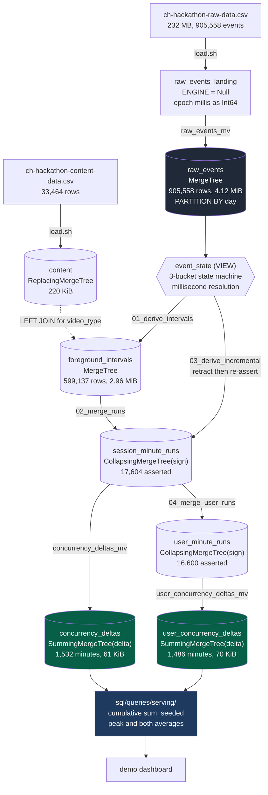

# Data model

**As of 2026-08-01.** One section per table: what it holds, what writes it, what reads it,
why the ORDER BY is what it is, and what it costs.

Written so that a teammate who has not been in these sessions can understand the whole
pipeline without asking anyone. Every figure is measured on the frozen slice
(`event_timestamp < 2026-08-01`); `[V:<id>]` resolves to a row in
[`evidence/LEDGER.tsv`](../evidence/LEDGER.tsv). Structure comes from `system.tables`,
`system.columns` and `system.parts`, never from the files in `sql/`: those have drifted from
the live server before and cost a day.

## Dataflow

The shape to notice: **the pipeline narrows by three orders of magnitude.** 905,558 events
become a 61 KiB serving table, because cost tracks interval boundaries rather than watch
time. A three-hour session costs the same two delta rows as a two-minute one.

## `raw_events`

**Holds.** Every event exactly as delivered, with epoch millis converted to `DateTime64(3)`.

**Written by.** `raw_events_mv`, from `raw_events_landing`. Never written directly.

**Read by.** `event_state`, the derivation pipeline, and the oracle. **Not by any dashboard
query.** `[V:filter_shapes]` No serving query touches it.

**Key.** `ORDER BY (video_session_id, event_timestamp)`, `PARTITION BY toYYYYMMDD(event_timestamp)`.
Ordered by session because every derivation step is per-session and walks a session's events
in time order. Partitioned by day so a day can be dropped or replaced without touching the
rest, which is what makes the unseen day a load rather than a migration.

**Costs.** `[V:inventory_phoenix]` 905,558 frozen rows, 4.12 MiB, 11 active parts.
232 MB of CSV compresses to 4.12 MiB, roughly 56x.

**Watch out.** `[V:inventory_phoenix]` It carries an `ingested_at DateTime` column that is not
in the committed DDL, added by an out-of-band `ALTER`. It is **not usable as a freeze key**:
see `GROUND_STATE.md` section 3.

## `content`

**Holds.** Content metadata: `content_id`, `title`, `video_type`, `category`.

**Read by.** The derivation, via `LEFT JOIN` to attach `video_type`. `LEFT`, not `INNER`, so
an event whose content is missing from the metadata is still counted as viewing: dropping
real playback because a metadata row is absent would be a correctness bug, not a data-quality
improvement.

**Key.** `ORDER BY content_id`, `ReplacingMergeTree`. Costs 220.41 KiB.
`[V:inventory_phoenix]`

**Watch out.** A `DICTIONARY` with `dictGet` was tried first and abandoned: on Cloud,
`dictHas` returned 0 for keys an `INNER JOIN` matched, because dictionaries load per replica.
The join is the working version and the header comment in `sql/schema/02_content.sql` records
why.

## `event_state` (view, not a table)

**Holds.** Nothing. It is the shared state machine, evaluated on read.

**What it does.** Collapses events to one row per `(video_session_id, millisecond)`, then
carries the last decisive state forward with `argMax ... OVER (PARTITION BY video_session_id
ORDER BY ts)`. Three buckets: events that open playback, events that close it, and everything
else, which is **neutral** and carries the previous state forward.

**Why milliseconds.** 29 percent of events share a second with another event. At second
resolution the tie order is arbitrary, so a pause and a resume in the same second resolved
differently on different runs. Collapsing at millisecond resolution with "close beats open at
the same instant" made it deterministic.

**Why neutral is the default.** An unrecognised value can never start counting someone as
watching. `[V:ingest_probe]` The live stream has already introduced two `event` values absent
from the corpus, and both were absorbed correctly with no code change.

**Do not edit this file.** It is validated against a brute-force oracle at zero diffs
`[V:oracle_parity]`. If you believe it is wrong, escalate rather than improve it.

## `foreground_intervals`

**Holds.** One row per contiguous foreground interval, with dimensions attached.

**Written by.** `sql/pipeline/01_derive_intervals.sql`, the batch path only. The incremental
path bypasses it, so in an incrementally-built database this table is empty by design.

**Key.** `ORDER BY (video_session_id, interval_start)`, no partition. Ordered by session
because its only consumer, the merge step, groups by session.

**Costs.** `[V:frozen_slice_stability]` 599,137 rows, 2.96 MiB.

**The boundary rule, which is validated and must not be changed.**

- `interval_start` inclusive, `interval_end` exclusive
- `interval_end = least(if(next_ts > ts, next_ts, ts + tol), ts + tol)`, so the 90-second gap
  tolerance **does** extend the tail
- tolerance is 90s, chosen from the observed gap distribution (p90 40s, p99 76s), not from
  the nominal 60s heartbeat: 60s would falsely split about 1 percent of normal traffic

**Watch out, and this looks worse than it is.** `[V:frozen_slice_stability]` **253,590 of
599,137 intervals (42.3 percent) are zero-length**, `interval_end = interval_start`. That is
storage precision, not a logic error: this table stores second-resolution `DateTime` while
`event_state` runs at milliseconds, so a sub-second segment truncates to a point. It changes
no output, because `timeSlots(t, 0, 60)` returns exactly one slot, and a viewer seen at
10:00:30 was indeed watching during the 10:00 minute. The invariant that would catch real
damage is `max_runs_per_session_minute`, and it is 1.

## `session_minute_runs`

**Holds.** One row per contiguous run of active minutes per session, `run_end` inclusive.

**Written by.** `02_merge_runs.sql` for full rebuilds, and `03_derive_incremental.sql` for
arrivals, which writes a `sign = -1` retraction for every previously asserted run of a touched
session and then re-asserts with `sign = +1`.

**Key.** `ORDER BY (video_session_id, run_start, run_end)`, `CollapsingMergeTree(sign)`.
Collapsing rather than mutation because a late heartbeat must be able to revise a published
minute without an `ALTER TABLE ... UPDATE`, which on a table this size would be a mutation
storm at 100x.

**Costs.** `[V:frozen_slice_stability]` 17,604 asserted runs.

**Watch out.** `[V:ingest_probe]` **Never use `count()` here.** It reads physical rows
including retractions. The live slice holds 7,593 physical rows and only 1,545 asserted ones.
The correct measure is `sum(sign)`.

## `concurrency_deltas` and `user_concurrency_deltas`

**Holds.** `+1` at `run_start` and `-1` at `run_end + 1 minute`, per dimension tuple. Summing
these in minute order reproduces the concurrency curve.

**Written by.** `concurrency_deltas_mv` and `user_concurrency_deltas_mv`, which fire on insert
into the corresponding runs table. `[V:inventory_phoenix]` Both are healthy with zero
exceptions in `system.query_views_log`.

**Read by.** Every dashboard query, and nothing else.

**Key, and this is the important one.**
`ORDER BY (platform, country, video_type, content_id, app_version, minute)`.

Dimensions lead and `minute` sits last, deliberately. A cumulative sum must be seeded by
every delta before the requested window, so a time predicate **cannot** prune it: starting the
sum inside the window loses every session that opened earlier and is still watching. What can
prune is a dimension filter, so dimensions occupy the prunable prefix. `[V:filter_shapes]`
Measured: a `platform` filter cuts to 2/4 granules and 16,384 rows; unfiltered reads 26,904.

The honest cost of that choice is in `problem/DESIGN.md` section 7: only `platform` prunes,
because it leads. `content_id` is fourth and a content-only filter reads the whole table.

**Costs.** `[V:frozen_slice_stability]` `concurrency_deltas` covers 1,532 distinct minutes in
**61.03 KiB**; the user table covers 1,486 minutes in 69.77 KiB. `[V:inventory_phoenix]`

**Watch out.** `count()` is meaningless here too: `SummingMergeTree` collapses rows on merge,
so it moves with merge timing rather than with data. Measured drifting by 7,740 rows within
minutes on this service. Use `uniqExact(minute)` and `sum(delta)`.

**The user table is not a copy.** A user with two concurrent sessions counts as 2 in
`concurrency_deltas` and 1 in `user_concurrency_deltas`. `[V:frozen_slice_stability]` Peak
sessions 2,829, peak users 2,749, both at 2026-07-26 10:56.

## Invariants, checked on every run

`./scripts/ground_state.sh` reports all of these. `[V:frozen_slice_stability]`

| Invariant | Required | Measured | What a breach would mean |
|---|---:|---:|---|
| `closure.session_deltas` | 0 | 0 | a session was counted up and never down |
| `closure.user_deltas` | 0 | 0 | same, user level |
| `runs_inverted` | 0 | 0 | a run ends before it starts |
| `intervals_inverted` | 0 | 0 | an interval ends before it starts |
| `max_runs_per_session_minute` | 1 | **1** | one session counted twice at one instant |
| `max_assertions_of_one_run` | 1 | **1** | the derive was run twice and everything is doubled |
| `serving.min_concurrency` | 0 | 0 | concurrency went negative |

The last three carry the most weight. `max_runs_per_session_minute = 1` is the no-double-count
proof. `min_concurrency = 0` says the deltas balance **in order**, not merely in total: a
curve can sum to zero overall and still go negative in the middle, and that would be a real
bug that closure alone would not catch.

`max_assertions_of_one_run = 1` is the only one that detects a re-run of the batch derive.
`[V:derive_idempotence]` Measured: running `02_merge_runs.sql` twice doubles concurrency from
2,829 to 5,658 while **closure stays 0** (each duplicated `+1` brings its own `-1`) and
**`max_runs_per_session_minute` stays 1** (the duplicate has an identical key, so `GROUP BY`
collapses it; that invariant detects overlap, and this failure is repetition). Use
`scripts/derive.sh`, which refuses to derive into a database that already holds runs.
