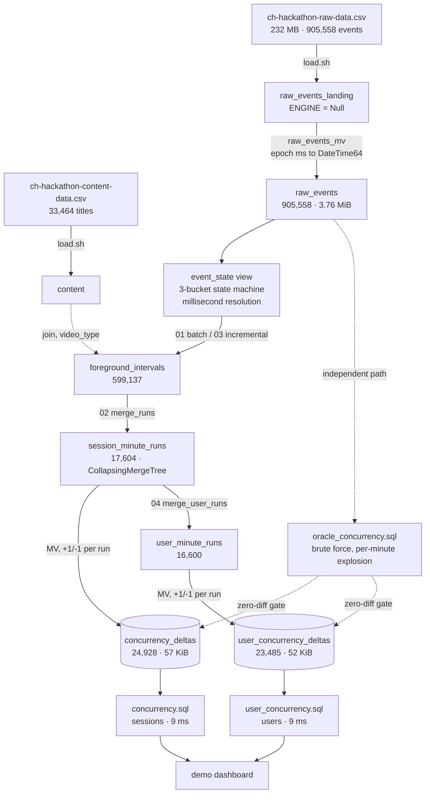

# Phoenix: where the build stands

Team-facing map of what exists, what it proves, and what is left. Numbers here are measured,
reproducible with the commands shown, and supersede anything older in `assumptions.md`.

Last updated 2026-08-01, after the state-machine correction.

## The one-sentence pitch

Counting a session as watching from start to end overstates the audience by **32.3% at peak**
on this dataset, and invents an audience in **1,590 minutes** where nobody was actually
watching. Phoenix counts only foreground playback, serves it from a 57 KiB rollup in 9 ms,
and absorbs late and still-open sessions without ever rebuilding.

## Pipeline



Dashboards read the two rollups at the bottom and nothing else. The oracle is deliberately
the slow, obviously-correct implementation and exists only to prove the fast one.

## The four design decisions

**1. Active intervals, not sessions.** Each event's state holds until the next event, capped
at a 90 s heartbeat gap. The cap is what makes a dropped `AppBackgrounded` survivable: silence
longer than the tolerance is never counted as watching.

**2. Three-bucket state machine, neutral means neutral.** 46 distinct `event` values exist. 4
deactivate, 8 reactivate, 34 are telemetry that must not flip state. `pause` hides in the
`event` column of `VideoHeartbeat` rows, not in `event_type`. Unknown values are neutral, so a
new event type can never manufacture viewing time.

**3. Deltas from merged minute runs.** Each run becomes `+1` at its first minute and `-1` after
its last. Cost tracks interval boundaries, not watch time, so a two-hour query costs what a
two-minute query costs. Merging to runs first is what stops a session that pauses four times
inside one minute from being counted four times.

**4. Retraction instead of mutation.** Re-deriving a session writes `sign = -1` rows for what
it previously asserted and `+1` rows for what it asserts now. Corrections are additive, so
open sessions and late arrivals are absorbed without touching any other session.

## Numbers that are proven, not claimed

| Claim | Number | Reproduce |
|---|---|---|
| Serving layer matches brute force, sessions | 3,664 minutes, **0 diffs** | `scripts/oracle.sh` vs `concurrency.sql` |
| Serving layer matches brute force, users | 3,664 minutes, **0 diffs** | `scripts/oracle.sh` vs `user_concurrency.sql` |
| Open sessions absorbed incrementally | 5,316 minutes, **0 diffs** | `./scripts/test_open_sessions.sh 30` |
| Only touched sessions are re-derived | 198 of 200 bystanders, exactly those with events in the window | same test, step 6b |
| Naive overcount at peak | 3,742 vs 2,829, **32.3%** | `naive_session_overlap.sql` |
| Phantom audience minutes | 5,254 vs 3,664, **1,590 minutes** | same |
| Pause exclusion worth | 2,829 vs 2,969, **4.9%** | `PAUSE_INACTIVE=0 scripts/oracle.sh` |
| Query latency | 9 ms filtered, 15 ms unfiltered | `--time` on any benchmark query |
| Compression | 232 MB CSV to 57 KiB serving table | `system.parts` |
| Data-quality invariants | 3 of 3 at zero | `data_quality.sql` |

## Findings that came from reading the data

- **`pause` is not an `event_type`.** 27,340 `pause` and 31,780 `resume` rows sit inside
  `VideoHeartbeat`. A state machine built from the data dictionary alone misses every one.
- **29% of events share a timestamp with another event.** Tie order is not stable between
  engines, so the same data gave different answers locally and on Cloud until events were
  collapsed per (session, millisecond).
- **Neutral telemetry was cancelling pauses.** Before the fix, `pause` followed by
  `buffer-health` counted as watching again. This alone moved the overcount from 12.6% to
  32.3%.
- **Dictionaries are unreliable on Cloud.** `dictHas` returned 0 for keys an `INNER JOIN`
  matched, because dictionaries load per replica. Replaced with a join.
- **Zero open sessions in the sample**, so that path had to be tested by manufacturing them.

## Who runs what

```bash
./scripts/init_db.sh                                   # schema, in dependency order
./scripts/load.sh data/<file>.csv raw_events_landing   # ingest, same command for the unseen day
./scripts/ch.sh --queries-file sql/pipeline/01_derive_intervals.sql --param_tolerance_s=90 --param_pause_inactive=1
./scripts/ch.sh --queries-file sql/pipeline/02_merge_runs.sql
./scripts/ch.sh --queries-file sql/pipeline/04_merge_user_runs.sql
./scripts/ch.sh --queries-file sql/queries/validation/data_quality.sql --format PrettyCompact
./scripts/test_open_sessions.sh 30                     # update-handling proof
cd frontend && npm install && npm run dev            # dashboard on :3200
```

Incremental (what a live pipeline runs each tick):

```bash
./scripts/ch.sh --queries-file sql/pipeline/03_derive_incremental.sql \
  --param_tolerance_s=90 --param_pause_inactive=1 \
  --param_from_ts='...' --param_to_ts='...'
```

## What is left

| # | Item | Why it matters | State |
|---|---|---|---|
| 1 | **ClickStack / Langfuse / LibreChat integration** | Hard requirement. "Superficial inclusion won't count" | Not started. Largest scoring gap |
| 2 | **Benchmark query set from organizers** | Ours are guesses; theirs are what is graded | Waiting. Needs an owner watching for the drop |
| 3 | **`assumptions.md` refresh** | Still carries the stale 12.6% and pre-fix rulings | Stale, misleading |
| 4 | **AdPause ruling** | 45 events, 5 minutes differ by 1 session, peak identical | Decision pending, not a blocker |
| 5 | **`replay.sh` live demo** | The "curve builds in real time" story | Written, never executed |
| 6 | **Unseen-day dry run** | Ingest to answers must be one rehearsed sequence | Commands exist, never rehearsed end to end |

## Known limits, stated before a judge finds them

- **Dimension attribution is first-seen per session.** 95 sessions report more than one
  platform and 120 more than one user; those are filed under whatever they started as.
  Measured cost on user counts: 57 minutes differ, at most 10 users.
- **Cumulative sum starts at series start**, so a filtered slice reads its whole history.
  Free at 12 days and 25K rows. At 100x, add snapshot rows carrying the running total at day
  boundaries so the sum starts from the nearest snapshot.
- **A backgrounded client that keeps emitting heartbeats** is counted until the gap cap,
  because the background event is not guaranteed and the heartbeat is all we have.
- **`country` has one value** in this sample, so it stays in the key for the unseen day but
  prunes nothing today.
